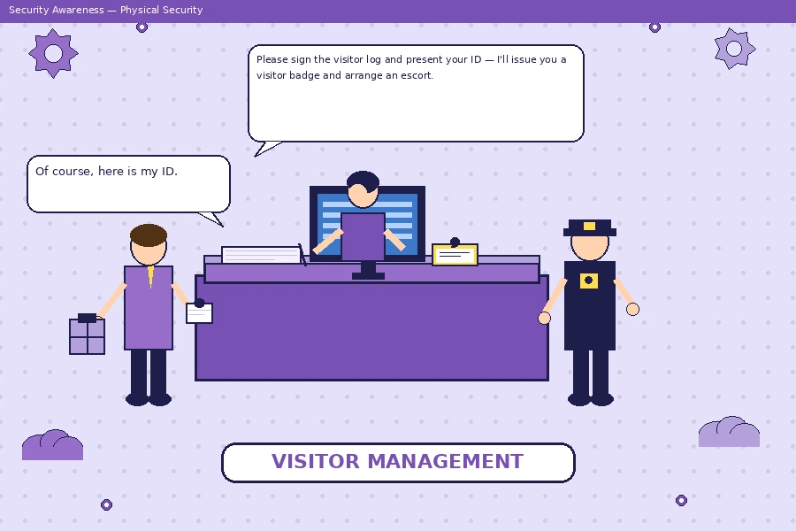
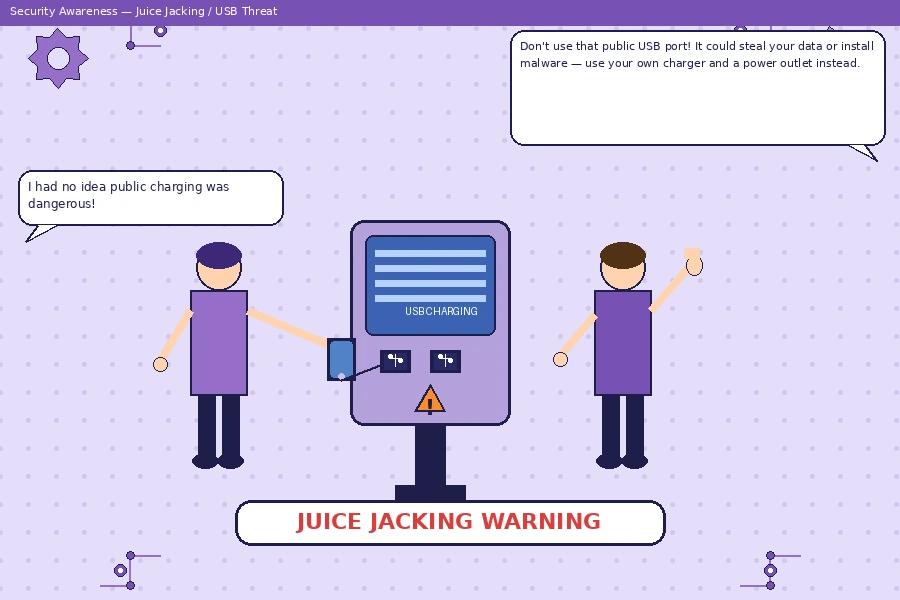
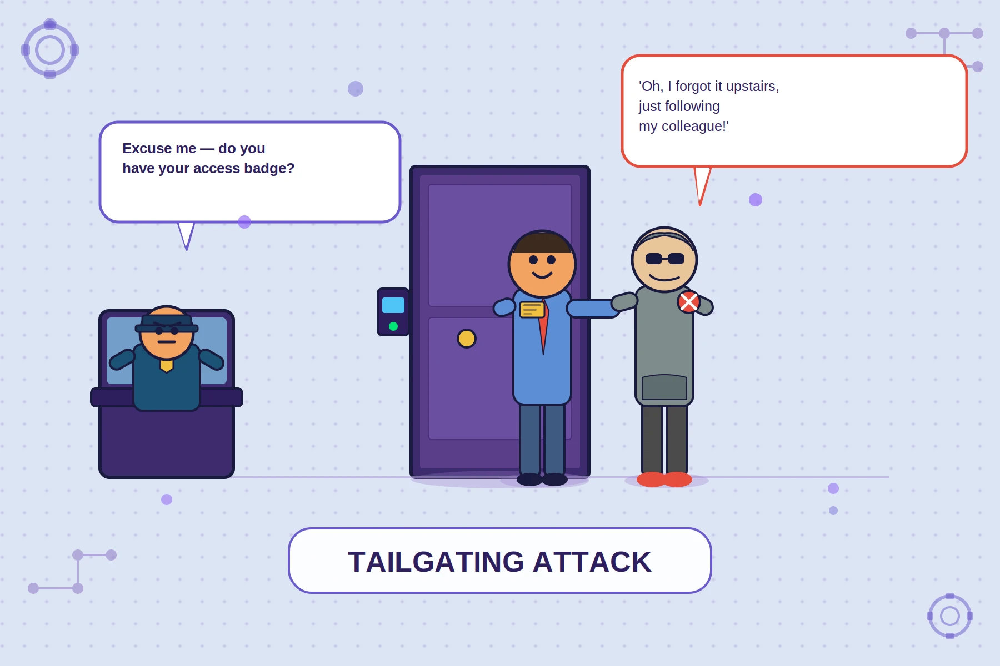

# Chapter 2: Physical Security

## Overview

It is easy, in a course focused on computing and information assurance, to leap immediately to firewalls, encryption protocols, and malware defenses. Yet one of the most persistent and important truths in security is this: **no digital control can compensate for an absent physical one**. If an attacker can walk up to a server, connect a USB drive, or simply pick up an unattended laptop, then all the encryption and access controls in the world provide little protection. Physical security is the foundation upon which all other security controls rest. This chapter examines the threats to physical security, the controls used to counter those threats, and the methodologies used to assess the physical security posture of an organization.

---

## 2.1 Why Physical Security Is the Foundation

The principle is straightforward: physical access to a system is, for most practical purposes, equivalent to total control over that system. An attacker with physical access to a running computer can extract data from memory, bypass operating system access controls with a bootable USB drive, install hardware keyloggers, or simply steal the device. Data centers can be targeted for theft of physical media or servers. Backup tapes removed from secure facilities have been lost in transit, exposing enormous volumes of sensitive data.

Physical security threats differ from cyber threats in an important way: they often bypass digital controls entirely. A sophisticated firewall does nothing to stop a burglar. Strong password policies are irrelevant to an attacker who can remove a hard drive. Defense in depth, as introduced in Chapter 1, requires layered defenses — and the physical layer must be addressed first.

> **Key Principle:** Physical security must be addressed as a prerequisite to, not an afterthought of, technical security controls.

---

## 2.2 Physical Security Threats

Physical security threats can be categorized into several types. Understanding each type is necessary to design proportionate controls.

### Theft

Device theft is one of the most common physical security incidents. Laptops, smartphones, and external drives are stolen both opportunistically (a laptop left unattended in a coffee shop) and deliberately (targeted theft of devices from executives or researchers for the data they contain). The 2006 theft of a Veterans Affairs laptop containing unencrypted data on 26.5 million veterans remains one of the most widely cited examples of the consequences of inadequate physical (and technical) security for mobile devices.

### Vandalism and Sabotage

Physical damage to equipment — whether by disgruntled insiders, activists, or adversaries — can cause significant disruption. Cutting network cables, damaging server equipment, or destroying backup media can take systems offline and cause data loss. In high-stakes environments, sabotage may be deliberate and targeted.

### Unauthorized Access

Unauthorized entry to secure areas — data centers, server rooms, offices — can enable attackers to install rogue hardware (such as network taps or hardware keyloggers), access physically secured systems, steal equipment, or plant surveillance devices. Unauthorized access is often achieved through social engineering techniques such as tailgating (discussed in Chapter 3) or by exploiting weaknesses in access control systems.

### Natural Disasters and Environmental Threats

Floods, fires, earthquakes, hurricanes, and power outages are not attackers, but they present very real threats to availability. Data centers must be designed with these threats in mind. The 2011 flooding in Thailand disrupted global hard drive supply chains for over a year, illustrating how physical environmental threats can have far-reaching consequences for information systems.

### Espionage and Surveillance

In certain threat environments — government, defense, financial services, research — physical surveillance may be used to collect intelligence. Attackers may install covert cameras, audio recorders, or network monitoring hardware. State-sponsored adversaries have been known to compromise hotel rooms, conference facilities, and offices used by targets during business travel.

---

## 2.3 Building and Perimeter Security

The first line of physical defense is the **perimeter** — the boundary between public and controlled space. Perimeter security is designed to deter, delay, and detect unauthorized entry.

### Fencing and Barriers

Physical barriers define the perimeter and force potential intruders to spend time and effort attempting to breach it. High-security facilities use anti-climb fencing (often topped with razor wire or angled outward), concrete bollards to prevent vehicle-ramming attacks, and security gates with controlled access. The choice of barrier depends heavily on the threat model: a corporate office campus faces different threats than a military installation.

### Lighting

Adequate lighting is one of the most cost-effective physical security controls available. Well-lit areas deter opportunistic attackers (who prefer to operate undetected), improve the effectiveness of surveillance cameras, and help security personnel observe the environment. Motion-activated lighting is particularly effective along perimeter areas and access points.

### Closed-Circuit Television (CCTV) and Video Surveillance

Video surveillance serves both detective and deterrent purposes. Cameras record activity for later review and, when visible, discourage would-be attackers. Modern IP camera systems can incorporate analytics for motion detection, object recognition, and anomaly detection. For surveillance to be effective, footage must be stored securely, reviewed regularly, and retained for a sufficient period. Cameras alone are insufficient — they must be combined with human review and clear incident response procedures.

### Security Guards

Trained security personnel provide a level of response capability that no automated system can fully replicate. Guards can exercise judgment, respond to incidents, challenge suspicious individuals, and conduct patrols. However, guards are also subject to human limitations — fatigue, distraction, and susceptibility to social engineering. Guard effectiveness is enhanced by clear procedures, good communication technology, and regular training.

### Signage and Security Markings

Visible signs — "Authorized Personnel Only," "CCTV in Operation," "Trespassers Will Be Prosecuted" — serve as both legal notice and psychological deterrence. While not a barrier in themselves, they establish expectations and create legal clarity about the boundaries of authorized access.

---

## 2.4 Access Control Systems

Once the perimeter is established, access control systems regulate who can enter which areas and under what circumstances. Physical access control is analogous to logical access control in the digital realm — and the same principles apply: **something you have**, **something you know**, and **something you are**.

### Key Card and Badge Systems

Electronic key card systems (using RFID or magnetic stripe cards) are the most common form of corporate physical access control. Each card is linked to an identity, and access events are logged. Cards can be quickly deactivated when employees leave or when a card is reported lost. Proximity cards (which work without insertion — simply by being near the reader) are convenient but can be vulnerable to cloning if an attacker gets close enough to read the card's signal.

> **Warning:** Standard RFID proximity cards operating at 125 kHz (the older standard) are highly vulnerable to cloning with inexpensive, commercially available devices. Organizations handling sensitive data should upgrade to higher-security smart cards with cryptographic authentication.

### Biometric Access Controls

Biometrics use physical or behavioral characteristics to verify identity. Common biometric systems include:

- **Fingerprint scanners** — widely used, relatively inexpensive, but can be fooled by high-quality reproductions
- **Retinal/iris scanners** — higher accuracy, more expensive, used in high-security environments
- **Facial recognition** — increasingly common, but raises privacy concerns and can be confused by lighting conditions or changes in appearance
- **Hand geometry** — measures the shape and size of the hand; used in some data centers and airports

Biometrics have the advantage of being difficult to lend or steal (unlike a card or PIN), but they cannot be revoked or changed if compromised — your fingerprint is permanent. Biometric systems are most effective as part of multi-factor authentication combined with another credential type.

### Mantraps and Airlocks

A **mantrap** (also called an airlock or access control vestibule) is a small enclosed area with two sets of doors — the second door does not open until the first has closed and access has been verified. This prevents **tailgating** (an unauthorized person following an authorized one through a door). Mantraps are common at the entrances to data centers, bank vaults, and government facilities. Some sophisticated mantraps include weight sensors or camera systems to detect if more than one person has entered the enclosed space.

### Visitor Management

Visitors to controlled facilities should be required to sign in, show identification, receive a visitor badge, and be escorted by authorized personnel. Visitor logs serve as both a deterrent and a forensic record. Badge designs should visually distinguish visitors from employees, making it easy for anyone in the facility to identify someone who should not be moving freely.

---

## 2.5 Data Center Physical Security Standards

Data centers — facilities that house the servers, storage, networking, and cooling equipment that support organizational IT — require especially rigorous physical security. They represent a single point of concentration for enormous volumes of critical data and systems.

Industry standards for data center security include the **Uptime Institute Tier Classification** system, which rates data centers from Tier I (basic) to Tier IV (fault tolerant), with each tier specifying increasingly robust availability and redundancy requirements. For security specifically, organizations often follow guidance from NIST Special Publication 800-53, which includes physical and environmental protection controls.

Best practices for data center physical security include:

- Location in a low-risk area (away from flood plains, flight paths, industrial hazards)
- No external signage identifying the building as a data center ("security through obscurity" as one layer)
- Multiple perimeter rings (outer fence, building exterior, secure room, equipment cage)
- Individual equipment cages or locking racks for colocation clients
- 24/7 on-site security personnel and video surveillance
- Strict visitor and contractor access logging and escorting
- Two-person integrity rules for particularly sensitive operations

---

## 2.6 Environmental Controls

The physical environment of a data center or server room must be carefully controlled to ensure availability. Environmental threats can cause hardware failures, data corruption, and fires.

### HVAC (Heating, Ventilation, and Air Conditioning)

Electronic equipment generates significant heat, and overheating causes failures. Data centers maintain carefully controlled temperatures (typically between 64°F and 80°F / 18°C and 27°C) and humidity levels (typically 40–60% relative humidity). Too little humidity causes static electricity buildup; too much encourages condensation and corrosion. Modern data centers use hot-aisle/cold-aisle containment architectures to direct airflow efficiently.

### Fire Suppression

Fire represents a catastrophic threat to data center equipment. Physical fire suppression systems used in data centers are specifically designed to minimize equipment damage. **Clean agent suppression systems** (such as FM-200 or Novec 1230) displace oxygen or absorb heat to extinguish fires without damaging electronics — unlike water-based sprinkler systems, which would destroy electronic equipment. Early warning smoke detection systems, including **Very Early Smoke Detection Apparatus (VESDA)**, can detect microscopic smoke particles long before a conventional detector would trigger.

### Uninterruptible Power Supplies (UPS) and Generators

Power outages threaten availability. **UPS systems** provide short-term battery backup power that allows systems to remain online during brief outages and gives time to gracefully shut down systems or switch to generator power before the batteries deplete. **Diesel generators** provide longer-term backup power for extended outages. Critical facilities typically maintain dual utility feeds from different substations, a UPS, and generator backup in combination.

---

## 2.7 Device Security

Not all computing happens in data centers. The security of endpoint devices — desktops, laptops, workstations — requires its own set of physical controls.

### Cable Locks

Laptop cable locks (such as the Kensington lock) provide a simple, low-cost deterrent against opportunistic laptop theft in shared or public spaces. While a determined attacker with tools can defeat them quickly, cable locks raise the effort required and deter casual theft significantly.

### Screen Privacy Filters

Privacy filters are physical overlays applied to monitor screens that restrict the viewing angle so that only the person directly in front of the screen can read its contents. These are particularly relevant in open-plan offices, during travel, and in public spaces — anywhere a nearby person could commit **shoulder surfing** (observing screen contents without authorization).

### Clean Desk Policy

A **clean desk policy** requires employees to secure sensitive materials — documents, portable drives, access badges, passwords — when leaving their workstations, especially at the end of the day. This reduces the risk of sensitive information being seen, photographed, or stolen by cleaning staff, visitors, or other unauthorized individuals. A complementary **clear screen policy** requires computers to be locked when unattended.

---

## 2.8 Mobile Device Physical Risks

Mobile devices — smartphones, tablets, and laptops — represent a unique physical security challenge because they routinely leave the controlled environment of the office and travel to airports, hotels, conference centers, and public spaces.

Physical risks specific to mobile devices include:

- **Theft** — the most common mobile security incident; often opportunistic
- **Loss** — accidental loss is extremely common and functionally identical to theft from a security standpoint
- **Evil maid attack** — an attacker with brief, unmonitored physical access to a device (such as a hotel room) installs malware, extracts data, or compromises the device hardware
- **Border search and seizure** — government authorities in some jurisdictions can legally compel travelers to unlock devices at border crossings
- **Juice jacking** — charging via untrusted public USB ports can expose devices to data theft or malware installation

Controls for mobile device risk include full-disk encryption, strong PINs (not just biometrics, which can be compelled by some authorities), Mobile Device Management (MDM) solutions with remote wipe capabilities, and employee training on travel security.

---

## 2.9 Human-Targeted Physical Attacks

Several common attack techniques exploit human behavior rather than technical weaknesses, and their primary vector is physical proximity.

### Dumpster Diving

**Dumpster diving** refers to searching through discarded materials — physical trash — for useful information. Organizations discard an astonishing volume of sensitive material: printed documents containing customer data, organizational charts, technical diagrams, sticky notes with passwords, and discarded hard drives. Effective countermeasures include cross-cut shredding of all paper documents, degaussing or physical destruction of storage media before disposal, and clear policies around document disposal.

> **Real-World Case:** In numerous social engineering assessments, professional penetration testers have retrieved usernames, internal IP addresses, phone directories, and even printed passwords by searching through corporate recycling bins — all without touching a computer.

### Shoulder Surfing

**Shoulder surfing** is the act of directly or covertly observing someone's screen, keyboard, or physical documents. Attackers may observe login credentials, sensitive document contents, or PIN codes entered at ATMs or office keypads. Countermeasures include privacy screen filters, physical positioning of workstations away from high-traffic areas, and employee awareness training.

### Tailgating and Piggybacking

**Tailgating** (sometimes called piggybacking) occurs when an unauthorized individual follows an authorized person through a secured door or entry point, taking advantage of the access that person legitimately possesses. The attacker relies on social norms — people are generally reluctant to challenge someone who appears to belong — and sometimes on the authorized person actively holding the door as a courtesy.

Countermeasures include mantraps, anti-tailgating education for all employees (specifically training them that it is acceptable and expected to challenge and report tailgating), and security officers stationed at access points.

---

## 2.10 Physical Security Assessments

Physical security, like all aspects of security, must be regularly evaluated to identify gaps. A **physical security assessment** (sometimes called a physical penetration test or "red team" exercise) is an authorized attempt to breach physical security controls to identify weaknesses before real attackers do.

Physical security assessments may include:

- Testing whether tailgating can be accomplished through secured entries
- Attempting to retrieve sensitive information through dumpster diving
- Testing guard response to suspicious behavior
- Evaluating whether visitor management procedures are consistently enforced
- Testing whether employees can be socially engineered into granting access
- Evaluating the visibility and quality of surveillance camera coverage

Findings from assessments should be documented and used to drive improvements in policies, procedures, and controls. Physical security assessments should be conducted by qualified professionals under written authorization to protect both the testers and the organization.

---

## 2.11 Real-World Case Studies

### Case Study 1: The Target Data Breach (2013)

While primarily known as a cyber breach (via stolen HVAC vendor credentials), the Target breach illustrates how physical and digital security intersect. The attackers gained network access through a third-party vendor with remote access to Target's systems. Physical security at the vendor level — the ability to control who had physical and logical access to systems connected to Target's network — was part of the failure chain. 40 million credit card numbers were stolen.

### Case Study 2: Stolen VA Laptop (2006)

A U.S. Department of Veterans Affairs employee took an agency laptop home — against policy — and it was stolen in a burglary. The device contained unencrypted personal data (names, Social Security numbers, birth dates, and disability ratings) on 26.5 million veterans and active-duty military personnel. The incident led to a sweeping overhaul of VA data handling policies, mandatory encryption for all portable devices, and congressional hearings. The financial and reputational cost was enormous. The countermeasure — full-disk encryption — was inexpensive compared to the harm caused by its absence.

---

## Key Terms

| Term | Definition |
|---|---|
| **Perimeter Security** | Physical controls at the boundary between public and controlled space (fences, barriers, gates) |
| **CCTV** | Closed-Circuit Television; video surveillance systems used for monitoring and recording |
| **Mantrap / Airlock** | A two-door access vestibule that prevents tailgating by requiring one door to close before the next opens |
| **Tailgating / Piggybacking** | An unauthorized person following an authorized individual through a secured access point |
| **Biometrics** | Authentication using physical or behavioral characteristics (fingerprints, iris scans, etc.) |
| **Clean Desk Policy** | An organizational policy requiring employees to secure sensitive materials when away from their workstations |
| **Shoulder Surfing** | Directly observing another person's screen, keyboard, or documents to gain unauthorized information |
| **Dumpster Diving** | Searching through discarded trash or recycling for useful information |
| **UPS (Uninterruptible Power Supply)** | Battery-based device providing short-term power backup during outages |
| **HVAC** | Heating, Ventilation, and Air Conditioning; critical for maintaining safe operating temperatures in data centers |
| **Clean Agent Suppression** | Fire suppression systems using gas agents (FM-200, Novec 1230) that extinguish fires without damaging electronics |
| **Evil Maid Attack** | An attack in which an adversary with brief, unmonitored physical access to a device installs malware or compromises it |
| **Juice Jacking** | Exploiting public USB charging stations to steal data or install malware on a connected device |
| **Physical Security Assessment** | An authorized evaluation of physical security controls, often including simulated intrusion attempts |

---

## Review Questions

1. **Conceptual:** Explain why physical security is described as the "foundation" of information security. What assumptions underlie all digital security controls that physical security is responsible for upholding?

2. **Applied:** A software company's office is in a shared office building with a single unmanned lobby. Describe at least five physical security controls the company should implement to protect its server room located on the 4th floor.

3. **Conceptual:** Compare and contrast the three main categories of physical access control credentials: something you have, something you know, and something you are. What are the relative strengths and weaknesses of biometric authentication compared to key card access?

4. **Applied:** An employee works in a busy open-plan office on financial reporting spreadsheets that contain sensitive client data. Identify the physical security threats this situation presents and recommend at least three specific countermeasures.

5. **Conceptual:** Explain how a mantrap (access control vestibule) works and which specific physical security threat it is designed to prevent. Why is this threat particularly difficult to counter with purely technical controls?

6. **Applied:** A company's data center suffered a fire that was extinguished by the building's standard water-based sprinkler system. The fire caused minimal structural damage, but nearly all of the server equipment was destroyed by water damage. What environmental control was missing, and what should have been in place instead?

7. **Conceptual:** Describe the "evil maid attack." What conditions make this attack possible, and what technical and procedural countermeasures can reduce the risk?

8. **Applied:** During a physical security assessment, a consultant finds that a company is using standard 125 kHz RFID proximity cards for access control. The company's R&D lab contains proprietary product designs worth hundreds of millions of dollars. What specific risk does this present, and what specific recommendation would you make?

9. **Reflective:** A company implements a clean desk policy, but a post-implementation survey finds that fewer than 30% of employees are complying with it. What factors might explain poor compliance, and what steps could management take to improve adherence?

10. **Applied:** Using the case study of the VA laptop theft, analyze what physical and technical controls were absent and how their presence could have prevented or limited the impact of the incident.

---

## Further Reading

- Garcia, M. L. (2007). *The Design and Evaluation of Physical Protection Systems* (2nd ed.). Butterworth-Heinemann. — The definitive technical reference for physical security system design.
- Fennelly, L. J. (2016). *Effective Physical Security* (5th ed.). Butterworth-Heinemann. — A comprehensive textbook covering all aspects of physical security for practitioners.
- NIST Special Publication 800-116. *A Recommendation for the Use of PIV Credentials in Physical Access Control Systems*. National Institute of Standards and Technology. Available at: https://csrc.nist.gov
- Uptime Institute. *Data Center Site Infrastructure Tier Standard: Topology*. Available at: https://uptimeinstitute.com — The widely used tiered data center classification framework.
- Hadnagy, C. (2010). *Social Engineering: The Art of Human Hacking*. Wiley. — Explores the intersection of social engineering and physical security, with real-world examples of physical breach scenarios.
