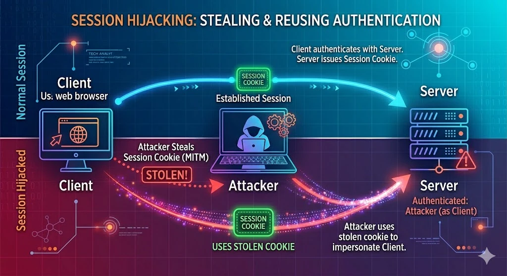
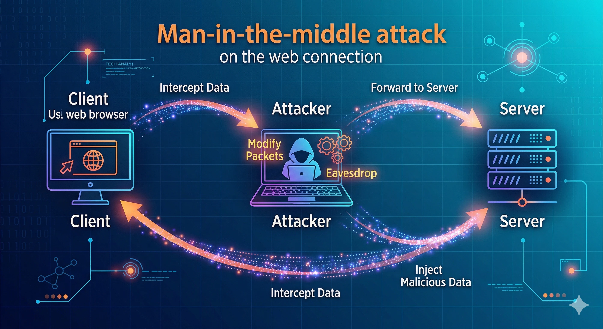
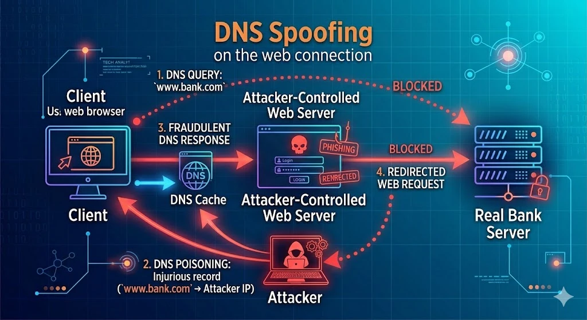
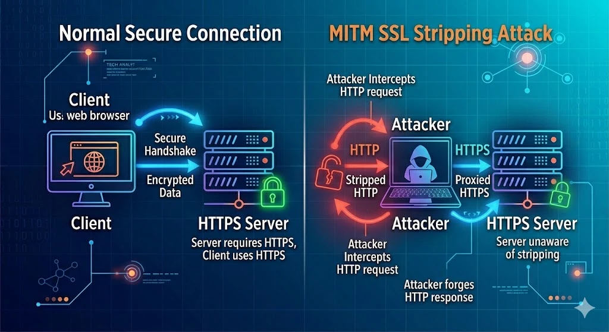

# Chapter 7: Network Security Fundamentals

## Introduction

Networks are the arteries of modern computing: nearly every piece of software of consequence communicates over a network, and nearly every organization's most sensitive data flows across one. The internet, as the world's largest and most open network, is simultaneously its most powerful communications medium and its largest attack surface. Understanding how networks function — their architecture, protocols, and inherent vulnerabilities — is a prerequisite for understanding how to defend them.

This chapter begins with a review of the networking concepts needed to understand security: the OSI and TCP/IP models, addressing, and routing. It then examines the specific threats that operate at each layer of the network stack and surveys the arsenal of defensive tools and architectures that network security engineers deploy to detect, prevent, and respond to those threats. The chapter concludes with wireless security, an area of particular practical importance given the ubiquity of Wi-Fi in homes, campuses, and enterprises.

---

## 7.1 Networking Foundations: A Security-Focused Review

### The OSI Model

The **Open Systems Interconnection (OSI) model** is a conceptual framework that divides network communication into seven distinct layers. Each layer provides services to the layer above it and relies on the layer below. Understanding this model is critical for security professionals because different attacks target different layers, and defensive tools are typically designed to operate at one or more specific layers.

| Layer | Name | Function | Examples |
|-------|------|----------|---------|
| 7 | Application | User-facing protocols | HTTP, DNS, SMTP, FTP |
| 6 | Presentation | Data formatting, encryption | TLS/SSL, JPEG, ASCII |
| 5 | Session | Session management | NetBIOS, RPC |
| 4 | Transport | End-to-end communication | TCP, UDP |
| 3 | Network | Logical addressing, routing | IP, ICMP, OSPF |
| 2 | Data Link | Physical addressing, framing | Ethernet, Wi-Fi (802.11), ARP |
| 1 | Physical | Bit transmission | Copper wire, fiber, radio waves |

### The TCP/IP Stack

The **TCP/IP model** is the practical implementation underlying the internet. It collapses the OSI's seven layers into four:

- **Application Layer** (combines OSI layers 5-7): HTTP/S, DNS, SMTP, SSH.
- **Transport Layer** (OSI layer 4): TCP (connection-oriented, reliable) and UDP (connectionless, best-effort).
- **Internet Layer** (OSI layer 3): IP addressing and routing.
- **Link Layer** (OSI layers 1-2): Physical and data-link operations.

**TCP (Transmission Control Protocol)** establishes connections through a *three-way handshake*: SYN (client initiates), SYN-ACK (server acknowledges), ACK (client confirms). It guarantees delivery, ordering, and error checking. **UDP (User Datagram Protocol)** is faster but provides no guarantees — appropriate for DNS queries, video streaming, and real-time applications.

### IP Addressing and Subnetting

Every device on an IP network has an **IP address** (IPv4: 32-bit, written as four octets, e.g., 192.168.1.100; IPv6: 128-bit, written in hexadecimal). A **subnet mask** defines which portion of an IP address identifies the network and which identifies the host within that network.

CIDR notation (e.g., 192.168.1.0/24) expresses the subnet mask as the number of bits in the network portion. Understanding subnetting is foundational to network segmentation, a core defensive strategy discussed later in this chapter.

---

## 7.2 Network Security Threats by OSI Layer

Security threats do not target the network as a monolithic entity — they target specific protocols and mechanisms at specific layers. Understanding the layer at which a threat operates guides the appropriate defensive response.

- **Layer 1 (Physical)**: Physical eavesdropping (tapping copper cables), jamming wireless signals, unauthorized physical access to network hardware.
- **Layer 2 (Data Link)**: ARP poisoning, MAC flooding (overwhelming a switch's address table to force broadcasting), VLAN hopping.
- **Layer 3 (Network)**: IP spoofing, ICMP flood attacks, route injection/BGP hijacking.
- **Layer 4 (Transport)**: SYN flood DoS attacks, TCP session hijacking, port scanning.

- **Layer 5-7 (Application)**: DNS poisoning, HTTP-based attacks (SQLi, XSS), email phishing, malware command-and-control communication.

---

## 7.3 Common Network Attack Types

### ARP Poisoning

The **Address Resolution Protocol (ARP)** maps IP addresses to MAC (hardware) addresses on a local network segment. ARP is a stateless protocol — devices cache ARP replies without verifying whether they requested them. An attacker on the same local network segment can broadcast forged ARP replies, associating their own MAC address with the IP address of another device (such as the default gateway). Subsequent traffic destined for that IP address is then forwarded to the attacker instead.

ARP poisoning enables **man-in-the-middle (MitM)** attacks: the attacker forwards traffic to the legitimate destination (so the attack remains invisible) while reading or modifying it in transit.

Tools like **arpspoof** and **Ettercap** automate ARP poisoning attacks. Defenses include *dynamic ARP inspection (DAI)* on managed switches, which validates ARP packets against a trusted DHCP snooping database.

### DNS Poisoning and Spoofing

The **Domain Name System (DNS)** translates human-readable domain names (e.g., `www.bank.com`) into IP addresses. **DNS cache poisoning** (also called DNS spoofing) involves injecting false DNS records into a resolver's cache so that subsequent lookups for a domain return an attacker-controlled IP address, redirecting users to malicious sites.

Classic DNS poisoning exploited the fact that DNS used predictable transaction IDs and source ports. The Kaminsky attack (discovered in 2008) demonstrated a practical, fast method for poisoning DNS caches on a wide scale. **DNSSEC** (DNS Security Extensions), covered in Chapter 8, provides cryptographic authentication of DNS records to prevent this class of attack.

### IP Spoofing

**IP spoofing** involves sending IP packets with a forged source address, making the traffic appear to originate from a different host. IP spoofing is used in denial-of-service attacks (to amplify traffic or make the source harder to trace) and in some types of session hijacking.

Defenses include **ingress filtering**: routers at network perimeters are configured to drop packets arriving from outside the network that claim to have source addresses belonging to the internal network (RFC 2827 / BCP 38).

### SYN Flood DoS/DDoS

A **SYN flood** attack exploits the TCP three-way handshake. The attacker sends a large volume of SYN packets — typically with spoofed source IPs — to a target server. The server allocates resources (a half-open connection entry in its state table) and sends SYN-ACK responses that never receive an ACK because the source IPs are fake. As the state table fills, the server can no longer accept legitimate connections.

A **Distributed Denial of Service (DDoS)** attack scales this by coordinating thousands of compromised hosts (a *botnet*) to flood the target simultaneously. Modern DDoS attacks can generate terabits-per-second of traffic. Defenses include SYN cookies (which avoid allocating state until the three-way handshake is complete), rate limiting, and cloud-based DDoS mitigation services (e.g., Cloudflare, Akamai).

### Packet Sniffing

**Packet sniffing** (or network capture) involves capturing and analyzing network traffic. On networks using hubs (which broadcast traffic to all ports), sniffing is trivial. Modern switched networks only forward frames to the intended recipient, but sniffing is still possible through ARP poisoning, compromising a switch's SPAN port, or placing a device on the same segment.

**Wireshark** is the most widely used packet capture and analysis tool. It provides a graphical interface for capturing live traffic or analyzing saved `.pcap` files, with protocol dissection for hundreds of protocols. Security professionals use Wireshark for troubleshooting and intrusion analysis; attackers use it to capture credentials from unencrypted protocols like HTTP, FTP, and Telnet.

> ⚠️ **Warning**: Packet sniffing on networks you do not own or have explicit authorization to test is illegal in most jurisdictions. Always obtain written authorization before conducting network captures.

### Port Scanning

**Port scanning** probes a target host's TCP or UDP ports to discover which services are running. **Nmap** (Network Mapper) is the de facto standard tool for port scanning and network discovery. A basic TCP SYN scan sends SYN packets to a range of ports; open ports respond with SYN-ACK, closed ports respond with RST, and filtered ports (behind a firewall) produce no response.

Nmap also supports OS detection, service version detection, and script-based vulnerability scanning through the Nmap Scripting Engine (NSE). Port scanning is a standard first step in network reconnaissance for both legitimate penetration testers and malicious attackers.

---

## 7.4 Network Defense Tools and Architecture

### Firewalls

A **firewall** is the most fundamental network security control — a device or software that monitors and controls incoming and outgoing network traffic based on predefined security rules.

**Packet-filtering firewalls** (Layer 3) examine individual packets and make allow/deny decisions based on source IP, destination IP, protocol, and port number. They are fast but stateless — they cannot distinguish between a new connection request and an established connection's return traffic.

**Stateful inspection firewalls** (Layer 4) track the state of network connections and make decisions based on context. A return packet is allowed if it belongs to an established, legitimate session. This prevents certain spoofing attacks that would fool a stateless filter.

**Next-Generation Firewalls (NGFWs)** operate up to Layer 7, inspecting application-layer traffic. They can identify and control applications (e.g., block BitTorrent but allow HTTP), perform SSL inspection (decrypting and re-encrypting TLS traffic to inspect its contents), and integrate with threat intelligence feeds. Major NGFW vendors include Palo Alto Networks, Fortinet, and Check Point.

### IDS and IPS

An **Intrusion Detection System (IDS)** monitors network traffic or host activity for signs of malicious activity and generates alerts. An **Intrusion Prevention System (IPS)** goes further — it actively blocks detected attacks in real time.

Both IDS and IPS can use two fundamental detection approaches:

- **Signature-based detection**: Compares traffic against a database of known attack patterns (signatures). Highly effective against known threats; ineffective against novel ("zero-day") attacks.
- **Anomaly-based detection**: Establishes a baseline of "normal" behavior and alerts on deviations. Can detect new attacks but is prone to false positives.

Network-based IDS/IPS (NIDS/NIPS) analyze network traffic at a chokepoint. Host-based IDS/IPS (HIDS/HIPS) monitor activity on individual endpoints. Popular open-source IDS tools include **Snort** and **Suricata**.

### Network Segmentation and VLANs

**Network segmentation** divides a network into isolated zones, limiting the blast radius of a compromise. If an attacker gains access to one segment, they cannot freely move to others.

**VLANs (Virtual Local Area Networks)** implement segmentation at Layer 2 using logical rather than physical separation. Traffic between VLANs must pass through a router or Layer 3 switch, where firewall rules can be applied. A typical segmentation scheme separates servers, user workstations, guest Wi-Fi, IoT devices, and management infrastructure into separate VLANs.

**VLAN hopping** attacks (using 802.1Q double-tagging or switch spoofing) can allow an attacker on one VLAN to send frames to another. Proper switch configuration (disabling DTP on access ports, never using the native VLAN for sensitive traffic) mitigates this risk.

### DMZ Architecture

A **DMZ (Demilitarized Zone)** is a network segment that hosts publicly accessible services (web servers, mail servers, DNS) while being isolated from the internal network. Traffic from the internet is permitted to reach DMZ hosts (with restrictions), but DMZ hosts cannot freely initiate connections into the internal network.

A typical DMZ architecture uses two firewalls: an outer firewall between the internet and the DMZ, and an inner firewall between the DMZ and the internal network. This ensures that even a complete compromise of a DMZ server does not give the attacker direct access to internal systems.

### VPNs: Virtual Private Networks

A **VPN (Virtual Private Network)** creates an encrypted tunnel between endpoints over a public network (typically the internet), providing confidentiality and integrity for the traffic within. VPNs are used to allow remote employees to securely access internal resources, to connect geographically separated offices, and to provide privacy for general internet browsing.

**IPSec (Internet Protocol Security)** operates at Layer 3 and can be deployed in *transport mode* (encrypting only the payload) or *tunnel mode* (encrypting the entire original IP packet, including headers). IPSec uses two main protocols: AH (Authentication Header) for integrity without encryption, and ESP (Encapsulating Security Payload) for both confidentiality and integrity.

**SSL/TLS VPNs** operate at Layer 4/7 and are accessible through standard web browsers or lightweight clients, making them easier to deploy for remote access than IPSec in some environments.

**WireGuard** is a modern VPN protocol, released in 2019, that uses state-of-the-art cryptography (Curve25519 for key exchange, ChaCha20-Poly1305 for encryption, BLAKE2 for hashing) and a dramatically simpler codebase (~4,000 lines vs. OpenVPN's ~100,000). Its simplicity reduces attack surface and has driven rapid adoption.

### Network Access Control (NAC)

**Network Access Control (NAC)** systems enforce security policy before allowing devices to connect to a network. A NAC system can verify that a device meets minimum security requirements (up-to-date operating system patches, active antivirus, required security software) before granting network access. Devices that fail compliance checks may be placed in a quarantine VLAN until remediated. NAC is implemented using the **802.1X** standard in conjunction with a RADIUS authentication server.

### SIEM: Security Information and Event Management

A **SIEM (Security Information and Event Management)** system aggregates log data from across the network infrastructure — firewalls, IDS/IPS, servers, endpoints, applications — normalizes and correlates it, and provides real-time alerting and historical forensic analysis. SIEM is the backbone of a Security Operations Center (SOC). Popular SIEM platforms include Splunk, IBM QRadar, Microsoft Sentinel, and the open-source Elastic Stack (ELK).

Effective SIEM implementation requires careful tuning to balance detection sensitivity with alert fatigue — too many low-quality alerts cause analysts to become desensitized, potentially missing real incidents.

---

## 7.5 Wireless Network Security

### WEP: A Case Study in Cryptographic Failure

**WEP (Wired Equivalent Privacy)**, the original Wi-Fi security protocol (802.11b, 1997), is a cautionary tale in protocol design. WEP used the RC4 stream cipher with a 40-bit (later 104-bit) key, XORed with a 24-bit Initialization Vector (IV) that was transmitted in plaintext. Critical flaws:

- The 24-bit IV space was small enough that IVs were reused frequently on busy networks, allowing traffic analysis.
- Several classes of "weak" IVs leaked key material, enabling key recovery with as few as 40,000-80,000 captured packets (achievable in minutes on a busy network).
- No protection against packet replay or injection.

WEP was officially deprecated by IEEE in 2004 and should never be used under any circumstances.

### WPA2: Current Standard

**WPA2 (Wi-Fi Protected Access 2)**, based on the IEEE 802.11i standard, replaced WEP and WPA using the **CCMP (Counter Mode CBC-MAC Protocol)** based on AES-128. WPA2 comes in two variants:

- **WPA2-Personal (PSK)**: Uses a pre-shared key. The passphrase is used to derive the **PMK (Pairwise Master Key)**, from which session keys are derived through the **4-way handshake**. The 4-way handshake can be captured and subjected to offline dictionary attacks if the passphrase is weak.
- **WPA2-Enterprise**: Uses IEEE 802.1X/EAP authentication against a RADIUS server, providing individual credentials for each user/device and eliminating the shared-secret weakness.

The **KRACK (Key Reinstallation Attack)** vulnerability, published in 2017, demonstrated a weakness in the WPA2 4-way handshake that could allow nonce reuse, potentially enabling traffic decryption on unpatched devices.

### WPA3: Enhanced Security

**WPA3**, introduced in 2018, addresses WPA2's weaknesses:

- **SAE (Simultaneous Authentication of Equals)**, replacing PSK, provides forward secrecy and resistance to offline dictionary attacks — even if a passphrase is captured in a handshake, it cannot be brute-forced offline.
- **192-bit security mode** for enterprise environments (WPA3-Enterprise).
- **OWE (Opportunistic Wireless Encryption)** for open networks, providing encryption without authentication to protect users on public Wi-Fi from passive sniffing.

### 802.1X Enterprise Authentication

**802.1X** is a port-based Network Access Control standard that provides authentication for devices connecting to a network, whether wired or wireless. In a wireless context, the client (supplicant), access point (authenticator), and RADIUS server (authentication server) perform an EAP exchange. The access point blocks all traffic except authentication frames until the server approves access. Various EAP methods (EAP-TLS, PEAP, EAP-TTLS) differ in how credentials are exchanged and what certificates are required.

### Bluetooth and NFC Security

**Bluetooth** enables short-range wireless communication (typically up to ~10 meters for Class 2 devices). Its security depends heavily on the pairing process:
- **Bluejacking**: Unsolicited messages sent via Bluetooth (nuisance, not a compromise).
- **Bluesnarfing**: Unauthorized access to data (contacts, calendar) on a Bluetooth device by exploiting OBEX protocol vulnerabilities.
- **BlueBorne (2017)**: A critical vulnerability affecting millions of devices, allowing remote code execution and MitM attacks without pairing.

Keep Bluetooth disabled when not in use, use Bluetooth 5.0+ with Secure Connections, and promptly apply firmware updates.

**NFC (Near Field Communication)** operates at ~13.56 MHz with a range of ~4 cm. It is used in contactless payments, access cards, and device pairing. The short range provides some physical security, but relay attacks (using two devices to extend the effective range without the card holder's knowledge) can defeat this. NFC-enabled credit cards and passports use cryptographic authentication to mitigate replay attacks.

---

## Key Terms

- **OSI Model**: A seven-layer conceptual framework for network communication.
- **TCP (Transmission Control Protocol)**: Connection-oriented, reliable transport layer protocol.
- **UDP (User Datagram Protocol)**: Connectionless, best-effort transport layer protocol.
- **ARP (Address Resolution Protocol)**: Maps IP addresses to MAC addresses on a LAN.
- **ARP Poisoning**: Sending forged ARP replies to redirect traffic through an attacker-controlled host.
- **DNS Poisoning**: Injecting false DNS records into a resolver's cache to redirect lookups.
- **SYN Flood**: A DoS attack exploiting the TCP three-way handshake to exhaust server state tables.
- **DDoS (Distributed Denial of Service)**: A DoS attack coordinated across many distributed hosts.
- **Packet Sniffing**: Capturing and analyzing network traffic.
- **Port Scanning**: Probing target ports to identify running services.
- **Firewall**: A device or software controlling network traffic based on security rules.
- **NGFW (Next-Generation Firewall)**: A firewall with deep packet inspection and application awareness.
- **IDS (Intrusion Detection System)**: Monitors for malicious activity and generates alerts.
- **IPS (Intrusion Prevention System)**: Monitors and actively blocks detected attacks.
- **VLAN (Virtual Local Area Network)**: Logical network segmentation at Layer 2.
- **DMZ (Demilitarized Zone)**: A network segment hosting publicly accessible services, isolated from the internal network.
- **VPN (Virtual Private Network)**: Creates an encrypted tunnel over a public network.
- **IPSec**: A suite of protocols for securing IP communications at Layer 3.
- **WireGuard**: A modern, high-performance VPN protocol using state-of-the-art cryptography.
- **NAC (Network Access Control)**: Enforces security policy compliance before granting network access.
- **SIEM**: Aggregates and correlates security events from across infrastructure for monitoring and analysis.
- **WEP**: Deprecated, cryptographically broken Wi-Fi security protocol.
- **WPA2**: Current widely deployed Wi-Fi security standard, using AES-CCMP.
- **WPA3**: The latest Wi-Fi security standard, introducing SAE and improved enterprise security.
- **802.1X**: Port-based NAC standard used for enterprise wired and wireless authentication.

---

## Review Questions

1. Describe the OSI model's seven layers and provide one example of a network attack that operates at each of layers 2, 3, and 4. For each attack, describe the appropriate defensive countermeasure.

2. Explain how an ARP poisoning attack works mechanically. Why is ARP vulnerable to this type of attack by design? Describe two technical controls that can mitigate ARP poisoning.

3. A company's web server is experiencing a SYN flood attack from thousands of spoofed IP addresses. Describe the attack mechanism in detail and explain how SYN cookies help mitigate it.

4. Compare and contrast packet-filtering, stateful inspection, and next-generation firewalls. For each type, describe a threat that it can detect/block that the previous generation cannot.

5. Explain the difference between an IDS and an IPS. Compare signature-based and anomaly-based detection, including the strengths and weaknesses of each approach.

6. You are designing a network for a small company with web servers that must be publicly accessible, an internal database server, and employee workstations. Describe a network architecture using DMZ and VLAN segmentation to protect these assets.

7. Explain why WEP is considered completely broken. What specific cryptographic flaws enable WEP key recovery, and how does WPA2 address these flaws?

8. Compare WPA2-Personal (PSK) and WPA2-Enterprise. In what types of environments is each appropriate, and what are the security tradeoffs?

9. A remote employee needs to securely access the company's internal network from home. Compare IPSec and WireGuard as VPN solutions for this use case, considering security, performance, and ease of deployment.

10. What is a SIEM system, and why is it considered essential in a Security Operations Center? What challenges are involved in deploying an effective SIEM?

---

## Further Reading

1. Forouzan, B.A. (2021). *Data Communications and Networking* (5th ed.). McGraw-Hill. — Comprehensive networking textbook with strong coverage of protocols and their security implications.

2. Northcutt, S., & Novak, J. (2002). *Network Intrusion Detection* (3rd ed.). New Riders. — A foundational text on IDS concepts and practical packet analysis.

3. Vanhoef, M., & Piessens, F. (2017). "Key Reinstallation Attacks: Forcing Nonce Reuse in WPA2." *Proceedings of the ACM SIGSAC Conference on Computer and Communications Security*. — The original KRACK attack paper.

4. Dorobantu, M. (2020). *WireGuard: Next Generation Kernel Network Tunnel*. Jason A. Donenfeld (original paper available at https://www.wireguard.com/papers/wireguard.pdf). — The original WireGuard design paper.

5. Scarfone, K., & Mell, P. (2007). *Guide to Intrusion Detection and Prevention Systems (IDPS)* (NIST Special Publication 800-94). National Institute of Standards and Technology.
