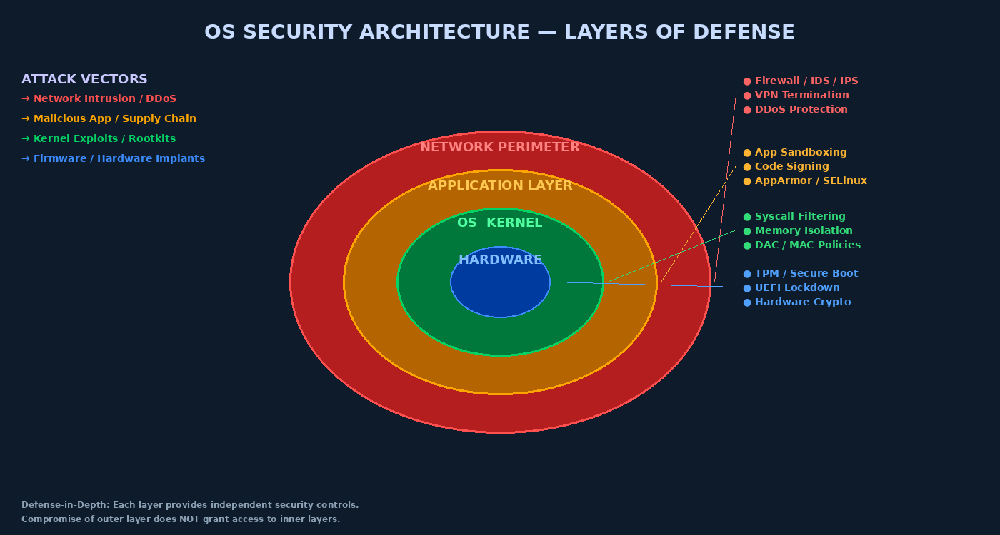

# Chapter 1 — Introduction to Operating System Security

## Why the Operating System Is the Security Foundation

Every application you run, every file you access, every network packet your machine sends — all of it flows through one piece of software: the operating system. The OS is not merely a convenience layer sitting between hardware and applications; it is the **ultimate security arbiter** for every resource on the machine. If the OS is compromised, no higher-level security control — not antivirus software, not application firewalls, not encrypted databases — can be trusted. An attacker who owns the kernel owns the machine.

This is the central insight that motivates the entire field of operating system security: because every other security control depends on the OS, the OS must itself be secure, verifiable, and correct. When it is not, the consequences are catastrophic. The 2017 WannaCry ransomware outbreak infected over 230,000 machines in 150 countries within hours, not because users clicked phishing links, but because a single Windows kernel vulnerability (MS17-010, exploited by the EternalBlue tool) allowed unauthenticated attackers to execute arbitrary code at kernel level. Similarly, the 2016 Dirty COW vulnerability (CVE-2016-5195) in the Linux kernel allowed any local user to escalate to root privileges using a race condition in the copy-on-write memory mechanism — a bug that had persisted unnoticed in the kernel for nine years.



## The OS Threat Landscape

The threats targeting operating systems fall into several major categories:

**Privilege Escalation** is the most common goal of OS attacks. An attacker who starts with user-level access seeks to gain kernel-level or root/SYSTEM access, at which point they can install rootkits, disable security controls, and persist indefinitely. Privilege escalation can be local (attacker already has shell access) or remote (combined with an initial access vulnerability).

**Kernel Exploits** target bugs in the kernel itself — the most trusted, most privileged code on the system. Kernel bugs are particularly dangerous because there is no safety net: if kernel code crashes or is subverted, the entire system is compromised. Common kernel vulnerability classes include integer overflows, use-after-free, race conditions, and type confusion.

**Rootkits** are software specifically designed to persist on a compromised system while hiding from detection. Kernel-mode rootkits (also called ring-0 rootkits) modify kernel data structures or hook system calls to hide processes, files, and network connections. Because they operate at the same privilege level as security scanning tools, they can defeat those tools entirely.

**Insecure Configurations** are arguably the most common real-world vulnerability. Default OS installations often include unnecessary services, world-writable directories, unpatched software, and permissive file permissions. OS hardening — systematically reducing the attack surface through configuration — is the first and most cost-effective security measure.

## A Brief History of OS Security

Understanding where OS security came from helps explain why modern systems work the way they do.

The **Unix Security Model (1970s)** established the foundational concepts still in use today: user and group identities, discretionary access control through file permission bits, the setuid mechanism, and the separation between privileged (root) and unprivileged users. Unix was designed for a time-sharing environment where multiple users on a single machine needed to be isolated from each other while sharing resources — a problem structurally identical to the multi-tenant cloud environments of today.

**Windows NT (1993)** introduced a more formal security architecture influenced by the Orange Book (DoD Trusted Computer System Evaluation Criteria). NT brought mandatory access tokens, security descriptors on every object, the Local Security Authority (LSA), Security Account Manager (SAM), and a structured security subsystem. Modern Windows security builds directly on this foundation.

**Hardened kernels and mandatory access control (2000s–present)** saw the introduction of SELinux (originally developed by the NSA and merged into Linux in 2003), AppArmor, gVisor, seccomp filtering, and kernel self-protection features like SMEP, SMAP, KASLR, and CFI. The shift from "keeping normal users out of each other's files" to "containing even privileged processes from damaging the system" marks the modern hardening philosophy.

## The Kernel: What It Is and Why It Matters

The kernel is the core of the operating system — the software layer that directly manages hardware resources and provides services to all other software. It runs in the most privileged CPU execution mode and is loaded into memory at boot time. Everything else — shells, browsers, databases, security tools — runs in user space and must ask the kernel for services through the **system call interface**.

The kernel controls:
- **CPU time** — scheduling processes and threads
- **Memory** — virtual memory mapping, physical page allocation, access permissions
- **Storage** — filesystem access, buffering, I/O scheduling
- **Network** — protocol stacks, socket management, packet routing
- **Devices** — hardware drivers, interrupt handling
- **Security enforcement** — access control checks on every resource request

Because the kernel enforces all security decisions, it is both the most important thing to protect and the most valuable target for attackers.

## Rings of Protection: CPU Privilege Levels

Modern x86 processors implement four privilege rings (0–3), though most operating systems use only ring 0 and ring 3. This hardware mechanism is the physical foundation of OS security.

| Ring | Name | Who Runs Here | Access Level |
|------|------|---------------|--------------|
| 0 | Kernel Mode | OS kernel, drivers | Full hardware access |
| 1 | (unused by most OS) | Historically hypervisors | — |
| 2 | (unused by most OS) | — | — |
| 3 | User Mode | Applications, shells | Restricted; must use syscalls |

When user-space code (ring 3) needs a kernel service, it executes a `syscall` instruction (x86-64) or `int 0x80` (legacy x86). The CPU switches to ring 0, validates the request, performs the operation, and returns to ring 3. This **privilege transition** is the primary enforcement point for OS security — every attempt by user code to access hardware or perform privileged operations must pass through this gate.

> **Key Concept:** A ring 3 process cannot simply read or write to kernel memory. The CPU enforces this through page table permission bits — kernel pages are flagged as supervisor-only, causing a protection fault if ring 3 code accesses them. SMEP (Supervisor Mode Execution Prevention) and SMAP (Supervisor Mode Access Prevention) provide additional enforcement: the kernel itself cannot accidentally execute or read user-space memory.

## The Trusted Computing Base

The **Trusted Computing Base (TCB)** is the set of all hardware, firmware, and software components that must be correct and trustworthy for the security of the entire system to hold. If any component of the TCB is compromised or buggy, the security guarantees of the entire system may be voided.

For a general-purpose OS, the TCB includes:
- CPU microcode and hardware security features
- UEFI/BIOS firmware
- The bootloader
- The OS kernel itself
- Core security services (LSA on Windows, PAM on Linux)
- Trusted hypervisor (in virtualized environments)

The security engineering principle of **minimizing the TCB** says that smaller TCBs are more secure because there is less code that must be correct. This principle motivates microkernel architectures, where only a tiny kernel (handling scheduling, IPC, and memory) is in the TCB, with drivers and services running in user space.

## The Reference Monitor Model

The **reference monitor** is a conceptual model, first articulated in the Anderson Report (1972), describing how an OS should mediate access to protected resources. A correct reference monitor must satisfy three properties:

1. **Complete Mediation** — Every access to every resource must be checked. No access path can bypass the monitor.
2. **Tamper-Proof** — The reference monitor itself cannot be modified by untrusted code.
3. **Verifiable** — The reference monitor must be small enough that its correctness can be proven or thoroughly tested.

The **security kernel** is the OS implementation of the reference monitor concept — the portion of the OS that enforces the reference monitor properties. SELinux's policy enforcement engine is an example of a security kernel layered on top of Linux.

## Saltzer & Schroeder's Security Design Principles

In their landmark 1975 paper, Jerome Saltzer and Michael Schroeder articulated eight principles of secure system design that remain canonical today:

| Principle | Meaning |
|-----------|---------|
| **Least Privilege** | Every program and user should operate with the minimum privilege needed to complete the task |
| **Economy of Mechanism** | Keep security mechanisms as simple as possible |
| **Open Design** | Security should not depend on secrecy of design (Kerckhoffs's principle) |
| **Complete Mediation** | Check every access to every object; never cache access decisions without revalidation |
| **Fail-Safe Defaults** | Default to denial; access requires explicit permission, not explicit denial |
| **Separation of Privilege** | Two keys are more secure than one; require multiple conditions for access |
| **Least Common Mechanism** | Minimize shared mechanisms between users |
| **Psychological Acceptability** | Security mechanisms should not make the system harder to use |

These principles directly shape OS security design. Least privilege motivates capabilities and mandatory access control. Economy of mechanism explains why monolithic kernels are harder to secure than microkernels. Fail-safe defaults explain why `umask 022` creates files without world-write permission by default.

## The OS Attack Surface

The attack surface of an OS is the sum of all paths through which an attacker can attempt to interact with or influence the system. Major components include:

- **System calls** — ~400 on Linux; each is a potential injection point for malformed data
- **Device drivers** — often third-party code running in kernel mode; historically a major source of kernel vulnerabilities
- **Inter-Process Communication** — pipes, shared memory, Unix domain sockets, D-Bus
- **Network stack** — TCP/IP implementation, protocol parsers, socket handling
- **File system** — path handling, permission enforcement, symlink resolution
- **Authentication subsystem** — PAM on Linux, LSASS on Windows
- **Package management and update mechanisms** — supply chain attack surface

Reducing attack surface is the first step in OS hardening: uninstall unused services, disable unused kernel modules, restrict system call availability with seccomp, and apply mandatory access control policies.

## Overview of Major OS Security Models

**Unix/Linux DAC Model:** The classical Unix model uses Discretionary Access Control (DAC) — owners of objects (files, directories) set their own access permissions. Every file has an owner UID, group GID, and a 9-bit permission mask (rwx for owner, group, others). This is simple but has weaknesses: if a process is compromised, it inherits its owner's permissions and can do anything that owner can do.

**Windows NT Security Model:** Windows uses a token-based system. Every process has a security token containing the user's SID (Security Identifier), group memberships, and privileges. Every securable object (file, registry key, process, etc.) has a Security Descriptor containing a DACL (who has access) and SACL (what to audit). Access checks compare the token against the DACL.

**SELinux MAC Model:** Security-Enhanced Linux implements Mandatory Access Control as a Linux Security Module. Every process and file has a **security label** (e.g., `system_u:system_r:httpd_t:s0`). A policy written by the security administrator defines what operations each label can perform on other labels. Unlike DAC, MAC decisions cannot be overridden by the object owner — even root is constrained by SELinux policy.

## OS Hardening Philosophy

OS hardening is the practice of systematically reducing a system's attack surface and increasing the cost for attackers. Key principles:

```bash
# Example hardening actions on Linux

# 1. Remove unnecessary packages
apt purge telnetd xinetd rsh-server vsftpd 2>/dev/null

# 2. Disable unused kernel modules
echo "install cramfs /bin/true" >> /etc/modprobe.d/hardening.conf

# 3. Set secure sysctl parameters
echo "kernel.dmesg_restrict = 1" >> /etc/sysctl.d/99-hardening.conf
echo "net.ipv4.conf.all.rp_filter = 1" >> /etc/sysctl.d/99-hardening.conf
sysctl -p /etc/sysctl.d/99-hardening.conf

# 4. Audit setuid binaries
find / -perm -4000 -type f 2>/dev/null
```

Hardening is not a single action but a continuous process. Industry standards like CIS Benchmarks provide comprehensive, evidence-based hardening guides for every major OS.

---

## Key Terms

| Term | Definition |
|------|-----------|
| **Kernel** | Core OS component running in ring 0 with full hardware access |
| **Ring 0 / Ring 3** | CPU privilege levels: 0=kernel, 3=user |
| **Trusted Computing Base (TCB)** | All components that must be correct for system security |
| **Reference Monitor** | Conceptual model for complete, tamper-proof access mediation |
| **System Call** | Privileged request from user space to kernel |
| **Privilege Escalation** | Gaining higher access than originally granted |
| **Rootkit** | Malware that hides itself by modifying the OS kernel |
| **DAC (Discretionary AC)** | Owner-controlled access permissions (Unix model) |
| **MAC (Mandatory AC)** | Policy-controlled access that overrides owner settings (SELinux) |
| **Least Privilege** | Operate with minimum necessary permissions |
| **Attack Surface** | All paths through which an attacker can interact with a system |
| **SMEP/SMAP** | CPU features preventing kernel from executing/reading user memory |
| **EternalBlue** | NSA exploit targeting Windows SMB kernel vulnerability (MS17-010) |
| **Dirty COW** | Linux kernel race condition enabling privilege escalation (CVE-2016-5195) |
| **Security Kernel** | OS implementation of the reference monitor |
| **Hardening** | Systematic reduction of attack surface through configuration |
| **KASLR** | Kernel Address Space Layout Randomization — randomizes kernel load address |
| **Complete Mediation** | Every access to every resource must be checked |

---

## Review Questions

1. **Conceptual:** Explain why compromising the OS kernel is more severe than compromising a user-space application. What additional capabilities does kernel-level access provide an attacker?

2. **Conceptual:** Describe the three required properties of a reference monitor. Give an example of a real OS component that attempts to satisfy each property.

3. **Conceptual:** Compare DAC and MAC security models. Under what scenario would a DAC system fail to prevent data leakage while an MAC system would succeed?

4. **Lab:** On a Linux system, run `find / -perm -4000 -type f 2>/dev/null` and list the setuid binaries found. For each binary, explain why setuid is necessary and what risks it introduces.

5. **Conceptual:** Saltzer and Schroeder's principle of "fail-safe defaults" says access should require explicit permission. How does Linux's `umask` mechanism implement this principle? What is the security impact of setting `umask 000`?

6. **Analysis:** The EternalBlue exploit (WannaCry, 2017) required no user interaction and exploited a remote kernel vulnerability. Using the OS security architecture diagram, identify which layer failed and explain how an outer layer (network perimeter) could have limited the damage even without patching the kernel.

7. **Lab:** Examine your system's `/proc/sys/kernel/` directory. Find three security-relevant sysctl parameters, explain what each controls, and determine whether your system has secure values set.

8. **Conceptual:** Why is "economy of mechanism" (keeping security mechanisms simple) important for security? Give an example of a complex OS mechanism that became a source of vulnerabilities.

9. **Lab:** Using `strace -c ls /` on a Linux system, examine which system calls the `ls` command makes. Identify three system calls and explain what potential security risk each represents if the kernel's handling of it had a bug.

10. **Analysis:** Compare the TCB of a monolithic kernel OS (Linux) versus a microkernel OS (seL4). Which has a smaller TCB, and what are the practical security tradeoffs of each approach?

---

## Further Reading

- Saltzer, J.H. & Schroeder, M.D. (1975). *The Protection of Information in Computer Systems.* Proceedings of the IEEE. — The foundational paper defining the eight security design principles.
- Anderson, J.P. (1972). *Computer Security Technology Planning Study.* USAF Electronic Systems Division. — Original formulation of the reference monitor concept.
- Kerrisk, M. (2010). *The Linux Programming Interface.* No Starch Press. Chapters 38–39. — Comprehensive coverage of Linux process credentials, capabilities, and security mechanisms.
- Microsoft. *Windows Internals, Part 1 (7th ed.)* — Chapter 7 covers the Windows security model, tokens, and the LSA in depth.
- NSA/CISA. *Cybersecurity Technical Report: Hardening Network Devices.* — Practical hardening guidance applicable to OS configurations.
