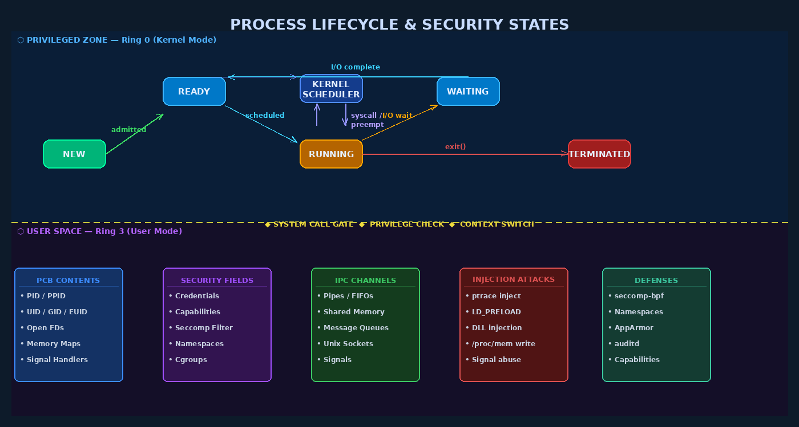

# Chapter 2 — Process Management and Security

## Processes: The Security Unit of Execution

From a security standpoint, the **process** is the fundamental unit of isolation and trust in a modern operating system. When we ask "what can this program do?", we are really asking about the security context of its process: what credentials does it run with, what resources can it access, what system calls can it make? Understanding the process model deeply is essential to understanding how attacks are contained — and how they escape containment.

A **process** is a running instance of a program. It differs from the program itself (which is just bytes on disk) in that a process has allocated memory, a program counter tracking execution, an open file descriptor table, a set of credentials, and a position in the kernel's process hierarchy. A **thread** is an execution context within a process — multiple threads share the process's memory space and file descriptors but have independent stacks and CPU register states. From a security perspective, threads within the same process share the same credentials and address space, so compromising one thread effectively compromises all threads in the process.

## The Process Control Block

The kernel tracks every process through a data structure called the **Process Control Block (PCB)**, referred to as `task_struct` in the Linux kernel source. The PCB contains everything the kernel needs to manage and make security decisions about a process:

```c
// Simplified view of security-relevant fields in Linux task_struct
struct task_struct {
    pid_t pid;                     // Process ID
    pid_t tgid;                    // Thread Group ID (= PID for main thread)
    struct task_struct *parent;    // Parent process pointer
    
    // Credentials (the key security context)
    const struct cred *cred;       // Effective credentials
    const struct cred *real_cred;  // Real credentials
    
    // Memory map
    struct mm_struct *mm;          // Virtual memory descriptor
    
    // Open files
    struct files_struct *files;    // File descriptor table
    
    // Signals
    struct signal_struct *signal;
    sigset_t blocked;              // Blocked signals
    
    // Namespaces (containers)
    struct nsproxy *nsproxy;
    
    // Seccomp filter
    struct seccomp seccomp;        // System call filter
    
    // Linux capabilities
    kernel_cap_t cap_effective;    // Currently effective capabilities
    kernel_cap_t cap_permitted;    // Maximum allowed capabilities
    kernel_cap_t cap_inheritable;  // Capabilities passed across exec
};
```

The `cred` structure is particularly critical — it contains the UID, GID, supplementary groups, and Linux capabilities that govern every access control decision made for this process.



## Process Lifecycle and Security Implications

Processes move through distinct states during their lifetime, and each transition has security significance:

| State | Description | Security Implication |
|-------|-------------|----------------------|
| **NEW** | Process is being created | Credentials and namespace inheritance set here |
| **READY** | Waiting for CPU time | Process is in kernel scheduler queue; PCB accessible |
| **RUNNING** | Executing on CPU | Ring 3 (user) or Ring 0 (kernel, during syscall) |
| **WAITING** | Blocked on I/O or resource | Signal delivery can interrupt; timing attacks possible |
| **TERMINATED** | Execution complete | Exit code, resource accounting; zombie state until parent reaps |

The transition from READY to RUNNING happens through the **context switch** — a critical security operation where the kernel saves the CPU register state of one process and loads the state of another. The kernel must ensure that register values from process A cannot leak into process B's register file, preventing information disclosure.

## Process Creation: fork() and exec()

In Unix, process creation follows a two-step model that has profound security implications.

### The fork() System Call

`fork()` creates a new process by duplicating the calling process. The child process inherits:
- A **copy** of the parent's virtual address space (copy-on-write)
- The parent's **open file descriptor table** (same file descriptions)
- The parent's **credentials** (UID, GID, capabilities)
- The parent's **signal handlers** and signal mask
- The parent's **environment variables**

```c
#include <unistd.h>
#include <stdio.h>

int main() {
    // Before fork: process has open files, credentials, etc.
    int fd = open("/etc/shadow", O_RDONLY);  // will be inherited!
    
    pid_t pid = fork();
    if (pid == 0) {
        // Child process — inherits fd pointing to /etc/shadow
        // This is a security concern if child drops privileges
        // but forgets to close sensitive file descriptors
        execve("/usr/bin/untrusted_program", args, env);
        // untrusted_program now has fd open to /etc/shadow!
    }
}
```

> **Security Warning:** File descriptor inheritance across fork/exec is a classic source of privilege leaks. Secure code should either set the `FD_CLOEXEC` flag on sensitive file descriptors (so they are automatically closed on exec) or explicitly close them before dropping privileges. The `O_CLOEXEC` flag to `open()` sets this automatically.

### The exec() Family

After `fork()`, the child typically calls one of the `exec()` functions to replace its memory image with a new program. `exec()` preserves:
- PID
- Open file descriptors (unless `FD_CLOEXEC` is set)
- UID/GID (unless the new executable is setuid)
- Signal dispositions (handlers reset to defaults, ignores preserved)

When executing a **setuid** binary, the kernel changes the process's **effective UID** to the file owner's UID before execution begins — a critical security transition discussed in the next section.

### Windows CreateProcess()

Windows uses a single `CreateProcess()` call that combines process creation and executable loading. Security-relevant parameters include:

- **bInheritHandles** — whether parent's inheritable handles are passed to child
- **lpProcessAttributes / lpThreadAttributes** — security descriptors for the new objects
- **dwCreationFlags** — process priority and creation flags
- An optional explicit security token to assign (via `CreateProcessAsUser()`)

## Credentials and Privilege

### Unix UID/GID Model

Unix processes carry multiple credential identifiers:

| Identifier | Abbreviation | Purpose |
|-----------|--------------|---------|
| Real User ID | RUID | Who owns this process (who launched it) |
| Effective User ID | EUID | Used for access control decisions |
| Saved Set-User-ID | SUID | Allows return to privileged EUID |
| Real Group ID | RGID | Primary group of the user |
| Effective Group ID | EGID | Used for file access group checks |

The separation between RUID and EUID enables the setuid mechanism: a privileged program (e.g., `passwd`) can temporarily gain elevated privileges (EUID=0) to perform specific operations, then drop back to the user's RUID. The "saved set-UID" allows the process to toggle between the two.

```bash
# Find all setuid executables on the system (security audit)
find / -perm -4000 -type f 2>/dev/null

# Find all setgid executables
find / -perm -2000 -type f 2>/dev/null

# Check credentials of a running process
cat /proc/<PID>/status | grep -E "Uid|Gid|Cap"
```

### The Danger of Setuid Binaries

Setuid binaries are a major attack surface. When a setuid root program (like `sudo`, `pkexec`, or a custom application) has a vulnerability, exploiting that vulnerability grants the attacker root access. Historical examples include:

- **CVE-2021-4034 (PwnKit):** A heap overflow in `pkexec` (a setuid root binary) allowed local privilege escalation to root on virtually all Linux distributions.
- **CVE-2019-14287:** A `sudo` bug allowed a user with `sudo` privileges restricted to a specific user ID to run commands as root by passing user ID `-1` or `4294967295`.

```bash
# Audit: list setuid binaries with their owners
find / -perm -4000 -type f 2>/dev/null -exec ls -la {} \;

# Expected legitimate setuid binaries
# -rwsr-xr-x root root /usr/bin/passwd
# -rwsr-xr-x root root /usr/bin/sudo
# -rwsr-xr-x root root /usr/bin/newgrp
```

### Windows Access Tokens

In Windows, every process has an associated **access token** that identifies the user, group memberships, privilege list, and integrity level. Token types:

- **Primary Token:** Created at logon; assigned to a process
- **Impersonation Token:** Used by a thread to temporarily assume a client's security context (used in client/server applications)

Windows **integrity levels** (Vista and later) add a mandatory layer: Low (browser processes, sandboxes), Medium (normal user processes), High (elevated/administrator), System (OS processes), Untrusted. Objects have mandatory integrity labels; Low integrity processes cannot write to Medium integrity objects even if the DACL would allow it.

## Process Isolation: Virtual Address Spaces

Each process runs in its own **virtual address space** — a private mapping of virtual addresses to physical memory pages managed by the kernel. Process A cannot read or write Process B's memory because:

1. Each process has its own **page table** — a mapping from virtual to physical addresses
2. Physical pages belonging to process A are not mapped into process B's page table
3. The CPU enforces page table boundaries in hardware

However, this isolation has intentional exceptions and unintended bypass techniques:

**Intentional Exceptions:**
- `ptrace()` system call — allows debuggers to read/write another process's memory (requires appropriate privileges or parent-child relationship)
- `/proc/<PID>/mem` — virtual file allowing authorized processes to read/write another process's memory
- Shared memory (`shmget`, `mmap` with `MAP_SHARED`) — explicitly shared regions between cooperating processes

**Unintended Bypasses:**
- **Spectre/Meltdown (2018):** CPU speculative execution caused physical memory (including kernel memory) to be loaded into CPU caches in ways that user-space processes could measure, breaking the assumption that virtual memory isolation protects confidentiality.
- **Row Hammer:** A hardware vulnerability where rapidly reading from DRAM rows causes bit flips in adjacent rows, allowing a process to modify memory it does not own.

## The /proc Filesystem

The `/proc` filesystem is a virtual filesystem that exposes kernel data structures as files. It is both a security intelligence source and an attack surface.

```bash
# Security investigation: what is process 1234 doing?
ls -la /proc/1234/fd/          # Open file descriptors
cat /proc/1234/maps            # Memory mappings with permissions
cat /proc/1234/status          # Credentials, capabilities
cat /proc/1234/cmdline         # Command line arguments
cat /proc/1234/environ         # Environment variables (may contain secrets!)
cat /proc/1234/net/tcp         # Network connections

# Security risk: environment variables often contain credentials
# strings /proc/<PID>/environ | grep -i "pass\|key\|secret\|token"
```

> **Security Warning:** `/proc/<PID>/environ` can expose API keys, database passwords, and other secrets passed as environment variables. Production systems should never pass secrets as environment variables, and should restrict access to `/proc` entries of privileged processes.

## Inter-Process Communication Security

IPC mechanisms allow processes to share data, creating communication channels that must be secured:

| IPC Mechanism | Security Considerations |
|---------------|------------------------|
| **Pipes** | One-directional, no authentication; vulnerable to FD leaks |
| **Named Pipes (FIFOs)** | Filesystem-based; permissions control who can open |
| **Unix Domain Sockets** | Can pass credentials (SCM_CREDENTIALS); path-based access |
| **Shared Memory** | Fast but requires careful synchronization; vulnerable to TOCTOU |
| **Message Queues** | Kernel-mediated; permission bits on the queue object |
| **D-Bus** | Policy file controls method calls; historically has had auth bypass bugs |

## Process Injection Techniques

Process injection allows attackers to execute code within the context of another process, inheriting its credentials and memory:

**Linux — ptrace injection:**
```python
# Conceptual: attach to process, write shellcode to memory, redirect execution
# ptrace(PTRACE_ATTACH, target_pid)
# ptrace(PTRACE_POKETEXT, target_pid, addr, shellcode)
# ptrace(PTRACE_SETREGS, target_pid, NULL, &regs_with_modified_rip)
```

**Linux — LD_PRELOAD hijacking:**
```bash
# Forces dynamic linker to load attacker's shared library FIRST
# Attacker can override any library function (e.g., getuid, strcmp)
LD_PRELOAD=/tmp/evil.so /usr/bin/sudo
```

**Windows — DLL injection:**
A remote thread is created in the target process using `CreateRemoteThread()`, with its start address pointing to `LoadLibrary()` with the attacker's DLL path — causing the DLL to load and execute within the target process's context.

## Defenses: Confining Processes

### seccomp-bpf

`seccomp` (secure computing mode) allows a process to install a BPF filter that restricts which system calls it can make:

```c
#include <sys/prctl.h>
#include <linux/seccomp.h>
#include <linux/filter.h>

// Modern browsers, container runtimes, and sandboxes use this
// to limit damage from compromised code
prctl(PR_SET_SECCOMP, SECCOMP_MODE_FILTER, &bpf_program);
```

Chrome, Firefox, systemd, and Docker all use seccomp filters to limit the system calls available to potentially dangerous code.

### Linux Namespaces

Namespaces allow the kernel to present a process with an isolated view of system resources:

| Namespace | Isolates |
|-----------|---------|
| **PID** | Process IDs — process 1 inside container is not the real init |
| **NET** | Network interfaces, routes, iptables |
| **MNT** | Filesystem mount points |
| **USER** | UID/GID mapping — fake root inside container |
| **IPC** | SysV IPC, POSIX message queues |
| **UTS** | Hostname and domainname |

```bash
# Run a process in an isolated network namespace (no network access)
ip netns add isolated
ip netns exec isolated /bin/bash
# Inside: cannot reach external network
```

### Monitoring with auditd

```bash
# Audit setuid execution
auditctl -a always,exit -F arch=b64 -S execve -F euid=0 -F auid>=1000 -k setuid_exec

# Audit ptrace usage (potential injection)
auditctl -a always,exit -F arch=b64 -S ptrace -k ptrace_audit

# View audit log
ausearch -k setuid_exec | aureport -x
```

---

## Key Terms

| Term | Definition |
|------|-----------|
| **Process** | A running program instance with its own address space and credentials |
| **Thread** | Execution context within a process; shares address space |
| **PCB (Process Control Block)** | Kernel data structure tracking all process state |
| **fork()** | System call that duplicates a process |
| **exec()** | System call that replaces a process's memory image with a new program |
| **RUID/EUID** | Real vs. Effective User ID; EUID used for access control |
| **Setuid bit** | Executable flag causing process to run with file owner's EUID |
| **Context Switch** | Kernel operation saving/restoring CPU state between processes |
| **Virtual Address Space** | Private memory mapping per process; hardware-enforced isolation |
| **ptrace** | System call allowing one process to read/write another's memory |
| **LD_PRELOAD** | Environment variable that forces shared library loading before others |
| **DLL Injection** | Windows technique to load code into another process |
| **seccomp** | Linux mechanism to filter available system calls via BPF |
| **Namespace** | Kernel isolation mechanism for various system resources |
| **Access Token (Windows)** | Process security context: user, groups, privileges, integrity level |
| **Integrity Level** | Windows mandatory label (Low/Medium/High/System) |
| **IPC** | Inter-Process Communication: pipes, shared memory, sockets, etc. |
| **/proc filesystem** | Virtual FS exposing kernel process information as files |
| **auditd** | Linux audit daemon for security event logging |

---

## Review Questions

1. **Conceptual:** Explain why file descriptor inheritance across `fork()` and `exec()` is a security concern. What is the `FD_CLOEXEC` flag and how does it mitigate this risk?

2. **Lab:** Find all setuid root binaries on your system. Choose one (not `sudo` or `passwd`) and research its purpose. Explain what access it requires root for and what would happen if it had a buffer overflow vulnerability.

3. **Conceptual:** A web server process runs as `www-data` (RUID and EUID both equal to www-data's UID). An attacker exploits a remote code execution vulnerability in the web server. What can the attacker do with www-data privileges? What can they NOT do?

4. **Lab:** Read `/proc/<your_shell_PID>/maps` and identify each memory region. Classify each region by type (text, data, heap, stack, library, vDSO) and note the read/write/execute permissions.

5. **Conceptual:** Explain the difference between a Linux namespace and a seccomp filter. How do they complement each other in a container security model?

6. **Analysis:** The LD_PRELOAD injection technique requires the attacker to set an environment variable before launching the target program. Why does this technique NOT work against setuid binaries? (Hint: look up how the dynamic linker handles LD_PRELOAD for setuid executables.)

7. **Lab:** Use `strace -p <PID>` to attach to a running process. What system calls do you observe? What security-sensitive operations can you see? What does this imply about the security of `strace` itself?

8. **Conceptual:** Spectre and Meltdown broke the assumption that virtual memory isolation is absolute. Explain the mechanism (speculative execution and cache timing) at a high level, and describe two OS-level mitigations that were deployed.

9. **Lab:** Run `cat /proc/self/status | grep Cap` and decode the capability bitmasks using `capsh --decode=<hex>`. What capabilities does your current shell process have?

10. **Analysis:** Compare process isolation in a Linux container (namespaces + cgroups + seccomp) versus a virtual machine. In what scenarios might a container's isolation be insufficient and a VM required?

---

## Further Reading

- Kerrisk, M. (2010). *The Linux Programming Interface.* No Starch Press. Chapters 25–28 (process creation), 36–37 (process credentials), 43–46 (IPC).
- Love, R. (2010). *Linux Kernel Development, 3rd ed.* Addison-Wesley. Chapter 3 (process management) — covers `task_struct` in depth.
- Kocher, P. et al. (2019). *Spectre Attacks: Exploiting Speculative Execution.* IEEE S&P 2019. — Original Spectre paper describing process isolation bypass.
- Google Project Zero. *A Deep Dive into Linux Namespaces.* projectzero.blogspot.com — Analysis of namespace security boundaries and escape techniques.
- Anderson, J. (2019). *An Introduction to Linux Audit System (auditd).* Red Hat Security Blog. — Practical guide to process-level security monitoring.
