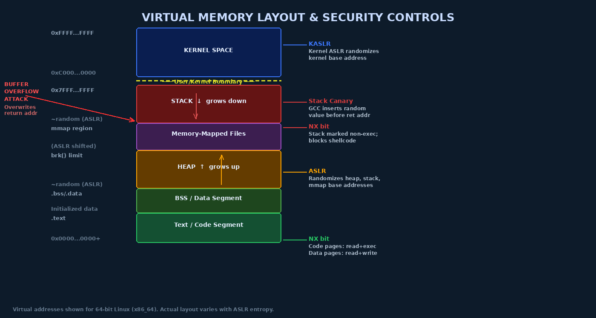

# Chapter 3 — Memory Management Security

## Why Memory Security Is the Most Critical OS Topic

Memory corruption vulnerabilities have dominated the security landscape for over three decades. The fundamental reason is that languages like C and C++ — which underlie virtually every OS kernel, embedded system, and high-performance runtime — do not automatically enforce memory bounds. A programmer who writes beyond the end of an array does not get an exception; they silently corrupt adjacent memory. An attacker who can carefully control *what* gets corrupted and *with what value* can often achieve arbitrary code execution.

Memory safety issues account for roughly 70% of high-severity Microsoft security vulnerabilities and a similar fraction of Chrome and Android CVEs. Understanding how these vulnerabilities work, and how the OS defends against them, is among the most practically valuable skills in security engineering.

## Virtual Memory Architecture

Modern operating systems use **virtual memory** to give each process the illusion of having the entire address space to itself. The CPU translates **virtual addresses** (what the program uses) to **physical addresses** (actual RAM locations) using **page tables** — data structures maintained by the kernel.

### The Paging Mechanism

Memory is divided into fixed-size units called **pages** (typically 4096 bytes on x86). The kernel maintains a **page table** for each process mapping virtual page numbers to physical page frame numbers. Each page table entry (PTE) contains:

- The physical frame number
- **Present bit** — is this page currently in RAM?
- **Read/Write bit** — can this page be written?
- **User/Supervisor bit** — can user-mode (ring 3) code access this page?
- **Execute-Disable (NX) bit** — can code be executed from this page?
- **Dirty/Accessed bits** — for OS page replacement algorithms

The **Translation Lookaside Buffer (TLB)** caches recent virtual-to-physical translations for performance. Security note: the TLB must be flushed during context switches to prevent one process from using cached entries belonging to another process (a **TLB flush attack surface**).

### Kernel Space vs. User Space Separation

On a 64-bit Linux system, the virtual address space is divided:
- **User space:** `0x0000000000000000` – `0x00007FFFFFFFFFFF` (128 TB)
- **Kernel space:** `0xFFFF800000000000` – `0xFFFFFFFFFFFFFFFF` (128 TB)

Kernel pages have the **User/Supervisor bit cleared**, so any attempt by ring-3 code to access them causes a **General Protection Fault**. Two additional CPU features strengthen this:

- **SMEP (Supervisor Mode Execution Prevention):** The kernel cannot execute code from user-space pages. Prevents "ret2usr" attacks where kernel code is redirected to attacker shellcode in user space.
- **SMAP (Supervisor Mode Access Prevention):** The kernel cannot access user-space data without explicitly disabling SMAP via `stac`/`clac` instructions. Prevents kernel from being tricked into reading attacker-controlled data.



## Process Memory Layout

A typical Linux process's virtual address space contains these segments:

```
High addresses
┌─────────────────┐ 0x7FFFFFFFFFFF
│    STACK        │ ← grows downward; local variables, return addresses
│        ↓        │
├─────────────────┤ (ASLR randomizes this)
│  Memory-Mapped  │   shared libraries (.so files), anonymous mmap
│    Region       │
├─────────────────┤
│        ↑        │
│    HEAP         │ ← grows upward; malloc/new allocations
├─────────────────┤ (ASLR randomizes this)
│  BSS Segment    │   uninitialized global variables (zeroed)
│  Data Segment   │   initialized global variables
│  Text Segment   │   program code (read + execute, no write)
└─────────────────┘ ~0x400000
Low addresses
```

## Stack-Based Buffer Overflow: The Classic Attack

The stack-based buffer overflow is the prototype memory corruption vulnerability. Understanding it deeply illuminates all subsequent vulnerability classes.

### Anatomy of a Stack Frame

When a function is called, the CPU pushes the **return address** (where execution should resume after the function returns) onto the stack, then the function sets up its **stack frame**:

```
High addresses (toward bottom of stack diagram)
┌────────────────────────────┐
│   Arguments to function    │
├────────────────────────────┤
│   Return Address           │ ← attacker's target: overwrite this
├────────────────────────────┤
│   Saved EBP/RBP            │ ← previous frame pointer
├────────────────────────────┤
│   Local variable buf[64]   │ ← overflow starts here
│   ...                      │ ← writing past end of buf
│   (rest of locals)         │
└────────────────────────────┘ ← ESP/RSP (top of stack)
```

### Vulnerable Code Example

```c
#include <stdio.h>
#include <string.h>

void vulnerable_function(char *user_input) {
    char buf[64];
    // VULNERABLE: strcpy does not check length!
    // If user_input > 64 bytes, overwrites saved RBP, return addr, etc.
    strcpy(buf, user_input);
    printf("Input: %s\n", buf);
}

int main(int argc, char *argv[]) {
    if (argc > 1)
        vulnerable_function(argv[1]);
    return 0;
}
```

An attacker supplies more than 64 bytes of input. The overflow:
1. Fills the 64-byte buffer
2. Overwrites the saved RBP (8 bytes on x86-64)
3. Overwrites the return address with the attacker's chosen value

When `vulnerable_function` returns, instead of going back to `main`, execution jumps to the attacker's address — which they've set to point to their **shellcode** (machine code that spawns a shell).

```bash
# Compile without protections for educational demonstration
gcc -fno-stack-protector -z execstack -no-pie -o vuln vuln.c

# With all protections (modern default)
gcc -fstack-protector-strong -pie -z noexecstack -o vuln_safe vuln.c
```

## Heap Overflow and Heap Exploitation

The heap is the dynamic memory region managed by `malloc()`/`free()` (or `new`/`delete` in C++). Heap overflows corrupt the metadata that `malloc` uses to track free memory blocks:

```c
// Heap overflow example
char *buf1 = malloc(64);
char *buf2 = malloc(64);  // Adjacent allocation

// Writing past buf1 corrupts buf2's malloc header
memcpy(buf1, attacker_input, 200);  // Overflow!
```

Heap exploitation techniques like **House of Spirit** and **House of Force** manipulate free-list pointers to cause `malloc` to return an attacker-controlled address on the next allocation — allowing writes to arbitrary locations including function pointers and return addresses.

## Use-After-Free: The Modern Dominant Vulnerability

Use-after-free (UAF) occurs when memory is freed but a pointer to it (a **dangling pointer**) remains and is later dereferenced:

```c
char *ptr = malloc(128);
free(ptr);
// ptr is now a dangling pointer — the memory may have been reallocated
// Attacker allocates their own object at the same address
char *attacker_obj = malloc(128);
// Copy attacker-controlled data into it
memcpy(attacker_obj, evil_data, 128);
// Now the dangling ptr dereferences attacker's data as if it were the original
ptr->function_pointer();  // Redirected to attacker code!
```

UAF vulnerabilities are the dominant class in modern browser exploits and are increasingly common in OS kernels. The Spectre family of kernel exploitation techniques frequently chains UAF with speculative execution to leak kernel memory.

## Integer Overflow → Memory Corruption

Integer overflow can silently create buffer sizes smaller than expected:

```c
// size_t is unsigned; if user_len = 0xFFFFFFFF and HEADER_SIZE = 8,
// then: 0xFFFFFFFF + 8 = 7 (wraps around!)
void process_packet(size_t user_len) {
    char *buf = malloc(user_len + HEADER_SIZE);  // Allocates only 7 bytes!
    memcpy(buf, packet_data, user_len);           // Writes 0xFFFFFFFF bytes → overflow
}
```

## Format String Vulnerabilities

Format string bugs occur when user-controlled data is passed directly as the format argument to `printf` family functions:

```c
// VULNERABLE
printf(user_input);  // user_input = "%x %x %x %x" leaks stack values
                     // user_input = "%n" writes to stack address!

// SAFE
printf("%s", user_input);  // Format string is controlled by programmer
```

The `%n` format specifier writes the number of characters printed so far to a pointer argument. With a crafted format string, an attacker can write arbitrary values to arbitrary addresses.

## Memory Safety Defenses

Modern OS and compiler toolchains deploy multiple layered defenses. Attackers must defeat all active defenses — a key principle of defense-in-depth.

### ASLR: Address Space Layout Randomization

ASLR randomizes the base addresses of the stack, heap, shared libraries, and (with PIE) the executable itself at each execution. An attacker who doesn't know where shellcode or ROP gadgets are located cannot jump to them.

```bash
# Linux ASLR configuration
cat /proc/sys/kernel/randomize_va_space
# 0 = disabled
# 1 = randomize stack, mmap, vDSO
# 2 = randomize stack, mmap, vDSO, heap (recommended)

# Observe ASLR in action
ldd /bin/ls  # Run twice — library base addresses change each time
```

**ASLR Bypass Techniques:**
- **Information leak:** Use a separate read vulnerability to leak an address from the process's memory, then calculate the base address from the known offset
- **Brute force:** Works only for 32-bit processes (low entropy); 64-bit ASLR has ~28 bits of entropy for the stack = 256 million possibilities

### Stack Canaries

GCC's **Stack Smashing Protector (SSP)** places a random **canary value** between local variables and the return address:

```
Stack frame with canary:
[ Local variables ] [ CANARY ] [ Saved RBP ] [ Return Address ]
```

Before returning, the function checks whether the canary still matches its original value. If an overflow changed the canary, the program calls `__stack_chk_fail()` and terminates.

```bash
# Compile with stack protection (default in most distributions)
gcc -fstack-protector-strong -o program program.c

# Check for stack protector in a binary
checksec --file=program  # (from pwntools or checksec package)
```

**Bypass:** If the attacker can first leak the canary value (via format string or read vulnerability), they can overwrite the canary with its own value, defeating the check.

### NX / DEP: Non-Executable Memory

The **NX bit** (No-Execute, also called XD on Intel, W^X policy) marks pages as either executable OR writable but not both simultaneously. This prevents the classical shellcode injection where the attacker writes their shellcode to the stack and jumps to it — the stack is now marked non-executable, causing a fault if the CPU tries to execute from it.

```bash
# Check NX status of a binary
readelf -l program | grep GNU_STACK
# RW = no NX (dangerous); RWE or absence = executable stack
# With NX: should show "RW" (no E flag)
```

**Bypass: Return-Oriented Programming (ROP)**

ROP defeats NX by not injecting new code — instead, the attacker chains together small snippets of existing executable code called **gadgets**. A gadget is a sequence ending in a `ret` instruction:

```
Gadget 1: pop rdi ; ret       (sets argument register)
Gadget 2: pop rsi ; ret       (sets second argument)
Gadget 3: call system         (calls system("bin/sh"))
```

By overwriting the stack with a chain of return addresses pointing to gadgets, the attacker builds a Turing-complete computation using only code that already exists in the binary or its libraries — all of it executable. The **ret2libc** technique is the simplest ROP attack: return directly to the `system()` function in libc with `/bin/sh` as the argument.

```bash
# Find ROP gadgets in a binary
ROPgadget --binary /lib/x86_64-linux-gnu/libc.so.6 | grep "pop rdi"
```

### KASLR

Kernel ASLR randomizes the base address at which the kernel loads itself in memory. Without KASLR, kernel symbols have fixed, predictable addresses — an attacker could hard-code the address of `commit_creds` or `prepare_kernel_cred` in their exploit.

**Bypasses:** Meltdown (CVE-2017-5754) used speculative execution to read kernel memory from user space, defeating KASLR by leaking kernel virtual addresses. The fix (KPTI — Kernel Page Table Isolation) maintains separate page tables for user and kernel mode, preventing user-space code from even *seeing* kernel addresses.

### Intel CET and Shadow Stack

Intel **Control-Flow Enforcement Technology (CET)** introduces the **shadow stack** — a second, read-only stack that stores only return addresses. When a function returns, the CPU checks that the return address on the regular stack matches the one on the shadow stack. ROP chains that overwrite the regular stack's return addresses are detected because the shadow stack is unmodified.

```bash
# Check for CET/shadow stack support in a binary
readelf -n binary | grep "Properties"
# Look for: GNU_PROPERTY_X86_FEATURE_1_SHSTK
```

## Memory Forensics Basics

Memory dumps contain a snapshot of system state at a point in time — valuable for incident response and malware analysis.

```bash
# Capture memory on Linux (LiME kernel module)
insmod /tmp/lime.ko "path=/tmp/memory.lime format=lime"

# Analyze with Volatility
python3 vol.py -f memory.lime linux.pslist  # List processes
python3 vol.py -f memory.lime linux.netstat # Network connections
python3 vol.py -f memory.lime linux.bash    # Bash history from memory
```

Evidence recoverable from memory dumps includes: running process list (including hidden rootkit processes), network connections, loaded kernel modules, decrypted data that is encrypted on disk, browser history, and encryption keys.

---

## Key Terms

| Term | Definition |
|------|-----------|
| **Virtual Memory** | Per-process abstraction mapping virtual to physical addresses via page tables |
| **Page Table** | Kernel data structure translating virtual page numbers to physical frames |
| **NX/XD bit** | CPU page table bit marking a page as non-executable |
| **SMEP/SMAP** | CPU features preventing kernel from executing/accessing user-space memory |
| **Buffer Overflow** | Writing past the end of a buffer, corrupting adjacent memory |
| **Stack Frame** | Per-function stack region containing locals, saved registers, and return address |
| **Return Address** | Saved program counter on the stack; overwriting it redirects execution |
| **Shellcode** | Machine code payload injected and executed by an attacker |
| **ASLR** | Address Space Layout Randomization — randomizes memory base addresses |
| **Stack Canary** | Random value between locals and return address to detect stack overflow |
| **NX / DEP** | Non-Executable memory / Data Execution Prevention — prevents shellcode execution |
| **ROP (Return-Oriented Programming)** | Exploit technique chaining existing code gadgets to bypass NX |
| **ret2libc** | ROP technique redirecting execution to libc functions (e.g., `system()`) |
| **Use-After-Free (UAF)** | Using a pointer after the pointed-to memory has been freed |
| **Heap Overflow** | Buffer overflow in heap-allocated memory corrupting heap metadata |
| **Integer Overflow** | Arithmetic overflow causing incorrect buffer size calculation |
| **Format String Bug** | Passing user input as printf format string, enabling memory reads/writes |
| **KASLR** | Kernel ASLR — randomizes kernel load address at boot |
| **KPTI** | Kernel Page Table Isolation — separates user/kernel page tables to defeat Meltdown |
| **Shadow Stack (CET)** | Read-only copy of return addresses; detects ROP chain manipulation |

---

## Review Questions

1. **Conceptual:** Explain in detail how overwriting the return address in a stack frame allows an attacker to redirect program execution. Draw a diagram of the stack before and after the overflow.

2. **Lab:** Compile the vulnerable C program from this chapter with no protections (`-fno-stack-protector -z execstack -no-pie`). Use `gdb` with `pattern create 200` (pwndbg/peda extension) to determine the exact offset to the return address.

3. **Conceptual:** ASLR and stack canaries are both designed to prevent return address overflows. Explain how a **format string vulnerability** (which provides a memory read primitive) can be used to defeat both protections simultaneously.

4. **Conceptual:** Return-Oriented Programming bypasses NX/DEP without injecting any code. Explain the mechanism, and describe what additional defense (introduced after NX) is specifically designed to defeat ROP.

5. **Lab:** On a Linux system with ASLR enabled, run `ldd /bin/ls` five times. Record the base address of `libc.so.6` each time. Calculate the entropy (number of different positions observed or estimable). How does this compare to 32-bit ASLR entropy?

6. **Conceptual:** Explain the difference between stack overflow exploitation and heap overflow exploitation. Why are heap exploitation techniques (House of Spirit, House of Force) generally considered harder to exploit reliably?

7. **Analysis:** The Meltdown vulnerability (CVE-2017-5754) was described as breaking KASLR. Explain how speculative execution caused kernel memory to be exposed to user-space processes, and why KPTI (Kernel Page Table Isolation) was an effective mitigation.

8. **Lab:** Run `checksec --file=/bin/ls` (install pwntools if needed). Identify which protections are present: NX, PIE, stack canary, RELRO. For any protection that is absent, explain what attack it would defend against.

9. **Conceptual:** Use-after-free vulnerabilities have become the dominant memory corruption class in modern systems. Why has the industry moved away from stack overflows as a primary attack vector? What properties of modern programs make UAF more exploitable?

10. **Lab:** Using `cat /proc/self/maps`, locate the VDSO, stack, heap, and text segment for your shell process. Note the address randomization. Then run `sysctl -w kernel.randomize_va_space=0` (as root in a test VM), and repeat — observe how addresses become deterministic.

---

## Further Reading

- Aleph One (Elias Levy). (1996). *Smashing the Stack for Fun and Profit.* Phrack Magazine, Issue 49. — The foundational buffer overflow paper; still required reading.
- Prandini, M. & Ramilli, M. (2012). *Return-Oriented Programming.* IEEE Security & Privacy. — Accessible introduction to ROP techniques.
- Lipp, M. et al. (2018). *Meltdown: Reading Kernel Memory from User Space.* USENIX Security 2018. — Original Meltdown paper.
- Sotirov, A. & Dowd, M. (2008). *Bypassing Browser Memory Protections.* Black Hat 2008. — Classic analysis of combined ASLR + DEP bypass techniques.
- Serebryany, K. et al. (2012). *AddressSanitizer: A Fast Address Sanity Checker.* USENIX ATC 2012. — The compiler instrumentation tool used to detect memory errors during development.
