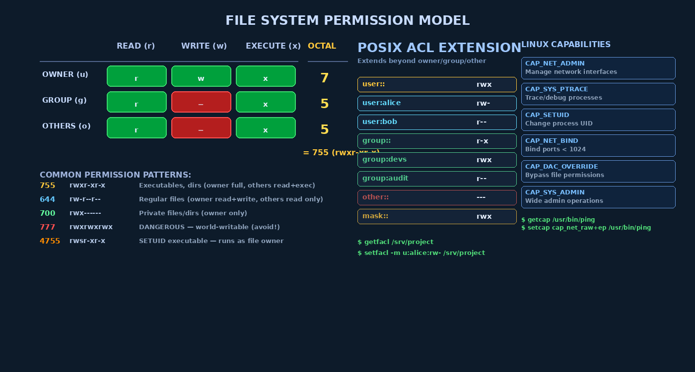

# Chapter 4 — File System Security

## The File System as a Security Boundary

The file system is where computing security becomes tangible. While memory corruption vulnerabilities are subtle and transient, file system security failures leave persistent evidence and persistent damage: configuration files read by attackers, secrets stolen from plaintext files, malware installed in startup directories, logs deleted to hide intrusion. The file system is also the primary mechanism through which users and processes share data — and sharing requires boundaries.

Two properties make the file system uniquely important from a security perspective. First, it is **persistent**: modifications survive reboots, power loss, and process termination. An attacker who achieves a momentary privilege escalation and installs a backdoor in a startup script has persistent access until someone notices and removes it. Second, it is **universally accessed**: virtually every operation a process performs eventually involves the file system — reading configuration, loading libraries, logging output, exchanging data with other processes through named pipes or socket files.

## Inodes and the Unix File System Model

In Unix-derived systems, every file and directory is represented by an **inode** (index node) — a kernel data structure that stores everything about a file except its name and contents:

```
Inode structure (simplified):
- File type (regular, directory, symbolic link, device, socket, pipe)
- Owner UID
- Owner GID
- Access permissions (12 bits: special + rwx×3)
- Timestamps: atime (last access), mtime (last modification), ctime (inode change)
- Link count (number of directory entries pointing to this inode)
- File size
- Block pointers (where file data lives on disk)
```

The filename is stored in a **directory entry** (dentry) that maps a name to an inode number. A single inode can have multiple directory entries pointing to it (hard links). Symbolic links (symlinks), by contrast, are themselves files containing a path string — and are a significant attack surface.

## Unix Permission Bits: The 9-Bit Model

Every file and directory has a 9-bit permission mask organized as three sets of **rwx** bits:

```
-rwxr-xr-x  (for a file like /usr/bin/ls)
│└────────┘
│ ↑↑↑ ↑↑↑ ↑↑↑
│ Owner Group Others
│ (u)   (g)   (o)
│
└─ File type: - = regular, d = directory, l = symlink,
               c = char device, b = block device, p = pipe, s = socket
```

| Bit | On File | On Directory |
|-----|---------|-------------|
| **r** (read) | Read file contents | List directory entries |
| **w** (write) | Modify file contents | Create/delete/rename entries in dir |
| **x** (execute) | Run as program | Enter directory (traverse); required for all subdirectory access |

The permission bits are stored as an octal number, where each digit represents one of the three groups:

```
755 → 111 101 101 → rwx r-x r-x
644 → 110 100 100 → rw- r-- r--
700 → 111 000 000 → rwx --- ---
000 → 000 000 000 → --- --- ---
```

```bash
# Viewing and changing permissions
ls -la /etc/shadow        # -rw-r----- = 640 (owner read/write, group read)
chmod 750 /srv/app        # Set explicitly
chmod u+x,g-w script.sh   # Symbolic modification
stat /etc/passwd           # Shows octal permissions, owner UID/GID
```



## umask: Default Permission Control

The **umask** defines which permission bits are **cleared** (masked off) when new files and directories are created:

```bash
umask 022
# New files:       666 AND NOT 022 = 644 (rw-r--r--)
# New directories: 777 AND NOT 022 = 755 (rwxr-xr-x)

umask 077
# New files:       666 AND NOT 077 = 600 (rw-------)  — private files
# New directories: 777 AND NOT 077 = 700 (rwx------)  — private dirs

# Check current umask
umask       # Shows current value
umask -S    # Shows symbolic: u=rwx,g=rx,o=rx (for umask 022)
```

> **Security Principle:** umask 022 is the typical system default — it prevents world-writable file creation, which is important because world-writable files can be modified by any user. Critical servers and backup scripts should use umask 077 to ensure sensitive output files are private by default.

## Special Permission Bits: SUID, SGID, Sticky

Beyond the 9 standard rwx bits, Unix supports three additional special bits that are a major source of both power and vulnerability:

### Setuid (SUID) — The Double-Edged Sword

When the SUID bit is set on an **executable**, the kernel sets the process's **Effective UID (EUID)** to the file's owner UID when it is executed. This allows ordinary users to run privileged operations without becoming root:

```bash
ls -la /usr/bin/passwd
# -rwsr-xr-x root root /usr/bin/passwd
#   ^
#   's' in owner execute position = SUID set
#   The 's' means the executable has SUID and owner has x permission
#   An 'S' (capital) would mean SUID set but owner has NO execute — a mistake

# passwd runs as root (EUID=0) even when launched by a regular user
# This is necessary because it needs to write to /etc/shadow (root-only)
```

**Security risk:** SUID root binaries are among the most valuable targets for privilege escalation. Any exploitable bug in a SUID root binary (buffer overflow, format string, command injection) can be leveraged to gain root.

```bash
# Security audit: find all SUID executables
find / -perm -4000 -type f 2>/dev/null

# Find recently modified SUID binaries (suspicious!)
find / -perm -4000 -newer /etc/passwd -type f 2>/dev/null
```

### Setgid (SGID)

SGID on an executable sets the process's EGID to the file's group. On **directories**, SGID causes new files created inside to inherit the directory's group (rather than the creator's primary group) — useful for shared project directories.

### Sticky Bit

On directories, the sticky bit prevents users from deleting files they don't own, even if they have write permission on the directory:

```bash
ls -la /tmp
# drwxrwxrwt
#         ^
#         't' = sticky bit set
# All users can create files in /tmp
# But only the file owner (or root) can delete their own files
```

Without the sticky bit, `/tmp` would be chaotic — any user could delete any other user's temporary files.

## File Permission Attack Scenarios

### World-Writable Files and Directories

```bash
# Find world-writable files (excluding /tmp, /proc)
find / -perm -002 -not -path "/tmp/*" -not -path "/proc/*" -type f 2>/dev/null

# Dangerous: world-writable cron job file
# An attacker can append malicious commands to execute as root
ls -la /etc/cron.d/
```

### Symlink Attacks in /tmp (TOCTOU Race)

The `/tmp` directory is world-writable with the sticky bit. An attacker can exploit **Time-Of-Check to Time-Of-Use (TOCTOU)** races using symbolic links:

```
Scenario (CVE-2017-6074 pattern):
1. Privileged program creates /tmp/tempfile for writing
2. Attacker creates symlink: /tmp/tempfile -> /etc/sudoers
3. Race condition: the moment between the program's check that 
   /tmp/tempfile is safe and its actual open()
4. Program opens /tmp/tempfile, which now points to /etc/sudoers
5. Program writes to /etc/sudoers, granting attacker sudo access
```

Defenses include using `mkstemp()` (creates a uniquely named temp file), the `O_NOFOLLOW` flag (refuses to follow symlinks on open), and `/proc/sys/fs/protected_symlinks = 1` (kernel-level symlink restriction in sticky directories).

```bash
# Enable kernel symlink/hardlink protections
sysctl fs.protected_symlinks=1
sysctl fs.protected_hardlinks=1
```

## POSIX Access Control Lists (ACLs)

Standard Unix permissions have a fundamental limitation: only one owner, one group, one "everyone else." **POSIX ACLs** extend this to allow permissions for any number of named users and groups:

```bash
# View ACL on a file
getfacl /srv/project/

# Example output:
# file: project
# owner: alice
# group: devteam
# user::rwx          (file owner)
# user:bob:rw-       (specific user bob)
# user:carol:r--     (read-only for carol)
# group::r-x         (owning group)
# group:sysadmin:rwx (full access for sysadmin group)
# mask::rwx          (maximum effective permissions for named users/groups)
# other::---         (everyone else: no access)

# Set ACL entries
setfacl -m u:bob:rw- /srv/project/report.txt
setfacl -m g:sysadmin:rwx /srv/project/
setfacl -R -m u:auditor:r-x /srv/project/  # Recursive

# Remove ACL entry
setfacl -x u:bob /srv/project/report.txt

# Default ACLs on directories (inherited by new files/subdirs)
setfacl -d -m g:devteam:rwx /srv/project/
```

The **mask** entry is critical: it defines the maximum permissions that can be granted to named users and groups (but not the file owner or "other"). Setting `mask::r--` overrides even `user:bob:rwx` to effectively give bob only read access.

## Linux Capabilities: Breaking the Root Monopoly

Traditional Unix has a binary privilege model: either you're root (and can do everything) or you're not (and are heavily restricted). **Linux capabilities** break root's omnipotence into ~40 distinct privileges that can be individually granted, removed, or restricted.

```bash
# View capabilities of a running process
cat /proc/<PID>/status | grep Cap
# CapInh: 0000000000000000  (inheritable)
# CapPrm: 0000000000000000  (permitted)
# CapEff: 0000000000000000  (effective)
# CapBnd: 000001ffffffffff  (bounding set)

# Decode capability bitmask
capsh --decode=000001ffffffffff

# View capabilities on an executable
getcap /usr/bin/ping
# /usr/bin/ping cap_net_raw=ep  (can send raw packets without root)

# Grant capability to executable (instead of making it SUID root)
setcap cap_net_bind_service=ep /usr/local/bin/myserver
# Now myserver can bind port 80 without root SUID
```

Key capabilities relevant to security:

| Capability | What It Allows | Security Risk |
|-----------|----------------|---------------|
| `CAP_NET_ADMIN` | Full network configuration | Can sniff all traffic, change routes |
| `CAP_NET_RAW` | Create raw/packet sockets | Can craft arbitrary packets |
| `CAP_SYS_PTRACE` | Debug any process | Can read any process's memory/secrets |
| `CAP_SETUID` | Change UID to any value | Effectively root |
| `CAP_DAC_OVERRIDE` | Bypass all file permissions | Can read any file |
| `CAP_SYS_ADMIN` | Broad admin operations | Almost equivalent to root |
| `CAP_CHOWN` | Change file ownership | Can take ownership of any file |

> **Security Warning:** `CAP_SYS_ADMIN` is sometimes called "the new root" because it grants so many powerful operations. Containers with `--cap-add SYS_ADMIN` should be treated as root-equivalent.

## Windows NTFS Permissions

Windows uses a fundamentally different permission model based on **Security Descriptors** attached to every securable object (file, directory, registry key, process, etc.):

- **DACL (Discretionary ACL):** Controls *who* has access and what kind (Read, Write, Execute, Full Control, etc.)
- **SACL (System ACL):** Controls *what to audit* — which accesses to log to the Security event log
- **Owner SID:** Can always change the DACL (discretionary = owner's choice)
- **Group SID:** (Legacy Unix compatibility field; not heavily used)

```cmd
REM View and manage NTFS permissions
icacls C:\srv\webapp
icacls C:\srv\webapp /grant "DOMAIN\DevTeam:(OI)(CI)M"
icacls C:\srv\webapp /deny "Everyone:(W)"

REM Common NTFS permission levels
REM F = Full Control
REM M = Modify (no permission change)
REM RX = Read & Execute
REM R = Read only
REM W = Write only
```

**Permission inheritance** is a key Windows concept: permissions set on a parent directory flow down to child files and subdirectories unless explicitly blocked. The `(OI)` (object inherit) and `(CI)` (container inherit) flags control this.

## File System Integrity Monitoring

How do you know if someone has modified a critical system file? Integrity monitoring establishes a baseline and alerts on deviations:

### AIDE (Advanced Intrusion Detection Environment)

```bash
# Initialize AIDE database (establishes baseline)
aide --init
cp /var/lib/aide/aide.db.new /var/lib/aide/aide.db

# Check for changes (run daily via cron)
aide --check

# Example output if /etc/sudoers was modified:
# File: /etc/sudoers
#  Mtime   : 2024-01-15 08:23:11  | 2024-03-20 03:47:22
#  SHA256  : abc123...            | def456...  (DIFFERENT!)
```

```bash
# /etc/aide.conf — what to monitor
/etc/      PERMS+CONTENT   # etc: check permissions AND content
/bin/      PERMS+CONTENT
/usr/bin/  PERMS+CONTENT
/var/log/  LOG             # logs: track changes but expect modifications
```

## Secure File Deletion

The `rm` command does not erase data — it only removes the directory entry and marks the inode's blocks as available. The data remains on disk until the blocks are overwritten by new data.

```bash
# Secure deletion: overwrite before deleting
shred -u -z -n 3 sensitive_file.txt
# -u: unlink (delete) after shredding
# -z: add final zero-overwrite pass to hide shredding
# -n 3: three overwrite passes (random data)

# Note: shred is less effective on:
# - SSDs (wear leveling means data may persist in old flash blocks)
# - Journaling filesystems (journal may contain file data)
# - RAID arrays (writes may go to unexpected locations)
# - Network/virtual filesystems

# For SSDs, use ATA Secure Erase or cryptographic erasure
hdparm --security-erase password /dev/sda
```

## Filesystem Encryption

Encryption protects data at rest from physical theft and unauthorized offline access:

| Solution | Scope | Strengths | Notes |
|----------|-------|-----------|-------|
| **dm-crypt/LUKS** | Full disk/partition | Transparent, kernel-native, widely used | Root passphrase at boot |
| **eCryptfs** | Per-directory | No special partition needed; per-user | `.Private/` in home dir |
| **BitLocker (Windows)** | Full disk | TPM integration, enterprise key management | Windows Pro/Enterprise |
| **FileVault (macOS)** | Full disk | Seamless, iCloud recovery key option | Hardware-accelerated on Apple Silicon |

```bash
# Create LUKS-encrypted partition
cryptsetup luksFormat /dev/sdb1
cryptsetup luksOpen /dev/sdb1 encrypted_data
mkfs.ext4 /dev/mapper/encrypted_data
mount /dev/mapper/encrypted_data /mnt/secure

# Add backup LUKS key slot (for recovery key)
cryptsetup luksAddKey /dev/sdb1
```

## /proc and /sys as Virtual Filesystems

`/proc` and `/sys` are virtual filesystems — they have no on-disk representation but expose kernel data structures as browsable files. This is both powerful and risky:

```bash
# Security-relevant /proc entries
/proc/sys/kernel/dmesg_restrict  # 1 = only root reads kernel messages
/proc/sys/fs/protected_symlinks  # 1 = symlink attack protection
/proc/sys/kernel/kptr_restrict   # 2 = hide kernel pointers from /proc
/proc/sys/kernel/perf_event_paranoid  # 3 = restrict perf to root only

# /sys security examples
/sys/kernel/security/apparmor/   # AppArmor policy interface
/sys/bus/usb/                    # USB device enumeration
```

> **Security Warning:** `/proc/<PID>/mem` allows a privileged process to read and write the memory of any process. While this is intentional (it's how debuggers work), it also means that any process with `CAP_SYS_PTRACE` can extract secrets from other processes at will. Container deployments should ensure this capability is restricted.

---

## Key Terms

| Term | Definition |
|------|-----------|
| **Inode** | Kernel data structure storing file metadata (permissions, ownership, timestamps) |
| **Permission bits** | 9-bit rwx mask for owner, group, and others |
| **Octal notation** | Base-8 representation of permission bits (e.g., 755) |
| **umask** | Bit mask applied to default permissions at file creation |
| **SUID (setuid)** | Permission bit causing executable to run with file owner's EUID |
| **SGID (setgid)** | Permission bit causing executable to run with file group's EGID |
| **Sticky bit** | On directories, prevents deletion of files by non-owners |
| **TOCTOU** | Time-Of-Check to Time-Of-Use race condition |
| **ACL** | Access Control List: per-named-user/group permissions beyond owner/group/other |
| **getfacl / setfacl** | Tools to view and modify POSIX ACL entries |
| **Linux capabilities** | Granular subdivision of root's privileges into ~40 distinct capabilities |
| **DACL** | Windows Discretionary ACL: who has what access to a Windows object |
| **SACL** | Windows System ACL: which accesses to audit/log |
| **AIDE** | Advanced Intrusion Detection Environment: file integrity monitoring tool |
| **shred** | Securely overwrite file data before deletion |
| **dm-crypt / LUKS** | Linux disk encryption framework |
| **Hard link** | Directory entry pointing to an existing inode |
| **Symlink** | Symbolic link: file containing a path string to another file |
| **O_NOFOLLOW** | open() flag refusing to follow symlinks in the final path component |
| **CAP_SYS_ADMIN** | Powerful Linux capability equivalent to near-root access |

---

## Review Questions

1. **Lab:** Run `ls -la /usr/bin/` and identify all setuid binaries. For each, determine its purpose and explain why setuid access is necessary for that specific functionality.

2. **Conceptual:** A developer creates a web application that stores uploaded files in `/var/www/uploads/` with permissions `777` (world-writable, world-executable). Describe three distinct attack scenarios this configuration enables.

3. **Lab:** Create a directory `/tmp/shared_project` and use `setfacl` to configure it so that user `alice` has `rwx`, user `bob` has `r-x`, the group `devteam` has `rwx`, and all others have no access. Verify with `getfacl`. Then explain what the `mask` entry shows.

4. **Conceptual:** Explain the TOCTOU race condition in symlink attacks. Why is the `O_NOFOLLOW` flag an effective defense but `access()` followed by `open()` is not?

5. **Lab:** Use `getcap -r / 2>/dev/null` to find all executables with Linux capabilities. Compare `/usr/bin/ping` — does it use SUID or capabilities on your system? What capability does it need and why?

6. **Conceptual:** Compare Windows NTFS DACL-based permissions to Unix permission bits. What can NTFS DACLs express that Unix permission bits cannot? What is the security significance of permission inheritance in Windows?

7. **Analysis:** Explain why `shred` may not reliably delete data on a modern SSD, a journaling filesystem, or a RAID array. What alternative mechanisms can be used for secure data erasure in each case?

8. **Lab:** Initialize an AIDE database on a test system. Then make a small change to `/etc/hosts`. Run `aide --check` and interpret the output. What metadata changed besides the file content hash?

9. **Conceptual:** A process running as www-data has `CAP_NET_BIND_SERVICE` set. A process running as root has `CAP_NET_BIND_SERVICE` removed. Which can bind port 80? Explain the interaction between UID=0 and capabilities.

10. **Lab:** Read `/proc/sys/fs/protected_symlinks`. If it is 0, explain what attack this leaves open. If it is 1, explain what restriction the kernel applies to symlink resolution in world-writable sticky directories.

---

## Further Reading

- Garfinkel, S. & Spafford, G. (2003). *Practical UNIX and Internet Security, 3rd ed.* O'Reilly. Chapters 4–5. — Comprehensive coverage of Unix file system security.
- Kerrisk, M. (2010). *The Linux Programming Interface.* No Starch Press. Chapters 15 (file attributes), 17 (ACLs), 39 (capabilities). — Definitive Linux reference.
- NIST SP 800-123. *Guide to General Server Security.* — Chapter 5 covers file system hardening recommendations.
- Sinofsky, S. (2012). *NTFS File Permissions.* Microsoft TechNet. — Detailed explanation of Windows permission inheritance and effective access calculation.
- CIS Linux Benchmark (latest version). Center for Internet Security. — Evidence-based file system hardening recommendations; downloadable free at cisecurity.org.
