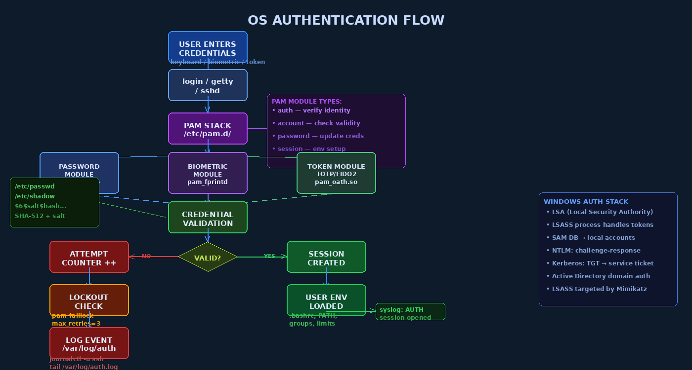

# Chapter 5 — OS Authentication: Mechanisms and Hardening

## Authentication as the Gateway to All OS Security

Authentication is the process by which the operating system verifies a claimed identity. It is the first line of defense — everything downstream (authorization, audit, access control) depends on knowing *who* is performing an action. An authentication failure doesn't just let one unauthorized user in; it potentially collapses the entire security model, because all subsequent access control decisions are made in the name of the stolen identity.

OS-level authentication is distinct from application authentication (a website's login form) in a critical way: the OS authenticates at the lowest trusted layer. A successful OS authentication results in a security token or session that all applications running under that session inherit. Compromising OS authentication means compromising every application, every file access, every network connection made by that session.

This chapter traces the authentication path from the moment a user presses a key to the creation of a trusted session, examining every link in the chain — and how each link can be broken.

## The Login Process: End-to-End

When a user logs into a Linux system, the following sequence occurs:

```
Physical keyboard / SSH / VNC input
         ↓
getty (local) / sshd / gdm (graphical) / other PAM-aware service
         ↓
Application calls PAM library
         ↓
PAM processes /etc/pam.d/<service> configuration
         ↓
PAM loads and executes module stack (pam_unix, pam_faillock, etc.)
         ↓
Modules consult /etc/shadow (or LDAP / Kerberos / biometric device)
         ↓
PAM returns: PAM_SUCCESS or PAM_AUTH_ERR
         ↓
On success: session setup (environment, home dir, resource limits)
         ↓
Shell or session launched as authenticated user
```



## Unix Authentication History: From passwd to shadow

### The /etc/passwd Problem

In early Unix systems, `/etc/passwd` stored both user account information *and* hashed passwords in a world-readable file:

```
# Original /etc/passwd format (with password hash in field 2)
root:$1$abc123$hashedpassword:0:0:root:/root:/bin/bash
alice:$1$def456$herhash:1001:1001:Alice:/home/alice:/bin/bash
```

The file had to be world-readable because user lookup (`getpwnam()`) is required by many programs running as unprivileged users. But this meant every user on the system could download the password hashes and attempt offline cracking.

The solution: **shadow passwords**. The password hash was moved to `/etc/shadow` (readable only by root), and the password field in `/etc/passwd` was replaced with an `x` placeholder:

```bash
# Modern /etc/passwd — no hash, just 'x'
root:x:0:0:root:/root:/bin/bash
alice:x:1001:1001:Alice Smith:/home/alice:/bin/bash

ls -la /etc/passwd  # -rw-r--r--  (world readable, fine — no secrets)
ls -la /etc/shadow  # -rw-r-----  (owner root, group shadow)
```

### The /etc/shadow Format

Each line in `/etc/shadow` has 9 colon-separated fields:

```
username : hashed_password : last_change : min_age : max_age : warn_period : inactive : expire : reserved

alice : $6$rounds=656000$salt$hash... : 19800 : 0 : 90 : 14 : 7 : : 

Fields:
- last_change: days since Jan 1, 1970 when password was last changed
- min_age:     minimum days before password can be changed (0 = anytime)
- max_age:     maximum days before password must be changed (90 days here)
- warn_period: days before expiry to warn user (14 days)
- inactive:    days after expiry before account is locked (7 days)
- expire:      absolute account expiration date (empty = never)
```

### Password Hashing in Linux

The `crypt()` function produces the stored hash. The algorithm is identified by the prefix in the hash string:

| Prefix | Algorithm | Notes |
|--------|-----------|-------|
| `$1$` | MD5 | **Insecure** — never use; breakable in seconds |
| `$2y$` | bcrypt | Good; adaptive cost factor |
| `$5$` | SHA-256 | Acceptable; fast but no memory hardness |
| `$6$` | SHA-512 | Common default; still vulnerable to GPU cracking |
| `$y$` | yescrypt | **Recommended** — memory-hard, resistant to GPU cracking |

**Salting** prevents rainbow table attacks. Each hash includes a unique random salt:

```
$6$rounds=656000$AbCdEfGhIjKlMnOp$<hash>
 ^                ^                 ^
 Algorithm        Salt (16 chars)   Actual hash

If two users have the same password, their hashes DIFFER because salts differ
Rainbow tables precomputed for one salt are useless against another salt
```

```bash
# Generate a password hash manually
python3 -c "import crypt; print(crypt.crypt('password', crypt.mksalt(crypt.METHOD_SHA512)))"

# Check password hash strength in shadow file
sudo awk -F: '{ print $1, $2 }' /etc/shadow | grep '^\$1\$'  # Find MD5 hashes (bad!)
```

> **Security Warning:** MD5-hashed passwords (`$1$`) can be cracked in seconds with modern GPU rigs running hashcat. If you find `$1$` hashes in your `/etc/shadow`, those passwords should be considered compromised and reset immediately.

## PAM: Pluggable Authentication Modules

**PAM** (Pluggable Authentication Modules) is the authentication framework used by virtually all Linux/Unix services. It decouples the authentication mechanism from the application — a service like `sshd` calls PAM without knowing whether authentication uses passwords, smart cards, biometrics, or TOTP tokens.

### PAM Architecture

```
Application (ssh, sudo, login, su, su, vsftpd...)
     ↓
PAM Library (libpam.so)
     ↓
/etc/pam.d/<service>  ← PAM configuration file for this service
     ↓
Module stack: pam_unix.so, pam_faillock.so, pam_pwquality.so...
     ↓
System resources: /etc/shadow, /etc/security/faillock.conf, LDAP, RADIUS...
```

### PAM Configuration File Format

```
# /etc/pam.d/sshd  — PAM config for SSH daemon
# type     control    module              arguments

auth       required   pam_env.so          # Load environment variables
auth       required   pam_faillock.so     preauth silent deny=5 unlock_time=900
auth       include    system-auth         # Include common auth config
auth       required   pam_faillock.so     authfail deny=5 unlock_time=900

account    required   pam_nologin.so      # Check /etc/nologin
account    include    system-auth
account    required   pam_faillock.so     # Check lockout status

password   include    system-auth         # For password changes

session    required   pam_selinux.so      close
session    required   pam_loginuid.so     # Set audit UID
session    required   pam_limits.so       # Apply resource limits
session    include    system-auth
session    required   pam_selinux.so      open
```

### PAM Module Types

| Type | Purpose | When Called |
|------|---------|-------------|
| **auth** | Verify the user's identity | At login time |
| **account** | Check account validity (expired?, locked?) | After auth |
| **password** | Update authentication credentials | During passwd |
| **session** | Set up / tear down user session | At session start/end |

### PAM Control Flags

Control flags determine how a module's success or failure affects the overall result:

| Flag | Meaning |
|------|---------|
| **required** | Must succeed; failure continues stack (other modules run) but result is eventual failure |
| **requisite** | Must succeed; failure immediately returns failure (stops stack) |
| **sufficient** | If this succeeds (and no required failure so far), stop and succeed; failure continues |
| **optional** | Success/failure doesn't affect overall result (used for side effects) |

```bash
# Example: MFA with TOTP — require both password AND token
# /etc/pam.d/sshd:
auth required pam_unix.so         # Must have correct password
auth required pam_google_authenticator.so  # AND must have valid TOTP token
```

### Key PAM Modules

```bash
# pam_unix.so — standard Unix password authentication
# reads /etc/shadow, handles password hashing
auth required pam_unix.so shadow nullok try_first_pass

# pam_faillock.so — account lockout after failed attempts
auth required pam_faillock.so preauth silent deny=5 unlock_time=900
# deny=5: lock after 5 failures; unlock_time=900: locked for 15 minutes
faillock --user alice          # Check lockout status
faillock --user alice --reset  # Unlock account

# pam_pwquality.so — password complexity enforcement
password required pam_pwquality.so minlen=12 dcredit=-1 ucredit=-1 ocredit=-1 lcredit=-1
# minlen=12: minimum 12 characters
# dcredit=-1: at least 1 digit required
# ucredit=-1: at least 1 uppercase required

# pam_limits.so — resource limits per user/group
# Reads /etc/security/limits.conf
session required pam_limits.so
# /etc/security/limits.conf:
# alice hard nproc 50        # alice cannot create more than 50 processes
# @devteam soft memlock 64   # soft memory lock limit for devteam group

# pam_google_authenticator.so — TOTP-based MFA
auth required pam_google_authenticator.so
```

## Windows Authentication Architecture

Windows uses a fundamentally different but equally layered authentication architecture.

### The Local Security Authority (LSA)

The **Local Security Authority (LSA)** is the Windows security subsystem that handles authentication, token creation, and the Security Accounts Manager (SAM). The **LSASS** process (`lsass.exe`) is the user-space component that runs the LSA:

```
User enters credentials (WinLogon)
         ↓
Credential Provider (password, smart card, biometric, etc.)
         ↓
LSASS process (lsass.exe) — runs as SYSTEM
         ↓
Authentication Package (MSV1_0 for local, Kerberos for domain)
         ↓
SAM database (local) or Active Directory (domain)
         ↓
LSASS creates Access Token
         ↓
Token assigned to user's first process (explorer.exe or shell)
```

> **Critical Security Warning:** **Mimikatz** and similar tools target LSASS directly. LSASS caches credentials in memory to enable Single Sign-On (SSO) — Kerberos tickets, NT hashes, and sometimes cleartext passwords (in older configurations with WDigest enabled). An attacker with SYSTEM privileges can dump LSASS memory and extract all credentials of users who have logged in. This is one of the most impactful techniques in modern Windows intrusions.

```powershell
# Mitigating LSASS credential dumping
# 1. Enable Credential Guard (requires UEFI Secure Boot + Hyper-V isolation)
# 2. Set LSASS to Protected Process Light (PPL)
Set-ItemProperty -Path "HKLM:\SYSTEM\CurrentControlSet\Control\Lsa" -Name "RunAsPPL" -Value 1

# 3. Disable WDigest authentication (prevent cleartext caching)
Set-ItemProperty -Path "HKLM:\SYSTEM\CurrentControlSet\Control\SecurityProviders\WDigest" -Name "UseLogonCredential" -Value 0

# 4. Enable Windows Defender Credential Guard
# Moves credential storage into a Hyper-V isolated VM that lsass.exe cannot read
```

### NTLM Authentication (Challenge-Response)

NTLM is Microsoft's legacy authentication protocol, still widely used for local authentication and backward compatibility:

```
1. Client → Server:  NEGOTIATE message
2. Server → Client:  CHALLENGE (random 8-byte nonce)
3. Client → Server:  AUTHENTICATE (NTLM hash of password XOR'd with challenge)
```

**NTLM Weaknesses:**
- **Pass-the-Hash (PtH):** The NT hash is captured (via LSASS dump, network sniffing, or DCSync) and used directly in step 3 without knowing the plaintext password. The server cannot distinguish legitimate authentication from PtH.
- **NTLM Relay:** An attacker intercepts an NTLM authentication exchange and relays it to another server, authenticating to that server as the victim.
- **Offline cracking:** NT hashes (unsalted MD4) are fast to crack — a GPU cluster can test billions per second.

### Kerberos: The Domain Authentication Protocol

Kerberos uses a trusted third-party (the Key Distribution Center, KDC) model with time-limited cryptographic tickets:

```
1. Client → KDC (AS): Authentication Service Request
   (encrypted with client's long-term key derived from password)
2. KDC → Client: Ticket Granting Ticket (TGT) + session key
   (TGT encrypted with KDC's secret key — client cannot forge it)
3. Client → KDC (TGS): Request service ticket using TGT
4. KDC → Client: Service Ticket for target server
5. Client → Server: Service Ticket + Authenticator
6. Server validates ticket (without contacting KDC for each request)
```

**Golden Ticket Attack:** If an attacker obtains the KRBTGT account's NTLM hash (possible through DCSync or domain controller compromise), they can forge **any TGT** for **any user** in the domain, including domain admins, with any expiration time. This is the ultimate domain persistence technique — Golden Tickets can be valid for years and survive password resets (except for the KRBTGT account itself).

## Multi-Factor Authentication at the OS Level

Modern OS authentication supports additional factors beyond passwords:

### TOTP (Time-Based One-Time Password)

TOTP generates a 6-digit code every 30 seconds using a shared secret and the current time. The `pam_google_authenticator.so` module implements TOTP for PAM-aware services:

```bash
# Setup TOTP for a user
google-authenticator  # Interactive setup, generates QR code

# Configure SSH to require TOTP
# /etc/ssh/sshd_config:
AuthenticationMethods publickey,keyboard-interactive
# /etc/pam.d/sshd:
auth required pam_google_authenticator.so
```

### FIDO2/WebAuthn

FIDO2 security keys (YubiKey, Titan Key) provide phishing-resistant hardware authentication:

```bash
# Linux PAM FIDO2 support
apt install libpam-u2f
pamu2fcfg > ~/.config/Yubico/u2f_keys   # Register key
# /etc/pam.d/sudo:
auth required pam_u2f.so
```

### Windows Hello

Windows Hello supports biometric (fingerprint, face recognition) and PIN authentication. Critically, Windows Hello for Business stores cryptographic keys in the TPM (Trusted Platform Module), making credentials hardware-bound — they cannot be extracted and used on another machine.

## SSH Hardening: Key-Based Authentication

SSH key-based authentication is significantly more secure than password authentication:

```bash
# Generate an ED25519 key pair (preferred over RSA for new keys)
ssh-keygen -t ed25519 -C "alice@workstation" -f ~/.ssh/id_ed25519

# Authorize the key on the server
ssh-copy-id -i ~/.ssh/id_ed25519.pub alice@server

# /etc/ssh/sshd_config hardening
PermitRootLogin no                     # Never allow root SSH login
PasswordAuthentication no              # Disable password auth (keys only)
PubkeyAuthentication yes
AuthorizedKeysFile .ssh/authorized_keys
MaxAuthTries 3                         # Limit auth attempts per connection
LoginGraceTime 30                      # Disconnect if not authenticated in 30s
AllowUsers alice bob deploy            # Whitelist specific users
Banner /etc/ssh/banner                 # Legal warning banner
ClientAliveInterval 300                # Session timeout: 5 minutes
ClientAliveCountMax 2
```

## Login Hardening Summary

```bash
# 1. Account lockout (pam_faillock)
cat /etc/security/faillock.conf
# deny = 5
# unlock_time = 900
# fail_interval = 900

# 2. Password aging (chage)
chage -M 90 -m 1 -W 14 alice   # Max 90 days, min 1 day, warn 14 days
chage -l alice                  # View policy

# 3. Session timeout (via PAM and shell)
echo "TMOUT=600" >> /etc/profile.d/timeout.sh  # 10-minute shell timeout

# 4. Restrict su to wheel group
# /etc/pam.d/su:
auth required pam_wheel.so use_uid

# 5. Disable unused accounts
usermod -L olduser    # Lock (prepend ! to shadow hash)
usermod -s /sbin/nologin serviceaccount  # Prevent interactive login

# 6. Login logging
last                  # Who logged in recently
lastb                 # Failed login attempts
journalctl -u sshd    # SSH service log
grep "Failed password" /var/log/auth.log  # Failed passwords
```

## Credential Storage Security

| Platform | Storage | Mechanism | Risks |
|----------|---------|-----------|-------|
| Linux | `/etc/shadow` | Hashed + salted | Offline cracking if stolen |
| Windows | SAM database | NT hash | Pass-the-hash if extracted |
| Windows domain | Active Directory | Kerberos + NT hash | DCSync, Golden Ticket |
| macOS | Keychain | AES-256, hardware key | Accessible to user's processes |
| Linux | GNOME Keyring | AES, unlocked at login | Accessible to user's processes |
| Windows | Credential Manager | DPAPI | Accessible with user's password |

---

## Key Terms

| Term | Definition |
|------|-----------|
| **PAM** | Pluggable Authentication Modules — Linux authentication framework |
| **/etc/shadow** | Root-readable file storing hashed Linux passwords |
| **Salt** | Random value added to password before hashing to prevent rainbow tables |
| **yescrypt** | Modern memory-hard password hashing algorithm (Linux default) |
| **PAM module types** | auth, account, password, session |
| **PAM control flags** | required, requisite, sufficient, optional |
| **pam_faillock** | PAM module implementing account lockout |
| **pam_pwquality** | PAM module enforcing password complexity |
| **LSA (Local Security Authority)** | Windows security subsystem managing authentication |
| **LSASS** | LSA Subsystem Service — user-space process hosting credential cache |
| **SAM** | Security Accounts Manager — Windows local account database |
| **NTLM** | NT LAN Manager — Windows challenge-response authentication protocol |
| **Pass-the-Hash (PtH)** | Using a stolen NT hash directly for NTLM authentication |
| **Kerberos** | Ticket-based network authentication protocol used in Active Directory |
| **TGT** | Ticket Granting Ticket — Kerberos credential from KDC |
| **Golden Ticket** | Forged Kerberos TGT created with compromised KRBTGT hash |
| **TOTP** | Time-based One-Time Password — 6-digit MFA code valid 30 seconds |
| **FIDO2/WebAuthn** | Hardware security key standard; phishing-resistant MFA |
| **Windows Hello** | Microsoft biometric/PIN authentication with TPM-backed keys |
| **Mimikatz** | Tool that extracts credentials from Windows LSASS memory |

---

## Review Questions

1. **Conceptual:** Explain why `/etc/passwd` must remain world-readable even though it contains security-sensitive information. Why was moving password hashes to `/etc/shadow` sufficient to address the original security problem?

2. **Lab:** Examine `/etc/shadow` on your system (as root). Identify the hash algorithm used for each account. Find any accounts with `!!` or `*` in the password field — what do these mean?

3. **Lab:** Configure `pam_faillock` to lock accounts after 3 failed attempts with a 5-minute unlock time. Test by intentionally failing authentication 3 times, then verify with `faillock --user <username>`.

4. **Conceptual:** Describe the PAM module types (auth, account, password, session) and explain why separating them into distinct types is architecturally useful for security.

5. **Conceptual:** Explain the difference between PAM `required` and `requisite` control flags. Provide a scenario where using `requisite` instead of `required` would meaningfully improve security.

6. **Analysis:** The Pass-the-Hash attack works against NTLM but not against Kerberos (directly). Explain why, and describe the "Pass-the-Ticket" attack that achieves a similar result against Kerberos environments.

7. **Lab:** Generate an Ed25519 SSH key pair and configure passwordless SSH access from your workstation to a test server. Then configure `sshd_config` to disable password authentication. Verify that password login is rejected while key-based login works.

8. **Conceptual:** Describe the Kerberos ticket-granting process. What is the role of the TGT, and why is stealing the KRBTGT account's hash (to create Golden Tickets) considered the most severe form of Active Directory compromise?

9. **Lab:** Configure `pam_pwquality` to require passwords of at least 12 characters with at least one digit, one uppercase letter, and one special character. Attempt to set a weak password and verify it is rejected. Show the relevant `/etc/pam.d/` configuration.

10. **Analysis:** Compare password authentication, TOTP, and FIDO2/WebAuthn in terms of: (a) phishing resistance, (b) credential theft resistance, (c) ease of deployment at scale, (d) user experience. Which would you recommend for protecting administrative SSH access and why?

---

## Further Reading

- Morgan, A.G. & Kukuk, T. (2001). *The Linux-PAM System Administrators' Guide.* kernel.org/pub/linux/libs/pam/ — Official comprehensive PAM documentation.
- Metcalf, S. (2015). *Mimikatz and Active Directory Kerberos Attacks.* adsecurity.org — Practical explanation of Golden Ticket and other Kerberos attacks.
- Grassi, P.A. et al. (2017). *NIST SP 800-63B: Digital Identity Guidelines — Authentication.* NIST. — Authoritative guidance on authentication assurance levels and requirements.
- Winter, J. & Dietrich, K. (2013). *A Hijacker's Guide to Communication Interfaces of the Trusted Platform Module.* — Deep dive into TPM-based credential protection.
- Kerrisk, M. (2010). *The Linux Programming Interface.* No Starch Press. Chapter 8 (users and groups) and Chapter 40 (login accounting) — Covers the Unix authentication model in detail.
