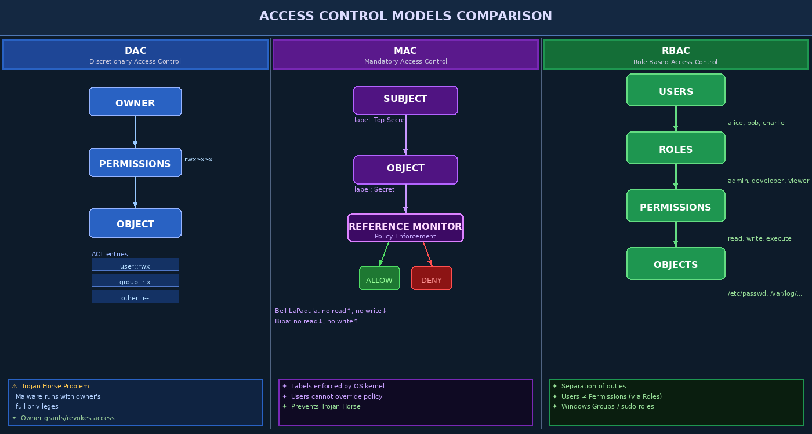

# Chapter 6 — Access Control Models in Operating Systems

Access control is the core mechanism by which an operating system decides whether a subject (process, user, or service) is permitted to perform an operation on an object (file, socket, device, memory region). Without robust access control, the OS cannot enforce any security policy. This chapter surveys the three foundational access control paradigms — DAC, MAC, and RBAC — then examines how modern OSes implement them through Linux capabilities, Windows integrity levels, and the principle of least privilege.

---

## 6.1 The Access Matrix Model

Before diving into specific models, it helps to understand the theoretical foundation: the **access matrix**. Imagined as a two-dimensional table, rows represent subjects (users or processes) and columns represent objects (files, devices, sockets). Each cell contains the set of operations the subject may perform on that object (read, write, execute, delete).

In practice, an access matrix is never stored as a whole — it would be enormous. Instead, operating systems store it in two ways:

- **Access Control Lists (ACLs)**: column-oriented — each object carries a list of (subject, permissions) pairs. Linux traditional Unix permissions and Windows NTFS ACLs are column-oriented.
- **Capability Lists**: row-oriented — each subject carries a list of (object, permissions) pairs. File descriptors in Unix are a form of capability.

> **Key Concept:** ACLs make it easy to answer "who can access this file?" Capabilities make it easy to answer "what can this process access?" Both are complementary views of the same matrix.

---

## 6.2 Discretionary Access Control (DAC)

**Discretionary Access Control** is the default model in Unix, Linux, and Windows. In DAC, the **owner** of a resource decides who may access it. The OS enforces whatever permissions the owner sets, but the owner is free to grant or revoke at will.

### 6.2.1 Unix DAC

Every file in Linux has an owner (UID) and group (GID), plus nine permission bits:

```bash
$ ls -la /etc/shadow
-rw-r----- 1 root shadow 1024 Jan 01 00:00 /etc/shadow
# owner=root: rw-   group=shadow: r--   other: ---
```

Modern Linux extends this with **POSIX ACLs** via `setfacl`/`getfacl`, allowing per-user and per-group entries beyond the traditional owner/group/other triad:

```bash
# Grant alice read access without changing group ownership
setfacl -m u:alice:r-- /var/data/report.txt
getfacl /var/data/report.txt
```

### 6.2.2 Windows DAC

Windows uses **Security Descriptors** containing a **DACL (Discretionary ACL)** attached to every securable object. Each entry is an **ACE (Access Control Entry)** specifying a SID and an access mask. You can inspect and modify them with `icacls`:

```powershell
icacls C:\sensitive\data.txt
icacls C:\sensitive\data.txt /grant:r "CORP\analyst:(R)"
icacls C:\sensitive\data.txt /deny "Everyone:(W)"
```

### 6.2.3 DAC Weaknesses

**The Trojan Horse Problem**: In DAC, if Alice runs a malicious program, that program executes with Alice's full privileges. It can read Alice's `.ssh/` folder, exfiltrate Alice's documents, and send data to a remote server — all because DAC makes no distinction between Alice and Alice's processes.

**The Confused Deputy Problem**: A privileged program acting on behalf of a user can be tricked into using its own privileges for the user's purposes rather than the user's limited privileges. A classic example: a compiler that runs setuid-root and can be tricked into writing to `/etc/passwd` instead of the user's output file.



---

## 6.3 Mandatory Access Control (MAC)

**Mandatory Access Control** replaces owner discretion with a centrally enforced policy. The OS (or a trusted security module) applies **security labels** to both subjects and objects, and a **reference monitor** intercepts every access request and enforces the policy — regardless of what the owner wishes.

### 6.3.1 Bell-LaPadula (Confidentiality Model)

The Bell-LaPadula model was developed for military classifications (Unclassified, Secret, Top Secret). Its rules:

| Rule | Description |
|------|-------------|
| **No Read Up (ss-property)** | A subject cannot read an object at a higher classification than its own clearance |
| **No Write Down (\*-property)** | A subject cannot write to an object at a lower classification |
| **Discretionary Security** | A DAC matrix is also enforced |

These rules prevent information from flowing from high to low classifications. A Top Secret process cannot write to a file labeled Unclassified (that would leak secrets downward).

### 6.3.2 Biba (Integrity Model)

Biba is the mirror of Bell-LaPadula, focusing on **data integrity** rather than confidentiality:

| Rule | Description |
|------|-------------|
| **No Read Down** | A high-integrity subject cannot read from a lower-integrity object (contamination) |
| **No Write Up** | A low-integrity subject cannot write to a higher-integrity object (corruption) |

### 6.3.3 MAC and the Trojan Horse

MAC solves the Trojan horse problem because labels are enforced by the kernel's reference monitor — the malicious program running as Alice cannot upgrade its own label to "trusted" without a kernel-level policy change. Even if Alice runs the malware, the malware's label prevents it from reading Alice's mail and writing it to a network socket if the policy forbids that flow.

---

## 6.4 Role-Based Access Control (RBAC)

**Role-Based Access Control** decouples users from permissions by introducing an intermediate layer: **roles**. Users are assigned to roles, and roles hold permissions. This dramatically simplifies administration in large organizations.

```
User ──assigned──► Role ──has──► Permission ──grants access to──► Object
```

### 6.4.1 RBAC in Linux

Linux implements RBAC through groups and `sudo`. The `/etc/sudoers` file (managed with `visudo`) maps users and groups to allowed commands:

```bash
# /etc/sudoers snippet
%wheel   ALL=(ALL) ALL           # wheel group can run anything as root
alice    ALL=(root) /usr/bin/systemctl restart nginx
bob      ALL=(root) NOPASSWD: /usr/sbin/tcpdump
```

### 6.4.2 RBAC in Windows

Windows implements RBAC through **built-in local groups**:

| Group | Default Capabilities |
|-------|---------------------|
| Administrators | Full system control |
| Power Users | (Legacy) software installation |
| Users | Standard application access |
| Backup Operators | Bypass file permissions for backup |
| Remote Desktop Users | RDP login only |
| Network Service | Network-accessible service account |

In Active Directory, Group Policy Objects (GPOs) extend RBAC to enterprise scale.

---

## 6.5 Linux Capabilities: Fine-Grained DAC

Traditional Unix had a binary privilege model: root (UID 0) can do anything; everyone else is limited. **Linux capabilities** break root's omnipotence into approximately 40 discrete privilege tokens.

### 6.5.1 Key Capabilities

| Capability | Effect |
|------------|--------|
| `CAP_NET_BIND_SERVICE` | Bind to ports < 1024 without root |
| `CAP_SYS_ADMIN` | Extremely broad — avoid if possible |
| `CAP_CHOWN` | Change file ownership |
| `CAP_KILL` | Send signals to any process |
| `CAP_DAC_OVERRIDE` | Bypass DAC permission checks |
| `CAP_SETUID` | Arbitrarily change process UID |
| `CAP_NET_RAW` | Use raw and packet sockets |

### 6.5.2 Capability Sets

Each thread has five capability sets:

- **Permitted (P)**: the maximum capabilities the thread may hold in Effective
- **Effective (E)**: currently active capabilities checked by the kernel
- **Inheritable (I)**: capabilities preserved across `execve()`
- **Bounding (B)**: hard ceiling; capabilities can only be dropped from this set
- **Ambient (A)**: capabilities that survive `execve()` for non-setuid binaries

```c
// Drop all capabilities except CAP_NET_BIND_SERVICE (C code)
#include <sys/capability.h>

cap_t caps = cap_from_text("cap_net_bind_service=eip");
if (cap_set_proc(caps) != 0) { perror("cap_set_proc"); exit(1); }
cap_free(caps);
```

```bash
# Inspect and set capabilities on a binary
getcap /usr/bin/ping
setcap cap_net_raw+ep /usr/local/bin/my_scanner
# Remove all capabilities
setcap -r /usr/local/bin/my_scanner
```

> **Warning:** `CAP_SYS_ADMIN` is so broad it is effectively root. Granting it defeats the purpose of capabilities. Prefer granular capabilities and drop `CAP_SYS_ADMIN` whenever possible.

---

## 6.6 Windows Mandatory Integrity Control (MIC)

Windows Vista introduced **Mandatory Integrity Control** — a MAC layer on top of Windows's traditional DAC. Every process and object gets an **integrity level**:

| Integrity Level | Value | Typical Use |
|-----------------|-------|-------------|
| Untrusted | 0x0000 | Anonymous processes |
| Low | 0x1000 | IE/Edge protected mode, sandboxed downloads |
| Medium | 0x2000 | Standard user processes |
| High | 0x3000 | Administrator processes (after UAC elevation) |
| System | 0x4000 | SYSTEM, kernel services |
| Protected Process | 0x5000 | DRM, anti-cheat services |

A process at Medium integrity cannot write to objects labeled High. This is why a standard user's browser (Low/Medium) cannot tamper with system files.

**UAC (User Account Control)** elevates a process from Medium to High when the user approves the elevation prompt. Internally, Windows creates a new token with the High integrity level assigned.

---

## 6.7 Implementing Least Privilege in Practice

### Dropping Privileges in C (Linux)

```c
#include <unistd.h>
#include <grp.h>

// After binding to port 80 as root, drop to unprivileged user
if (setgroups(0, NULL) != 0) { perror("setgroups"); exit(1); }
if (setgid(www_gid) != 0)    { perror("setgid"); exit(1); }
if (setuid(www_uid) != 0)    { perror("setuid"); exit(1); }
// From here: process runs as www-data with no privileges
```

> **Critical Order:** Always call `setgroups()` → `setgid()` → `setuid()`. If you call `setuid()` first, you lose the ability to call `setgid()`.

### Windows Service Hardening

```powershell
# Configure a service to run as NetworkService (limited account)
sc.exe config MyService obj= "NT AUTHORITY\NetworkService" password= ""

# Restrict service with minimal required privileges
sc.exe privs MyService SeChangeNotifyPrivilege/SeImpersonatePrivilege

# Make service binary protected (PPL)
Set-ItemProperty -Path "HKLM:\SYSTEM\CurrentControlSet\Services\MyService" `
  -Name "LaunchProtected" -Value 1
```

---

## 6.8 Attribute-Based Access Control (ABAC)

**ABAC** extends RBAC by making access decisions based on arbitrary **attributes** of subjects, objects, and the environment:

- Subject attributes: department=finance, clearance=secret, location=campus
- Object attributes: classification=confidential, owner=HR, created=2024
- Environment: time=business-hours, vpn=connected

ABAC is expressed in policy languages like **XACML** and is increasingly used in cloud environments (AWS IAM policies, Azure RBAC conditions).

---

## Key Terms

| Term | Definition |
|------|-----------|
| **Access Control** | Mechanism deciding whether a subject may perform an operation on an object |
| **Access Matrix** | Theoretical table mapping (subject, object) pairs to allowed operations |
| **ACL** | Access Control List — column-oriented access matrix slice |
| **Capability** | Row-oriented access token granting specific rights |
| **DAC** | Discretionary AC — owner controls access |
| **MAC** | Mandatory AC — OS-enforced labels regardless of owner |
| **RBAC** | Role-Based AC — permissions via intermediate role layer |
| **ABAC** | Attribute-Based AC — contextual policy language |
| **Bell-LaPadula** | MAC confidentiality model: no read up, no write down |
| **Biba** | MAC integrity model: no read down, no write up |
| **Reference Monitor** | Kernel component intercepting every access to enforce MAC |
| **Linux Capability** | Fine-grained privilege token replacing binary root/non-root |
| **Permitted Set** | Maximum capabilities a thread may hold |
| **Effective Set** | Currently active capability set checked by kernel |
| **MIC** | Windows Mandatory Integrity Control — integrity labels on tokens/objects |
| **UAC** | Windows User Account Control — integrity elevation mechanism |
| **Trojan Horse Problem** | Malware executing with victim's privileges in DAC systems |
| **Confused Deputy** | Privileged program tricked into misusing its own privileges |
| **Least Privilege** | Design principle: grant only the minimum required permissions |
| **DACL** | Discretionary ACL — Windows object access control list |

---

## Review Questions

1. **Conceptual:** Explain the Trojan horse problem in the context of DAC. Why does MAC mitigate this problem? Provide a concrete attack scenario and show how each model responds.

2. **Conceptual:** Compare Bell-LaPadula and Biba models. Why might a real system need both simultaneously? What information flows do each prevent?

3. **Lab:** On a Linux system, create a file `/tmp/test.txt` owned by root. Using `setfacl`, grant a non-root user read-only access without changing the file's group. Verify the ACL with `getfacl`. What happens when that user tries to write to the file?

4. **Analysis:** Linux's `CAP_SYS_ADMIN` capability covers dozens of operations. List five specific operations it enables and explain why this makes it a security risk when granted to untrusted processes.

5. **Hands-on:** Write a C program that: (a) opens a listening socket on port 443, (b) drops `CAP_NET_BIND_SERVICE` from all capability sets, (c) drops all other capabilities, (d) calls `setuid(1000)`. Compile and test with `sudo`. What capabilities remain after your drops?

6. **Comparison:** Create a table comparing DAC, MAC, and RBAC across these dimensions: who controls policy, whether the Trojan horse problem is mitigated, and typical OS implementations.

7. **Windows Lab:** Using `icacls` in a Windows VM, create a directory where: (a) Administrators have full control, (b) Users have read+execute only, (c) Everyone is explicitly denied write. Test by logging in as a standard user and attempting to create a file.

8. **Conceptual:** Explain the "confused deputy problem." Describe a real-world example involving a setuid binary on Linux and how Linux capabilities or filesystem permissions could mitigate it.

9. **Critical Thinking:** A developer argues that running a web server as root is fine because "the server process only reads files, it never writes them." Identify three specific attack scenarios where this assumption fails and the root privilege causes harm.

10. **Lab:** Using `sudo -l` on a Linux system where your user has sudo entries, enumerate what commands you can run as root. Then use `getcap -r / 2>/dev/null` to find binaries with elevated capabilities. Discuss what privilege escalation paths exist.

---

## Further Reading

1. Sandhu, R. S., et al. (1996). "Role-Based Access Control Models." *IEEE Computer*, 29(2), 38–47. — The foundational RBAC paper.
2. Bell, D. E., & LaPadula, L. J. (1976). *Secure Computer Systems: Unified Exposition and Multics Interpretation*. MITRE Corporation. — Original Bell-LaPadula specification.
3. Smalley, S., & Craig, R. (2013). "Security Enhanced (SE) Android." *NDSS 2013*. — MAC applied to mobile OS.
4. Kerrisk, M. (2010). *The Linux Programming Interface*. No Starch Press. Chapters 38–39 cover capabilities and privilege in depth.
5. Microsoft. (2023). *How User Account Control Works*. Microsoft Docs. — Authoritative UAC architecture description.
