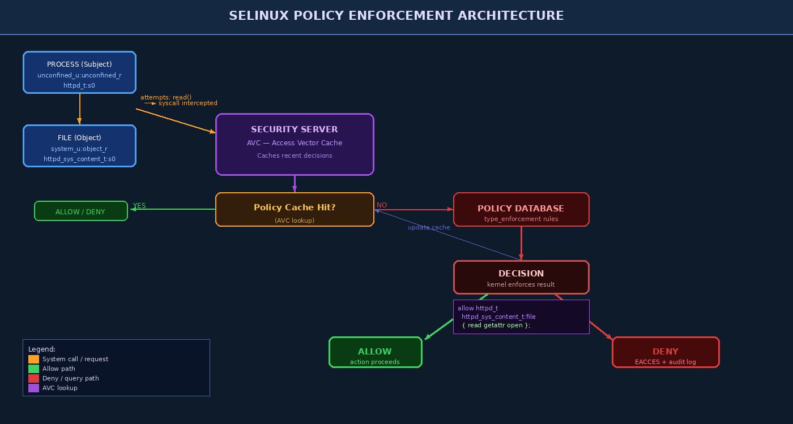

# Chapter 7 — Security Policies and Policy Enforcement Mechanisms

A security policy is the formal specification of what actions are permitted and which are forbidden within a system. In the operating system context, policy is distinct from mechanism: **policy** answers "what is allowed?" while **mechanism** answers "how is it enforced?" This chapter examines how operating systems encode and enforce security policies, with deep dives into Linux Security Modules (SELinux and AppArmor), Windows Group Policy, and application whitelisting technologies.

---

## 7.1 What Is a Security Policy?

A **security policy** is a set of rules governing the behavior of subjects (processes, users) with respect to objects (files, sockets, IPC channels). At the OS level, a policy can be expressed as:

```
allow <subject> <object>:<class> { <permissions> };
```

This simple form comes directly from SELinux policy language and captures the essence of all OS policies. The **reference monitor** — a trusted kernel component — intercepts every security-relevant operation and consults the policy before permitting or denying it.

Reference monitor properties (formally required):
1. **Always invoked** — no access occurs without a check
2. **Tamper-proof** — cannot be disabled by normal processes
3. **Small and verifiable** — simple enough to audit and prove correct

### Discretionary vs. Mandatory Policies

| Property | Discretionary (DAC) | Mandatory (MAC) |
|----------|--------------------|-----------------------|
| Policy author | Resource owner | Centralized system admin |
| Can user override? | Yes | No |
| Trojan horse resistant? | No | Yes |
| Examples | POSIX permissions, Windows DACL | SELinux, AppArmor, MIC |

---

## 7.2 Linux Security Modules (LSM) Framework

**LSM** is a kernel framework that allows security modules to attach hooks to kernel operations. When a process attempts an operation (e.g., `open()`, `connect()`, `execve()`), the kernel calls the DAC check first, then invokes each registered LSM hook. If any hook returns an error, the operation is denied.

```
Process syscall
  │
  ▼
 DAC check (UID/GID/permissions)
  │  ← DENY if DAC fails
  ▼
LSM hook (SELinux / AppArmor / etc.)
  │  ← DENY if MAC policy rejects
  ▼
 Operation executes
```

LSM is **stackable** since Linux 4.15 — multiple LSMs can run simultaneously (e.g., SELinux + Lockdown + BPF).

### Major LSM Implementations

| LSM | Developer | Policy Model | Primary Distribution |
|-----|-----------|-------------|---------------------|
| SELinux | NSA / Red Hat | Type Enforcement (label-based) | RHEL, CentOS, Fedora, Android |
| AppArmor | Canonical | Path-based profiles | Ubuntu, Debian, SLES |
| Tomoyo | NTT Data | Pathname-based domains | Embedded Linux |
| Smack | Casey Schaufler | Simplified MAC labels | Tizen, automotive |
| Landlock | Mickaël Salaün | Unprivileged sandboxing | Kernel 5.13+ |

---

## 7.3 SELinux Deep Dive

### 7.3.1 History and Background

**SELinux (Security-Enhanced Linux)** was developed by the NSA starting in the late 1990s as a proof-of-concept implementation of Flask architecture from the Mach OS research. It was open-sourced in 2000 and merged into the Linux kernel mainline in version 2.6.0 (December 2003). Today it is the default LSM on Red Hat family distributions and is the backbone of Android's security model.



### 7.3.2 Security Contexts

Every process and object in an SELinux system has a **security context** — a label consisting of four fields:

```
user:role:type:level
system_u:system_r:httpd_t:s0
  │        │       │       │
  │        │       │       └─ MLS/MCS sensitivity level
  │        │       └─ Type (the primary enforcement domain)
  │        └─ Role (used in RBAC enforcement)
  └─ SELinux user (mapped from Linux user)
```

You can view and manipulate security contexts with:

```bash
# Show context of current process
id -Z

# Show file contexts
ls -Z /var/www/html/
# system_u:object_r:httpd_sys_content_t:s0 /var/www/html/index.html

# Show process contexts
ps auxZ | grep httpd
# system_u:system_r:httpd_t:s0  apache  1234 ...

# Check overall SELinux status
sestatus
```

### 7.3.3 Type Enforcement (TE)

The dominant mechanism in SELinux is **Type Enforcement**. Every process runs in a **domain** (a type for processes), and every object has a **type**. Policy rules explicitly grant or deny operations between (domain, type) pairs:

```
# Allow httpd to read its content files
allow httpd_t httpd_sys_content_t:file { read getattr open };

# Allow httpd to bind to http_port_t (port 80/443)
allow httpd_t http_port_t:tcp_socket name_bind;

# Deny httpd from accessing shadow password file
# (absence of allow rule = implicit deny)
```

This **default-deny** model means that everything not explicitly permitted is forbidden. A newly written service starts with no access to anything.

### 7.3.4 Domain Transitions

When a process calls `execve()` to run a new program, SELinux can **automatically transition** the process to a new domain based on:
1. The current domain of the calling process
2. The type of the executable being launched
3. A `type_transition` rule in policy

```
# Rule: when init_t executes a file of type httpd_exec_t,
# the new process gets domain httpd_t
type_transition init_t httpd_exec_t:process httpd_t;
```

This ensures that when the init system starts Apache, the Apache process automatically gets the `httpd_t` domain — no matter what user started it.

### 7.3.5 SELinux Modes

```bash
# Check current mode
getenforce    # Enforcing / Permissive / Disabled

# Temporarily switch to permissive (survives until reboot)
setenforce 0    # permissive
setenforce 1    # enforcing

# Permanently configure in /etc/selinux/config
# SELINUX=enforcing | permissive | disabled
# SELINUXTYPE=targeted | strict | mls
```

| Mode | Behavior |
|------|----------|
| **Enforcing** | Policy is enforced; violations are denied and logged |
| **Permissive** | Policy is NOT enforced; violations are logged only (debugging) |
| **Disabled** | SELinux is entirely off; no hooks active |

> **Warning:** Switching from Disabled to Enforcing requires a filesystem relabel (`touch /.autorelabel` and reboot). Skipping this step causes permission failures for every process because file contexts are missing.

### 7.3.6 SELinux Tooling

```bash
# Diagnose recent AVC (Access Vector Cache) denials
ausearch -m avc -ts recent
audit2why < /var/log/audit/audit.log

# Automatically generate a policy module from denials
audit2allow -M mypolicy < /var/log/audit/audit.log
semodule -i mypolicy.pp

# Change a file's context temporarily
chcon -t httpd_sys_content_t /var/data/webapp/

# Restore context to policy default
restorecon -Rv /var/www/html/

# Manage port contexts (e.g., allow httpd on 8080)
semanage port -a -t http_port_t -p tcp 8080
semanage port -l | grep http

# Manage boolean settings (on/off policy switches)
getsebool -a | grep httpd
setsebool -P httpd_can_network_connect on
```

### 7.3.7 Diagnosing and Writing Custom SELinux Policy

A typical workflow when a service is being denied by SELinux:

```bash
# 1. Switch to permissive, run your application, capture denials
setenforce 0
systemctl start myapp
ausearch -m avc -ts recent > /tmp/denials.txt

# 2. Generate a policy module
audit2allow -M myapp_policy < /tmp/denials.txt

# 3. Review the generated .te file carefully
cat myapp_policy.te

# 4. If acceptable, compile and install
semodule -i myapp_policy.pp

# 5. Return to enforcing
setenforce 1
```

---

## 7.4 AppArmor Deep Dive

**AppArmor** takes a fundamentally different approach from SELinux: instead of labeling every object, it uses **pathname-based profiles** that restrict what an application can access by filesystem path, network, and capabilities.

### 7.4.1 Profile Structure

AppArmor profiles live in `/etc/apparmor.d/`. A profile for `nginx` might look like:

```
#include <tunables/global>

/usr/sbin/nginx {
  #include <abstractions/base>
  #include <abstractions/nameservice>

  capability net_bind_service,
  capability setuid,
  capability setgid,

  /etc/nginx/**   r,
  /var/www/html/** r,
  /var/log/nginx/ rw,
  /var/log/nginx/** rw,
  /run/nginx.pid  rw,

  network tcp,
  deny /etc/shadow r,
  deny /root/** rwx,
}
```

### 7.4.2 AppArmor Modes and Tools

```bash
# Check AppArmor status
aa-status
apparmor_status

# Set a profile to complain mode (log but don't enforce)
aa-complain /usr/sbin/nginx

# Set a profile to enforce mode
aa-enforce /usr/sbin/nginx

# Interactively build a profile from log data
aa-logprof

# Load/reload a profile
apparmor_parser -r /etc/apparmor.d/usr.sbin.nginx
```

| Feature | SELinux | AppArmor |
|---------|---------|----------|
| Policy basis | Labels (types) | Paths |
| Default policy | Default-deny everything | Deny only what profiles specify |
| Learning mode | Permissive | Complain |
| Complexity | High | Moderate |
| Portability | Label must follow files | Path must match |

---

## 7.5 Windows Security Policy

### 7.5.1 Group Policy Objects (GPOs)

In Windows environments, security policy is primarily administered through **Group Policy Objects** applied via Active Directory. GPOs can enforce:

- Password complexity and length requirements
- Account lockout thresholds
- Audit policy (which events get logged)
- User rights assignments (who can log on locally, deny network logon)
- Security options (LAN Manager compatibility, UAC behavior)
- Software Restriction Policies / AppLocker

```powershell
# View local effective policy
secedit /analyze /cfg baseline.cfg /log analysis.log

# Export current security settings
secedit /export /cfg current_policy.inf

# Apply a security template
secedit /configure /cfg hardened.inf /db temp.sdb

# View GPO results for current user/computer
gpresult /R
gpresult /H gporeport.html
```

### 7.5.2 Windows Defender Application Control (WDAC) and AppLocker

**AppLocker** (Windows 7+) and **WDAC** (Windows 10+) implement **application whitelisting** — only signed or explicitly approved applications may run.

```powershell
# AppLocker: list current rules
Get-AppLockerPolicy -Effective | Format-List

# Create an AppLocker rule allowing only signed Microsoft executables
New-AppLockerPolicy -FileInfo (Get-AppLockerFileInformation -Directory C:\Windows -Recurse) `
  -RuleType Publisher -RuleNamePrefix "Allow Signed MS" | Set-AppLockerPolicy -Ldap

# WDAC: generate policy from golden machine
New-CIPolicy -Level Publisher -FilePath "C:\Policies\BasePolicy.xml" `
  -ScanPath "C:\Windows" -UserPEs
ConvertFrom-CIPolicy "C:\Policies\BasePolicy.xml" "C:\Policies\BasePolicy.p7b"
```

---

## 7.6 Security Policy Violation Detection and Response

Security Information and Event Management (SIEM) systems consume policy violation events:

```bash
# SELinux violations in structured format for SIEM ingestion
ausearch -m avc --format csv > selinux_violations.csv

# AppArmor denials in syslog
grep "apparmor.*DENIED" /var/log/syslog | tail -50

# Windows security policy violations (PowerShell)
Get-WinEvent -FilterHashtable @{LogName='Security'; Id=4625} |
  Select-Object TimeCreated, Message | Export-Csv failed_logons.csv
```

---

## Key Terms

| Term | Definition |
|------|-----------|
| **Security Policy** | Formal specification of permitted/denied operations in a system |
| **Reference Monitor** | Kernel component enforcing MAC policy on every access |
| **LSM** | Linux Security Modules — kernel framework for pluggable security modules |
| **SELinux** | NSA-developed Type Enforcement MAC for Linux |
| **Security Context** | SELinux label: user:role:type:level |
| **Type Enforcement (TE)** | Primary SELinux mechanism: domain-to-type policy rules |
| **Domain** | SELinux type assigned to a process |
| **Domain Transition** | Automatic type change on execve() per SELinux policy |
| **AVC** | Access Vector Cache — caches SELinux policy decisions |
| **AppArmor** | Path-based MAC LSM used in Ubuntu/Debian |
| **Audit2allow** | Tool generating SELinux policy from denial logs |
| **Enforcing Mode** | SELinux mode that actively denies policy violations |
| **Permissive Mode** | SELinux mode that logs but does not deny violations |
| **GPO** | Group Policy Object — Windows domain-wide policy container |
| **AppLocker** | Windows application whitelisting via executable rules |
| **WDAC** | Windows Defender Application Control — successor to AppLocker |
| **semanage** | SELinux policy management tool (ports, fcontexts, users) |
| **restorecon** | Restore SELinux file context to policy default |
| **Boolean** | SELinux on/off policy switches for common use-case variations |
| **Complain Mode** | AppArmor equivalent of permissive — logs, doesn't deny |

---

## Review Questions

1. **Conceptual:** Explain the difference between a security policy and a security mechanism. Give two examples of each from either Linux or Windows.

2. **Architecture:** Draw the flow of a Linux `open()` syscall from user space through DAC and LSM checks to either execution or denial. Where in this flow does SELinux intervene?

3. **SELinux Lab:** On an RHEL/CentOS/Fedora system with SELinux enforcing, deploy a web page to a custom directory (not `/var/www/html`). Why does Apache return a 403? Use `ausearch`, `chcon`, and `restorecon` to diagnose and fix the issue.

4. **Policy Writing:** Translate this requirement into a SELinux type enforcement rule: "The PostgreSQL daemon (`postgresql_t`) should be able to read and write files of type `postgresql_db_t` but should never be able to read `/etc/shadow` (`shadow_t`)."

5. **Comparison:** Compare SELinux type enforcement vs. AppArmor path-based enforcement. Describe a scenario where SELinux's label-based model provides stronger security than AppArmor's path-based model.

6. **Tools Lab:** Given an `/var/log/audit/audit.log` file with SELinux AVC denials for a custom application, walk through the `audit2allow` workflow to create and install a custom policy module. What review steps should you perform before installing the generated policy?

7. **Windows Lab:** Using `secpol.msc` or PowerShell, configure a Windows system to: (a) require 12-character minimum passwords, (b) lock accounts after 5 failed attempts, (c) audit all logon failures. Verify each setting is active.

8. **Critical Analysis:** A developer argues "we can just run SELinux in permissive mode permanently so our application doesn't break — the logs tell us what would have been denied." Why is this reasoning flawed from a security standpoint?

9. **WDAC Lab:** Create an AppLocker policy (or WDAC policy) that allows only executables in `C:\Windows\` and `C:\Program Files\` to run. Test by trying to execute a binary from `C:\Users\Public\`. What event ID is generated on denial?

10. **Research:** Investigate the SELinux policy for a real service (e.g., `httpd_selinux(8)` man page). List five SELinux booleans available for httpd, explain what each enables, and describe the security risk of enabling each one.

---

## Further Reading

1. McCarty, B. (2004). *SELinux: NSA's Open Source Security Enhanced Linux*. O'Reilly. — Comprehensive SELinux reference.
2. Caplan, J., & Smalley, S. (2005). "Implementing SELinux as a Linux Security Module." *NSA Technical Report*. — Architecture internals.
3. Apparmor Wiki. (2023). *AppArmor Documentation*. https://gitlab.com/apparmor/apparmor/-/wikis/Documentation — Official reference.
4. Microsoft. (2023). *Windows Defender Application Control Design Guide*. Microsoft Docs. — WDAC deployment guide.
5. NIST SP 800-53 Rev 5. (2020). *Security and Privacy Controls for Federal Information Systems*. — AC-family controls describe MAC requirements.
