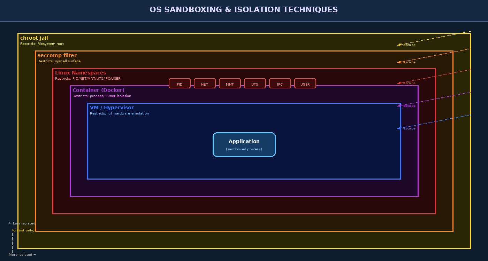

# Chapter 8 — Sandboxing, Isolation, and Containerization Security

The principle of **sandboxing** is simple: accept that code may be compromised, and limit the damage it can cause. Instead of trying to prevent all vulnerabilities, a sandbox restricts what a compromised process can see, do, and communicate with. This chapter surveys the sandboxing landscape from the crude isolation of `chroot` to the hardware-enforced isolation of virtual machines, with special attention to the Linux primitives that underpin container technology.

---

## 8.1 The Sandboxing Principle

A sandbox imposes a **confinement boundary** around a process. When the process is compromised — through a vulnerability, malicious input, or supply-chain attack — the attacker's capabilities are limited to what the sandbox permits. Effective sandboxes enforce:

1. **Filesystem isolation** — what files the process can see/write
2. **Network isolation** — what network interfaces and hosts it can reach
3. **Process isolation** — what other processes it can see, signal, or ptrace
4. **Syscall restriction** — which kernel interfaces it may use
5. **Resource limits** — CPU/memory/I/O caps preventing DoS

No single mechanism provides all five. Modern container runtimes compose multiple primitives to achieve defense-in-depth sandboxing.



---

## 8.2 chroot — The Original Jail

**chroot** (change root) is the oldest Unix isolation mechanism. It relocates a process's view of the filesystem root to a specified directory. The process and its children cannot traverse above this new root using normal path operations.

```bash
# Create a minimal chroot environment
mkdir -p /jails/webroot/{bin,lib,lib64,usr,etc,dev}

# Copy required binaries and libraries
cp /bin/bash /jails/webroot/bin/
ldd /bin/bash | awk '{print $3}' | xargs -I{} cp {} /jails/webroot/lib64/

# Enter the chroot
sudo chroot /jails/webroot /bin/bash
# Now: ls / shows only the jail contents
```

### 8.2.1 chroot Escape Techniques

chroot provides **extremely weak isolation** and is not considered a security boundary on its own:

1. **Requires root inside**: Any process with `CAP_SYS_CHROOT` can call `chroot()` again and escape.
2. **Open file descriptor escape**: A process holding an open file descriptor to a directory outside the chroot can use that fd to navigate out with `fchdir()` + `chroot(".")`.
3. **Kernel exploits**: Any kernel vulnerability allowing arbitrary memory write immediately escapes the chroot.
4. **Mount escapes**: With `CAP_SYS_ADMIN`, a process can mount `/proc` and use it to access host filesystems.

```c
// Classic chroot escape (requires root inside jail)
int dir_fd = open("/", O_RDONLY);   // fd to jail root
mkdir("tmp_escape", 0755);
chroot("tmp_escape");               // chroot into subdirectory
fchdir(dir_fd);                     // navigate via pre-opened fd
for (int i = 0; i < 40; i++) chdir(".."); // walk up past original jail
chroot(".");                        // new root = real filesystem root
```

> **Key Concept:** chroot is a debugging and administrative tool, not a security boundary. Never rely on chroot alone to contain a potentially malicious process. Use it as the outermost layer with additional restrictions.

---

## 8.3 Linux Namespaces

**Namespaces** are the core building block of container isolation. Each namespace type virtualizes a different aspect of the kernel's global state, giving processes an isolated view.

| Namespace | Flag | What It Isolates |
|-----------|------|-----------------|
| **PID** | `CLONE_NEWPID` | Process tree — processes see only their own subtree |
| **NET** | `CLONE_NEWNET` | Network interfaces, routing tables, firewall rules |
| **MNT** | `CLONE_NEWNS` | Mount points — filesystem tree |
| **UTS** | `CLONE_NEWUTS` | Hostname and NIS domain name |
| **IPC** | `CLONE_NEWIPC` | System V IPC, POSIX message queues |
| **USER** | `CLONE_NEWUSER` | UID/GID mappings — unprivileged containers |
| **CGROUP** | `CLONE_NEWCGROUP` | cgroup root view |
| **TIME** | `CLONE_NEWTIME` | Monotonic and boot clocks (kernel 5.6+) |

### 8.3.1 Namespace Commands

```bash
# Create new namespaces interactively (requires root or user namespace support)
unshare --pid --fork --mount-proc /bin/bash
# PID 1 inside is now the bash shell

# List namespaces for a process
ls -la /proc/1234/ns/

# Enter a specific container's namespaces
nsenter --target 1234 --mount --uts --ipc --net --pid -- /bin/bash

# Create unprivileged user namespace (no root required)
unshare --user --map-root-user /bin/bash
id    # shows root inside, but no real privileges outside
```

### 8.3.2 USER Namespaces and Unprivileged Containers

The **USER namespace** allows a non-root user to appear as root within the namespace. UID 0 inside the namespace maps to an unprivileged UID (e.g., 100000) on the host:

```bash
# /etc/subuid and /etc/subgid define the mapping range
cat /etc/subuid
# john:100000:65536  (john gets UIDs 100000-165535 for namespace mapping)
```

This enables **rootless containers** (Podman's default mode) where no privileged daemon is required.

---

## 8.4 Linux Control Groups (cgroups)

**cgroups** impose resource limits on processes and their children, preventing a sandboxed process from consuming all host resources (a denial-of-service attack vector):

```bash
# cgroups v2: create a group and set limits
mkdir /sys/fs/cgroup/myapp
echo "200000 1000000" > /sys/fs/cgroup/myapp/cpu.max   # 20% of one CPU
echo $((512 * 1024 * 1024)) > /sys/fs/cgroup/myapp/memory.max  # 512MB
echo "10485760 1048576" > /sys/fs/cgroup/myapp/io.max  # I/O limit

# Assign a process to the group
echo $PID > /sys/fs/cgroup/myapp/cgroup.procs
```

Key cgroup controllers:
- **cpu**: CPU time quotas and weights
- **memory**: RSS/swap limits; OOM kill when exceeded
- **io**: Block I/O read/write bandwidth and IOPS
- **pids**: Maximum number of processes in the cgroup
- **net_cls**: Tag packets for network traffic control

---

## 8.5 seccomp — Syscall Filtering

**seccomp (Secure Computing Mode)** allows a process to install a filter that restricts which system calls it may make. In `seccomp-bpf` mode, a BPF (Berkeley Packet Filter) program inspects each syscall number and arguments, returning ALLOW, DENY, KILL, or LOG.

```c
#include <seccomp.h>

// Whitelist approach: allow only specific syscalls, kill on others
scmp_filter_ctx ctx = seccomp_init(SCMP_ACT_KILL_PROCESS);

seccomp_rule_add(ctx, SCMP_ACT_ALLOW, SCMP_SYS(read), 0);
seccomp_rule_add(ctx, SCMP_ACT_ALLOW, SCMP_SYS(write), 0);
seccomp_rule_add(ctx, SCMP_ACT_ALLOW, SCMP_SYS(exit_group), 0);
seccomp_rule_add(ctx, SCMP_ACT_ALLOW, SCMP_SYS(fstat), 0);

seccomp_load(ctx);
// From here: any syscall not in the list kills the process
```

Docker's default seccomp profile blocks 44+ dangerous syscalls including:
- `keyctl`, `add_key`, `request_key` — kernel keyring (prevents key theft)
- `ptrace` — process tracing (prevents container escape via ptrace)
- `reboot`, `kexec_load` — host rebooting
- `mount`, `umount2` — filesystem mounts (without CAP_SYS_ADMIN)
- `clone` with `CLONE_NEWUSER` — user namespace creation
- `acct` — process accounting manipulation

```bash
# Run container with custom seccomp profile
docker run --security-opt seccomp=/path/to/profile.json nginx

# Run without seccomp (dangerous — only for debugging)
docker run --security-opt seccomp=unconfined nginx
```

---

## 8.6 Linux Capabilities in Sandboxing

Containers drop almost all capabilities and add back only those required:

```bash
# Docker: drop all capabilities, add only net_bind_service
docker run --cap-drop=ALL --cap-add=NET_BIND_SERVICE nginx

# Inspect capabilities of a running process
cat /proc/$(pgrep nginx)/status | grep Cap
# CapPrm: 0000000000000400   (only CAP_NET_BIND_SERVICE)
# CapEff: 0000000000000400
# CapBnd: 0000000000000400

# Decode capability bitmask
capsh --decode=0000000000000400
```

Minimal capability sets reduce the blast radius if the containerized process is compromised.

---

## 8.7 Container Security (Docker)

Docker combines namespaces + cgroups + seccomp + capabilities into a usable container runtime:

```
Container = namespaces + cgroups + seccomp + capabilities (+ optional AppArmor/SELinux)
```

### 8.7.1 Container Escape Vulnerabilities

**CVE-2019-5736 (runc vulnerability)**: A running container could overwrite the host's `runc` binary (the container runtime) by exploiting a race condition in `/proc/self/exe`. This allowed a malicious container to execute arbitrary code on the host as root.

```bash
# Check your runc version (patched version is >= 1.0.0-rc7)
runc --version
docker version
```

**Privileged Container Escape**: Running `docker run --privileged` grants the container all capabilities and disables seccomp/AppArmor. From a privileged container:

```bash
# Mount the host filesystem
mkdir /mnt/host
mount /dev/sda1 /mnt/host
# Now write to host files, add SSH keys, modify cron, etc.

# Alternatively: use nsenter to join host namespaces
nsenter -t 1 -m -u -i -n -p -- /bin/bash
# Now running in host namespaces — full host access
```

### 8.7.2 Docker Security Best Practices

```dockerfile
# Use non-root user in Dockerfile
RUN addgroup --system --gid 1001 appgroup && \
    adduser --system --uid 1001 --gid 1001 appuser
USER appuser

# Read-only root filesystem
# docker run --read-only --tmpfs /tmp nginx
```

```bash
# Docker Bench Security (automated audit)
docker run -it --net host --pid host --userns host --cap-add audit_control \
  -v /var/lib:/var/lib -v /var/run/docker.sock:/var/run/docker.sock \
  docker/docker-bench-security

# Scan image for vulnerabilities
docker scout cves nginx:latest
trivy image nginx:latest
```

Security hardening checklist:

| Control | Command / Config |
|---------|-----------------|
| Non-root user | `USER 1001` in Dockerfile |
| Read-only FS | `--read-only` |
| Drop capabilities | `--cap-drop=ALL` |
| No new privileges | `--security-opt=no-new-privileges` |
| Resource limits | `--memory=512m --cpus=0.5` |
| Custom seccomp | `--security-opt seccomp=profile.json` |
| No host network | (avoid `--network=host`) |
| Image scanning | `trivy image` or `snyk container test` |

---

## 8.8 Kubernetes Security Context

In Kubernetes, security settings are applied per-pod and per-container:

```yaml
apiVersion: v1
kind: Pod
spec:
  securityContext:
    runAsNonRoot: true
    runAsUser: 1000
    fsGroup: 2000
    seccompProfile:
      type: RuntimeDefault
  containers:
  - name: webapp
    securityContext:
      allowPrivilegeEscalation: false
      readOnlyRootFilesystem: true
      capabilities:
        drop: ["ALL"]
        add: ["NET_BIND_SERVICE"]
```

**Pod Security Standards** (replacement for deprecated PSP):
- **Privileged**: No restrictions
- **Baseline**: Prevents known privilege escalations
- **Restricted**: Heavily restricted; follows hardening best practices

---

## 8.9 Browser Sandboxing

**Google Chrome's multi-process sandbox** demonstrates sandboxing in a complex application:

- **Browser Process**: Manages UI, tabs, network — runs with normal user privileges
- **Renderer Process**: Executes JavaScript and HTML rendering — runs in a highly restricted sandbox using `seccomp-bpf` (Linux), `win32k lockdown` (Windows), or Seatbelt (macOS)
- **GPU Process**: Hardware acceleration — moderately sandboxed
- **Plugin Process**: Flash/PDF — heavily sandboxed

The renderer's sandbox allows only a tiny number of syscalls. Even if an attacker achieves code execution in the renderer via a JavaScript vulnerability, they face a second barrier: escaping the renderer sandbox to reach the OS (a "full chain" browser exploit requires both a renderer RCE and a sandbox escape).

---

## 8.10 Windows Sandbox Technologies

### AppContainer

**AppContainer** is Windows 8+'s primary application sandbox used by UWP apps and modern Edge:

- Unique AppContainer SID per application
- Isolation from other applications' files, registry, and network resources
- Capabilities must be explicitly declared in app manifest
- Cannot access most Win32 APIs directly

### Windows Sandbox

**Windows Sandbox** (Windows 10 Pro/Enterprise) creates a lightweight VM-based sandbox for running untrusted applications, using the Hyper-V hypervisor for hardware-enforced isolation:

```powershell
# Enable Windows Sandbox
Enable-WindowsOptionalFeature -Online -FeatureName "Containers-DisposableClientVM"

# Or via Windows Features GUI
# The sandbox is disposable — all changes are lost on close
```

---

## Key Terms

| Term | Definition |
|------|-----------|
| **Sandbox** | Confinement environment limiting a process's access to host resources |
| **chroot** | Change filesystem root — weak, easily escapable isolation |
| **Linux Namespace** | Kernel mechanism virtualizing a specific global resource |
| **PID Namespace** | Isolates the process ID number space |
| **NET Namespace** | Provides private network stack per container |
| **USER Namespace** | Maps UID/GID to enable rootless containers |
| **cgroups** | Control groups — enforce resource limits on process trees |
| **seccomp** | Secure Computing Mode — syscall whitelist/blacklist filter |
| **seccomp-bpf** | BPF-based seccomp allowing argument-level filtering |
| **Capabilities** | Fine-grained Linux privilege tokens |
| **Container Escape** | Exploit breaking out of container isolation to host |
| **Privileged Container** | Docker `--privileged` mode — essentially no isolation |
| **runc** | Low-level OCI-compliant container runtime used by Docker |
| **CVE-2019-5736** | Critical runc vulnerability enabling container escape |
| **AppContainer** | Windows UWP sandbox with per-app SID isolation |
| **nsenter** | Enter existing process's namespaces |
| **unshare** | Create new namespaces for current process |
| **Pod Security Standard** | Kubernetes policy defining allowed pod configurations |
| **Renderer Process** | Browser sub-process running page content in a sandbox |
| **Rootless Container** | Container running without root using user namespaces |

---

## Review Questions

1. **Conceptual:** Describe the five dimensions of sandboxing (filesystem, network, process, syscall, resource limits). For each dimension, identify which Linux kernel mechanism provides isolation.

2. **Architecture:** Explain why chroot alone is not a security boundary. Demonstrate two different chroot escape techniques, explaining what preconditions each requires.

3. **Lab (Namespaces):** Using `unshare`, create a shell session with new PID, UTS, and mount namespaces. Inside this session: (a) verify PID 1 is your shell, (b) change the hostname, (c) mount a tmpfs at `/tmp/sandbox`. Verify these changes are invisible from the host.

4. **seccomp Lab:** Write a C program using `libseccomp` that allows only the syscalls needed to read a file and print its contents to stdout, then calls `seccomp_load()`. What happens when the program tries to open a network socket after seccomp is loaded?

5. **Docker Security:** Run `docker run --privileged ubuntu bash` and demonstrate how you can mount the host filesystem and read a file from it. Then run the same container with `--cap-drop=ALL --read-only` and show which operations are now blocked.

6. **CVE Analysis:** Research CVE-2019-5736. Explain the race condition in runc that enabled the escape, what an attacker needed to do to trigger it, and what the patch changed to prevent it.

7. **Comparison:** Compare Docker containers vs. VMs (Hyper-V/KVM) in terms of isolation strength, performance overhead, and attack surface. When would you choose a VM over a container for running untrusted code?

8. **Browser Sandboxing:** Describe Chrome's multi-process sandbox model. What Linux kernel mechanisms does the Chrome renderer sandbox use on Linux? Why does a full browser exploit require both a renderer RCE and a sandbox escape?

9. **Kubernetes Lab:** Write a Kubernetes Pod spec that enforces: non-root user, read-only root filesystem, no privilege escalation, dropped ALL capabilities, and a RuntimeDefault seccomp profile. Deploy it and verify the constraints are active with `kubectl exec`.

10. **Design Exercise:** You are deploying a web scraper that must make outbound HTTP requests but should never be able to write to the host filesystem, see other containers' processes, or consume more than 1 CPU core. Design a Docker run command (or Compose file) with every security flag you would apply, explaining the rationale for each.

---

## Further Reading

1. Kerrisk, M. (2013). "Namespaces in operation." *LWN.net* series. — Definitive namespace reference (https://lwn.net/Articles/531114/).
2. Docker Inc. (2023). *Docker Security Documentation*. https://docs.docker.com/engine/security/ — Official container security guide.
3. Bui, T. (2015). "Analysis of Docker Security." *arXiv:1501.02967*. — Academic analysis of container attack surfaces.
4. Google Project Zero. (2019). "A deeper look at CVE-2019-5736." *Project Zero Blog*. — In-depth runc escape analysis.
5. NIST SP 800-190. (2017). *Application Container Security Guide*. — NIST guidance for container deployments.
