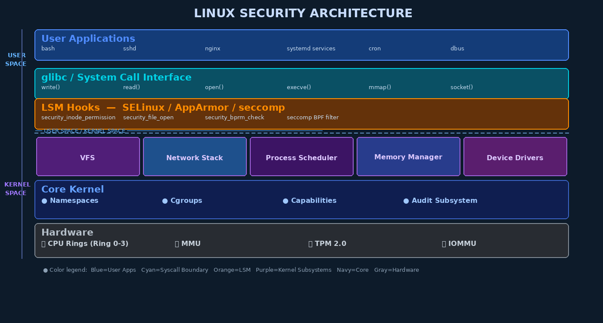

# Week 11: Linux Security Architecture In Depth

## Overview

Linux powers the majority of the world's servers, cloud infrastructure, embedded devices, Android smartphones, and supercomputers. Understanding Linux security architecture at a deep level is therefore essential for any OS security professional. This chapter moves beyond surface-level hardening tips to examine *why* Linux's security model works the way it does, where its structural weaknesses lie, and how modern additions — from Linux Security Modules to systemd sandboxing — address the shortcomings of the original Unix design.

---

## The Linux Security Model: Foundations

Linux inherits the Unix principle that **everything is a file**. Devices (`/dev/sda`), processes (`/proc/1234/`), sockets, pipes, and even kernel parameters (`/proc/sys/`) are exposed as filesystem objects. This unification simplifies the interface — one set of `read()`/`write()`/`open()` system calls governs access to almost everything — but it also means that **file permission misconfiguration can expose kernel internals** or hardware devices directly to unprivileged users.

The traditional Unix privilege model divides the world into two tiers: processes running as **UID 0 (root)** and everything else. Root can bypass nearly every access check — reading any file, killing any process, binding to privileged ports, loading kernel modules. This binary model is sometimes called "superuser privilege" and represents a single catastrophic point of failure: any vulnerability that elevates an attacker to root grants unrestricted control over the system.

> **Key Concept:** The traditional root model violates the principle of least privilege. A web server process that only needs to read HTML files should not run as root and therefore should not be able to rewrite `/etc/passwd`. Linux Capabilities (Chapter 8) partially address this by splitting root privileges into discrete units that can be granted individually.

---

## System Call Interface: The Primary Kernel Boundary



Every user-space program interacts with the kernel exclusively through **system calls** (syscalls). When a process needs to open a file, allocate memory, or send a network packet, it invokes a syscall via a software interrupt or the `syscall` instruction (x86-64). The CPU transitions from Ring 3 (user mode) to Ring 0 (kernel mode), executes the requested kernel function, and returns to user space.

The **system call table** (`sys_call_table`) maps syscall numbers to kernel function pointers. Linux 6.x provides over 400 syscalls. This interface is the most scrutinized boundary in the OS — every syscall is a potential vulnerability if the kernel does not properly validate user-supplied arguments (pointers, lengths, flags).

```c
// Example: how glibc wraps write() into a syscall
// In user space:
ssize_t write(int fd, const void *buf, size_t count) {
    // calls: syscall(SYS_write, fd, buf, count)
    // → triggers Ring 3→0 transition
    // → kernel validates fd, copies buf from user space (copy_from_user)
    // → performs I/O, returns to Ring 3
}
```

**Kernel modules** extend the kernel at runtime without rebooting. They can add device drivers, filesystems, or security modules. However, loading a **unsigned or malicious kernel module** grants the code full kernel privilege — making module signing (`CONFIG_MODULE_SIG_FORCE`) critical for production systems.

---

## Linux Security Modules (LSM) Framework

The **LSM framework**, introduced in Linux 2.6, provides a set of hooks inserted at security-sensitive points throughout the kernel. When, for example, a process tries to open a file, the kernel calls `security_file_open()` — an LSM hook. Registered security modules can then enforce additional policy beyond standard DAC (Discretionary Access Control).

```
Process calls open() → VFS lookup → security_inode_permission() → DAC check → LSM policy check → allow/deny
```

Key LSM hooks include:
- `security_inode_permission` — file/directory access checks
- `security_file_open` — file open checks (after path resolution)
- `security_bprm_check` — program execution (setuid, label transitions)
- `security_socket_connect` / `security_socket_bind` — network access

Since **Linux 4.15**, multiple LSMs can be stacked simultaneously. The major LSMs are:

| LSM | Model | Use Case |
|-----|-------|----------|
| SELinux | Mandatory Access Control (MAC), Type Enforcement | RHEL/Fedora, Android |
| AppArmor | Path-based MAC, profile per program | Ubuntu/Debian |
| seccomp | Syscall filtering (BPF programs) | Container isolation, browsers |
| TOMOYO | Pathname-based MAC | Embedded Linux |
| SMACK | Simplified Mandatory Access Control | IoT/embedded |

---

## The /proc Filesystem as Security Intelligence

The `/proc` virtual filesystem exposes kernel and process state as readable files. It is simultaneously a powerful diagnostic tool and an **information disclosure risk**.

Per-process directories `/proc/PID/` contain:
- `maps` — virtual memory layout (reveals ASLR bases if readable)
- `mem` — direct process memory (only readable by same UID or ptrace-capable processes)
- `environ` — environment variables (may contain secrets, API keys)
- `cmdline` — command-line arguments (may include passwords passed as args)
- `fd/` — open file descriptors (reveals open sockets, pipes)
- `status` — process metadata including UID, GID, capabilities

```bash
# Reading /proc to investigate a running process (as root):
cat /proc/$(pgrep sshd)/maps        # reveals memory layout
cat /proc/$(pgrep sshd)/environ | tr '\0' '\n'  # environment variables
ls -la /proc/$(pgrep sshd)/fd       # open file descriptors
```

Security-relevant `/proc/sys/kernel/` parameters include `dmesg_restrict`, `kptr_restrict`, `yama.ptrace_scope`, and `perf_event_paranoid`. These should be tuned — see Chapter 13 for the complete sysctl hardening list.

---

## Linux Audit Subsystem (auditd)

The **auditd** daemon provides kernel-level audit logging, capturing system calls, file accesses, and authentication events with cryptographic integrity (via `augenrules`). It writes to `/var/log/audit/audit.log` in a structured format.

```bash
# Install and enable auditd
apt install auditd audispd-plugins
systemctl enable --now auditd

# Watch writes to /etc/passwd
auditctl -w /etc/passwd -p wa -k passwd_changes

# Audit all execve() calls by non-root users
auditctl -a always,exit -F arch=b64 -S execve -F uid!=0 -k user_exec

# Audit privilege escalation (setuid programs)
auditctl -a always,exit -F arch=b64 -S execve -F euid=0 -F uid!=0 -k setuid_exec
```

The `ausearch` and `aureport` tools query the audit log:
```bash
ausearch -k passwd_changes --start today   # find passwd modification events
aureport --auth                             # authentication report
aureport --login -i                         # login report with interpreted fields
```

---

## Systemd Service Sandboxing

Modern Linux systems use **systemd** to manage services. Systemd supports extensive sandboxing directives that constrain what a service can do, even if it is compromised:

```ini
# /etc/systemd/system/myapp.service
[Service]
User=myapp
Group=myapp
PrivateTmp=yes              # isolated /tmp, invisible to other services
ProtectSystem=strict        # /usr, /boot, /etc read-only
ProtectHome=yes             # /home, /root inaccessible
NoNewPrivileges=yes         # cannot gain capabilities via setuid
CapabilityBoundingSet=CAP_NET_BIND_SERVICE  # only this capability
MemoryDenyWriteExecute=yes  # no JIT / W^X bypass
LockPersonality=yes         # cannot change execution domain
RestrictSyscalls=@system-service  # syscall whitelist
ProtectKernelTunables=yes   # /proc/sys and /sys read-only
ProtectKernelModules=yes    # cannot load kernel modules
RestrictAddressFamilies=AF_INET AF_INET6  # only TCP/IP sockets
```

Assess a service's security posture:
```bash
systemd-analyze security nginx     # shows security score 0-10 (lower = more exposed)
systemd-analyze security --no-pager
```

---

## SSH Security Hardening

SSH is the primary remote administration protocol for Linux. A misconfigured SSH daemon is a critical attack surface.

```
# /etc/ssh/sshd_config — recommended hardening settings
Protocol 2
PermitRootLogin no
PasswordAuthentication no
PubkeyAuthentication yes
AuthorizedKeysFile .ssh/authorized_keys
AllowUsers admin devops
MaxAuthTries 3
MaxSessions 5
LoginGraceTime 30
AllowTcpForwarding no
X11Forwarding no
PrintLastLog yes
Banner /etc/ssh/banner.txt
```

**SSH Certificate Authority (CA)**: Instead of distributing individual public keys, an SSH CA signs user and host keys. This enables centralized revocation and greatly simplifies large-scale deployments:

```bash
# Create SSH CA key pair
ssh-keygen -t ed25519 -f /etc/ssh/ca_key -C "CorpSSH-CA"

# Sign a user key (valid 1 day, principal=admin)
ssh-keygen -s /etc/ssh/ca_key -I "john@corp" -n admin -V +1d ~/.ssh/id_ed25519.pub

# On server — trust the CA instead of individual keys
echo "TrustedUserCAKeys /etc/ssh/ca_key.pub" >> /etc/ssh/sshd_config
```

---

## Linux Firewall: iptables / nftables

Linux uses **Netfilter** hooks in the kernel network stack, configured via `iptables` (legacy) or `nftables` (modern). The **default-deny** philosophy requires explicit rules for permitted traffic:

```bash
# nftables — default deny with allowlist
nft add table inet filter
nft add chain inet filter input { type filter hook input priority 0 \; policy drop \; }
nft add rule inet filter input ct state established,related accept
nft add rule inet filter input iif lo accept
nft add rule inet filter input tcp dport { 22, 443 } accept
nft add rule inet filter input counter drop   # log and drop everything else
```

**OUTPUT filtering** is often neglected but critical — malware on the system will attempt to call home. Restricting outbound traffic to only expected destinations limits the blast radius of a compromise.

---

## Intrusion Detection on Linux

| Tool | Method | What It Detects |
|------|--------|-----------------|
| `rkhunter` | Hash comparison, known signatures | Rootkits, backdoors, suspicious files |
| `chkrootkit` | Binary signature scanning | Known rootkit signatures |
| `AIDE` | File/dir integrity baseline | Any filesystem changes since baseline |
| `osquery` | SQL queries against OS state | Anomalous processes, network connections |
| `auditd` | Kernel syscall monitoring | Privileged operations, file changes |

```bash
# Initialize AIDE baseline (run after clean install)
aide --init && mv /var/lib/aide/aide.db.new /var/lib/aide/aide.db

# Run daily check (add to cron)
aide --check 2>&1 | mail -s "AIDE Report $(hostname)" security@corp.com
```

---

## Linux Credential Hardening

Configure password policy in `/etc/security/pwquality.conf`:
```
minlen = 14
dcredit = -1     # require at least 1 digit
ucredit = -1     # require at least 1 uppercase
lcredit = -1     # require at least 1 lowercase
ocredit = -1     # require at least 1 special char
maxrepeat = 3    # no more than 3 consecutive same characters
```

Configure account lockout in `/etc/security/faillock.conf`:
```
deny = 5           # lock after 5 failures
unlock_time = 900  # auto-unlock after 15 minutes
fail_interval = 900
```

---

## Key Terms

| Term | Definition |
|------|-----------|
| **LSM (Linux Security Modules)** | Framework providing kernel hooks for mandatory access control |
| **SELinux** | NSA-developed MAC LSM using type enforcement labels |
| **AppArmor** | Path-based LSM using per-program security profiles |
| **seccomp** | System call filter using BPF programs |
| **auditd** | Linux kernel audit daemon; logs security events |
| **UID 0** | Root user; bypasses most kernel access controls |
| **Capabilities** | Fine-grained Linux privilege units replacing all-or-nothing root |
| **Namespace** | Kernel isolation primitive for processes, network, mounts, etc. |
| **sshd_config** | SSH daemon configuration; primary SSH hardening surface |
| **PrivateTmp** | systemd directive giving a service an isolated /tmp |
| **NoNewPrivileges** | systemd/prctl flag preventing privilege escalation |
| **AIDE** | Advanced Intrusion Detection Environment — file integrity monitor |
| **pam_faillock** | PAM module enforcing account lockout after failed logins |
| **nftables** | Modern Linux firewalling framework replacing iptables |
| **Netfilter** | Linux kernel packet filtering framework underlying iptables/nftables |
| **ptrace** | System call for debugging/tracing processes; significant attack surface |
| **rkhunter** | Rootkit Hunter — scans for known rootkits and suspicious binaries |
| **Kernel module** | Dynamically loadable code running in Ring 0 kernel space |

---

## Review Questions

1. **Conceptual:** Explain why the "everything is a file" design philosophy creates both convenience and security risks in Linux.
2. **Conceptual:** How do Linux Capabilities improve upon the traditional binary root/non-root privilege model? Give three examples of capabilities and what they permit.
3. **Analytical:** A developer proposes running their web application as root "to avoid permission issues." Identify at least four specific risks and explain which principle is violated.
4. **Conceptual:** Explain how LSM hooks differ from standard Linux DAC checks. What does "MAC stacking" mean since Linux 4.15?
5. **Hands-on Lab:** Configure `/etc/ssh/sshd_config` to disable password authentication, restrict logins to users in the `sshusers` group, limit `MaxAuthTries` to 3, and disable X11 forwarding. Test with `sshd -t`.
6. **Hands-on Lab:** Write three `auditctl` rules: (a) watch `/etc/sudoers` for any access; (b) audit all `execve()` calls by non-root users; (c) audit `openat()` on files in `/etc/ssh/`.
7. **Conceptual:** What information does `/proc/PID/environ` expose and under what circumstances can an attacker read another process's environment?
8. **Analytical:** Review this systemd service unit. Which security directives are missing that should be added for a non-privileged network service?
   ```ini
   [Service]
   ExecStart=/usr/bin/myapp
   User=myapp
   ```
9. **Hands-on Lab:** Run `systemd-analyze security nginx` on a Linux system. Identify three specific directives that could be added to lower the exposure level.
10. **Conceptual:** Compare `rkhunter`, `AIDE`, and `auditd` — which layer does each operate at, and can they be used together? When would each detect an intrusion?

---

## Further Reading

1. *The Linux Programming Interface* — Michael Kerrisk (No Starch Press, 2010) — definitive reference for syscalls, /proc, and credentials
2. Red Hat: "A Guide to Linux Namespaces" — access.redhat.com
3. Linux Kernel Documentation: `Documentation/admin-guide/LSM/` — kernel.org
4. NSA SELinux Project: "SELinux By Example" — Mayer, MacMillan, Caplan (Prentice Hall, 2006)
5. CIS Ubuntu Linux Benchmark — cisecurity.org (free download with registration)
