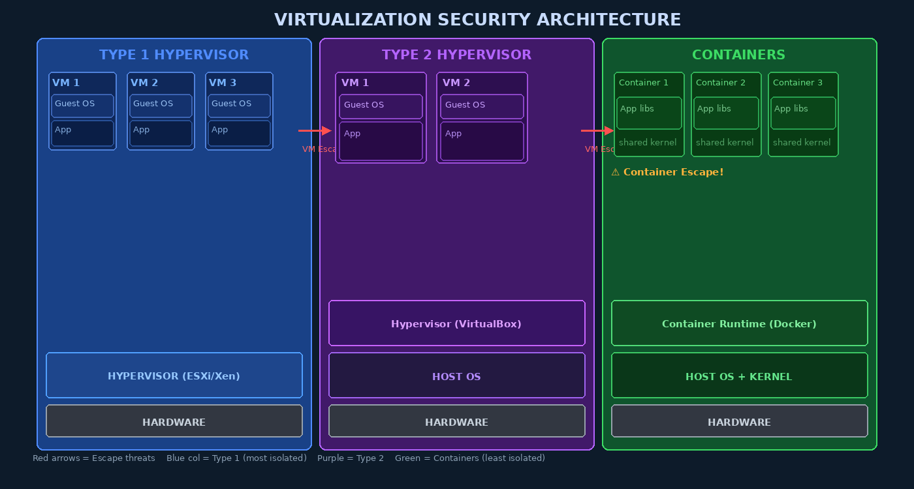

# Week 12: Virtualization Security

## Overview

Virtualization has become the foundational technology of modern computing infrastructure. Cloud platforms run millions of virtual machines; enterprise data centers consolidate dozens of workloads onto single physical hosts; containers package microservices for rapid deployment. Virtualization offers compelling security benefits — workload isolation, snapshot recovery, and the ability to run untrusted code in sandboxed environments. Yet it simultaneously introduces a new class of threats that did not exist in bare-metal deployments: hypervisor vulnerabilities, VM escape attacks, side-channel leakage across VM boundaries, and the expanded attack surface of virtual hardware emulation.

---

## Hypervisor Architecture and Security Implications

A **hypervisor** (Virtual Machine Monitor, VMM) creates and manages virtual machines, abstracting the underlying hardware into isolated virtual environments. The two architectural types have distinct security profiles:

### Type 1 — Bare-Metal Hypervisors

Type 1 hypervisors run **directly on hardware**, with no host OS underneath. Examples include VMware ESXi, Xen, Microsoft Hyper-V, and KVM (which runs inside the Linux kernel, treating Linux as a minimal host).

**Security advantages:**
- Smaller software attack surface (no general-purpose host OS)
- Hardware-level isolation between VMs
- Used by all major cloud providers (AWS, Azure, GCP)

**Security risks:**
- Hypervisor kernel bugs directly expose all VMs
- Management interfaces (vCenter, IPMI) become high-value targets

### Type 2 — Hosted Hypervisors

Type 2 hypervisors run as applications on top of a conventional host OS. Examples include VirtualBox, VMware Workstation, and Parallels.

**Security disadvantages:**
- Compromising the host OS compromises all VMs
- Larger attack surface (full OS + hypervisor application)
- Host OS vulnerabilities undermine VM isolation



---

## How Virtualization Enforces Isolation

Hypervisors enforce isolation through multiple mechanisms:

1. **Virtual hardware**: Each VM gets a virtualized CPU, memory, disk, and network interface. The guest believes it owns real hardware.
2. **Memory isolation**: Hardware-assisted virtualization (Intel VT-x/AMD-V with EPT/NPT) provides **Extended Page Tables** — a second layer of page translation ensuring a guest cannot access another VM's physical memory pages, even if it corrupts its own page tables.
3. **Virtual network interfaces**: Each VM connects to a virtual switch (vSwitch). Traffic between VMs traverses the hypervisor's networking layer, where security policies can be enforced.
4. **CPU privilege rings**: Hardware virtualization introduces VMX root mode (Ring -1) for the hypervisor, below Ring 0 used by guest OS kernels.

---

## VM Escape: The Nightmare Scenario

A **VM escape** is a vulnerability that allows code running inside a guest VM to execute code in the hypervisor or on the host OS — a complete violation of the isolation guarantee. VM escapes are among the most severe virtualization vulnerabilities, typically rated CVSS 9.0+.

### Notable VM Escape CVEs

| CVE | Year | Product | Mechanism |
|-----|------|---------|-----------|
| CVE-2015-3456 (VENOM) | 2015 | QEMU/KVM, Xen | Virtual floppy disk controller buffer overflow; attacker sends crafted FDC commands from guest → host code execution |
| CVE-2018-3646 (L1TF/Foreshadow) | 2018 | Intel CPUs / KVM | Speculative execution reads L1 cache data across VM boundaries — guest can read hypervisor or other VM memory |
| CVE-2019-0708 (BlueKeep) | 2019 | Windows RDP in VMs | Pre-auth RCE in RDP allowing wormable exploitation even inside VMs |
| CVE-2021-22555 | 2021 | Linux kernel Netfilter | Heap OOB write exploitable in VM context to escape container/namespace |

> **VENOM Technical Detail:** The virtual floppy disk controller (FDC) in QEMU maintained a data buffer with a fixed 512-byte size but no length validation. By sending malformed FDC I/O port commands from inside the guest, an attacker could overflow this buffer and overwrite adjacent heap memory in the QEMU process — which runs on the host with elevated privileges.

---

## Hypervisor Hardening Strategies

```bash
# ESXi hardening examples (via esxcli)
esxcli system settings advanced set -o /Net/GuestIPHack -i 0
esxcli system settings advanced set -o /Mem/ShareForceSalting -i 2   # disable KSM dedup
esxcli network firewall set --default-action DROP                     # default deny
```

Key hypervisor hardening principles:
- **Minimize virtual hardware**: Remove unused virtual devices (floppy, COM ports, CD-ROM, USB). Every emulated device is attack surface.
- **Disable VM-to-host communication channels**: VMware Guest Tools RPC, shared folders, clipboard sharing — all can be attack vectors.
- **Management network segmentation**: Hypervisor management interfaces should be on a dedicated, firewalled VLAN inaccessible from VMs.
- **Integrity verification**: ESXi TPM attestation, Hyper-V Shielded VMs with vTPM.

---

## Memory Security in Virtualization

### Kernel Samepage Merging (KSM) Side-Channel

**KSM** (Kernel Samepage Merging) is a Linux memory optimization that identifies identical memory pages across VMs and maps them to a single physical page. While it reduces memory consumption, it creates a **timing side-channel**: an attacker in one VM can detect when a specific page is merged or split by measuring memory access timing, potentially inferring what another VM is computing.

CVE-2015-2877 documented this attack. The fix — `ksm_use_zero_pages` and per-VM KSM control — is now standard hardening practice.

```bash
# Disable KSM entirely on a KVM host (recommended for multi-tenant environments)
echo 0 > /sys/kernel/mm/ksm/run
systemctl disable ksmtuned
```

### Nested Page Tables (NPT/EPT)

Nested paging ensures guest page table manipulations cannot map to physical addresses outside the VM's allocated memory. The hypervisor maintains a second-level page table (EPT on Intel, NPT on AMD). Any guest attempt to map an unauthorized physical frame generates a VM-exit, which the hypervisor handles by denying the mapping.

---

## Virtual Networking Security

Virtual networks introduce risks beyond physical networking:

- **Promiscuous mode**: A compromised VM enabling promiscuous mode on its vNIC could capture traffic from other VMs on the same vSwitch. Hypervisors should enforce `MacChanges: reject` and `ForgedTransmits: reject` policies.
- **VLAN hopping**: Misconfigured trunk ports or double-tagging attacks can allow a VM to access VLANs it should not.
- **Virtual switch security**: VMware vSwitch, OVS (Open vSwitch), and Linux bridges each have security configurations. Micro-segmentation (NSX-T) provides per-VM firewall rules.

```bash
# OVS — restrict promiscuous mode on a port
ovs-vsctl set port VM1-eth0 other_config:no-flood=true
# VMware ESXi — reject MAC address changes via PowerCLI
Get-VM | Get-NetworkAdapter | Get-SecurityPolicy | Set-SecurityPolicy -MacChanges $false
```

---

## Virtualization-Based Security (VBS) in Windows 10/11

Microsoft uses Hyper-V to create a secure, isolated VM that protects critical Windows components even from a compromised kernel:

**Credential Guard**: LSASS (the Local Security Authority, which holds NTLM hashes and Kerberos tickets) runs inside a **Virtual Trust Level 1 (VTL1)** Hyper-V VM. Even if the Windows kernel (VTL0) is compromised, credentials cannot be extracted.

**HVCI (Hypervisor-Protected Code Integrity)**: Kernel code integrity is enforced by the hypervisor at VTL1. The Windows kernel cannot load unsigned code even if an attacker gains kernel-level access — the hypervisor denies the page permission changes.

```powershell
# Check if VBS/HVCI is enabled
Get-CimInstance -ClassName Win32_DeviceGuard -Namespace root\Microsoft\Windows\DeviceGuard |
    Select VirtualizationBasedSecurityStatus, CodeIntegrityPolicyEnforcementStatus
```

---

## KVM Security: QEMU Attack Surface

KVM (Kernel-based Virtual Machine) uses **QEMU** for hardware emulation. QEMU runs as a user-space process on the host, emulating disk controllers, network cards, USB, and hundreds of other devices. This emulation code represents a massive attack surface — any bug in device emulation code that a guest can trigger becomes a potential VM escape.

**libvirt sVirt**: libvirt uses SELinux to label each QEMU process and its associated files with unique labels (e.g., `svirt_t:s0:c1,c2`). Even if one QEMU process is compromised, SELinux prevents it from accessing files or processes belonging to other VMs.

```bash
# View SELinux labels on QEMU processes
ps auxZ | grep qemu
# Output: system_u:system_r:svirt_t:s0:c234,c567 qemu-system-x86_64 ...
```

---

## Container vs. VM Security Comparison

| Property | Virtual Machines | Containers |
|----------|-----------------|------------|
| **Kernel isolation** | Separate kernel per VM | Shared host kernel |
| **Attack surface for isolation bypass** | Hypervisor + virtual hardware | Kernel namespaces + seccomp + LSM |
| **A single kernel bug breaks isolation?** | No — hypervisor layer remains | Yes — kernel exploits can escape containers |
| **Boot time** | 30s–5min | Milliseconds |
| **Memory overhead** | High (full OS per VM) | Low (shared kernel) |
| **Snapshot support** | Full VM snapshots | Image layers (no memory snapshots) |
| **Defense in depth** | Multiple isolation layers | Requires LSM + seccomp + capabilities |

---

## Cloud Provider Hypervisor Security

**AWS Nitro System**: AWS built custom silicon (Nitro Cards) to offload hypervisor functions to dedicated hardware, dramatically reducing the software attack surface. The Nitro hypervisor has less than 1% of the code of a traditional hypervisor.

**Google Titan**: Google's custom security chip provides measured boot, attestation, and root-of-trust for GCP hypervisor nodes.

---

## Snapshot and Live Migration Security

**Snapshot files** contain a complete copy of VM memory at a point in time — including encryption keys, passwords, TLS session keys, and plaintext credentials. Snapshot files must be treated as **highly sensitive** and encrypted at rest.

**Live migration** (vMotion, libvirt migrate) transfers VM memory across a network while the VM continues running. If this traffic is unencrypted, an attacker with network access can capture the complete VM memory stream. Always encrypt migration traffic using TLS or IPsec tunnels.

---

## Key Terms

| Term | Definition |
|------|-----------|
| **Hypervisor** | Software/firmware/hardware creating and managing virtual machines |
| **Type 1 Hypervisor** | Bare-metal hypervisor running directly on hardware (ESXi, Xen, Hyper-V) |
| **Type 2 Hypervisor** | Hosted hypervisor running atop a general-purpose OS (VirtualBox, VMware WS) |
| **VM Escape** | Exploit allowing guest code to execute on the host/hypervisor |
| **VENOM** | CVE-2015-3456; virtual FDC buffer overflow enabling VM escape in QEMU |
| **EPT/NPT** | Extended/Nested Page Tables; hardware mechanism for VM memory isolation |
| **KSM** | Kernel Samepage Merging; memory deduplication creating side-channel risk |
| **VBS** | Virtualization-Based Security; Windows uses Hyper-V to protect kernel/LSASS |
| **Credential Guard** | VBS feature moving LSASS into a hypervisor-isolated VM |
| **HVCI** | Hypervisor-Protected Code Integrity; prevents unsigned kernel code |
| **QEMU** | Userspace hardware emulator used with KVM; large attack surface |
| **sVirt** | libvirt+SELinux labeling scheme isolating KVM VMs from each other |
| **Live Migration** | Moving running VM between hosts; requires encrypted transport |
| **L1TF/Foreshadow** | CVE-2018-3646; speculative execution attack crossing VM boundaries |
| **vSwitch** | Virtual network switch connecting VMs; misconfiguration enables sniffing |
| **Nitro System** | AWS custom hardware offloading hypervisor functions; reduced attack surface |

---

## Review Questions

1. **Conceptual:** Explain the security difference between Type 1 and Type 2 hypervisors. In which scenario would you absolutely require a Type 1 hypervisor?
2. **Analytical:** How does Intel EPT (Extended Page Tables) prevent a guest OS from reading another VM's memory, even if the guest corrupts its own page tables?
3. **Conceptual:** Describe the VENOM vulnerability (CVE-2015-3456). What is the attack primitive (what can the guest control?), and how does it result in host code execution?
4. **Hands-on Lab:** Identify all virtual hardware devices attached to a KVM VM using `virsh dumpxml <vmname>`. Which devices could be removed to reduce attack surface?
5. **Conceptual:** Compare container isolation to VM isolation in terms of kernel sharing. Provide a specific scenario where a container escape is possible but a VM escape would not be.
6. **Analytical:** Why is Kernel Samepage Merging (KSM) a security risk in multi-tenant environments? Describe the attack mechanism.
7. **Conceptual:** Explain how Windows Credential Guard prevents credential theft even after a kernel-level compromise. What specific threat does it mitigate?
8. **Hands-on Lab:** Using `esxcli` or libvirt/virsh, disable floppy disk, COM ports, and USB controllers on a test VM. Document the commands used.
9. **Conceptual:** Why must VM snapshot files and live migration traffic be protected? What data is contained in a VM memory snapshot?
10. **Analytical:** The AWS Nitro hypervisor has dramatically less code than VMware ESXi. From a security perspective, why does this matter? What is the relationship between code size and attack surface?

---

## Further Reading

1. *The Art of Exploitation* — Jon Erickson — background on memory exploitation relevant to VENOM-style attacks
2. Xen Project Security Team: "Xen Security Advisories" — xenproject.org/security
3. VMware: "vSphere Security Configuration Guide" — docs.vmware.com
4. Amazon Web Services: "The Security Design of the AWS Nitro System" — aws.amazon.com/security/
5. Intel: "A Tour Beyond BIOS: Memory Protection and Virtualization" — uefi.org (whitepaper)
