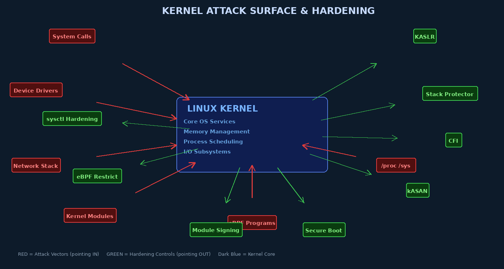

# Week 13: Kernel Security — Hardening, Rootkits, and Kernel Exploits

## Overview

The operating system kernel is the highest-value target in any computer system. Unlike user-space software, where exploitation typically allows an attacker to control a single process, a kernel vulnerability grants **complete, unrestricted control over the entire system** — every process, every file, every network connection, and every hardware device. This chapter examines the kernel attack surface, the taxonomy of rootkits that abuse kernel access, and the layered hardening techniques that modern OS kernels employ to resist these attacks.

---

## The Kernel Attack Surface

The Linux kernel provides approximately 400 system call entry points, manages physical memory for every process, and includes millions of lines of code for device drivers, network protocols, and filesystem implementations. Each of these subsystems represents a potential attack entry point.



### Primary Attack Vectors

**System Calls (400+ in Linux x86-64)**
Every syscall is a potential input validation failure. The kernel must safely dereference user-supplied pointers using `copy_from_user()` / `copy_to_user()` — bypassing this can lead to kernel memory corruption. Historical examples: `ptrace` bugs, `sendmsg` bugs, `ioctl` misuse.

**Device Drivers**
Device drivers account for the **majority of kernel CVEs**. Drivers are often written by hardware vendors with less rigorous security review than the core kernel. A USB device driver, for example, receives data from potentially malicious external hardware. The BadUSB attack demonstrates how a USB device can trigger driver vulnerabilities.

**Kernel Modules**
Loadable kernel modules (LKMs) run in Ring 0 with no privilege restrictions. An attacker who can load an arbitrary module (requires `CAP_SYS_MODULE` or root) can run arbitrary kernel code.

**eBPF Programs**
The extended Berkeley Packet Filter (eBPF) allows user-space programs to inject code into the kernel for monitoring and filtering. While the eBPF verifier validates programs before execution, the verifier itself has had multiple vulnerabilities (CVE-2021-3490, CVE-2022-23222) allowing privilege escalation.

**Network Stack**
Remote attackers can target kernel network code without any local access. Historical examples: CVE-2016-10229 (UDP flaw), CVE-2019-11477 (SACK Panic).

**`/proc` and `/sys` Interfaces**
These virtual filesystems expose kernel internals. Information leaks via `/proc/kallsyms` (kernel symbol table) or `/sys/kernel/debug/` can provide addresses needed to bypass KASLR.

---

## Rootkit Taxonomy

A **rootkit** is software designed to maintain persistent, hidden access to a system while concealing its presence from the system owner. The sophistication and persistence of rootkits varies dramatically by type.

### Layer 1: User-Mode Rootkits

User-mode rootkits operate entirely in user space, manipulating visible system state without touching the kernel.

**LD_PRELOAD Hooking**: By setting `LD_PRELOAD=/path/to/evil.so`, the attacker's shared library is loaded before any other library, allowing them to intercept and modify libc functions (`readdir`, `fopen`, etc.) to hide files, processes, and network connections.

```bash
# Detection: LD_PRELOAD rootkits are trivially visible to root
env | grep LD_PRELOAD    # check environment
cat /proc/self/maps      # check which libraries are loaded
# Compare output of ls vs. raw directory scan:
ls /tmp
perl -e 'opendir(D,"/tmp"); print join("\n", readdir(D)), "\n"'
```

**Binary Replacement**: Replacing system binaries (`ps`, `netstat`, `ls`) with trojaned versions that omit attacker-controlled processes/connections.

### Layer 2: Kernel-Mode Rootkits (LKM Rootkits)

Kernel rootkits run inside the kernel itself, making them invisible to user-space tools and extremely difficult to detect from within the compromised system.

**Process Hiding via DKOM (Direct Kernel Object Manipulation)**:
The Linux kernel maintains a doubly-linked list of `task_struct` objects (one per process). A rootkit can unlink its own `task_struct` from this list, making the process invisible to `ps`, `top`, and `/proc` enumeration:

```c
// Simplified DKOM — remove process from kernel task list
// (actual rootkits use kernel symbol resolution to find task_struct)
list_del_init(&current->tasks);   // unlink from process list
// process still runs, consumes CPU, but is invisible to ps/top
```

**Inline Function Hooking**: Overwriting the first bytes of kernel functions with a jump to attacker-controlled code. For example, hooking `sys_getdents64()` (used by `ls`) to skip entries whose names match a pattern.

**System Call Table Hooking**: Overwriting entries in `sys_call_table[]` to redirect syscalls to attacker-controlled handlers.

### Layer 3: Bootloader Rootkits (Bootkits)

Bootkits infect the **Master Boot Record (MBR)** or **UEFI boot sequence**, loading before the OS. Because they control the boot process, they can manipulate the kernel and drivers before any security software initializes.

Examples: Rovnix, Necurs, Mebromi. Detection requires booting from external media and examining the MBR/VBR directly.

### Layer 4: Firmware Rootkits (UEFI Rootkits)

The most persistent and most dangerous rootkit category. Firmware rootkits infect the **UEFI firmware** stored in SPI flash on the motherboard. They survive:
- OS reinstallation
- Hard drive replacement
- BIOS "reset to defaults" (if the flash is not fully wiped)

**LojAx** (2018): First UEFI rootkit found in the wild, attributed to APT28. Modified the UEFI firmware to persist a dropper that reinstalled malware after every reboot.

**CosmicStrand** (2022): UEFI firmware bootkit affecting Gigabyte/ASUS motherboards; detected only through specialized firmware analysis tools.

Detection requires UEFI firmware scanning tools (ESET firmware scanner, binwalk analysis, chipsec).

---

## Rootkit Detection Techniques

### Host-Based Detection

```bash
# rkhunter — hash database comparison
rkhunter --update && rkhunter --check --skip-keypress

# chkrootkit — signature-based scanning
apt install chkrootkit && chkrootkit

# Cross-view detection: compare /proc listing vs. raw process table
# If they differ, a rootkit is hiding processes
```

### Cross-View Detection

A rootkit hiding processes by manipulating `/proc` will show discrepancies between:
- `ps aux` (reads `/proc`) → shows rootkit-filtered view
- Direct iteration of kernel task list via `/dev/kmem` or VM introspection → shows true process list

### Memory Forensics with Volatility

When the system cannot be trusted, boot from external media and analyze memory:

```bash
# Acquire memory (from trusted environment)
dd if=/dev/mem of=/mnt/external/memory.img bs=1M

# Volatility 3 — analyze Linux memory image
python3 vol.py -f memory.img linux.pslist   # list all processes from kernel structs
python3 vol.py -f memory.img linux.lsmod    # list kernel modules from kernel list
python3 vol.py -f memory.img linux.check_syscall  # detect syscall table hooks
python3 vol.py -f memory.img linux.malfind  # find suspicious memory segments
```

Comparing `linux.pslist` (reads kernel data structures directly) with `/proc` output reveals hidden processes.

---

## Kernel Hardening Techniques

### KASLR — Kernel Address Space Layout Randomization

KASLR randomizes the base address at which the kernel is loaded in physical and virtual memory at each boot. Without knowing kernel addresses, attackers cannot hardcode return addresses for kernel ROP chains.

```bash
# Verify KASLR is enabled (non-zero offset at boot)
cat /proc/kallsyms | grep T startup_64   # shows randomized address
dmesg | grep KASLR                        # boot-time KASLR message
```

**KASLR Bypasses**: Information leaks via `/proc/kallsyms` (mitigated by `kernel.kptr_restrict=2`), timing side-channels, or Spectre-class attacks can reveal kernel addresses, defeating KASLR.

### SMEP and SMAP

- **SMEP (Supervisor Mode Execution Prevention)**: The CPU raises a fault if kernel-mode code attempts to execute a page marked user-space (Ring 3). Prevents "ret2user" attacks where kernel RIP is redirected to attacker shellcode in user memory.
- **SMAP (Supervisor Mode Access Prevention)**: The CPU faults if kernel-mode code accesses user-space memory without explicit `stac`/`clac` instructions. Prevents kernel code from being tricked into using attacker-controlled user-space data structures.

Both require hardware support (Intel 2011+, AMD 2012+). Verify:
```bash
grep -m1 smep /proc/cpuinfo && grep -m1 smap /proc/cpuinfo
```

### Kernel Stack Canaries

Like userspace stack canaries, the kernel places a random value between local variables and the return address on the kernel stack. Stack corruption that overwrites the return address also clobbers the canary, which is checked before the function returns.

### Control Flow Integrity (CFI)

**Forward-Edge CFI**: Validates that indirect function calls (calls through function pointers) target a legitimate function entry point, not arbitrary code injected by an attacker. The kernel's CFI implementation (CONFIG_CFI_CLANG) uses LLVM to generate checks.

**Backward-Edge CFI / Shadow Stack**: Intel CET (Control-flow Enforcement Technology) maintains a separate, hardware-protected shadow stack containing only return addresses. Any attempt to corrupt the regular stack's return address is caught by comparing with the shadow stack copy.

### Kernel Module Signing

```bash
# Enforce signed modules only (no unsigned modules load)
# In /etc/default/grub:
GRUB_CMDLINE_LINUX="... module.sig_enforce=1"

# Check if a module is signed:
modinfo mymodule.ko | grep sig

# Build and sign a module:
/usr/src/linux-headers-$(uname -r)/scripts/sign-file sha256 \
    kernel_key.priv kernel_cert.pem mymodule.ko
```

### Kernel Lockdown Mode

Linux kernel lockdown (since 5.4) restricts what even root can do to prevent kernel modification:

- **Integrity mode**: Prevents loading unsigned modules, accessing `/dev/mem`, `/dev/kmem`, kexec, and other paths that could modify running kernel code.
- **Confidentiality mode**: Additionally prevents reading kernel memory.

```bash
# Check lockdown status
cat /sys/kernel/security/lockdown

# Enable via kernel command line:
# lockdown=integrity
# lockdown=confidentiality
```

### sysctl Security Parameters

```bash
# Comprehensive kernel hardening via sysctl
cat >> /etc/sysctl.d/99-hardening.conf << 'EOF'
# Kernel pointer restriction (hide kernel addresses from /proc)
kernel.kptr_restrict = 2
# Restrict dmesg to root (hide boot-time address leaks)
kernel.dmesg_restrict = 1
# Restrict ptrace (0=all, 1=parent, 2=admin, 3=none)
kernel.yama.ptrace_scope = 2
# Disable magic SysRq key
kernel.sysrq = 0
# Prevent core dumps from setuid programs (contain sensitive data)
fs.suid_dumpable = 0
# Protect FIFOs and regular files in sticky directories
fs.protected_fifos = 2
fs.protected_regular = 2
# TCP SYN flood protection
net.ipv4.tcp_syncookies = 1
# Disable ICMP redirects (prevent routing table manipulation)
net.ipv4.conf.all.accept_redirects = 0
net.ipv4.conf.all.send_redirects = 0
# Disable IP source routing
net.ipv4.conf.all.accept_source_route = 0
EOF
sysctl -p /etc/sysctl.d/99-hardening.conf
```

---

## Secure Boot Chain of Trust

```
UEFI Firmware (vendor-signed)
    ↓ verifies signature of
Shim (signed by Microsoft CA — allows custom Secure Boot)
    ↓ verifies signature of
GRUB bootloader (signed by distro key)
    ↓ verifies signature of
Linux Kernel (signed by distro key)
    ↓ with CONFIG_MODULE_SIG_FORCE
Kernel Modules (must be signed by enrolled key)
```

Each link in this chain must be verified before the next is trusted. A break at any point (e.g., an unsigned bootloader) can allow an attacker to introduce malicious code before any OS security mechanisms initialize.

---

## eBPF Security: Tool and Threat

eBPF is a powerful kernel subsystem that allows user-space programs to inject small, verified programs into kernel hooks — for tracing, monitoring, and networking. Security tools like Falco, Tetragon, and Cilium use eBPF extensively.

However, eBPF is also an **attack surface**:
- The eBPF verifier has had multiple bypasses (CVE-2021-3490: out-of-bounds write via ALU32 ops; CVE-2022-23222: verifier flaw)
- eBPF-based rootkits can hook kernel functions invisibly without loading a traditional LKM
- Attackers with local code execution can use eBPF to escalate to kernel context

```bash
# Restrict eBPF to root only (default in many distros)
sysctl -w kernel.unprivileged_bpf_disabled=1
# Further restrict: disable even for root unless CAP_BPF
sysctl -w kernel.bpf_stats_enabled=0
```

---

## Key Terms

| Term | Definition |
|------|-----------|
| **Rootkit** | Software concealing malicious presence, often with kernel-level access |
| **LKM Rootkit** | Loadable Kernel Module rootkit running at Ring 0 |
| **DKOM** | Direct Kernel Object Manipulation; hiding processes by unlinking task_struct |
| **KASLR** | Kernel Address Space Layout Randomization; randomizes kernel load address |
| **SMEP** | Supervisor Mode Execution Prevention; blocks kernel execution in user pages |
| **SMAP** | Supervisor Mode Access Prevention; blocks kernel from accessing user memory |
| **CFI** | Control Flow Integrity; validates legitimate call/return targets |
| **Shadow Stack** | Hardware-protected copy of return addresses for backward-edge CFI |
| **Bootkit** | MBR/bootloader-level rootkit persisting before OS loads |
| **UEFI Rootkit** | Firmware-level rootkit surviving OS reinstallation (e.g., LojAx, CosmicStrand) |
| **eBPF** | Extended Berkeley Packet Filter; kernel programmability layer; attack surface |
| **Kernel Lockdown** | Linux feature restricting even root from modifying running kernel |
| **Module Signing** | Cryptographic signature requirement for loading kernel modules |
| **kASAN** | Kernel Address Sanitizer; detects buffer overflows/use-after-free in kernel |
| **Stack Canary** | Random value on stack detecting overflow before return address is used |
| **Volatility** | Memory forensics framework for analyzing kernel data structures offline |
| **CosmicStrand** | 2022 UEFI firmware rootkit; survives hard drive replacement |

---

## Review Questions

1. **Conceptual:** Why does kernel-level compromise represent a categorically different level of access than user-space compromise? What specifically does a kernel rootkit have access to that a user-space rootkit does not?
2. **Analytical:** Explain DKOM (Direct Kernel Object Manipulation) in the context of process hiding. What kernel data structure is manipulated, and why is this technique invisible to `ps` and `/proc`?
3. **Conceptual:** Describe the four rootkit layers (user-mode, kernel-mode, bootkit, firmware). For each, explain: (a) how it achieves persistence, (b) what it can hide, and (c) how it can be detected.
4. **Hands-on Lab:** Run `rkhunter --check` on a Linux system. Identify any warnings and research whether they represent actual risks in your environment.
5. **Conceptual:** How does SMEP prevent "ret2user" kernel exploits? What CPU feature is required, and can a kernel exploit bypass SMEP?
6. **Analytical:** A security audit finds `kernel.kptr_restrict = 0` on a production server. Explain the risk this creates and the specific attack it enables.
7. **Conceptual:** Explain the difference between forward-edge and backward-edge CFI. Which does Intel CET address? How does a shadow stack physically prevent return address corruption?
8. **Hands-on Lab:** Use Volatility to analyze a provided Linux memory image. Compare the output of `linux.pslist` with the system's `/proc` directory listing. Document any discrepancies.
9. **Conceptual:** Why are UEFI rootkits (LojAx, CosmicStrand) so dangerous? What persistence mechanism makes them survive even hard drive replacement? How would you detect one?
10. **Analytical:** eBPF is described as both a powerful security tool and a dangerous attack surface. Explain both perspectives with specific examples of legitimate eBPF security use cases and known eBPF exploit techniques.

---

## Further Reading

1. *Linux Kernel Security Subsystem* — kernel.org Documentation: `Documentation/security/`
2. "Kernel Self-Protection Project (KSPP)" — kernsec.org — tracks kernel hardening feature status
3. Phrack Magazine Issue 59: "Kernel Rootkits" — phrack.org — foundational technical reference
4. Alexander Matrosov et al., *Rootkits and Bootkits* (No Starch Press, 2019) — comprehensive coverage of advanced persistent threats
5. Brendan Gregg: "BPF Performance Tools" (Addison-Wesley, 2019) — eBPF architecture and security implications
