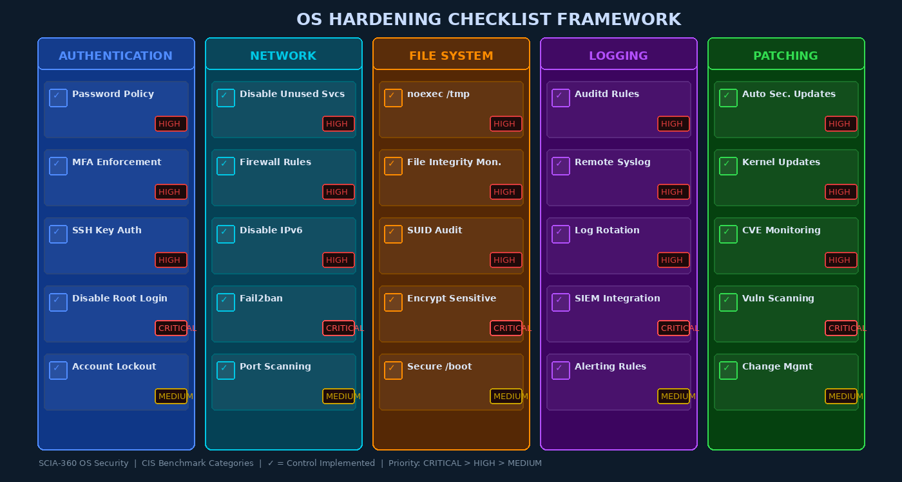

# Week 14: OS Hardening, Benchmarks, and Configuration Management

## Overview

OS hardening is the systematic process of reducing a system's attack surface by eliminating unnecessary features, tightening configurations, and applying defensive controls. The fundamental philosophy is simple: **every unnecessary service, open port, enabled feature, and default credential is a potential vulnerability**. A freshly installed operating system is optimized for compatibility and ease of use, not security. Hardening reverses these defaults in a principled, documented, and repeatable way.

This chapter examines the CIS Benchmark standard — the most widely used OS hardening framework — and provides specific, actionable hardening controls across five categories: authentication, network, filesystem, logging, and patching.

---

## CIS Benchmarks: The Gold Standard

The **Center for Internet Security (CIS)** publishes freely available hardening benchmarks for virtually every major OS: Ubuntu, RHEL/CentOS, Windows Server, macOS, Debian, Fedora, and more. These benchmarks represent community consensus among security professionals, vendors, and government agencies.

### Benchmark Structure

Each CIS Benchmark is organized into two levels:

| Level | Description | Use Case |
|-------|-------------|----------|
| **Level 1** | "Pragmatic" baseline — controls with minimal operational impact, suitable for all environments | General production systems |
| **Level 2** | "Defense in depth" — more restrictive controls that may impact functionality | High-security environments, regulated industries |

Each control is labeled **Scored** (compliance tools can check it automatically) or **Not Scored** (requires manual assessment).

### CIS-CAT Assessment Tool

```bash
# CIS-CAT Lite (free) — assess a system against a benchmark
./CIS-CAT.sh -a -b benchmarks/CIS_Ubuntu_Linux_22.04_LTS_Benchmark_v1.0.0-xccdf.xml \
    -o /tmp/cis-report

# OpenSCAP — open-source alternative
oscap xccdf eval \
    --profile xccdf_org.ssgproject.content_profile_cis_level2_server \
    --results /tmp/oscap-results.xml \
    --report /tmp/oscap-report.html \
    /usr/share/xml/scap/ssg/content/ssg-ubuntu2204-xccdf.xml
```

---

## Category 1: Authentication Hardening



### Password Policy

Configure `/etc/security/pwquality.conf`:

```ini
# /etc/security/pwquality.conf — CIS-compliant password policy
minlen = 14            # minimum 14 characters
dcredit = -1           # at least 1 digit required
ucredit = -1           # at least 1 uppercase required
lcredit = -1           # at least 1 lowercase required
ocredit = -1           # at least 1 special character required
maxrepeat = 3          # no more than 3 consecutive identical chars
maxclassrepeat = 4     # no more than 4 consecutive chars from same class
difok = 4              # minimum 4 chars different from last password
```

Configure password aging in `/etc/login.defs`:

```
PASS_MAX_DAYS   90     # passwords expire after 90 days
PASS_MIN_DAYS   7      # minimum 7 days before password can be changed
PASS_WARN_AGE   14     # warn 14 days before expiry
```

### Account Lockout

Configure `pam_faillock` in `/etc/security/faillock.conf`:

```ini
deny = 5               # lock after 5 consecutive failures
fail_interval = 900    # count failures within 15-minute window
unlock_time = 900      # auto-unlock after 15 minutes (0 = admin manual unlock)
even_deny_root = yes   # apply lockout even to root (controversial but CIS L2)
audit                  # log failed attempts to audit log
```

And in `/etc/pam.d/common-auth` (Debian/Ubuntu):

```
auth required pam_faillock.so preauth silent
auth [default=die] pam_faillock.so authfail
auth sufficient pam_unix.so
auth [default=die] pam_faillock.so authsucc
```

### Disabling Unused Accounts

```bash
# Lock accounts that should not be able to log in
passwd -l mail          # lock the account
usermod -s /sbin/nologin daemon  # set shell to nologin

# Find all accounts with UID >= 1000 (normal users) and verify each is needed
awk -F: '$3 >= 1000 && $3 < 65534 {print $1, $3, $7}' /etc/passwd

# Find accounts with empty passwords (security risk)
awk -F: '$2 == "" {print $1}' /etc/shadow
```

### Sudoers Hardening

```bash
# /etc/sudoers — CIS-compliant configuration
# Never use NOPASSWD in production:
# BAD: deployer ALL=(ALL) NOPASSWD: ALL

# GOOD: require password, restrict to specific commands
deployer ALL=(root) /usr/bin/systemctl restart myapp, /usr/bin/systemctl status myapp

# Require TTY (prevents sudo from scripts/cron abuse)
Defaults requiretty

# Log all sudo commands
Defaults logfile=/var/log/sudo.log
Defaults log_input, log_output

# Limit sudo session timeout
Defaults timestamp_timeout=5   # re-require password after 5 minutes
```

---

## Category 2: Network Hardening

### Disabling Unnecessary Services

```bash
# Identify all listening services
ss -tlnp         # TCP
ss -ulnp         # UDP
# or
netstat -tlnp

# Disable and mask unneeded services (masking prevents accidental re-enable)
systemctl disable --now avahi-daemon cups bluetooth rpcbind
systemctl mask avahi-daemon cups bluetooth rpcbind

# Audit all enabled services
systemctl list-unit-files --state=enabled
```

### Host-Based Firewall with nftables

```bash
# /etc/nftables.conf — CIS-compliant baseline
table inet filter {
    chain input {
        type filter hook input priority 0; policy drop;
        
        ct state invalid drop comment "drop invalid packets"
        ct state {established, related} accept comment "allow tracked connections"
        iif lo accept comment "allow loopback"
        
        ip protocol icmp icmp type { echo-reply, destination-unreachable,
            echo-request, time-exceeded } accept comment "allow necessary ICMP"
        
        tcp dport 22 ct state new \
            limit rate 15/minute accept comment "SSH with rate limiting"
        
        # Log and drop everything else
        log prefix "nftables DROP: " counter drop
    }
    
    chain output {
        type filter hook output priority 0; policy accept;
        # Restrict outbound if needed:
        # tcp dport != { 80, 443, 53, 22 } reject
    }
    
    chain forward {
        type filter hook forward priority 0; policy drop;
    }
}
```

### Kernel Network Hardening (sysctl)

```bash
cat >> /etc/sysctl.d/99-network-hardening.conf << 'EOF'
# SYN flood protection
net.ipv4.tcp_syncookies = 1
net.ipv4.tcp_max_syn_backlog = 2048

# Disable IP forwarding (unless this is a router)
net.ipv4.ip_forward = 0
net.ipv6.conf.all.forwarding = 0

# Disable ICMP redirects (prevent routing manipulation)
net.ipv4.conf.all.accept_redirects = 0
net.ipv4.conf.default.accept_redirects = 0
net.ipv4.conf.all.send_redirects = 0

# Disable source routing
net.ipv4.conf.all.accept_source_route = 0

# Enable reverse path filtering (prevent IP spoofing)
net.ipv4.conf.all.rp_filter = 1
net.ipv4.conf.default.rp_filter = 1

# Disable broadcast ICMP (smurf attack prevention)
net.ipv4.icmp_echo_ignore_broadcasts = 1

# Log martian packets (packets with impossible source addresses)
net.ipv4.conf.all.log_martians = 1
EOF
sysctl --system
```

---

## Category 3: Filesystem Hardening

### Mount Options

```bash
# /etc/fstab — add noexec, nosuid, nodev to appropriate partitions
# /tmp — no executable files, no setuid programs, no device files
tmpfs  /tmp  tmpfs  defaults,noexec,nosuid,nodev,size=2G  0  0

# /var — no executable or setuid (data partition)
/dev/sda3  /var  ext4  defaults,nosuid,nodev  0  2

# /home — users should not be able to run setuid or device files
/dev/sda4  /home  ext4  defaults,noexec,nosuid,nodev  0  2

# /proc — hardening options
proc  /proc  proc  defaults,hidepid=2,gid=proc  0  0
```

The `hidepid=2` option on `/proc` prevents non-root users from seeing other users' process information.

### AIDE File Integrity Monitoring

```bash
# /etc/aide/aide.conf — configure what to monitor
/etc  CONTENT_EX    # monitor /etc with extended attributes
/bin  CONTENT_EX    # system binaries
/sbin CONTENT_EX
/lib  CONTENT_EX
/usr/bin CONTENT_EX
/boot CONTENT_EX    # bootloader and kernel

# Exclusions (files that legitimately change):
!/var/log/.*
!/etc/mtab
!/etc/adjtime

# Initialize baseline after clean install:
aide --init
cp /var/lib/aide/aide.db.new /var/lib/aide/aide.db

# Daily check via cron:
# 0 3 * * * root /usr/bin/aide --check | /usr/bin/mail -s "AIDE $(hostname)" soc@corp.com
```

### SUID/SGID Audit

```bash
# Find all SUID binaries (run as file owner regardless of caller UID)
find / -perm -4000 -type f 2>/dev/null | sort

# Find all SGID binaries
find / -perm -2000 -type f 2>/dev/null | sort

# Remove SUID from binaries that don't need it (example: mount)
chmod u-s /usr/bin/mount    # if always run by root in your environment

# Review and document all SUID/SGID binaries — any unrecognized entry is suspicious
```

---

## Category 4: Logging and Monitoring

### auditd CIS Compliance Rules

```bash
# /etc/audit/rules.d/99-cis.rules
# Delete all existing rules
-D
# Set buffer size
-b 8192
# Actions on audit failure (2=kernel panic — use 1 for log, 2 for paranoid)
-f 1

# Time changes
-a always,exit -F arch=b64 -S adjtimex -S settimeofday -k time-change
-a always,exit -F arch=b64 -S clock_settime -k time-change
-w /etc/localtime -p wa -k time-change

# User/group modifications
-w /etc/group -p wa -k identity
-w /etc/passwd -p wa -k identity
-w /etc/gshadow -p wa -k identity
-w /etc/shadow -p wa -k identity
-w /etc/security/opasswd -p wa -k identity

# Network configuration changes
-a always,exit -F arch=b64 -S sethostname -S setdomainname -k system-locale
-w /etc/hosts -p wa -k system-locale

# Login/logout events
-w /var/log/wtmp -p wa -k logins
-w /var/log/lastlog -p wa -k logins
-w /var/run/faillock -p wa -k logins

# Privileged command execution (all setuid/setgid programs)
-a always,exit -F path=/usr/bin/sudo -F perm=x -F auid>=1000 -F auid!=4294967295 -k priv_cmd
-a always,exit -F path=/usr/bin/su -F perm=x -F auid>=1000 -F auid!=4294967295 -k priv_cmd

# Kernel module loading
-w /sbin/insmod -p x -k modules
-w /sbin/rmmod -p x -k modules
-w /sbin/modprobe -p x -k modules
-a always,exit -F arch=b64 -S init_module -S delete_module -k modules

# Make rules immutable (requires reboot to change — highest security)
-e 2
```

### Remote Syslog

```bash
# rsyslog — forward to remote SIEM
# /etc/rsyslog.d/50-remote.conf
*.* action(type="omfwd" target="siem.corp.com" port="514" protocol="tcp"
    action.resumeRetryCount="100"
    queue.type="linkedList" queue.size="20000"
    queue.filename="fwdRule1" queue.saveonshutdown="on")
```

---

## Category 5: Windows Server Hardening

PowerShell hardening commands for Windows Server:

```powershell
# Disable SMBv1 (EternalBlue/WannaCry vector)
Set-SmbServerConfiguration -EnableSMB1Protocol $false -Force
Disable-WindowsOptionalFeature -Online -FeatureName SMB1Protocol

# Enable Windows Defender Application Control (WDAC)
# Apply Microsoft Security Baseline via LGPO.exe
.\LGPO.exe /g "Windows Server 2022 Security Baseline\GPOs\"

# PowerShell Constrained Language Mode (prevents most PS-based attacks)
# Set via AppLocker or WDAC policy — CLM activates automatically

# Disable unnecessary features
Disable-WindowsOptionalFeature -Online -FeatureName Telnet-Client
Disable-WindowsOptionalFeature -Online -FeatureName TFTP
Remove-WindowsFeature FS-SMB1

# Audit LAPS (Local Administrator Password Solution) deployment
Get-ADComputer -Filter * -Properties ms-Mcs-AdmPwd | 
    Where-Object {$_."ms-Mcs-AdmPwd" -ne $null} | Select Name

# Windows Firewall — default deny inbound
netsh advfirewall set allprofiles firewallpolicy blockinbound,allowoutbound

# Disable autorun/autoplay
Set-ItemProperty -Path "HKLM:\SOFTWARE\Microsoft\Windows\CurrentVersion\Policies\Explorer" `
    -Name "NoDriveTypeAutoRun" -Value 255
```

---

## Automated Hardening with Ansible

```yaml
# ansible/hardening.yml — dev-sec.io os-hardening role
---
- hosts: all
  become: yes
  vars:
    os_auth_pw_max_age: 90
    os_auth_pw_min_age: 7
    os_auth_retries: 5
    os_security_kernel_enable_sysrq: false
    os_security_users_allow: ['vagrant']
    network_ipv6_enable: false
  roles:
    - role: dev-sec.os-hardening
    - role: dev-sec.ssh-hardening
```

Run the assessment:
```bash
# OpenSCAP — generate HTML compliance report
oscap xccdf eval \
    --profile cis_level1_server \
    --results results.xml \
    --report report.html \
    ssg-rhel9-xccdf.xml

# View score summary
oscap info results.xml | grep -A5 "Score:"
```

---

## Configuration Drift Detection

**Configuration drift** occurs when systems diverge from their hardened baseline over time due to manual changes, software updates, or ad-hoc fixes. Detection strategies:

1. **AIDE** — detects filesystem changes daily
2. **Ansible** — `--check` mode shows what would change (shows drift)
3. **Puppet/Chef** — continuously enforce desired state, report deviations
4. **AWS Config / Azure Policy** — cloud-native compliance monitoring
5. **Tripwire Enterprise** — commercial SIEM-integrated integrity monitoring

```bash
# Use Ansible in check mode to detect drift
ansible-playbook hardening.yml --check --diff | grep "changed"
```

---

## Key Terms

| Term | Definition |
|------|-----------|
| **CIS Benchmark** | Center for Internet Security hardening guide; community-consensus security baseline |
| **CIS Level 1** | Pragmatic controls with minimal operational impact |
| **CIS Level 2** | Defense-in-depth controls; higher security, possible functionality impact |
| **CIS-CAT** | CIS Configuration Assessment Tool; automated benchmark scanning |
| **OpenSCAP** | Open-source SCAP implementation for automated compliance assessment |
| **pam_faillock** | PAM module enforcing account lockout after repeated failed logins |
| **pam_pwquality** | PAM module enforcing password complexity requirements |
| **noexec** | Mount option preventing execution of binaries from a partition |
| **nosuid** | Mount option preventing setuid bit from taking effect on a partition |
| **AIDE** | Advanced Intrusion Detection Environment; file integrity baseline tool |
| **Configuration drift** | Uncontrolled divergence of a system from its security baseline |
| **hidepid=2** | /proc mount option hiding other users' process directories |
| **auditd** | Linux kernel audit daemon; central to CIS logging requirements |
| **sudoers** | Configuration file controlling sudo privilege delegation |
| **NOPASSWD** | Dangerous sudo option allowing privilege escalation without authentication |
| **Ansible** | Infrastructure-as-code tool; enables idempotent hardening automation |
| **SMBv1** | Legacy Microsoft file sharing protocol; EternalBlue/WannaCry vulnerability |
| **LAPS** | Local Administrator Password Solution; unique passwords per Windows machine |
| **sysctl** | Interface for reading/writing Linux kernel parameters at runtime |

---

## Review Questions

1. **Conceptual:** Explain the difference between CIS Benchmark Level 1 and Level 2. In what business context might you apply Level 2 despite potential functionality tradeoffs?
2. **Hands-on Lab:** Run `oscap xccdf eval` against a RHEL/CentOS or Ubuntu system using the CIS profile. Document the five most critical failing controls and the remediation commands for each.
3. **Analytical:** A system administrator sets `Defaults NOPASSWD: ALL` in sudoers for a service account. Describe the specific attack scenarios this enables and how to remediate it.
4. **Conceptual:** Explain why adding `noexec` to the `/tmp` mount prevents certain attack scenarios. What class of attacks does it mitigate, and what attack technique can bypass it?
5. **Hands-on Lab:** Use `find` to enumerate all SUID binaries on a Linux system. Research each one and document: (a) its purpose, (b) whether its SUID bit is required, and (c) whether it has any known CVEs.
6. **Conceptual:** What is configuration drift, and why is it a security problem even if a system was properly hardened at deployment? What tools can detect and remediate drift?
7. **Analytical:** Design a complete auditd ruleset for a PCI-DSS compliant Linux system. Which events must be logged under PCI-DSS requirement 10?
8. **Hands-on Lab:** Write an Ansible playbook that enforces three CIS Level 1 controls: (a) `/tmp` mounted with noexec/nosuid/nodev, (b) `PermitRootLogin no` in sshd_config, and (c) auditd enabled and running.
9. **Conceptual:** Explain why Windows SMBv1 is still in the hardening checklists in 2024. Why hasn't it been eliminated from the threat surface? What organizational challenges persist?
10. **Analytical:** Compare manual hardening, Ansible automation, and commercial tools (CIS-CAT Pro, Tenable.io). For each approach, identify scenarios where it is the appropriate choice.

---

## Further Reading

1. CIS Controls v8 — cisecurity.org/controls — framework connecting individual hardening controls to larger security program objectives
2. DISA STIGs (Security Technical Implementation Guides) — public.cyber.mil/stigs — US DoD hardening requirements, often more stringent than CIS
3. "Ansible for DevOps" — Jeff Geerling (LeanPub) — practical automation for hardening at scale
4. Microsoft Security Compliance Toolkit — microsoft.com/en-us/download — Windows security baselines and LGPO tools
5. NIST SP 800-123: "Guide to General Server Security" — nvlpubs.nist.gov — foundational server hardening methodology
