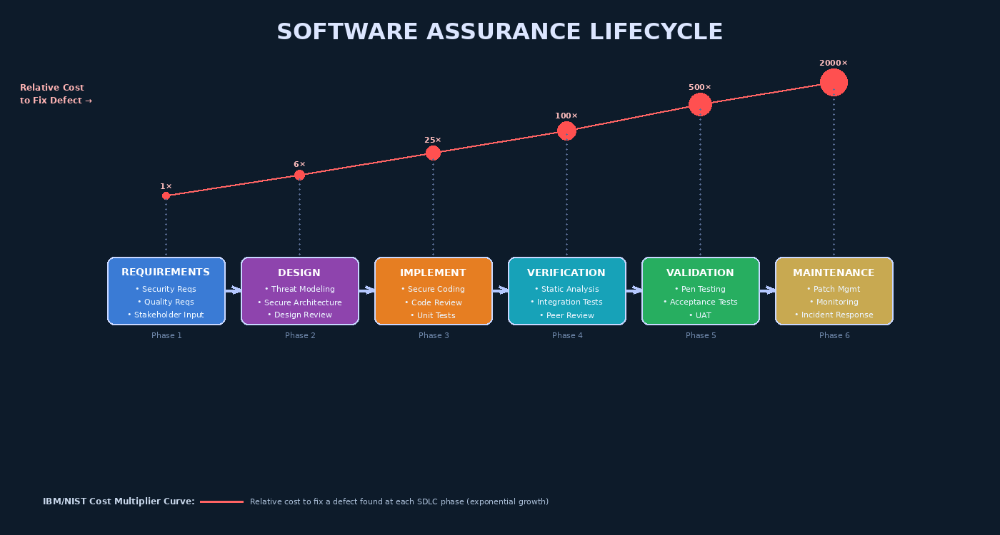

# Chapter 1 — Introduction to Software Assurance and Quality



## 1.1 What Is Software Assurance?

Software assurance is the discipline that provides justified confidence that software functions as intended, is free from vulnerabilities that could be intentionally or unintentionally exploited, and will not cause harm to the people, infrastructure, or organizations that depend on it. The term encompasses both **software quality** — the degree to which a software product meets its specified functional and non-functional requirements — and **software security assurance** — confidence that the software is resistant to malicious exploitation.

These two concerns are often treated as separate engineering disciplines, but in practice they are deeply intertwined. A system that crashes under unexpected input has both a quality defect (reliability failure) and potentially a security defect (denial of service or memory corruption). Understanding the overlap is central to this course.

> **Key Distinction:** Software *quality* asks "does the software do what it is supposed to do?" Software *security assurance* asks "can an adversary cause the software to do something it is *not* supposed to do?"

### 1.1.1 Defining Core Terminology

Before proceeding, precision in language is critical. The software engineering community uses several terms that are frequently conflated:

| Term | IEEE Definition | Example |
|------|----------------|---------|
| **Error** | A human mistake that causes a defect | Developer misunderstands an integer range |
| **Defect / Bug** | A flaw introduced into software artifacts | Off-by-one in a loop boundary condition |
| **Fault** | The manifestation of a defect in the code | `buffer[n]` accessed when valid indices end at `buffer[n-1]` |
| **Failure** | Observable incorrect behavior at runtime | Program writes beyond array bounds, crashes or corrupts data |
| **Vulnerability** | A defect exploitable by an adversary | Buffer overflow reachable via user-controlled input → remote code execution |

Understanding this hierarchy is essential because different assurance techniques target different levels. Static analysis catches faults before they become failures; penetration testing exploits vulnerabilities; unit testing observes failures in controlled conditions.

---

## 1.2 Why Software Assurance Matters — The Cost of Defects

### 1.2.1 The Cost Multiplier Curve

The most cited justification for early investment in software assurance comes from landmark studies by IBM and later the National Institute of Standards and Technology (NIST). These studies measured the **relative cost to fix a defect** depending on when it was discovered in the software development lifecycle:

| Phase Defect Discovered | Relative Cost to Fix |
|------------------------|---------------------|
| Requirements | 1× |
| Design | 6× |
| Coding / Implementation | 25× |
| Testing (internal) | 100× |
| Post-release / Production | 10,000× |

This exponential relationship exists because defects compound. A security requirement missed at requirements elicitation propagates into an insecure architecture, which is baked into hundreds of thousands of lines of code, documented in deployment guides, and relied upon by downstream systems. Retrofitting security into a live production system requires coordinated patches, regression testing, customer notification, and in regulated industries, formal re-certification.

### 1.2.2 The Scale of Software Vulnerabilities

The National Vulnerability Database (NVD) catalogues Common Vulnerabilities and Exposures (CVEs). As of recent years, the NVD receives and publishes approximately **25,000–30,000 new CVEs per year** — roughly one new publicly disclosed vulnerability every 20 minutes. The top recurring vulnerability categories (per MITRE CWE Top 25 and OWASP Top 10) have remained surprisingly stable for over a decade: injection flaws, broken authentication, insecure deserialization, and misconfigurations.

### 1.2.3 High-Profile Software Failures

Three canonical examples illustrate the real-world consequences of defects that escaped the assurance process:

**Ariane 5 Flight 501 (1996):** The European Space Agency's Ariane 5 rocket exploded 37 seconds after launch due to an unhandled integer overflow exception. A 64-bit floating point value representing horizontal velocity was converted to a 16-bit signed integer. The value exceeded the representable range, threw an operand error, and the backup Inertial Reference System (which ran the same software) also failed. Estimated loss: $500 million. Root cause: software reused from Ariane 4 without re-validating assumptions about the operational envelope.

**Therac-25 Radiation Therapy Machine (1985–1987):** A race condition in concurrent software controlling a medical linear accelerator allowed the high-power electron beam to fire without the physical beam-deflector in place. At least six patients received massive radiation overdoses; three died. Root cause: removal of hardware safety interlocks on the assumption that software would be reliable, combined with inadequate concurrency testing.

**Equifax Data Breach (2017):** Personal financial data of 147 million Americans was exposed because Equifax failed to apply a security patch for Apache Struts (CVE-2017-5638) — a critical remote code execution vulnerability — for approximately two months after it was publicly disclosed. Root cause: absent software composition analysis, poor patch management processes, and no detection controls.

These examples span embedded systems, safety-critical systems, and enterprise web applications — making clear that software assurance failures are not confined to any single domain.

---

## 1.3 The Software Assurance Lifecycle

Effective assurance is not a phase — it is a set of activities woven throughout the entire Software Development Lifecycle (SDLC). The diagram at the top of this chapter illustrates the six-stage assurance pipeline, with the defect-cost curve showing why earlier stages yield exponentially better return on investment.

### 1.3.1 Assurance Activities by SDLC Phase

**Requirements Phase:** Elicit security requirements alongside functional requirements. Perform abuse-case analysis. Define measurable acceptance criteria for security properties. Identify applicable compliance mandates (HIPAA, PCI DSS, GDPR, FedRAMP).

**Design Phase:** Conduct threat modeling (STRIDE, PASTA, Attack Trees). Apply security architecture principles. Document trust boundaries. Perform architecture security reviews.

**Implementation Phase:** Enforce secure coding standards (CERT, CWE/SANS Top 25 mitigations). Conduct peer code reviews with security checklists. Integrate static application security testing (SAST) in pre-commit hooks.

**Verification Phase:** Run automated SAST tools (SonarQube, CodeQL, Semgrep). Execute unit and integration tests. Perform software composition analysis (SCA) to detect vulnerable dependencies.

**Validation Phase:** Conduct dynamic application security testing (DAST). Execute penetration testing by trained red teams. Run acceptance testing against security requirements.

**Maintenance Phase:** Monitor for new CVEs affecting deployed libraries (Dependabot, Snyk). Apply patches promptly. Conduct post-incident analysis. Update threat models as architecture evolves.

---

## 1.4 Software Assurance Frameworks

### 1.4.1 NIST Secure Software Development Framework (SSDF)

The NIST SSDF (NIST SP 800-218) provides a set of high-level software security practices grouped into four categories: **Prepare the Organization** (establish policies, train people, instrument tools), **Protect the Software** (protect source code, development environments, and tools), **Produce Well-Secured Software** (design securely, test, fix vulnerabilities), and **Respond to Vulnerabilities** (identify and remediate post-deployment vulnerabilities). The SSDF has become a contractual requirement for U.S. federal software vendors under Executive Order 14028.

### 1.4.2 OWASP Software Assurance Maturity Model (SAMM)

OWASP SAMM provides a maturity framework against which organizations can measure their software assurance programs across five business functions: **Governance**, **Design**, **Implementation**, **Verification**, and **Operations**. Each function contains two security practices, each measured on three maturity levels. SAMM's strength is that it is measurable, incremental, and non-prescriptive about specific tools.

### 1.4.3 SAFECode Fundamental Practices

The Software Assurance Forum for Excellence in Code (SAFECode) publishes industry consensus practices including threat modeling, secure design reviews, static analysis, fuzz testing, and vulnerability response processes. SAFECode practices serve as a bridge between high-level frameworks (SSDF, SAMM) and implementation-level tooling.

### 1.4.4 BSA Framework for Secure Software

The BSA Framework aligns closely with NIST Cybersecurity Framework principles applied to the software supply chain, emphasizing secure development environments, third-party component vetting, and vulnerability disclosure programs.

---

## 1.5 Testing, Verification, and Validation

These three terms appear throughout software assurance literature and are frequently confused:

**Testing** is the process of executing a program with the intent of finding failures. Testing is always dynamic — it requires running the software.

**Verification** answers Barry Boehm's question: *"Are we building the product right?"* It checks conformance to specifications and standards. Verification activities include code reviews, inspections, static analysis, and formal proofs — most of which do not require executing the software.

**Validation** answers the complementary question: *"Are we building the right product?"* It checks that the software satisfies stakeholder needs. Validation activities include acceptance testing, user testing, and penetration testing against real-world attack scenarios.

```
Verification: Does the implementation match the specification?
Validation:   Does the specification match stakeholder needs?
Testing:      Does the running system exhibit the correct behavior?
```

A common pitfall is achieving high verification metrics (e.g., 95% code coverage) while failing validation (the requirements themselves were wrong or incomplete). In security, this manifests as software that correctly implements a flawed authentication design.

---

## 1.6 The Assurance Argument

In safety-critical and high-assurance domains (aviation, medical devices, defense), it is not sufficient to say "we ran tests." Regulators and certifying bodies require a **structured assurance argument** — a systematic case that the software is trustworthy. The Goal Structuring Notation (GSN) and Claims/Argument/Evidence (CAE) patterns provide formal methods for constructing such arguments.

An assurance argument has three components:
- **Claim:** A proposition about the system's safety or security (e.g., "The authentication module prevents unauthorized access")
- **Evidence:** Artifacts supporting the claim (test results, code review reports, threat model outputs, formal proofs)
- **Warrant:** The reasoning that links the evidence to the claim (e.g., "Because the penetration test attempted all OWASP authentication bypass techniques and all failed, the claim is supported")

---

## 1.7 Roles in a Software Assurance Program

| Role | Primary Responsibilities |
|------|--------------------------|
| **QA Engineer** | Designing and executing test plans; defect tracking; process audits |
| **Security Engineer** | Threat modeling; security architecture review; security requirements; red team coordination |
| **Test Engineer** | Writing and automating test cases; maintaining test frameworks; CI/CD integration |
| **V&V Specialist** | Formal verification; requirements traceability; certification support |
| **Security Champion** | Developer embedded in a scrum team; code review; security awareness training |

Modern DevSecOps blurs these boundaries by distributing security responsibility across the entire development team, but specialist roles remain essential for complex threat modeling, formal verification, and penetration testing.

---

## Key Terms

1. **Software Assurance** — Justified confidence that software functions as intended and is free from exploitable vulnerabilities
2. **Software Quality** — Degree to which software satisfies functional and non-functional requirements
3. **Defect** — A flaw introduced into software artifacts through human error
4. **Fault** — The representation of a defect within the code or system
5. **Failure** — Observable incorrect behavior resulting from a fault being triggered
6. **Vulnerability** — A defect that can be intentionally exploited by an adversary
7. **SDLC** — Software Development Lifecycle; the structured process from requirements to retirement
8. **Verification** — Confirming that software is built according to specifications
9. **Validation** — Confirming that software meets actual stakeholder needs
10. **NIST SSDF** — Secure Software Development Framework; NIST SP 800-218
11. **OWASP SAMM** — Software Assurance Maturity Model; five business function framework
12. **CVE** — Common Vulnerabilities and Exposures; NVD catalog identifier
13. **CWE** — Common Weakness Enumeration; catalog of software weakness types
14. **Assurance Argument** — Structured case for trustworthiness using claims, evidence, and warrants
15. **Cost Multiplier Curve** — Exponential relationship between defect discovery phase and remediation cost
16. **Defense in Depth** — Layered security controls so no single failure is catastrophic
17. **SAFECode** — Software Assurance Forum for Excellence in Code; industry consensus practices
18. **Race Condition** — Defect arising when program behavior depends on the timing of concurrent events
19. **Integer Overflow** — Arithmetic error when a value exceeds the maximum representable integer
20. **Shift Left** — Philosophy of moving security and quality activities earlier in the SDLC

---

## Review Questions

1. Explain the difference between a defect, a fault, a failure, and a vulnerability. Give an original example of each and describe how they relate to one another in the context of a web application login feature.

2. Using the IBM/NIST cost multiplier data, calculate the estimated cost difference between catching an authentication design flaw in the requirements phase versus discovering the same flaw after production deployment. What assumptions must you make in this calculation?

3. Describe the Therac-25 incident in terms of the defect taxonomy (error → defect → fault → failure). What assurance activities, if they had been applied, would most likely have prevented the fatalities?

4. Compare and contrast verification and validation. Give one concrete example of each for a mobile banking application. Why is it possible to pass verification but fail validation?

5. What are the four categories of the NIST SSDF, and how do they map to the six phases of the software assurance lifecycle depicted in this chapter's diagram?

6. A software development manager argues: "We have 95% automated test coverage. We don't need separate security review." Construct a detailed counter-argument drawing on at least three concepts from this chapter.

7. Describe the three components of a structured assurance argument (claim, evidence, warrant). Write a short assurance argument for the claim: "The system's session management implementation prevents session hijacking."

8. Why has the Equifax breach become a canonical example of supply-chain risk in software assurance? What specific SDLC phase and assurance activity would have directly prevented the breach?

9. Compare OWASP SAMM and the NIST SSDF. For each framework, identify: (a) its primary audience, (b) its key structural units, and (c) one strength and one limitation.

10. Explain the concept of "shift left" in the context of software assurance. What organizational, tooling, and cultural changes are required to successfully shift security activities left?

---

## Further Reading

1. **McGraw, G.** (2006). *Software Security: Building Security In*. Addison-Wesley. — The foundational text establishing software security as an engineering discipline, introducing touchpoints and risk-based security testing.

2. **NIST SP 800-218** (2022). *Secure Software Development Framework (SSDF) Version 1.1*. National Institute of Standards and Technology. Available at: https://csrc.nist.gov/publications/detail/sp/800-218/final

3. **Leveson, N.** (1995). *Safeware: System Safety and Computers*. Addison-Wesley. — Deep analysis of Therac-25 and other safety-critical failures; essential for understanding how software defects become catastrophic.

4. **Howard, M. & Lipner, S.** (2006). *The Security Development Lifecycle*. Microsoft Press. — Microsoft's SDL methodology; introduces the cost-of-defects argument and secure development practices at industrial scale.

5. **OWASP SAMM Project** (2020). *Software Assurance Maturity Model v2.0*. Available at: https://owaspsamm.org — The definitive reference for measuring and improving organizational software assurance programs.
