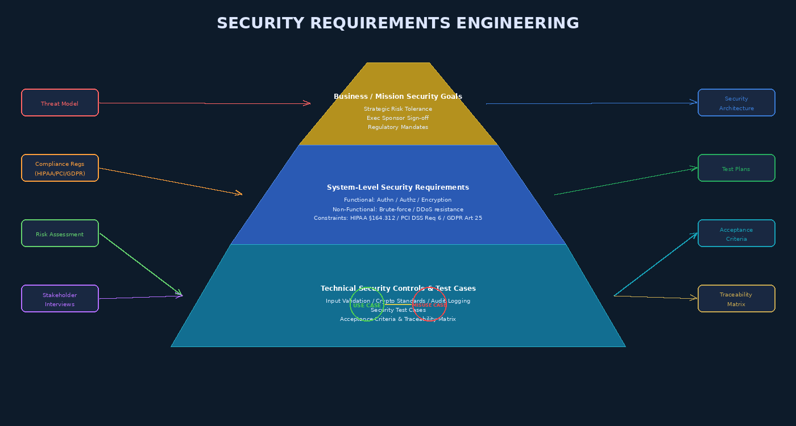

# Chapter 2 — Security Requirements and Specifications



## 2.1 The Most Neglected Phase — and the Most Expensive to Ignore

Security requirements are consistently identified by industry surveys and post-breach analyses as the most neglected phase of software development. A 2020 Veracode study found that over 76% of applications contain at least one security flaw — and the root cause is nearly always traceable to a missing or incorrect requirement, not a coding error per se. When developers build what they were asked to build, and what they were asked to build was insecure by specification, no amount of code review or penetration testing can fully compensate.

The perverse economics reinforce the problem. Security requirements are abstract, non-revenue-generating, and invisible when done correctly — making them easy targets for scope reduction under schedule pressure. Yet the IBM/NIST cost multiplier data from Chapter 1 makes the calculation unambiguous: a security requirement that costs $100 to specify correctly in Week 1 costs $10,000–$1,000,000 to retrofit after production deployment.

This chapter develops a rigorous methodology for eliciting, specifying, organizing, and validating security requirements so they can serve as the foundation for all downstream assurance activities.

---

## 2.2 Taxonomy of Security Requirements

Security requirements fall into three fundamental categories:

### 2.2.1 Functional Security Requirements

Functional security requirements specify **what the system must actively do** to enforce security. They describe concrete behaviors:

- "The system shall authenticate all API requests using OAuth 2.0 Bearer tokens validated against the authorization server"
- "The system shall enforce role-based access control, denying users access to resources outside their assigned roles"
- "The system shall encrypt all Personally Identifiable Information (PII) at rest using AES-256-GCM"
- "The system shall generate an immutable audit log entry for every authentication event, recording timestamp, user identifier, source IP, and outcome"

These requirements are testable: given a specific input or action, the system either performs the security function or it does not.

### 2.2.2 Non-Functional Security Requirements

Non-functional security requirements specify **how secure the system must be** — measurable properties of security behavior under adversarial conditions:

- "The system shall rate-limit login attempts to five per IP per minute, returning HTTP 429 after the threshold is exceeded"
- "The system shall maintain 99.5% availability under a volumetric DDoS attack of up to 10 Gbps, as validated by load testing"
- "The system shall remain resistant to SQL injection attacks as demonstrated by successful completion of OWASP ZAP automated scanning with zero High-severity findings"
- "Session tokens shall have a minimum entropy of 128 bits and shall expire after 30 minutes of inactivity"

### 2.2.3 Security Constraints

Security constraints are **externally imposed requirements** arising from regulatory mandates, contractual obligations, or organizational policy:

| Regulation | Relevant Article / Section | Security Requirement Imposed |
|-----------|---------------------------|------------------------------|
| HIPAA | §164.312(a)(1) | Implement access controls for ePHI |
| HIPAA | §164.312(b) | Audit controls for ePHI access |
| PCI DSS | Requirement 6 | Develop and maintain secure systems; patch critical vulnerabilities |
| PCI DSS | Requirement 8 | Unique user IDs and strong authentication for cardholder data access |
| GDPR | Article 25 | Data protection by design and by default |
| GDPR | Article 32 | Appropriate technical measures including encryption and pseudonymization |
| NIST RMF | SP 800-53 AC-2 | Account management controls |

Security constraints are non-negotiable. They define the compliance floor, not the security ceiling.

---

## 2.3 Eliciting Security Requirements

Requirements elicitation for security demands a different mindset than functional requirements elicitation. Stakeholders rarely walk into a meeting saying "I need protection against SSRF attacks." Security elicitation techniques must systematically surface unstated, non-obvious security needs.

### 2.3.1 Stakeholder Interviews with Adversarial Framing

Traditional requirements interviews ask "what should the system do?" Security-focused interviews add: "what would a malicious actor want to do to this system, and what damage could they cause?" Interviewees often include:
- Business owners who understand the value of assets being protected
- Legal and compliance officers who know the regulatory obligations
- Operations teams who understand existing attack patterns in production
- End users who may have experienced social engineering attempts

### 2.3.2 Regulatory and Standards Analysis

For any system operating in a regulated industry, a compliance gap analysis against applicable standards (HIPAA, PCI DSS, GDPR, FedRAMP, SOX, FISMA) should produce a specific set of non-negotiable security requirements. Each regulatory control should map to one or more security requirements in the SRS (Software Requirements Specification).

### 2.3.3 Threat Intelligence Analysis

Historical vulnerability data for similar systems (prior CVEs in comparable platforms, OWASP Top 10 for the relevant application type, vendor security advisories) provides an empirical basis for anticipating attacks. If every similar application in your industry has suffered SQL injection, your requirements should explicitly address it.

### 2.3.4 Attack Surface Analysis

Howard and Lipner's attack surface methodology enumerates all system **entry points** (HTTP endpoints, APIs, file upload handlers, database connections, inter-service calls), **assets** (PII, authentication credentials, financial data, cryptographic keys), **trust levels** (anonymous users, authenticated users, admin users, service accounts), and **exit points** (logs, reports, API responses). Every entry point that accepts untrusted data is a source of security requirements. Every asset that must be protected generates confidentiality and integrity requirements.

---

## 2.4 Misuse Cases and Abuse Cases

Use cases document how legitimate actors interact with a system to achieve goals. **Misuse cases** (also called abuse cases) document how malicious actors interact with a system to cause harm. They are the adversarial complement to use cases and are essential for deriving security requirements systematically.

### 2.4.1 Misuse Case Notation

In UML, misuse cases are typically drawn as ovals with a threat actor (stick figure labeled with role: "External Attacker," "Malicious Insider," "Script Kiddie"). The association between attacker and misuse case is labeled `<<threatens>>`, while the mitigation relationship between a use case (security control) and misuse case is `<<mitigates>>`.

### 2.4.2 Writing a Formal Abuse Case

```
Abuse Case ID:   AC-004
Title:           Bypass Authentication via SQL Injection
Actor:           External Attacker (unauthenticated)
Asset at Risk:   User account database, session management
Preconditions:   Application login form is accessible; backend uses
                 string-concatenated SQL queries
Trigger:         Attacker submits ' OR '1'='1 as username
Main Flow:
  1. Attacker navigates to /login
  2. Attacker submits username: admin'-- and any password
  3. Application constructs:
     SELECT * FROM users WHERE username='admin'--' AND password='x'
     The comment (--) causes password check to be ignored
  4. Application authenticates attacker as admin user
  5. Attacker gains full admin access
Success (for attacker): Unauthorized access to admin account
Derived Security Requirement: SR-012 — All database queries
  shall use parameterized statements or stored procedures;
  string concatenation with user input shall be prohibited
Mitigation Use Case: UC-Auth-Parameterized-Queries
```

### 2.4.3 Security User Stories in Agile

In Agile teams, security requirements should be expressed as stories with testable acceptance criteria. Two formats are in common use:

**Attacker-perspective story:**
> "As an external attacker, I want to inject SQL into the login form so that I can bypass authentication — *this must not succeed.*"

**Defender-perspective story:**
> "As a security engineer, I want all SQL queries to use parameterized inputs so that SQL injection attacks against the login form are prevented."
> **Acceptance Criteria:**
> - Bandit/FindSecBugs reports zero SQL injection findings in authentication module
> - OWASP ZAP active scan reports zero SQLi findings against `/api/auth/login`
> - Manual test with SQLMap produces no authentication bypass

---

## 2.5 Requirements Quality Attributes

A security requirement that cannot be tested provides no assurance value. All security requirements must satisfy the following quality attributes:

| Attribute | Description | Bad Example | Good Example |
|-----------|-------------|-------------|--------------|
| **Completeness** | All security needs captured | "Passwords shall be stored securely" | "Passwords shall be hashed using bcrypt with cost factor ≥ 12" |
| **Consistency** | No contradictions | Req A: no PII in logs; Req B: log full request for debugging | Explicit rule: log request metadata excluding PII fields |
| **Unambiguity** | One and only one interpretation | "Strong authentication required" | "Multi-factor authentication required: TOTP or FIDO2 hardware key" |
| **Testability** | Verifiable by defined test procedure | "System shall be secure" | "System shall pass OWASP ASVS Level 2 verification" |
| **Traceability** | Linked to source (threat, regulation, misuse case) | Freestanding requirement | SR-015 ← AC-007 ← STRIDE:Spoofing ← HIPAA §164.312(d) |

The single most common security requirements defect is **vagueness**. Requirements like "the system shall be secure," "data shall be protected," and "strong encryption shall be used" fail every quality attribute above. They are untestable, unambiguous, and unenforceable.

---

## 2.6 Requirements Traceability Matrix

A **Requirements Traceability Matrix (RTM)** links each security requirement to: the source that motivated it (threat, regulation, misuse case), the design decision that addresses it, the implementation artifact that realizes it, and the test case that verifies it.

```
| Req ID | Requirement Summary        | Source        | Design Element         | Test Case  | Status  |
|--------|----------------------------|---------------|------------------------|------------|---------|
| SR-001 | Parameterized SQL queries  | AC-004/SQLi   | DB Layer Architecture  | TC-DB-001  | Passed  |
| SR-002 | bcrypt password hashing    | NIST SP800-63 | AuthService.hashPwd()  | TC-AUTH-003| Passed  |
| SR-003 | MFA for admin accounts     | HIPAA §164.312| AdminAuth Module       | TC-MFA-001 | Open    |
| SR-004 | Session timeout 30min      | PCI DSS 8.1.8 | SessionManager         | TC-SESS-002| Passed  |
| SR-005 | AES-256 for PII at rest    | GDPR Art.32   | EncryptionService      | TC-ENC-001 | Passed  |
```

The RTM is a living document, maintained throughout the project lifecycle, and serves as the primary evidence artifact for compliance audits.

---

## 2.7 STRIDE Applied at the Requirements Level

STRIDE (detailed fully in Chapter 3) can be applied proactively at the requirements phase to generate security requirements *before* design begins. For each system asset or interaction identified in the attack surface analysis, ask:

- **Spoofing:** Can actors falsely claim identities? → Requirement: Authentication controls
- **Tampering:** Can data be modified in transit or at rest? → Requirement: Integrity controls (MACs, signatures, parameterized queries)
- **Repudiation:** Can actors deny performing actions? → Requirement: Non-repudiation controls (audit logs, digital signatures)
- **Information Disclosure:** Can unauthorized parties read data? → Requirement: Confidentiality controls (encryption, access control)
- **Denial of Service:** Can the system be made unavailable? → Requirement: Availability controls (rate limiting, input size limits)
- **Elevation of Privilege:** Can actors gain unauthorized permissions? → Requirement: Authorization controls (RBAC, privilege separation)

---

## 2.8 Domain-Specific Security Requirements Standards

### OWASP Application Security Verification Standard (ASVS)

OWASP ASVS provides three levels of security verification requirements for web applications:

- **Level 1:** Minimum security assurance; suitable for low-risk applications; verifiable by automated scanning
- **Level 2:** Standard for most applications handling sensitive data; requires both automated and manual testing
- **Level 3:** Highest level; for critical infrastructure, medical devices, financial systems; requires formal verification and penetration testing

ASVS provides over 280 specific, testable security requirements organized into categories: architecture, authentication, session management, access control, validation, cryptography, error handling, data protection, communications, and more.

### OWASP Mobile Application Security Verification Standard (MASVS)

MASVS applies equivalent rigor to mobile applications (iOS and Android), addressing certificate pinning, local data storage security, inter-process communication security, and anti-tampering controls.

### IoT Security Requirements

IoT systems face unique requirements: limited computational resources, physical access risks, firmware update security, default credential elimination, secure boot, and hardware root of trust requirements. NIST SP 800-213 (IoT Device Cybersecurity Guidance for the Federal Government) provides a baseline.

---

## Key Terms

1. **Functional Security Requirement** — Specifies a concrete security action the system must perform
2. **Non-Functional Security Requirement** — Specifies a measurable security property under adversarial conditions
3. **Security Constraint** — Externally imposed requirement from regulation, contract, or policy
4. **Misuse Case** — Documents how a malicious actor attempts to harm a system; adversarial complement to use case
5. **Abuse Case** — Formal specification of an attack scenario used to derive security requirements
6. **Attack Surface** — Total set of entry points, assets, trust levels, and exit points in a system
7. **Requirements Traceability Matrix (RTM)** — Links requirements to sources, design decisions, and test cases
8. **OWASP ASVS** — Application Security Verification Standard; 280+ testable web security requirements across 3 levels
9. **HIPAA §164.312** — Technical safeguards section requiring access controls, audit controls, and transmission security
10. **PCI DSS** — Payment Card Industry Data Security Standard; 12 requirements for cardholder data protection
11. **GDPR Article 25** — Data protection by design and by default; EU regulation
12. **Parameterized Query** — SQL technique preventing injection by separating code from data
13. **Testability** — Quality attribute requiring that a requirement can be verified by a defined test procedure
14. **Security User Story** — Agile artifact expressing a security requirement with attacker perspective and acceptance criteria
15. **Vague Requirement** — A requirement that lacks measurability, testability, or specificity; the most common security requirements defect
16. **Attack Surface Analysis** — Systematic enumeration of entry points, assets, trust levels, and exit points
17. **OWASP MASVS** — Mobile Application Security Verification Standard
18. **Negative Requirement** — Specifies something the system must NOT do or allow
19. **Compliance Gap Analysis** — Comparing current security posture against regulatory requirements
20. **Security Champion** — A developer embedded in a team who advocates for security requirements

---

## Review Questions

1. Explain the difference between a functional security requirement, a non-functional security requirement, and a security constraint. Write one example of each for a hospital patient-records web application.

2. Using the abuse case template from Section 2.4.2, write a complete abuse case for a cross-site scripting (XSS) attack against a user profile page that displays user-supplied content.

3. Why is "the system shall use strong encryption" considered a defective security requirement? Rewrite it as a high-quality requirement satisfying all five quality attributes from Section 2.5.

4. A new healthcare startup must comply with HIPAA. List five specific security requirements derived directly from HIPAA §164.312. For each, identify whether it is functional, non-functional, or a constraint.

5. Describe the attack surface analysis methodology (Howard & Lipner). Apply it to a food-delivery mobile application: list at least three entry points, two assets, two trust levels, and two exit points. What security requirements does this analysis generate?

6. Construct a Requirements Traceability Matrix (RTM) with five rows for a banking mobile application. For each row, identify a security requirement, its source, the design element that addresses it, and the test case that verifies it.

7. How does STRIDE applied at the requirements phase differ from STRIDE applied during design/threat modeling? What advantage does requirements-phase application provide?

8. Compare OWASP ASVS Level 1 and Level 2. For what type of application would you recommend each? What additional assurance activities are required to satisfy Level 2 that are not required for Level 1?

9. Write three security user stories in the defender-perspective format for a user authentication module, complete with acceptance criteria that include specific tool outputs or measurable test results.

10. What are the most common mistakes made when writing security requirements? Select three from the chapter and provide an original example of each mistake along with a corrected version.

---

## Further Reading

1. **Mead, N.R. & Stehney, T.** (2005). *Security Quality Requirements Engineering (SQUARE) Methodology*. Carnegie Mellon University Software Engineering Institute Technical Report CMU/SEI-2005-TN-009. — The foundational methodology for structured security requirements elicitation.

2. **Sindre, G. & Opdahl, A.L.** (2005). "Eliciting Security Requirements with Misuse Cases." *Requirements Engineering*, 10(1), 34–44. — The original academic paper establishing misuse case methodology.

3. **OWASP Application Security Verification Standard 4.0.3** (2021). Available at: https://owasp.org/www-project-application-security-verification-standard/ — The definitive reference for web application security requirements.

4. **Howard, M. & Lipner, S.** (2006). *The Security Development Lifecycle*, Chapter 4: Security Requirements. Microsoft Press. — Industrial-scale requirements practice from the team that developed Microsoft SDL.

5. **NIST SP 800-160 Vol. 1** (2016). *Systems Security Engineering: Considerations for a Multidisciplinary Approach in the Engineering of Trustworthy Secure Systems*. — Comprehensive systems engineering perspective on security requirements as part of a holistic assurance approach.
