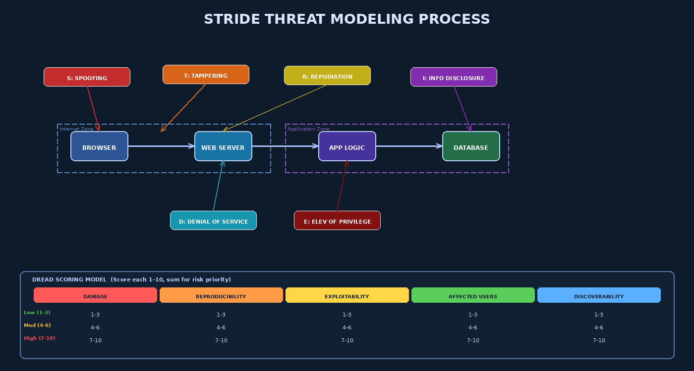

# Chapter 3 — Threat Modeling: Systematic Security Analysis



## 3.1 Why Threat Modeling Is the Cornerstone of Proactive Security

Every software system that handles data, communicates over a network, or executes in an adversarial environment will face attacks. The question is not *if* but *when, how, and how badly.* Threat modeling is the structured discipline of identifying those attacks proactively — before a line of production code is written, before an architecture is finalized, before adversaries find the vulnerabilities for you.

The alternative — discovering threats reactively through breaches, bug bounties, or penetration tests — is expensive, embarrassing, and increasingly inadequate. A 2022 IBM Cost of a Data Breach report found that organizations with mature threat modeling programs contained breaches 28% faster and spent 45% less on remediation than those without.

Threat modeling integrates directly with the assurance lifecycle introduced in Chapter 1 and generates the security requirements discussed in Chapter 2. It is most valuable when applied early (at design time) and most common when applied late (after a security incident). This chapter provides the knowledge and techniques to apply it systematically from the beginning.

---

## 3.2 The Four-Question Framework

Adam Shostack, co-designer of the Microsoft Threat Modeling approach, distills all threat modeling methodologies to four fundamental questions:

1. **What are we building?** — Establish a shared, accurate understanding of the system: its components, data flows, trust boundaries, and external dependencies
2. **What can go wrong?** — Enumerate threats systematically using a structured taxonomy
3. **What are we going to do about it?** — Prioritize threats and define mitigations (design changes, security controls, compensating controls)
4. **Did we do a good enough job?** — Validate the threat model through review, testing, and iteration

The power of this framework is its simplicity. Every sophisticated threat modeling methodology (STRIDE, PASTA, LINDDUN, Attack Trees) is an elaboration on these four questions for specific contexts, risk profiles, or organizational maturity levels.

---

## 3.3 STRIDE — Microsoft's Threat Taxonomy

STRIDE is an acronym identifying six fundamental categories of security threats applicable to software systems. Developed at Microsoft in 1999 by Praerit Garg and Loren Kohnfelder, it provides a systematic checklist for ensuring that every major threat category is considered for every component and data flow.

| Letter | Threat Category | Violated Property | Software Examples |
|--------|----------------|-------------------|--------------------|
| **S** | Spoofing Identity | Authentication | Username forgery, session token theft, ARP spoofing, OAuth token replay |
| **T** | Tampering with Data | Integrity | SQL injection, parameter tampering, man-in-the-middle data modification, log tampering |
| **R** | Repudiation | Non-repudiation | Denying transactions, deleting audit logs, spoofing log sources |
| **I** | Information Disclosure | Confidentiality | Data exfiltration, verbose error messages exposing stack traces, unencrypted PII in transit |
| **D** | Denial of Service | Availability | HTTP flood, memory exhaustion via large payloads, algorithmic complexity attacks (ReDoS) |
| **E** | Elevation of Privilege | Authorization | Vertical privilege escalation, IDOR, JWT role manipulation, sudo misconfiguration |

### 3.3.1 Applying STRIDE to DFD Elements

Each element type in a Data Flow Diagram (DFD) is susceptible to specific STRIDE categories:

| DFD Element | Applicable STRIDE Categories |
|-------------|------------------------------|
| External Entities (Browser, Third-party API) | S, R |
| Processes (Web Server, App Logic) | S, T, R, I, D, E |
| Data Flows (HTTP, DB Queries) | T, I, D |
| Data Stores (Database, File System, Cache) | T, R, I, D |
| Trust Boundaries | All — boundaries are where attacks cross security zones |

### 3.3.2 STRIDE Worked Example — Login Feature

For a login endpoint (`POST /api/auth/login`):

- **S (Spoofing):** Attacker replays a captured session token → Mitigation: Short-lived tokens, HTTPS, token binding
- **T (Tampering):** Attacker modifies `role=user` to `role=admin` in a JWT payload → Mitigation: JWT signature validation, signed tokens
- **R (Repudiation):** User denies placing a fraudulent order → Mitigation: Immutable audit log with timestamp and user binding
- **I (Information Disclosure):** Login failure returns "Invalid password" (confirming username exists) → Mitigation: Generic "Invalid credentials" message
- **D (DoS):** Attacker floods login with 10,000 requests/second → Mitigation: Rate limiting, CAPTCHA, IP-based throttling
- **E (Elevation of Privilege):** Attacker bypasses authentication entirely via SQL injection → Mitigation: Parameterized queries, WAF

---

## 3.4 Data Flow Diagrams for Threat Modeling

A **Data Flow Diagram (DFD)** provides the system model against which STRIDE threats are systematically enumerated. DFDs use four element types:

- **Processes** (circles or rounded rectangles): Software components that transform data
- **Data Stores** (parallel horizontal lines): Databases, files, caches, queues
- **External Entities** (rectangles): Actors outside the system boundary: browsers, APIs, users, partner services
- **Data Flows** (arrows): Movement of data between elements, labeled with data type and protocol
- **Trust Boundaries** (dashed boxes/lines): Lines where data crosses security zones; every crossing is a threat opportunity

### 3.4.1 Level 0 vs. Level 1 DFDs

**Level 0 DFD (Context Diagram):** Shows the entire system as a single process with all external entities and primary data flows. Establishes system boundary and data scope. Suitable for executive reviews and initial threat brainstorming.

**Level 1 DFD:** Decomposes the single process into major subsystems, showing internal data flows and internal trust boundaries. This is the level used for systematic STRIDE analysis.

For a web application with authentication:
```
Level 0:
  [Browser] ──HTTPS──→ [Web Application] ──DB Protocol──→ [Database]
  [Admin Console] ──HTTPS──→ [Web Application]

Level 1:
  [Browser] ──HTTPS──→ [Load Balancer] ──HTTP──→ [Web Server]
  [Web Server] ──RPC──→ [Auth Service]
  [Web Server] ──RPC──→ [Business Logic]
  [Auth Service] ──SQL──→ [User DB]
  [Business Logic] ──SQL──→ [App DB]
  Trust Boundary 1: Internet | DMZ (between Browser and Load Balancer)
  Trust Boundary 2: DMZ | App Zone (between Web Server and Auth/Logic)
  Trust Boundary 3: App Zone | Data Zone (between services and databases)
```

---

## 3.5 PASTA — Process for Attack Simulation and Threat Analysis

PASTA is a **risk-centric, 7-stage** threat modeling methodology particularly suited to enterprise environments where business risk quantification is required. Unlike STRIDE (which is technology-centric), PASTA starts from business objectives and works down to technical attack enumeration.

| Stage | Activity | Output |
|-------|----------|--------|
| 1 | Define Business Objectives | Risk appetite, assets, business impact |
| 2 | Define Technical Scope | Architecture diagrams, technology inventory |
| 3 | Decompose Application | DFDs, component inventory, trust boundaries |
| 4 | Threat Analysis | Threat agent profiling, attack tree construction |
| 5 | Vulnerability and Weakness Analysis | CVE analysis, SAST results, design weaknesses |
| 6 | Attack Enumeration | Attack paths from threat agents to vulnerabilities |
| 7 | Risk and Impact Analysis | Risk scoring, residual risk, mitigation priorities |

PASTA produces a risk register with business-impact-weighted threat ratings — making it well-suited for justifying security investments to non-technical executives.

---

## 3.6 Attack Trees — Schneier's Methodology

Introduced by Bruce Schneier in 1999, **attack trees** model attacks as hierarchical tree structures with a root node representing the attacker's ultimate goal and child nodes representing sub-goals and conditions. They support:

- **AND nodes:** All child conditions must be satisfied simultaneously
- **OR nodes:** Any one child condition is sufficient
- **Leaf nodes:** Atomic attack steps (e.g., "exploit CVE-2023-XXXX in Apache component")

### 3.6.1 Attack Tree Example — Unauthorized Database Access

```
Root: Access customer database without authorization
  OR:
    1. Exploit SQL injection in web layer (OR)
         1.1 Inject via search parameter
         1.2 Inject via login form
    2. Compromise database credentials (AND)
         2.1 Obtain DB connection string (OR)
               2.1.1 Find in source code repository
               2.1.2 Extract from application config file
         2.2 Connect to DB from accessible network (OR)
               2.2.1 Compromise app server
               2.2.2 DB exposed on public network
    3. Exploit misconfigured backup (AND)
         3.1 Discover S3 backup bucket
         3.2 Bucket has public read access
```

Leaf nodes can be annotated with **difficulty**, **probability**, **cost to attacker**, and **cost to defend** — enabling prioritized remediation based on attack feasibility.

---

## 3.7 LINDDUN — Privacy Threat Modeling

LINDDUN addresses **privacy threats** that STRIDE does not capture — particularly relevant for GDPR compliance and healthcare applications.

| Letter | Privacy Threat | Description |
|--------|---------------|-------------|
| **L** | Linkability | Connecting data points to identify individuals |
| **I** | Identifiability | Uniquely identifying a person from pseudonymous data |
| **N** | Non-repudiation | Evidence preventing a person from denying their involvement |
| **D** | Detectability | Inferring existence or absence of sensitive information |
| **D** | Disclosure of Information | Unauthorized access to personal data |
| **U** | Unawareness | Data subjects unaware of data processing activities |
| **N** | Non-compliance | Violations of privacy regulations or policies |

LINDDUN analysis is applied to DFDs identically to STRIDE, with privacy threat trees generated for each relevant DFD element.

---

## 3.8 Threat Prioritization — DREAD and CVSS

Not all identified threats warrant equal remediation effort. Prioritization frameworks help allocate resources effectively.

### 3.8.1 DREAD Scoring

DREAD assigns a score of 1–10 to each threat across five dimensions:

| Dimension | Question | Low (1-3) | High (8-10) |
|-----------|----------|-----------|-------------|
| **D**amage | How severe is the damage if exploited? | Information disclosure | Root compromise / data destruction |
| **R**eproducibility | How easily can the attack be reproduced? | Requires rare conditions | Always reproducible |
| **E**xploitability | How much skill does exploitation require? | Expert-level | Script kiddie / automated tool |
| **A**ffected Users | How many users are impacted? | Single user | All users |
| **D**iscoverability | How easily can an attacker find this? | Requires deep access | Visible in public-facing behavior |

`DREAD Score = (D + R + E + A + D) / 5`  — Scores above 7.5 are typically classified High; 4.0–7.5 Medium; below 4.0 Low.

### 3.8.2 CVSS — Common Vulnerability Scoring System

The industry-standard CVSS v3.1 scores vulnerabilities across Attack Vector, Attack Complexity, Privileges Required, User Interaction, Scope, Confidentiality Impact, Integrity Impact, and Availability Impact — producing a Base Score of 0–10. CVSS is used for CVE scoring in the NVD and is the lingua franca of vulnerability management programs.

---

## 3.9 Threat Modeling in Agile — Rapid Threat Modeling

Traditional threat modeling assumes a complete architecture exists before analysis. In Agile, architecture evolves sprint-by-sprint. Effective Agile threat modeling practices include:

- **Lightweight Threat Modeling (LTM):** 30-60 minute structured whiteboard session at sprint planning; focus on the user story being implemented; outputs: threats and acceptance criteria
- **Security Story Mapping:** Attach threat analysis results directly to user story cards as security tasks and acceptance criteria
- **Threat Dragon / OWASP Threat Dragon:** Web-based, git-integrated threat modeling tool supporting rapid DFD creation and STRIDE analysis with version control integration
- **Iterative Threat Model:** Maintain a living threat model document that is updated each sprint as architecture evolves

---

## 3.10 Complete Worked Example — Online Banking Login Feature

**Step 1: What are we building?**
Feature: Multi-factor authentication for online banking. Components: React SPA → API Gateway → Auth Service → User DB → TOTP Verification Service → Audit Log Service.

**Step 2: What can go wrong? (STRIDE on each component)**

| Component | Threat | Category | DREAD Score |
|-----------|--------|----------|-------------|
| API Gateway | HTTP flood attacking rate limiter bypass | D | 7.2 |
| Auth Service | JWT algorithm confusion (RS256→HS256) | E | 9.1 |
| Auth Service | Username enumeration via timing side-channel | I | 6.4 |
| User DB | SQL injection via username field | T/E | 8.8 |
| Audit Log | Log injection to forge audit trail | T/R | 7.6 |
| TOTP Service | TOTP code replay within validity window | S | 6.9 |
| TLS Channel | Certificate substitution (missing pinning) | S/T | 7.0 |

**Step 3: What are we going to do about it?**

| Threat | Mitigation | Owner | Sprint |
|--------|-----------|-------|--------|
| JWT algorithm confusion | Explicitly specify RS256; reject HS256 | Dev | Sprint 3 |
| SQL injection | Parameterized queries in all Auth Service DB calls | Dev | Sprint 3 |
| Log injection | Sanitize log entries; use structured logging (JSON) | Dev | Sprint 4 |
| TOTP replay | Invalidate TOTP codes after single use; enforce 30s window | Dev | Sprint 3 |
| HTTP flood | API Gateway rate limiting: 10 auth attempts/IP/minute | Ops | Sprint 3 |

**Step 4: Did we do a good enough job?**
- Threat model reviewed by security architect before sprint implementation begins
- SAST scan verifies parameterized queries in Auth Service
- Penetration test exercises JWT manipulation and TOTP replay scenarios pre-launch

---

## Key Terms

1. **Threat Modeling** — Proactive discipline of identifying, categorizing, prioritizing, and mitigating threats before deployment
2. **STRIDE** — Six-category threat taxonomy: Spoofing, Tampering, Repudiation, Information Disclosure, Denial of Service, Elevation of Privilege
3. **PASTA** — Risk-centric 7-stage threat modeling: Process for Attack Simulation and Threat Analysis
4. **LINDDUN** — Privacy-focused threat modeling taxonomy for GDPR/healthcare systems
5. **Attack Tree** — Hierarchical model of attack paths with AND/OR logic and leaf-node attack steps
6. **DFD** — Data Flow Diagram; four elements: process, data store, external entity, data flow; used as threat model substrate
7. **Trust Boundary** — Line in a DFD where data crosses security zones; primary threat analysis focus point
8. **DREAD** — Threat scoring: Damage, Reproducibility, Exploitability, Affected Users, Discoverability
9. **CVSS** — Common Vulnerability Scoring System; industry-standard 0-10 vulnerability severity metric
10. **Shostack's Four Questions** — What are we building? What can go wrong? What are we going to do? Did we do a good enough job?
11. **Spoofing** — Impersonating another identity; violates authentication
12. **Elevation of Privilege** — Gaining permissions beyond those granted; violates authorization
13. **Repudiation** — Denying having performed an action; violates non-repudiation
14. **Information Disclosure** — Unauthorized data access; violates confidentiality
15. **Denial of Service** — Making a system unavailable; violates availability
16. **Tampering** — Unauthorized data modification; violates integrity
17. **OWASP Threat Dragon** — Open-source web-based threat modeling tool with DFD/STRIDE support
18. **Microsoft Threat Modeling Tool** — Microsoft's threat model automation tool; automated STRIDE analysis
19. **Lightweight Threat Modeling** — 30-60 minute Agile-compatible threat analysis technique
20. **Attack Surface** — Complete enumeration of system entry points, assets, trust levels, and exit points

---

## Review Questions

1. Explain Shostack's four-question framework for threat modeling. Why is each question necessary? What is the risk of skipping question 4?

2. Apply STRIDE analysis to the four components of a simple e-commerce checkout flow: Browser → Web Server → Payment Service → Payment Database. For each STRIDE category at each component, identify at least one concrete threat.

3. Draw a Level 1 DFD for a password-reset feature that sends a reset token via email. Identify all trust boundaries. Apply STRIDE to the email delivery data flow.

4. Compare STRIDE and PASTA methodologies. For which organizational context is each better suited? What are the trade-offs in time, expertise, and output quality?

5. Construct an attack tree for the goal "Steal user session cookies from a web application." Include at least two OR branches and one AND branch. Annotate leaf nodes with exploitability ratings.

6. A threat receives a DREAD score of D=9, R=8, E=3, A=10, D=2. Calculate its DREAD score. Is this a high, medium, or low priority? What does the scoring pattern tell you about the nature of this threat?

7. How does threat modeling integrate with Agile development? What challenges arise when applying traditional threat modeling in a two-week sprint cycle, and how do lightweight threat modeling approaches address them?

8. Explain the LINDDUN privacy threat "Linkability." Give a concrete example from a fitness tracking application, and propose a technical mitigation.

9. Using the worked example in Section 3.10 as a model, perform a threat model for a two-factor authentication recovery flow (user lost their authenticator app and requests account recovery via email). Identify at least five threats and propose mitigations for each.

10. What is the relationship between a threat model and a Requirements Traceability Matrix? How should the outputs of a threat model be incorporated into the RTM from Chapter 2?

---

## Further Reading

1. **Shostack, A.** (2014). *Threat Modeling: Designing for Security*. Wiley. — The definitive textbook; author co-designed the Microsoft Threat Modeling methodology; essential reading for this course.

2. **Schneier, B.** (1999). "Attack Trees: Modeling Security Threats." *Dr. Dobb's Journal*, December 1999. — The seminal paper introducing attack trees as a security analysis tool.

3. **UcedaVélez, T. & Morana, M.M.** (2015). *Risk Centric Threat Modeling: Process for Attack Simulation and Threat Analysis*. Wiley. — The authoritative reference for the PASTA methodology.

4. **OWASP Threat Modeling Cheat Sheet** (2023). Available at: https://cheatsheetseries.owasp.org/cheatsheets/Threat_Modeling_Cheat_Sheet.html — Practical guidance for implementing threat modeling in development teams.

5. **Wuyts, K. & Joosen, W.** (2015). "LINDDUN Privacy Threat Modeling: A Tutorial." Technical Report CW 685, KU Leuven. — Comprehensive tutorial on applying LINDDUN for privacy-by-design.
