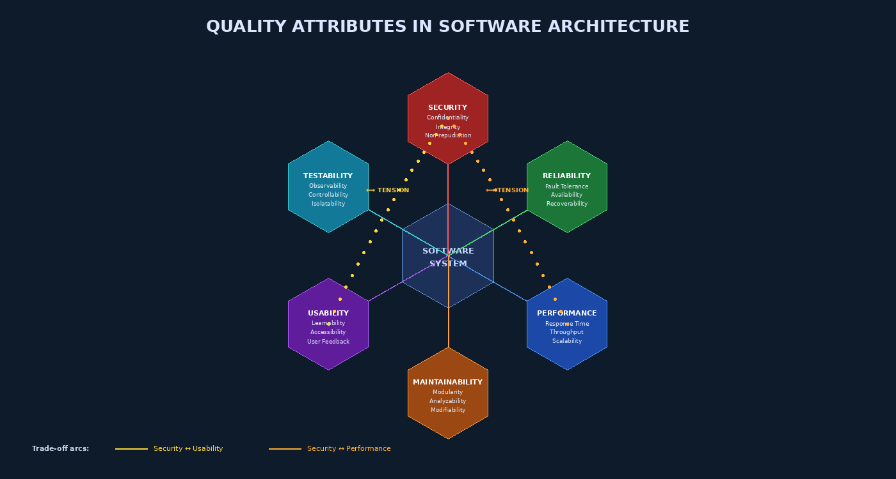

# Chapter 4 — Quality in Architecture and Design



## 4.1 Architecture Is Where Security and Quality Are Won or Lost

Security engineers frequently observe that applications built on insecure architectures cannot be secured after the fact — they can only be made "less insecure." The same holds for other quality attributes: a monolithic application designed without modularity cannot suddenly become maintainable through refactoring alone; a system designed without observability cannot simply have testability bolted on.

Software architecture defines the fundamental structures of a system: the components, their responsibilities, the communication mechanisms between them, and the policies governing their interactions. Every architectural decision is also a security decision and a quality decision. When a team chooses a microservices architecture, they are simultaneously choosing a service mesh security model, a distributed tracing observability model, and a fault isolation model. Understanding these implications — and making them explicit — is the task of architecture-level assurance.

This chapter examines the security architecture principles that must guide design decisions, the quality attributes that architectures must simultaneously satisfy, the trade-offs between them, and the patterns and anti-patterns that characterize secure, high-quality designs.

---

## 4.2 Security Architecture Principles

The foundational principles of secure architecture were codified by Saltzer and Schroeder in their 1975 landmark paper "The Protection of Information in Computer Systems." These principles remain the bedrock of secure software design five decades later.

### 4.2.1 Defense in Depth

**Principle:** No single security control should be the last line of defense. Security controls should be layered so that the failure or bypass of any single control does not result in a complete security failure.

**Architectural implication:** A web application should have a Web Application Firewall (WAF) at the perimeter *and* input validation in the application layer *and* parameterized queries in the data layer — even though any one of these would, in theory, prevent SQL injection. Defense in depth acknowledges that all controls have a non-zero failure probability.

```
Internet → [WAF/CDN] → [Load Balancer + TLS Termination]
        → [API Gateway + Auth] → [Service Mesh + mTLS]
        → [Application Logic + Input Validation]
        → [Data Layer + Parameterized Queries]
        → [Database + Encryption at Rest]
```

### 4.2.2 Fail-Safe Defaults

**Principle:** Access should be denied by default. The system's safest state should be the state it adopts when its configuration is incomplete, ambiguous, or under attack.

**Architectural implication:** Authorization systems should be designed as explicit allowlists (grant access to listed resources) rather than denylist systems (deny only explicitly forbidden resources). A new API endpoint without an authorization annotation should be inaccessible until explicitly granted. Fail-open architectures — where a firewall failure results in all traffic being allowed — violate this principle catastrophically.

### 4.2.3 Least Privilege

**Principle:** Every component, service account, and user should operate with the minimum permissions necessary for its function.

**Architectural implication:** Microservices should have dedicated service accounts with database permissions limited to the tables and operations they require — not a shared "app_user" with full schema access. Lambda functions should have IAM roles granting only the specific S3 buckets and DynamoDB tables they need. Privilege escalation attacks succeed when components have permissions far exceeding their operational requirements.

### 4.2.4 Separation of Duties

**Principle:** Critical operations requiring high levels of trust should require the involvement of more than one party or component.

**Architectural implication:** Code deployment to production should require both a code review approval and a CI/CD gate passing security scans — no single developer should have unilateral deployment capability. Financial transaction approval above a threshold should require two-factor authorization, not just authentication.

### 4.2.5 Economy of Mechanism

**Principle:** Security mechanisms should be as simple as possible. Complexity is the enemy of security — complex mechanisms are harder to analyze, harder to test, and more likely to contain vulnerabilities.

**Architectural implication:** A single, centralized authentication service is preferable to authentication logic scattered across dozens of microservices. A shared authorization library is preferable to each team implementing their own RBAC logic. Every line of security-critical code is a potential vulnerability; minimizing that code reduces the attack surface.

### 4.2.6 Complete Mediation

**Principle:** Every access to every object must be checked against the access control policy. No caching of authorization decisions should be permitted unless the cache is both correct and invalidated appropriately.

**Architectural implication:** Caching authenticated user permissions for performance is a common optimization — but the cache must be invalidated when permissions change (account suspension, role revocation). An admin who is suspended should not retain cached admin access for the cache TTL period.

### 4.2.7 Open Design

**Principle:** The security of a system should not depend on the secrecy of its design or algorithms. Security through obscurity — relying on attackers not knowing how a system works — is not a security control.

**Architectural implication:** Cryptographic algorithms should be publicly reviewed standards (AES, RSA, ChaCha20, SHA-3) — not proprietary "home-grown" algorithms. Authentication protocols should be standards (OAuth 2.0, OIDC, SAML) reviewed by the security community, not custom token schemes. Open design does not preclude secrets — it means that the *algorithm* should be public and the *key* should be secret, not the other way around.

---

## 4.3 Secure Design Patterns

Design patterns provide reusable, proven solutions to recurring design problems. Secure design patterns address recurring security design problems.

### 4.3.1 Input Validation Patterns

**Allowlist (Positive) Validation:** Define exactly what is acceptable; reject everything else. Preferred for all user inputs.
```
def validate_username(username: str) -> bool:
    import re
    return bool(re.match(r'^[a-zA-Z0-9_]{3,32}$', username))
```

**Centralized Validation:** Rather than each module validating its own inputs (inconsistently), route all external inputs through a single validation layer. This ensures consistency and makes the validation logic reviewable as a unit.

### 4.3.2 Authentication Patterns

**Credential Management Pattern:** Never store plaintext passwords. Use adaptive hashing algorithms (bcrypt cost ≥ 12, Argon2id with appropriate memory/time parameters, scrypt). Separate the credential storage function into an isolated component with no other responsibilities.

**Token Pattern:** Issue short-lived, signed tokens (JWTs with RS256 or ES256) for session management. Tokens should contain minimal claims, have explicit expiration (`exp`), and be validated on every request.

### 4.3.3 Authorization Patterns

**Policy-Based Authorization:** Externalize authorization logic from business logic. Use an authorization service or policy engine (OPA — Open Policy Agent, Casbin) that evaluates policies against principal attributes, resource attributes, and environmental context.

```
# OPA policy — deny by default
default allow = false

allow {
    input.user.role == "admin"
    input.action == "delete"
    input.resource.type == "document"
}

allow {
    input.user.id == input.resource.owner_id
    input.action == "read"
}
```

**RBAC vs. ABAC:** Role-Based Access Control (RBAC) assigns permissions to roles and users to roles — simple, auditable, suitable for most enterprise systems. Attribute-Based Access Control (ABAC) evaluates policies based on arbitrary attributes of user, resource, action, and environment — more expressive, better for dynamic and fine-grained access control (e.g., "user can read documents in their department created within the last 90 days").

---

## 4.4 Quality Attributes and Their Architectural Implications

ISO 25010 (SQuaRE model) defines eight top-level quality characteristics. Architecture must balance competing demands across these characteristics.

### 4.4.1 Security

ISO 25010 decomposes security into: **Confidentiality** (data accessible only to authorized parties), **Integrity** (data not modified without authorization), **Non-repudiation** (actions cannot be denied), **Accountability** (actions traceable to responsible parties), **Authenticity** (identity claims verifiable).

Architectural mechanisms: TLS for confidentiality-in-transit; database encryption for confidentiality-at-rest; HMACs and digital signatures for integrity; audit logging for accountability and non-repudiation; PKI and MFA for authenticity.

### 4.4.2 Reliability

ISO 25010 decomposes reliability into: **Maturity** (frequency of failure under normal operation), **Fault Tolerance** (operation despite component failures), **Recoverability** (restoration after failure), **Availability** (proportion of time the system operates as specified).

Architectural mechanisms: redundancy (active-active, active-passive), circuit breakers, graceful degradation, health checks, automated failover. Note the tension with security: redundant systems expand the attack surface; failover mechanisms can be exploited for DoS.

### 4.4.3 Maintainability

**Modularity** (well-defined component boundaries), **Analyzability** (ease of diagnosing defects), **Modifiability** (components changeable without unexpected side effects), **Testability** (ease of testing components in isolation).

The security implication of maintainability is profound: systems that are difficult to maintain are difficult to patch. The Equifax breach (Chapter 1) was enabled by poor patch management — itself enabled by complex, unmaintainable dependencies. High modularity enables targeted patching. High analyzability enables rapid vulnerability assessment.

### 4.4.4 Performance Efficiency

Security controls have performance costs: TLS adds handshake latency; encryption adds CPU overhead; access control checks add per-request overhead; comprehensive audit logging adds I/O. Architecture must allocate performance budget explicitly to security controls rather than treating them as zero-cost.

---

## 4.5 Architecture-Level Trade-offs

The diagram at the top of this chapter visualizes key tension relationships between quality attributes. These are not incidental — they reflect fundamental constraints:

**Security ↔ Usability:** Strong authentication (hardware tokens, complex MFA) reduces usability. Excessive access prompts (Windows Vista's UAC syndrome) cause users to habituate and approve all prompts reflexively. The architecture must find a balance: risk-based authentication that applies strong controls for high-risk actions while allowing frictionless access for low-risk operations.

**Security ↔ Performance:** Every TLS handshake, every authorization check, every HMAC computation consumes CPU cycles. High-security configurations (FIPS-compliant cipher suites, full packet logging, per-request authorization) impose measurable performance penalties. Session token caching, TLS session resumption, and policy decision caching are common architectural optimizations that introduce their own security trade-offs (see: complete mediation principle).

**Maintainability ↔ Performance:** Architectural patterns that maximize maintainability (microservices, hexagonal architecture, dependency injection) introduce overhead through network calls, serialization, and abstraction layers. Highly optimized code is often tightly coupled and difficult to maintain.

---

## 4.6 Security Anti-Patterns

Anti-patterns document recurring design mistakes that create security vulnerabilities:

| Anti-Pattern | Description | Security Risk | Mitigation |
|-------------|-------------|---------------|------------|
| **God Object** | Single class/service with excessive responsibilities | Excessive privilege in one component amplifies blast radius of compromise | Decompose into minimal-privilege services |
| **Hard-coded Credentials** | Database passwords, API keys in source code | Credential exposure via source code repository access | Environment variables, secrets management (Vault, AWS Secrets Manager) |
| **The Blob / Monolith** | All functionality in single deployable unit | Cannot apply least privilege; patch requires full redeployment | Modular architecture, microservices for high-risk components |
| **Lava Flow** | Dead code retained due to fear of breakage | Unmaintained code paths with unknown security properties; widened attack surface | Disciplined code removal with coverage tracking |
| **Security Through Obscurity** | Relying on attackers not knowing system internals | Single point of failure; discovered by reverse engineering | Open design + cryptographic secrets |
| **Shared Service Account** | All services authenticate to DB with same credentials | Lateral movement: compromise of one service compromises all data | Per-service credentials, least-privilege accounts |

---

## 4.7 Design for Testability

Testability is not about adding test backdoors — which create security vulnerabilities. It is about designing components with clear contracts, observable state, and controllable inputs:

- **Dependency Injection:** Allows test doubles (mocks, stubs) to replace real dependencies without production code changes
- **Hexagonal Architecture (Ports and Adapters):** Separates business logic from I/O adapters; core logic testable in isolation without a live database or network
- **Structured Logging:** Logging in JSON format to standard streams enables test assertion on system behavior without database queries
- **Feature Flags:** Allow security features to be enabled/disabled in test environments without code changes; must never be accessible from production as a bypass mechanism

---

## 4.8 Secure API Design Principles

Modern systems expose functionality through APIs. Secure API design requires:

- **Authentication:** All endpoints require a valid bearer token or client certificate; no anonymous access to sensitive resources
- **Authorization on every request:** Authorization decisions re-evaluated per request, not cached from login
- **Rate limiting by design:** Throttling configured at the API gateway layer; not an afterthought
- **Input validation at the API boundary:** Strict schema validation (OpenAPI / JSON Schema) before any processing; return 400 Bad Request for schema violations
- **Versioning:** Deprecated API versions disabled, not merely discouraged, after migration window
- **Minimal data responses:** API responses return only the fields the caller is authorized to see (RBAC-filtered responses; never return full database rows)

---

## Key Terms

1. **Defense in Depth** — Layered security controls preventing single-point failures
2. **Fail-Safe Defaults** — System defaults to most restrictive/secure state when configuration is ambiguous
3. **Least Privilege** — Components operate with minimum necessary permissions
4. **Separation of Duties** — Critical operations require multiple parties or approvals
5. **Economy of Mechanism** — Security mechanisms should be as simple as possible
6. **Complete Mediation** — Every access check enforced on every request; no stale authorization caches
7. **Open Design** — Security does not depend on secrecy of design; only keys should be secret
8. **Allowlist Validation** — Accepting only explicitly defined valid inputs; rejecting all others
9. **RBAC** — Role-Based Access Control; permissions assigned to roles, roles assigned to users
10. **ABAC** — Attribute-Based Access Control; policy evaluated against arbitrary attribute sets
11. **God Object Anti-Pattern** — Single over-privileged component amplifying breach blast radius
12. **Hard-Coded Credentials Anti-Pattern** — Secrets embedded in source code
13. **Security Through Obscurity** — Relying solely on attackers not knowing system internals; not a real security control
14. **ISO 25010** — International standard defining eight quality characteristics including security, reliability, maintainability
15. **Hexagonal Architecture** — Ports-and-adapters pattern separating business logic from I/O adapters
16. **Dependency Injection** — Design pattern enabling test doubles and loose coupling
17. **ATAM** — Architecture Tradeoff Analysis Method; evaluates architectural decisions against quality attribute scenarios
18. **Defense-in-Depth** — Multiple overlapping security layers
19. **Lava Flow Anti-Pattern** — Dead code retained due to fear of removal; expands attack surface
20. **Policy-Based Authorization** — Externalized authorization logic evaluated by a policy engine (OPA, Casbin)

---

## Review Questions

1. Explain the Saltzer-Schroeder principle of "fail-safe defaults" with a concrete architectural example for a healthcare web application. What is the security consequence of violating this principle?

2. A developer argues: "We use HTTPS, so we don't need input validation — the encryption protects us." Using the defense-in-depth principle and at least two other security architecture principles, construct a detailed counter-argument.

3. Compare RBAC and ABAC authorization models. Design an authorization policy for a document management system where: doctors can read all patient records in their department, nurses can read records for their assigned patients only, and admins can read all records. Which model would you use and why?

4. Using the ISO 25010 quality attribute framework, describe the security trade-offs introduced by adding a distributed caching layer (e.g., Redis) to an authentication system. Which principles from Section 4.2 are potentially violated?

5. Identify and explain three anti-patterns from Section 4.6 in the following scenario: "A monolithic Java EE application connects to the database using a hardcoded connection string with admin privileges. The application contains 40,000 lines of commented-out legacy code from a feature that was deprecated in 2018."

6. Describe the hexagonal architecture (ports and adapters) pattern. How does it improve testability without creating security backdoors? What is the security risk of test-specific code paths that are not properly isolated?

7. Design a secure API authentication architecture for a financial trading platform. Specify the authentication mechanism, authorization model, rate limiting strategy, and audit logging requirements, justifying each choice against the security architecture principles in this chapter.

8. What does "design for testability" mean in the context of security assurance? Give three specific architectural techniques that improve testability without compromising security.

9. Explain the "economy of mechanism" principle. How does it apply to the choice between a centralized authentication service versus distributed authentication logic in a microservices architecture? What are the security benefits and operational costs of each approach?

10. Using the ATAM (Architecture Tradeoff Analysis Method) concept, describe how you would evaluate the security/performance trade-off for enabling TLS mutual authentication (mTLS) between microservices in a high-throughput financial system processing 100,000 transactions per second.

---

## Further Reading

1. **Saltzer, J.H. & Schroeder, M.D.** (1975). "The Protection of Information in Computer Systems." *Proceedings of the IEEE*, 63(9), 1278–1308. — The seminal paper establishing the foundational security design principles; required reading in any serious security architecture course.

2. **Bass, L., Clements, P., & Kazman, R.** (2021). *Software Architecture in Practice*, 4th Edition. Addison-Wesley. — The definitive software architecture textbook; chapters on quality attributes and ATAM are directly applicable to this chapter's material.

3. **OWASP Security by Design Principles** (2023). Available at: https://owasp.org/www-project-developer-guide/draft/design/security_principles/ — Practical implementation guidance for each security design principle.

4. **Fernandez, E.B., Yoshioka, N., & Washizaki, H.** (2011). "Modeling misuse patterns." *Availability, Reliability, and Security for Business, Enterprise, and Health Information Systems*, pp. 3–14. — Connects misuse cases (Chapter 2) to secure design patterns (this chapter).

5. **McGraw, G.** (2006). *Software Security: Building Security In*, Chapter 6: Security Architecture and Design. Addison-Wesley. — Gary McGraw's treatment of architecture-level security touchpoints, including the risk analysis and architecture risk analysis methods.
