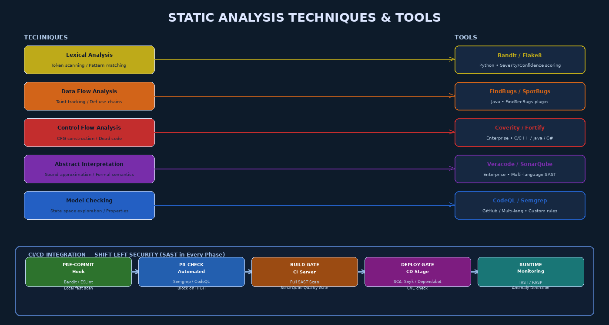

# Chapter 5 — Static Analysis and Code Inspection



## 5.1 Finding Defects Without Executing Code

Static analysis examines software artifacts — source code, bytecode, binaries, configuration files — without executing them, inferring their behavior through mathematical or heuristic reasoning. It is, by a wide margin, the most **cost-effective** technique in the software assurance toolkit: it can analyze an entire codebase in minutes, operates without a running environment, produces consistent reproducible results, and scales to code review workloads no human team could match.

The academic foundations of static analysis rest in formal methods: program semantics, type theory, abstract interpretation, and model checking. The practical manifestations range from simple regular-expression scanners to PhD-level theorem provers. Understanding the spectrum — where each technique sits on the soundness/completeness/performance trade-off curve — equips a software assurance practitioner to select and configure tools effectively.

> **Key Principle:** Static analysis does not prove a program is correct. It proves the presence or absence of specific properties of the code as written. A clean static analysis result means "no instances of the patterns this tool looks for were found" — not "this code is secure."

---

## 5.2 Taxonomy of Static Analysis Techniques

### 5.2.1 Lexical Analysis — Token Scanning

Lexical analysis is the simplest form of static analysis: the code is scanned at the token level (without semantic understanding) for patterns associated with dangerous constructs.

**How it works:** The source code is tokenized (split into identifiers, operators, string literals, etc.), and the token stream is searched for patterns matching a rule set. No understanding of program flow, data dependencies, or calling context is required.

**What it finds:** Calls to known-dangerous functions, hardcoded string literals that look like credentials, specific API usage patterns.

**Example — C/C++ dangerous functions:**
```c
// Flagged by lexical analysis: gets() has no length parameter
char buffer[64];
gets(buffer);  // ← SAST flag: CWE-120, buffer overflow risk

// Also flagged:
strcpy(dst, src);  // use strncpy or strlcpy
sprintf(buf, user_input);  // use snprintf with format literal
system(user_input);  // command injection risk
```

**Tools:** grep (manual), FLAWFINDER (C/C++), rough pattern-matching mode of Semgrep

**Limitations:** High false-positive rate (no context); misses vulnerabilities that don't involve known-dangerous function names. Easily circumvented by renaming functions.

### 5.2.2 Data Flow Analysis — Taint Tracking

Data flow analysis tracks the movement of data through a program — specifically, data originating from untrusted sources (user input, network, files, environment variables) that reaches sensitive sinks (database queries, shell commands, HTML output, file paths) without adequate sanitization.

**Taint analysis vocabulary:**
- **Source:** Where untrusted data enters the program (`request.getParameter()`, `os.environ[]`, `argv[]`)
- **Sink:** Where data is used in a dangerous way (`executeQuery()`, `subprocess.run()`, `innerHTML =`)
- **Sanitizer:** A function that makes data safe for use at a sink (`PreparedStatement`, `html.escape()`, `shlex.quote()`)
- **Taint propagation:** If variable `x` is tainted and `y = f(x)`, then `y` is tainted unless `f` is a sanitizer

**Forward taint analysis:** Starts at sources, tracks data forward to sinks. Detects SQL injection, command injection, XSS.

**Backward taint analysis:** Starts at sinks, traces data backward to sources. Useful for understanding data provenance.

**Def-use chains:** Static analysis constructs a mapping of where each variable is defined (def) and where it is used (use). Taint analysis follows these chains.

**Python example — tainted data reaching SQL sink:**
```python
# Detected by taint analysis: user input flows to SQL query without sanitization
import sqlite3
from flask import request

def get_user(conn):
    username = request.args.get('username')  # SOURCE: tainted
    # MISSING SANITIZER
    query = "SELECT * FROM users WHERE name='" + username + "'"  # SINK: SQL query
    return conn.execute(query)  # ← SAST flag: SQL injection, CWE-89

# Corrected with sanitizer (parameterized query):
def get_user_safe(conn):
    username = request.args.get('username')
    return conn.execute("SELECT * FROM users WHERE name=?", (username,))
```

**Tools:** Bandit (Python), FindSecBugs (Java), Semgrep, CodeQL, Checkmarx

### 5.2.3 Control Flow Analysis — CFG Construction

Control flow analysis models all possible execution paths through a program using a **Control Flow Graph (CFG)**. A CFG is a directed graph where nodes represent basic blocks (sequences of instructions with no branches) and edges represent possible execution transfers (conditional branches, loops, function calls, exceptions).

**Applications:**
- **Dead code detection:** Nodes with no incoming edges from reachable nodes are dead code — code that can never execute. Dead code may contain unfixed security vulnerabilities and is a maintenance liability.
- **Unreachable exception handlers:** Exception handlers for exceptions that the preceding code can never throw.
- **Infinite loop detection:** Cycles in the CFG with no exit condition.
- **Path-sensitive analysis:** Analysis that distinguishes different paths (e.g., the value of a variable depends on which branch was taken).

```
CFG for simple authentication check:
  [Entry] → [Call authenticate(user, pwd)]
            ↙                           ↘
  [auth == true]                    [auth == false]
       ↓                                  ↓
  [Grant access]                    [Log failure]
                                          ↓
                                    [Return 401]
  [Exit]
```

**Tools:** SonarQube (dead code), Coverity, Clang Static Analyzer, CFG visualizers (pycfg for Python)

### 5.2.4 Abstract Interpretation — Sound Approximation

Abstract interpretation, formalized by Patrick and Radhia Cousot in 1977, provides a mathematically rigorous framework for proving properties about all possible program executions by analyzing the program over an **abstract domain** — a simplified representation of program states that over-approximates actual behavior.

**Key property: Soundness.** An abstract interpretation analyzer that reports "no null pointer dereferences" has mathematically proven that no null pointer dereference is possible — for any input, for any execution path. This is in contrast to testing (which can only check specific inputs) and most other static analysis techniques (which may miss paths).

**Cost of soundness:** False positives. Because the abstract domain over-approximates, the analyzer may report potential issues on code paths that are actually impossible. Industrial abstract interpretation tools (Astrée, Polyspace) are tuned to minimize false positives while maintaining soundness for specific property classes.

**Tools:** Astrée (C/C++, DO-178C avionics), Polyspace (MATLAB, C, Ada), IKOS (NASA)

### 5.2.5 Model Checking — State Space Exploration

Model checking exhaustively explores all possible states of a system model to verify that a property holds in every reachable state. It was originally developed for hardware verification but has been applied to software concurrency, protocol verification, and security property verification.

**How it works:** The program (or protocol) is modeled as a finite-state automaton. A property to be verified (expressed in temporal logic, e.g., LTL or CTL) is specified. The model checker explores all reachable states to confirm the property holds — or produces a counterexample trace showing a violation.

**SPIN:** Verifies concurrent C programs; widely used for protocol verification and race condition detection.

**CBMC:** Bounded Model Checker for C; can prove absence of buffer overflows, assertion violations, and null pointer dereferences within a specified execution depth.

**Java PathFinder (JPF):** NASA model checker for Java programs; finds deadlocks, race conditions, unhandled exceptions.

---

## 5.3 SAST Tools by Platform

### 5.3.1 Python

**Bandit:** The primary Python SAST tool, developed by PyCQA (Python Code Quality Authority). Bandit analyzes Python ASTs against a plugin-based rule set covering 60+ security issue categories.

```bash
# Install and run Bandit
pip install bandit
bandit -r ./src -f json -o bandit-report.json

# Sample output:
# [B608:hardcoded_sql_expressions] Possible SQL injection via string-based query
#   Severity: Medium  Confidence: Medium
#   Location: src/auth.py:47:12
```

Bandit scores each finding by **Severity** (Low/Medium/High) and **Confidence** (Low/Medium/High), allowing teams to filter on High/High findings for CI gates while reviewing Medium findings in sprint review.

**Semgrep:** Rule-based multi-language SAST with a YAML rule syntax enabling custom security rules written in minutes. The Semgrep Registry provides hundreds of community rules for Python.

### 5.3.2 Java

**SpotBugs with FindSecBugs plugin:** SpotBugs (successor to FindBugs) performs bytecode-level static analysis. The FindSecBugs plugin adds 140+ security rules covering SQL injection, cryptographic weaknesses, path traversal, XSS, and XXE.

```xml
<!-- Maven integration -->
<plugin>
    <groupId>com.github.spotbugs</groupId>
    <artifactId>spotbugs-maven-plugin</artifactId>
    <version>4.7.3.4</version>
    <configuration>
        <plugins>
            <plugin>
                <groupId>com.h3xstream.findsecbugs</groupId>
                <artifactId>findsecbugs-plugin</artifactId>
                <version>1.12.0</version>
            </plugin>
        </plugins>
    </configuration>
</plugin>
```

### 5.3.3 Enterprise SAST

**Veracode SAST:** Cloud-based SaaS SAST supporting 20+ languages. Accepts binary uploads (no source code required); performs binary static analysis and outputs findings mapped to OWASP Top 10, CWE, and NIST 800-53.

**SonarQube:** Self-hosted or SaaS code quality and security platform. Provides "Quality Gates" — configurable pass/fail criteria for builds based on code coverage, technical debt, and security hotspot counts.

**GitHub CodeQL:** Code analysis engine that treats code as a database and queries it with QL (query language). Highly accurate; supports custom queries. Integrated into GitHub Advanced Security for free on public repos.

```yaml
# GitHub Actions CodeQL workflow
- name: Initialize CodeQL
  uses: github/codeql-action/init@v3
  with:
    languages: python, javascript

- name: Perform CodeQL Analysis
  uses: github/codeql-action/analyze@v3
  with:
    category: "/language:python"
```

---

## 5.4 Formal Code Inspection — The Fagan Method

Manual code review, conducted with discipline and rigor, remains among the highest-ROI defect detection activities in software assurance. Michael Fagan at IBM (1976) developed the inspection methodology that bears his name.

**Fagan Inspection Phases:**

| Phase | Activity | Participants | Output |
|-------|----------|--------------|--------|
| 1. Planning | Inspection coordinator schedules review; distributes materials | Coordinator, author | Inspection schedule, reviewer assignments |
| 2. Overview | Author walks reviewers through design intent; context setting | All | Reviewers understand intent |
| 3. Preparation | Reviewers individually examine code against checklists | Individual reviewers | Personal defect lists |
| 4. Inspection Meeting | Team meets to log defects (not discuss fixes); moderator-led | All | Official defect log |
| 5. Rework | Author fixes defects | Author | Updated code |
| 6. Follow-up | Coordinator verifies all defects addressed | Coordinator | Closed defect log |

**Fagan Inspection ROI Data:** IBM studies found Fagan Inspection detected 60–82% of defects in inspected code at a cost of 5–15% of total development effort. The defect rate after inspection was 10× lower than uninspected code entering testing.

**Optimal parameters:** 150–200 lines of code per hour; 60–90 minute sessions maximum; 2–4 reviewers. Above these rates, defect detection efficiency drops sharply.

---

## 5.5 False Positives, False Negatives, and Tool Tuning

Every SAST tool makes the classic trade-off between **false positives** (flagging code that is not actually vulnerable) and **false negatives** (missing code that is actually vulnerable):

| | | Actual Defect | No Actual Defect |
|-|-|--------------|-----------------|
| **Tool Reports Defect** | | True Positive (TP) | False Positive (FP) |
| **Tool Reports Clean** | | False Negative (FN) | True Negative (TN) |

**Precision:** TP / (TP + FP) — what fraction of findings are real?
**Recall:** TP / (TP + FN) — what fraction of real defects are found?

Tools tuned for high precision (few FPs) have low recall (miss many real defects). Tools tuned for high recall (find most defects) produce excessive FPs that waste reviewer time and cause alert fatigue.

**Managing FP rates in CI/CD:**
- Establish a **baseline** at tool onboarding: mark existing findings as known; only new findings block builds
- Use **suppression comments** (`# nosec` in Bandit; `@SuppressFBWarnings` in FindSecBugs) for justified exceptions — always with a comment explaining why the finding is not a real vulnerability
- **Tune rule sets** to disable categories with consistently high FP rates in your codebase
- **Review FP trends:** Track FP rate per rule; rules with >80% FP rate should be disabled or reconfigured

---

## 5.6 Integrating SAST into CI/CD Pipelines

The shift-left principle demands that SAST runs as early and as frequently as possible — at pre-commit, on every pull request, and as a build gate in CI. The diagram at the top of this chapter illustrates the full integration pipeline.

```yaml
# .github/workflows/security.yml
name: Security Scanning

on: [push, pull_request]

jobs:
  sast:
    runs-on: ubuntu-latest
    steps:
      - uses: actions/checkout@v4

      - name: Run Bandit (Python SAST)
        run: |
          pip install bandit
          bandit -r src/ -f json -o bandit-report.json \
            --severity-level medium --confidence-level medium
          # Exit non-zero on HIGH severity findings → blocks build
          bandit -r src/ --severity-level high --exit-zero

      - name: Run Semgrep
        uses: semgrep/semgrep-action@v1
        with:
          config: "p/owasp-top-ten p/python"

      - name: Upload SARIF results
        uses: github/codeql-action/upload-sarif@v3
        with:
          sarif_file: semgrep.sarif
```

**Build gate policy (recommended):**
- HIGH severity / HIGH confidence → Block build immediately
- HIGH severity / MEDIUM confidence → Block build; require explicit approval to override
- MEDIUM severity / any confidence → Report; do not block; require sprint-level resolution
- LOW severity → Report; track in backlog

---

## 5.7 Software Composition Analysis (SCA)

Modern applications are 60–80% open-source dependencies by code volume (Synopsys OSSRA report). SCA tools identify known vulnerabilities in third-party libraries by comparing dependency manifests against vulnerability databases (NVD, OSV, GitHub Advisory Database).

**Key SCA tools:**
- **OWASP Dependency-Check:** Open-source; scans Java, .NET, Python, Ruby, Node.js, C/C++; produces HTML/XML/JSON reports; maps to NVD CVEs
- **Snyk:** Commercial SaaS; real-time CVE feeds; automatic PR creation for updates; license compliance
- **Dependabot:** GitHub-native; automatic dependency update PRs; configurable security alert thresholds
- **npm audit / pip-audit / mvn dependency:check:** Language-native tools; minimal friction; appropriate for developer workstations

```bash
# Python: pip-audit
pip install pip-audit
pip-audit -r requirements.txt --format json

# Node.js: npm audit
npm audit --audit-level=high

# Java: OWASP Dependency-Check Maven plugin
mvn org.owasp:dependency-check-maven:check -DfailBuildOnCVSS=7
```

SCA should be treated with the same build-gate rigor as SAST: critical CVEs (CVSS ≥ 9.0) in direct dependencies should block the build; high CVEs (CVSS 7.0–8.9) should be triaged within the sprint.

---

## Key Terms

1. **Static Analysis** — Examination of software artifacts without execution to infer behavior and detect defects
2. **SAST** — Static Application Security Testing; automated static analysis focused on security vulnerabilities
3. **Taint Analysis** — Tracks untrusted data from sources through the program to dangerous sinks
4. **Source (Taint)** — Entry point of untrusted data: `request.getParameter()`, `argv[]`, environment variables
5. **Sink (Taint)** — Dangerous usage point: SQL queries, shell commands, HTML output
6. **Sanitizer** — Function that makes tainted data safe for use at a sink
7. **Control Flow Graph (CFG)** — Directed graph of all possible execution paths through a program
8. **Dead Code** — Code that can never be executed; detected by CFG analysis
9. **Abstract Interpretation** — Mathematically sound over-approximation of all possible program states
10. **Model Checking** — Exhaustive state-space verification of system properties
11. **Fagan Inspection** — Six-phase formal code review methodology with measured defect detection rates
12. **False Positive** — SAST finding flagging code that is not actually vulnerable
13. **False Negative** — SAST failure to flag code that is actually vulnerable
14. **Bandit** — Python SAST tool; AST-based; severity/confidence scoring
15. **CodeQL** — GitHub's code analysis engine; treats code as queryable database
16. **Semgrep** — Multi-language pattern-based SAST with YAML rule syntax
17. **SpotBugs / FindSecBugs** — Java bytecode SAST; security rules via FindSecBugs plugin
18. **SCA** — Software Composition Analysis; identifies CVEs in third-party dependencies
19. **Shift Left** — Philosophy of moving security analysis to earliest possible SDLC phase
20. **Build Gate** — CI/CD policy blocking deployment when SAST/SCA findings exceed configured thresholds

---

## Review Questions

1. Explain the difference between lexical analysis and data flow (taint) analysis as static analysis techniques. For each, give one type of vulnerability it can detect and one type it cannot detect.

2. Trace the taint flow in the following Python snippet and identify all tainted variables, the sink, and the missing sanitizer. Rewrite the function securely.
   ```python
   from flask import request
   import subprocess
   def run_report():
       report_name = request.args.get('report')
       cmd = "generate_report.sh " + report_name
       return subprocess.check_output(cmd, shell=True)
   ```

3. Draw a simplified Control Flow Graph for the following pseudocode. Identify any dead code and explain why it is unreachable.
   ```
   function checkAge(age):
     if age >= 18: return "adult"
     if age >= 13: return "teen"
     return "child"
     return "unknown"   // line D
   ```

4. Explain the concept of abstract interpretation soundness. Why do sound static analyzers (like Astrée) produce more false positives than heuristic tools (like Bandit)? In what application domains is soundness worth the false-positive cost?

5. Describe the Fagan Inspection methodology in detail. What is the purpose of separating the "inspection meeting" (phase 4) from the "rework" phase (phase 5)? What data from IBM's Fagan studies supports the ROI argument for formal inspection?

6. A SAST tool reports 200 findings on a legacy codebase, of which only 15 are true positives after manual review. Calculate the precision and recall (assume you independently know there are 30 actual vulnerabilities). Describe a strategy for improving this tool's usefulness without losing important findings.

7. Design a complete SAST/SCA integration pipeline for a Python Flask web application using GitHub Actions. Specify: which tools run at which pipeline stages, what severity thresholds trigger build failure, and how suppression/exceptions are managed.

8. What is Software Composition Analysis (SCA), and why is it insufficient to rely solely on SAST for supply-chain security? Give a concrete example of a vulnerability that SAST would miss but SCA would catch.

9. Compare Bandit and CodeQL for Python security analysis. What types of findings does each tool excel at detecting? What are the setup and operational cost trade-offs between the two?

10. A security-focused code review checklist should cover which six highest-priority vulnerability categories for a Python REST API? For each category, name one specific SAST rule or tool check that automates its detection, and one thing only human review can catch.

---

## Further Reading

1. **Livshits, B. & Lam, M.S.** (2005). "Finding Security Vulnerabilities in Java Applications with Static Analysis." *Proceedings of the 14th USENIX Security Symposium*. — Foundational academic paper on data flow-based security analysis; basis for many commercial SAST tools.

2. **Fagan, M.E.** (1976). "Design and Code Inspections to Reduce Errors in Program Development." *IBM Systems Journal*, 15(3), 182–211. — The original paper establishing the Fagan Inspection methodology; the data on defect rates and ROI remain valid and referenced today.

3. **Cousot, P. & Cousot, R.** (1977). "Abstract Interpretation: A Unified Lattice Model for Static Analysis of Programs by Construction or Approximation of Fixpoints." *POPL 1977*. — The mathematical foundations of abstract interpretation; essential for understanding the soundness/completeness tradeoff.

4. **OWASP Code Review Guide v2.0** (2017). Available at: https://owasp.org/www-project-code-review-guide/ — Comprehensive practitioner guide to security-focused manual code review; covers vulnerability categories, review checklists, and tool integration.

5. **Synopsys** (2023). *Open Source Security and Risk Analysis (OSSRA) Report*. Available at: https://www.synopsys.com/software-integrity/resources/analyst-reports/open-source-security-risk-analysis.html — Annual industry report on open-source dependency vulnerabilities; provides empirical data on SCA findings across industries.
