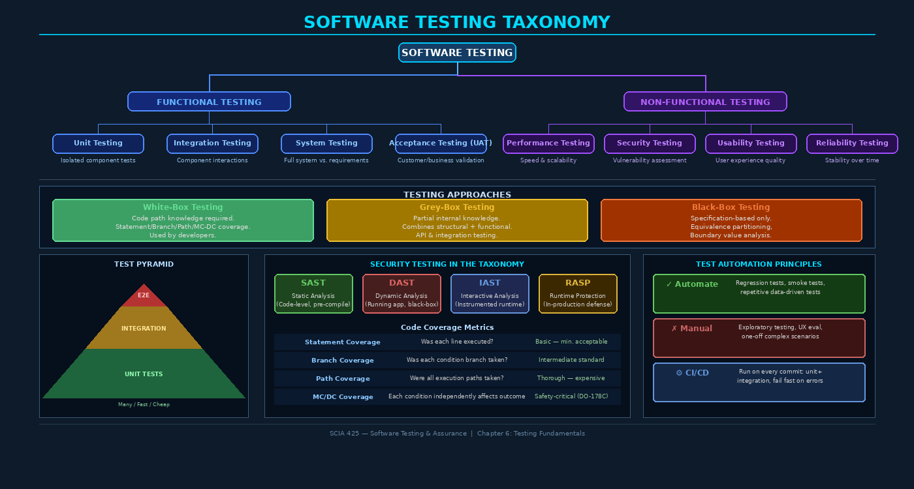

# Chapter 6: Software Testing Fundamentals and Taxonomy



## 6.1 The Role of Testing in Software Assurance

Testing is one of the most misunderstood activities in software engineering. Developers often conflate "testing" with "proof of correctness," yet Edsger Dijkstra established the foundational epistemological limit of testing in 1969: **"Program testing can be used to show the presence of bugs, but never their absence."** This is not a pessimistic statement — it is a precise boundary condition that every software quality engineer must internalize.

Testing is evidence gathering. Each test that passes adds confidence; each test that fails reveals a defect. The discipline of software testing is therefore a rigorous exercise in **systematic falsification** — we design test cases that are most likely to expose failures, not most likely to confirm that the software works. An effective tester is adversarial by nature.

In the context of software assurance, testing serves several complementary purposes: it validates that software meets specified requirements, it verifies internal design correctness, it builds stakeholder confidence, and — critically for security — it probes whether protective controls can be defeated by adversarial inputs. Testing does not replace formal verification, code review, or static analysis; it operates alongside these techniques in a defense-in-depth assurance posture.

> **Key Principle:** Testing demonstrates that a system behaves correctly for the inputs tested. The goal is to select the *most revealing* inputs — those that maximize the probability of finding defects — not to simply accumulate passing test counts.

---

## 6.2 Essential Testing Terminology

Precision in vocabulary is essential for any technical discipline. The following terms form the lingua franca of software testing:

| Term | Definition |
|------|-----------|
| **Test Case** | A specification of inputs, execution conditions, and expected outcomes designed to exercise a specific path or feature |
| **Test Suite** | An organized collection of related test cases |
| **Test Plan** | Document describing scope, approach, resources, schedule, and objectives of testing activities |
| **Test Oracle** | The mechanism that determines whether a test passed or failed (expected behavior source) |
| **Test Harness** | Infrastructure including drivers, stubs, and frameworks that enables automated test execution |
| **Test Fixture** | The fixed state (database records, files, configuration) required to run a test reproducibly |
| **Test Double** | A generic term for any object replacing a real dependency during testing |

Test doubles deserve special attention. The term was popularized by Gerard Meszaros in *xUnit Test Patterns* (2007) and encompasses five distinct types:

- **Stub** — Returns canned responses without verifying calls; replaces a dependency that provides inputs
- **Mock** — Pre-programmed with expectations; fails if calls don't match (behavior verification)
- **Spy** — Like a stub but records calls for later assertion
- **Fake** — A working simplified implementation (e.g., in-memory database instead of PostgreSQL)
- **Dummy** — A placeholder that is never actually used, filling required parameter slots

Confusing mocks with stubs is endemic in practice. The key distinction: **mocks verify interactions** (was this method called with these arguments?), while **stubs control state** (return this value when called).

---

## 6.3 Testing Levels: The V-Model

The V-model maps testing levels to development phases, ensuring that each development artifact has a corresponding verification activity:

```
Requirements Analysis  ←→  Acceptance Testing (UAT)
System Design          ←→  System Testing
Architectural Design   ←→  Integration Testing
Component Design       ←→  Unit Testing
                      Coding
```

### 6.3.1 Unit Testing

Unit tests exercise individual components (functions, classes, methods) in isolation from their dependencies. They should be:

- **Fast** — Execute in milliseconds; no network, filesystem, or database calls
- **Isolated** — Only the unit under test; all dependencies replaced with doubles
- **Deterministic** — Same inputs always produce same outputs
- **Self-validating** — Pass/fail without human interpretation

Frameworks: JUnit 5 (Java), pytest (Python), Jest (JavaScript), Google Test (C++).

```python
# Example: Unit test for input sanitization function
import pytest
from sanitizer import sanitize_sql_input

def test_sanitize_removes_single_quote():
    result = sanitize_sql_input("O'Brien")
    assert "'" not in result

def test_sanitize_blocks_comment_sequence():
    result = sanitize_sql_input("admin'--")
    assert "--" not in result

def test_sanitize_preserves_valid_input():
    result = sanitize_sql_input("john.doe@example.com")
    assert result == "john.doe@example.com"
```

### 6.3.2 Integration Testing

Integration tests verify that components interact correctly through their interfaces. Common strategies:

- **Big bang** — Integrate all components at once (poor defect localization)
- **Top-down** — Integrate from upper layers downward, stubbing lower layers
- **Bottom-up** — Integrate from lower layers upward, using test drivers
- **Sandwich/hybrid** — Combines top-down and bottom-up

Integration tests often involve real (or near-real) infrastructure: actual databases with test data, real HTTP servers, message queues. They run slower than unit tests and are therefore kept in a separate CI stage.

### 6.3.3 System Testing

System testing treats the complete, integrated system as a black box, validating behavior against the system requirements specification (SRS). This is where functional and non-functional requirements are both verified:

- Functional correctness against use cases
- Performance benchmarks under realistic load
- Security controls under attack simulation
- Compatibility with supported platforms and browsers

### 6.3.4 Acceptance Testing (UAT)

User Acceptance Testing confirms that the system meets business needs and is ready for deployment. Performed by stakeholders, QA representatives, or proxy end-users. In regulated industries (FDA, aviation, finance), acceptance testing is often a formal contractual obligation with documented sign-off.

---

## 6.4 Testing Approaches: White-Box, Black-Box, Grey-Box

### 6.4.1 White-Box (Structural) Testing

White-box testing requires visibility into the software's internal structure — source code, architecture, algorithms. The tester designs test cases to exercise specific code paths. Coverage metrics define objectives:

| Coverage Criterion | Description | Standard |
|-------------------|-------------|----------|
| **Statement Coverage** | Every executable statement executed at least once | Minimum baseline |
| **Branch Coverage** | Every decision outcome (true/false) exercised | Recommended baseline |
| **Path Coverage** | Every unique execution path through a function | Thorough; often infeasible |
| **MC/DC Coverage** | Each condition independently affects the decision outcome | DO-178C (aviation), IEC 62304 |

**Modified Condition/Decision Coverage (MC/DC)** is required for safety-critical software (Level A airborne systems under DO-178C). It requires that every condition in a decision has been shown to independently affect the decision's outcome — far more rigorous than simple branch coverage.

Tools for coverage measurement:
- **gcov / lcov** — GCC-based C/C++ coverage
- **Istanbul / NYC** — JavaScript/Node.js coverage
- **JaCoCo** — Java bytecode-level coverage
- **coverage.py** — Python statement and branch coverage

### 6.4.2 Black-Box (Functional/Behavioral) Testing

Black-box testing treats the system as an opaque box: only inputs and expected outputs matter. The tester works from specifications, requirements, or interface documentation. Key techniques:

**Equivalence Partitioning** — Divide the input domain into equivalence classes where all values in a class behave identically. Test one representative from each class:

```
Age field (valid: 18-65):
  Class 1 (below min): age < 18       → Test: age = 10
  Class 2 (valid):     18 ≤ age ≤ 65  → Test: age = 35
  Class 3 (above max): age > 65       → Test: age = 80
```

**Boundary Value Analysis (BVA)** — Defects cluster at boundaries. Test the boundary values themselves and values just inside/outside:

```
For valid range [18, 65]: test values 17, 18, 19, 64, 65, 66
```

**Decision Table Testing** — Enumerate all combinations of conditions and their corresponding actions. Effective for business logic with multiple interacting conditions.

**State Transition Testing** — Model system behavior as a state machine; design tests that exercise each state, each valid transition, and each invalid transition attempt.

### 6.4.3 Grey-Box Testing

Grey-box testing combines structural knowledge with behavioral testing: the tester knows the architecture and can design more targeted black-box tests. API testing is inherently grey-box — you know the interface specification but test from outside the implementation boundary.

---

## 6.5 The Test Pyramid and the Anti-Pattern of Inversion

The test pyramid, popularized by Mike Cohn and elaborated by Martin Fowler, describes the optimal distribution of test types:

```
        /\
       /E2E\           ← Few, slow, fragile, expensive
      /──────\
     /INTEGR. \        ← Medium: service boundaries
    /──────────\
   /  UNIT TESTS \     ← Many, fast, cheap, isolated
  /______________\
```

**Why the pyramid matters:** Unit tests are milliseconds each; 10,000 unit tests run in seconds. A single end-to-end test might take minutes, require a full environment, and fail for environmental reasons unrelated to code changes. A test suite that is predominantly E2E tests — the **inverted pyramid** or "ice cream cone" anti-pattern — becomes slow, unreliable, and expensive to maintain, ultimately causing developers to distrust or disable automated testing.

The practical guideline: **70% unit / 20% integration / 10% E2E** is a common starting target, though the right ratio depends on the system's architecture and risk profile.

---

## 6.6 Security Testing in the Taxonomy

Security testing spans all levels of the testing taxonomy but employs specialized techniques:

| Technique | Stage | Approach | Tooling |
|-----------|-------|----------|---------|
| **SAST** (Static Application Security Testing) | Pre-compile | White-box | Semgrep, SonarQube, Checkmarx |
| **DAST** (Dynamic Application Security Testing) | Running app | Black-box | OWASP ZAP, Burp Suite |
| **IAST** (Interactive AST) | Test execution | Hybrid | Contrast Security, Seeker |
| **RASP** (Runtime Application Self-Protection) | Production | In-process | Sqreen, OpenRASP |

Security-specific testing techniques include:

- **Negative Testing** — Inputs that should be *rejected*: SQL metacharacters, path traversal sequences, oversized inputs, malformed tokens
- **Boundary Testing of Security Controls** — Test rate limiting at exactly the threshold; test session timeouts at the boundary
- **Fuzz Testing** — Automated generation of semi-random inputs to discover unexpected crashes or behaviors (detailed in Chapter 7)

---

## 6.7 Mutation Testing: Measuring Test Suite Effectiveness

Code coverage tells you which lines were *executed* during testing — it does not tell you whether your tests would *detect* a bug if one existed. Mutation testing answers this stronger question.

A **mutation** is a small syntactic change to the source code: changing `>` to `>=`, replacing `&&` with `||`, or deleting a statement. Each modified version is a **mutant**. A test suite **kills a mutant** if at least one test fails when run against the mutated code. A **surviving mutant** reveals a gap in test coverage — code exists that no test would catch being broken.

```
Original:  if (attempts >= MAX_ATTEMPTS) lockAccount();
Mutant 1:  if (attempts >  MAX_ATTEMPTS) lockAccount();  # Off-by-one mutation
Mutant 2:  if (attempts >= MAX_ATTEMPTS) ;               # Statement deletion
```

**Mutation Score = Killed Mutants / Total Mutants × 100%**

Tools: **PIT (Pitest)** for Java, **mutmut** for Python, **Stryker** for JavaScript/TypeScript.

A mutation score above 80% is generally considered strong. Mutation testing is computationally expensive (O(n) test suite runs per mutant), so it is typically run on changed code paths only in CI.

---

## 6.8 Test Automation: Principles and CI/CD Integration

Automation ROI depends on test frequency and maintenance cost. Decision framework:

```
Automate if:
  ✓ Test runs repeatedly (regression, smoke, nightly)
  ✓ Test is deterministic and stable
  ✓ Test takes significant manual effort
  ✓ Test validates critical functionality

Keep manual if:
  ✗ Exploratory / learning-phase testing
  ✗ One-time validation
  ✗ Heavily visual / UX evaluation
  ✗ Complex scenario requiring human judgment
```

**CI/CD Pipeline Integration Pattern:**

```yaml
# Example GitHub Actions testing pipeline
jobs:
  test:
    stages:
      - unit-tests:          # Every commit — fast, < 2 min
          run: pytest tests/unit --cov=src --cov-fail-under=80
      - security-sast:       # Every commit — static analysis
          run: semgrep --config=auto src/
      - integration-tests:   # Every commit, isolated — < 10 min
          run: pytest tests/integration
      - e2e-tests:           # Main branch only — < 30 min
          run: playwright test
      - security-dast:       # Main branch, against staging
          run: zap-baseline.py -t https://staging.example.com
```

**Fail-fast principle:** Unit and SAST failures should immediately halt the pipeline and notify developers. Never merge code with failing tests.

---

## 6.9 Test Documentation Standards: IEEE 829

IEEE 829-2008 (Standard for Software and System Test Documentation) defines a comprehensive documentation framework:

- **Test Plan** — Master document defining scope, strategy, resources, schedule, risk
- **Test Design Specification** — Features to be tested and approach for each test condition
- **Test Case Specification** — Individual test cases with inputs, expected outputs, special requirements
- **Test Procedure Specification** — Step-by-step execution instructions
- **Test Item Transmittal Report** — What is being delivered for testing
- **Test Log** — Chronological record of events during test execution
- **Test Incident Report** — Documentation of any event requiring investigation
- **Test Summary Report** — Evaluation of testing against the test plan

In practice, modern agile teams adapt these artifacts — often combining them into living documents in tools like Jira, TestRail, or Confluence — but the underlying structure of IEEE 829 remains the professional standard for formal quality assurance in regulated industries.

---

## Key Terms

| Term | Definition |
|------|-----------|
| **Test Oracle** | Source of expected behavior for pass/fail determination |
| **Test Double** | Generic term for stubs, mocks, spies, fakes, and dummies |
| **Equivalence Partitioning** | Grouping inputs with identical expected behavior |
| **Boundary Value Analysis** | Testing at and adjacent to partition boundaries |
| **MC/DC Coverage** | Coverage criterion for safety-critical software (DO-178C) |
| **Mutation Testing** | Systematic code mutation to evaluate test suite effectiveness |
| **Mutation Score** | Percentage of mutants killed by the test suite |
| **DAST** | Dynamic Application Security Testing — black-box runtime testing |
| **IAST** | Interactive Application Security Testing — instrumented hybrid |
| **RASP** | Runtime Application Self-Protection — in-production defense |
| **Test Pyramid** | Optimal distribution: many unit, fewer integration, fewest E2E |
| **V-Model** | Development model pairing each phase with a verification level |
| **Negative Testing** | Tests designed to verify rejection of invalid inputs |
| **IEEE 829** | Standard for software and system test documentation |
| **gcov / JaCoCo** | Code coverage measurement tools for C/C++ and Java |
| **Regression Testing** | Re-running tests to verify new changes don't break existing behavior |
| **Test Harness** | Infrastructure (drivers, stubs, frameworks) enabling automated testing |
| **Black-Box Testing** | Specification-based testing without internal code knowledge |
| **White-Box Testing** | Structural testing with full code visibility |
| **State Transition Testing** | Design tests from a state machine model of system behavior |

---

## Review Questions

1. Explain Dijkstra's observation about the limitations of testing and its implications for software quality assurance strategy. Why can't we simply test until all bugs are found?

2. Distinguish between a **mock** and a **stub** in test double terminology. Provide a scenario where using a mock is more appropriate than a stub.

3. A password validation function accepts passwords from 8 to 64 characters. Apply **boundary value analysis** to identify the complete set of test values that should be used for the length parameter.

4. Your team has 500 unit tests, 50 integration tests, and 200 end-to-end tests. What is wrong with this distribution, and what specific problems will it cause in practice?

5. Explain what **MC/DC coverage** means and why it is required for aviation software (DO-178C Level A) but not required for typical commercial web applications.

6. A mutation testing run produces a score of 45%. What does this tell you about your test suite? Describe three concrete steps you would take to improve the mutation score.

7. Compare **SAST**, **DAST**, **IAST**, and **RASP**. For each, identify: (a) at what phase of SDLC it operates, (b) whether it is white-box or black-box, and (c) one category of vulnerability it is uniquely well-suited to detect.

8. Describe the purpose of **IEEE 829** test documentation standards. Which documents would you prioritize for a 3-month agile project with a 4-person QA team?

9. You are integrating automated testing into a CI/CD pipeline for a financial services application. Design the testing stages, specifying which test types run at each stage and what failure conditions halt the pipeline.

10. Explain the difference between **state transition testing** and **decision table testing**. Describe a scenario where each technique is most appropriate.

---

## Further Reading

1. **Beizer, B.** (1990). *Software Testing Techniques* (2nd ed.). Van Nostrand Reinhold. — The foundational reference for systematic black-box and white-box testing techniques.

2. **Meszaros, G.** (2007). *xUnit Test Patterns: Refactoring Test Code*. Addison-Wesley. — Definitive reference for test double patterns and test design.

3. **Fowler, M.** (2012). "TestPyramid." martinfowler.com. — The original articulation and subsequent analysis of the test pyramid model.

4. **IEEE Std 829-2008.** *IEEE Standard for Software and System Test Documentation*. IEEE. — The professional standard for test documentation artifacts.

5. **Jia, Y. & Harman, M.** (2011). "An Analysis and Survey of the Development of Mutation Testing." *IEEE Transactions on Software Engineering*, 37(5). — Comprehensive survey of mutation testing theory and practice.
