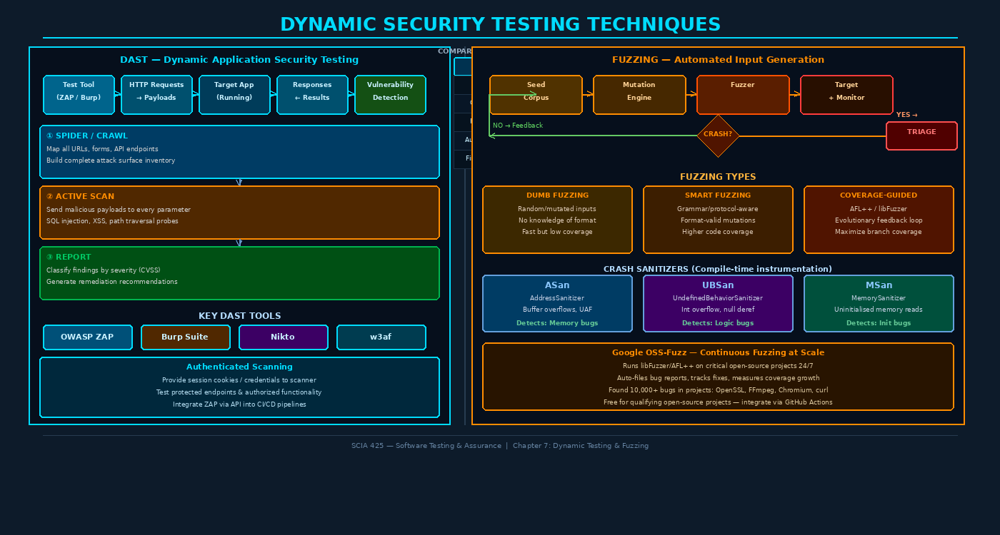

# Chapter 7: Dynamic Testing and Fuzzing



## 7.1 Testing by Execution: The Foundation of Dynamic Analysis

Static analysis (Chapter 5) examines code without running it. **Dynamic testing** requires the program to execute — inputs flow in, outputs flow out, and behavior is observed in real time. This is the most direct way to establish what software actually does, as opposed to what it was intended to do or what a static model predicts it does. Many vulnerabilities are simply impossible to detect statically: timing-dependent race conditions, runtime configuration errors, server-side logic flaws that only manifest under specific state sequences, and memory corruption bugs that depend on heap layout.

Dynamic Application Security Testing (DAST) applies execution-based testing specifically to discover security vulnerabilities in running applications. Unlike SAST, which runs on source code before deployment, DAST operates against a deployed application — making it architecture-agnostic and language-agnostic. A DAST tool doesn't care whether your backend is Python, Java, or Go; it sends HTTP requests and analyzes responses.

> **Key Insight:** DAST simulates what an attacker does. It probes your application from the outside with no privileged knowledge, exactly as an adversary would approach a target. The tool's advantage over a human attacker is speed and repeatability; the human attacker's advantage over the tool is creativity and context.

---

## 7.2 DAST Architecture and Workflow

A DAST scanner operates in three sequential phases:

### Phase 1: Discovery / Spidering

Before attacking, the scanner must map the application's **attack surface** — all the URLs, forms, API endpoints, parameters, and input vectors that could accept data. This is done through:

- **Traditional crawling** — Following HTML links, submitting forms, discovering URLs
- **AJAX/SPA crawling** — Executing JavaScript to discover dynamically rendered content
- **API discovery** — Parsing OpenAPI/Swagger specs or discovering REST endpoints empirically
- **Sitemap parsing** — Using `robots.txt`, sitemaps, and known-path wordlists

The output is a comprehensive inventory of attack surface, organized as a site tree.

### Phase 2: Active Scanning

For each discovered input point (URL parameter, form field, HTTP header, JSON body field), the scanner systematically sends **malicious test payloads** designed to trigger vulnerability-specific responses:

```
Parameter: ?id=1
Test payloads:
  SQL Injection:     ?id=1' OR '1'='1
  XSS:               ?id=<script>alert(1)</script>
  Path Traversal:    ?id=../../../etc/passwd
  Command Injection: ?id=1; ls -la
  XXE:               ?id=<!DOCTYPE foo [<!ENTITY xxe SYSTEM "file:///etc/passwd">]>
```

The scanner analyzes responses for signatures of successful exploitation: error messages, unexpected content, timing anomalies, or out-of-band callbacks.

### Phase 3: Analysis and Reporting

Findings are classified by severity (typically using CVSS) and deduplicated. A quality DAST report includes:

- Evidence (request/response demonstrating the vulnerability)
- Risk rating and CVSS score
- Reproduction steps
- Remediation guidance
- False positive status (some findings require manual validation)

---

## 7.3 OWASP ZAP: Architecture and Professional Usage

OWASP ZAP (Zed Attack Proxy) is the premier open-source DAST tool, maintained by the Open Web Application Security Project. Its architecture comprises several cooperative components:

| Component | Function |
|-----------|----------|
| **Proxy** | Intercepts browser ↔ application traffic; records all requests |
| **Spider** | Passive crawler discovering application structure |
| **Ajax Spider** | Executes JavaScript to discover SPA content |
| **Passive Scanner** | Analyzes traffic without sending additional requests |
| **Active Scanner** | Sends attack payloads to all discovered inputs |
| **Fuzzer** | Targeted parameter fuzzing with custom wordlists |
| **Scripting Engine** | Automates complex test scenarios via JS/Python/Groovy |

### CI/CD Integration with ZAP

ZAP can be fully automated in CI/CD pipelines via its Docker image and command-line API:

```bash
# Baseline scan (passive only — safe for any environment)
docker run --rm owasp/zap2docker-stable zap-baseline.py \
  -t https://staging.myapp.com \
  -r baseline-report.html \
  -z "-config scanner.attackStrength=HIGH"

# Full active scan (only against non-production environments)
docker run --rm owasp/zap2docker-stable zap-full-scan.py \
  -t https://staging.myapp.com \
  -r full-scan-report.html \
  --auto

# API scan using OpenAPI spec
docker run --rm owasp/zap2docker-stable zap-api-scan.py \
  -t https://staging.myapp.com/api/v1/openapi.json \
  -f openapi \
  -r api-scan-report.html
```

### Authenticated Scanning

Most application vulnerabilities hide behind authentication. Configuring ZAP to maintain a valid session requires:

1. Recording a login sequence as a ZAP script
2. Specifying the authentication method (form-based, HTTP basic, OAuth bearer token)
3. Defining session validity indicators (what a logged-in response looks like)
4. Configuring automatic re-authentication when session expires

Without authenticated scanning, DAST only sees the login page and public content — typically 10-20% of the actual attack surface.

---

## 7.4 Burp Suite: Professional Security Testing

Burp Suite (PortSwigger) is the industry-standard commercial tool for manual and automated web security testing. Its workflow centers on the **proxy** — all browser traffic is intercepted, allowing real-time inspection and modification.

Key modules:

**Burp Scanner** — Automated active scanning with a sophisticated detection engine, particularly strong at injection vulnerabilities and logic flaws.

**Burp Intruder** — Highly configurable fuzzing tool with four attack modes:
- **Sniper** — One payload set, one position at a time
- **Battering Ram** — Same payload in all positions simultaneously
- **Pitchfork** — Multiple payload sets, synchronized across positions
- **Cluster Bomb** — Multiple payload sets, all combinations (Cartesian product)

**Burp Repeater** — Manual request replay with live editing. Essential for understanding a vulnerability's behavior and crafting targeted exploits.

**Burp Collaborator** — Out-of-band (OOB) vulnerability detection. When a server makes an external request to the Collaborator server, it confirms vulnerabilities like SSRF, blind XSS, XXE, and blind SQL injection that don't produce visible output in the response.

```
# Example: Blind SSRF detection via Collaborator
# Original request: POST /webhook with url=https://partner.com/notify
# Injected payload:  url=https://xyz.burpcollaborator.net/callback
# If Collaborator receives a DNS lookup or HTTP request → SSRF confirmed
```

---

## 7.5 Manual Dynamic Testing Techniques

Automated scanners miss logic flaws. The following manual techniques complement automated DAST:

**Parameter Tampering** — Modifying URL parameters, POST data, or cookies that encode business logic:
```
Original: GET /order?discount=5&tier=standard
Tampered: GET /order?discount=100&tier=admin
```

**Cookie Manipulation** — Decoding, modifying, and re-encoding session cookies to test for insecure deserialization, predictable tokens, or improper access controls.

**HTTP Header Injection** — Testing non-standard headers for unexpected processing: `X-Forwarded-For`, `X-Original-URL`, `X-Rewrite-URL`, `Host` header injection.

**Forced Browsing** — Directly accessing URLs that should be restricted, bypassing the intended navigation flow. Tests for broken access control (OWASP Top 10 #1 2021).

**Session Token Analysis** — Capturing multiple session tokens and analyzing for patterns: sequential IDs, short entropy, predictable timestamps embedded in tokens.

**Business Logic Testing** — Exercising workflows in unintended sequences: placing an order with zero quantity, submitting a form twice, navigating backward in a multi-step process.

---

## 7.6 Fuzzing: Automated Discovery of Unknown Unknowns

Fuzzing (fuzz testing) is the technique of automatically generating large volumes of inputs to a target program, monitoring for crashes, hangs, or unexpected behavior. It is uniquely powerful at discovering vulnerability classes that other techniques miss: **memory corruption bugs** (buffer overflows, use-after-free, integer overflows), parser bugs, and edge cases in input handling.

The technique was introduced by Barton Miller at the University of Wisconsin–Madison in 1989. His study sent random inputs to 25 Unix utility programs and found that one-third crashed or hung. The results were shocking for the time and remain instructive: even heavily used, mature software breaks on unexpected inputs.

### 7.6.1 Fuzzing Types

**Dumb Fuzzing (Mutation-Based)** — Start with valid seed inputs and apply random mutations: flip bits, insert/delete bytes, repeat sequences, insert special characters. Fast to implement, but inefficient — many mutations produce invalid inputs that are rejected before reaching interesting code paths.

**Generation-Based (Smart) Fuzzing** — Uses a grammar, protocol specification, or format model to generate structurally valid but semantically unusual inputs. A grammar-based fuzzer for JSON will always generate valid JSON, ensuring the parser receives well-formed inputs before encountering edge cases.

**Coverage-Guided Fuzzing** — The state-of-the-art technique. Instruments the target binary to measure which branches are executed for each input. Uses evolutionary algorithms to preferentially mutate inputs that discover new code coverage. When a mutation causes a new branch to execute, the mutated input is added to the corpus and used for further mutation.

```
Coverage-Guided Fuzzing Loop:
  1. Start with seed corpus (small set of valid inputs)
  2. Mutate a corpus input → new test case
  3. Run target with new test case (instrumented binary)
  4. If new coverage found: add to corpus, go to 2
  5. If crash: save crash input, continue
  6. If no new coverage: discard, go to 2
```

---

## 7.7 AFL++ and libFuzzer: Production Coverage-Guided Fuzzers

**AFL++ (American Fuzzy Lop++)** is the dominant open-source fuzzer for compiled programs. Key features:

- LLVM/GCC-based compile-time instrumentation for coverage feedback
- Multiple mutation strategies (havoc, splicing, deterministic stages)
- Persistent mode for in-process fuzzing (10x-100x faster)
- Parallel fuzzing across multiple CPU cores
- Fork server to avoid repeated process initialization overhead

```bash
# Compiling a target with AFL++ instrumentation
AFL_USE_ASAN=1 afl-clang-fast -o target_fuzz target.c

# Running the fuzzer
afl-fuzz -i seeds/ -o findings/ -m none -- ./target_fuzz @@
#                                         ^^ Input file placeholder
```

**libFuzzer** is an LLVM-integrated in-process fuzzer. Rather than launching a new process for each input, libFuzzer calls a fuzz target function directly within the process, achieving enormous throughput:

```c
// libFuzzer target function signature
extern "C" int LLVMFuzzerTestOneInput(const uint8_t *data, size_t size) {
    // Parse, process, or feed 'data' to the target code
    ParseInput(data, size);
    return 0;  // Non-zero return values are reserved
}
```

**Google OSS-Fuzz** runs libFuzzer and AFL++ continuously on over 1,000 critical open-source projects. It has found over 10,000 vulnerabilities in projects including OpenSSL, Chromium, FFmpeg, curl, and the Linux kernel. Integration requires writing a fuzz target function and a simple build script — the service handles scaling, storage, and bug reporting automatically.

---

## 7.8 Sanitizers: Amplifying Fuzzing Effectiveness

A fuzzer can only detect bugs that produce observable failures: crashes, hangs, or assertion violations. Many serious vulnerabilities — particularly memory corruption bugs — don't immediately crash the program; they silently corrupt memory, enabling exploitation. **Sanitizers** are compile-time instrumentation tools that make these bugs loudly observable.

| Sanitizer | Abbreviation | Detects | Overhead |
|-----------|-------------|---------|---------|
| AddressSanitizer | ASan | Buffer overflows, heap use-after-free, stack smashing | 2x memory, 2x time |
| UndefinedBehaviorSanitizer | UBSan | Signed integer overflow, null pointer deref, type confusion | ~20% time |
| MemorySanitizer | MSan | Use of uninitialized memory | 3x time |
| ThreadSanitizer | TSan | Data races, deadlocks | 5-20x time |

Always compile fuzz targets with `ASan + UBSan` at minimum:

```bash
clang -fsanitize=address,undefined -fno-omit-frame-pointer -g \
      -o target_sanitized target.c
```

Sanitizers convert silent memory bugs into immediate, deterministic crashes with detailed diagnostic output — stack traces, memory maps, and variable states — dramatically accelerating triage.

---

## 7.9 Crash Triage and Differential Fuzzing

When a fuzzer finds a crash, the raw crash input may not be the minimal reproducible case. **Crash triage** involves:

1. **Deduplication** — Many crash inputs trigger the same underlying bug; deduplicate by crash stack hash
2. **Minimization** — Reduce the crashing input to the smallest possible case (`afl-tmin`, `creduce`)
3. **Severity classification** — Is the crash exploitable? (arbitrary write > controlled read > assertion)
4. **Reproduction** — Ensure the minimal case reproduces reliably and is saved with the bug report

**Differential fuzzing** tests multiple implementations of the same specification against identical inputs, flagging discrepancies. Two XML parsers should produce identical parse trees for the same input; if they don't, one has a bug. This technique discovered the **JSONFuzz** findings where multiple JSON parsers had inconsistent behavior for edge cases, enabling security bypasses in systems that applied validation with one parser but processed with another.

---

## 7.10 IAST: Interactive Application Security Testing

IAST instruments the application runtime — typically via a language agent injected at startup — to monitor data flow and taint propagation *during normal test execution* (functional testing, integration tests, load tests). Unlike DAST, IAST sees inside the application and can pinpoint the exact vulnerable line of code. Unlike SAST, it operates on real execution paths with real data.

```
IAST agent monitors:
  → Untrusted input enters the application (HTTP parameter, header, cookie)
  → Input flows through transformation functions
  → Input reaches a sensitive sink (database query, file path, shell command)
  → If input reaches sink without proper sanitization → vulnerability reported
```

IAST tools (Contrast Security, Seeker, HCL AppScan) produce extremely low false-positive rates because they report only vulnerabilities that were actually exercised, with full execution context. The downside is the requirement to instrument and deploy the application — impractical for third-party systems or compiled binaries.

---

## 7.11 Regression Testing for Security Patches

When a security vulnerability is fixed, a **security regression test** should be added to the test suite to prevent re-introduction:

```python
# After fixing CVE-2023-XXXX (SQL injection in search endpoint):
def test_search_rejects_sql_injection():
    """Regression test: CVE-2023-XXXX — SQL injection in search"""
    malicious_inputs = [
        "'; DROP TABLE users; --",
        "1' OR '1'='1",
        "admin'/*",
        "1; SELECT * FROM secrets",
    ]
    for payload in malicious_inputs:
        response = client.get(f"/search?q={payload}")
        assert response.status_code in [400, 422]
        assert "syntax error" not in response.text.lower()
        assert "sql" not in response.text.lower()
```

Regression tests are the institutional memory of your security history. They prevent the tragically common pattern of re-discovering and re-fixing the same vulnerability in a future development cycle.

---

## Key Terms

| Term | Definition |
|------|-----------|
| **DAST** | Dynamic Application Security Testing — black-box testing of running applications |
| **OWASP ZAP** | Open-source DAST proxy and scanner maintained by OWASP |
| **Burp Suite** | Commercial web application security testing platform (PortSwigger) |
| **Fuzzing** | Automated testing with semi-random or mutated inputs to discover crashes |
| **Coverage-Guided Fuzzing** | Uses execution coverage feedback to guide mutation toward new code paths |
| **AFL++** | American Fuzzy Lop++ — dominant open-source coverage-guided fuzzer |
| **libFuzzer** | LLVM in-process fuzzer for high-throughput target function fuzzing |
| **Seed Corpus** | Initial set of valid inputs used as starting point for fuzzing mutations |
| **AddressSanitizer (ASan)** | Compile-time tool that detects memory safety violations at runtime |
| **Mutation Score** | Ratio of detected-to-introduced code mutations (test suite strength metric) |
| **Out-of-band Detection** | Vulnerability detection via external callbacks (Burp Collaborator) |
| **Crash Triage** | Process of deduplicating, minimizing, and classifying fuzzer-found crashes |
| **Differential Fuzzing** | Comparing multiple implementations against the same inputs to find discrepancies |
| **IAST** | Interactive Application Security Testing — runtime instrumented hybrid approach |
| **Forced Browsing** | Directly accessing URLs that should be restricted without proper authorization |
| **Session Token Analysis** | Examining tokens for predictability, short entropy, or embedded timestamps |
| **OSS-Fuzz** | Google's continuous fuzzing service for open-source projects |
| **Sanitizers (ASan/UBSan/MSan)** | Runtime instrumentation tools that amplify bug observability during fuzzing |
| **Parameter Tampering** | Modifying request parameters to test business logic controls |
| **Regression Test** | Test added after a bug fix to prevent re-introduction of the same defect |

---

## Review Questions

1. Explain why DAST is described as "architecture-agnostic" compared to SAST. What types of vulnerabilities can DAST find that SAST cannot, and vice versa?

2. Describe the three phases of a DAST scan (spider/crawl → active scan → report). What specific risk does an *unauthenticated* DAST scan miss, and how does authenticated scanning address this gap?

3. Compare Burp Intruder's four attack modes (Sniper, Battering Ram, Pitchfork, Cluster Bomb). For each, describe a specific testing scenario where that mode is most appropriate.

4. Barton Miller's 1989 fuzzing study found that 1 in 3 Unix utilities crashed on random input. Why is this result still relevant 35 years later, and what does it imply about modern software?

5. Explain the evolutionary feedback loop in coverage-guided fuzzing. How does AFL++ "learn" to explore deeper code paths over time, and why is this fundamentally more effective than dumb (random) fuzzing?

6. You are fuzzing a PDF parser compiled as a Linux binary. Describe the complete setup: compilation flags (including which sanitizers), seed corpus construction, fuzzer command, and what success looks like after 24 hours.

7. What is a "silent memory corruption" bug, and why are sanitizers essential when combined with fuzzing? Give an example of a vulnerability class that would be invisible to a fuzzer without AddressSanitizer.

8. Compare DAST and IAST across four dimensions: deployment requirements, false positive rate, vulnerability depth reported, and applicability to third-party software.

9. Explain the concept of differential fuzzing and describe how it could be used to find security-relevant discrepancies between two JSON parsing libraries used in a security policy enforcement system.

10. After patching a SQL injection vulnerability in a user search feature, what security regression tests should you add to the test suite? Write at least three test cases in pseudocode.

---

## Further Reading

1. **Miller, B.P., Fredriksen, L., & So, B.** (1990). "An Empirical Study of the Reliability of UNIX Utilities." *Communications of the ACM*, 33(12), 32-44. — The original fuzzing paper that started the field.

2. **Zalewski, M.** (2015). *The Fuzzer's Book / AFL Technical Details*. lcamtuf.blogspot.com. — Deep technical explanation of AFL's coverage-guided mutation strategy from its creator.

3. **Serebryany, K., et al.** (2012). "AddressSanitizer: A Fast Address Sanity Checker." *USENIX Annual Technical Conference*. — The original ASan paper describing the instrumentation approach and performance characteristics.

4. **OWASP.** (2023). *OWASP Testing Guide v4.2*. owasp.org. — Comprehensive methodology for manual and automated dynamic testing of web applications.

5. **Klees, G., et al.** (2018). "Evaluating Fuzz Testing." *ACM CCS 2018*. — Rigorous analysis of fuzzing evaluation methodology; essential reading for understanding what fuzzing benchmarks actually measure.
