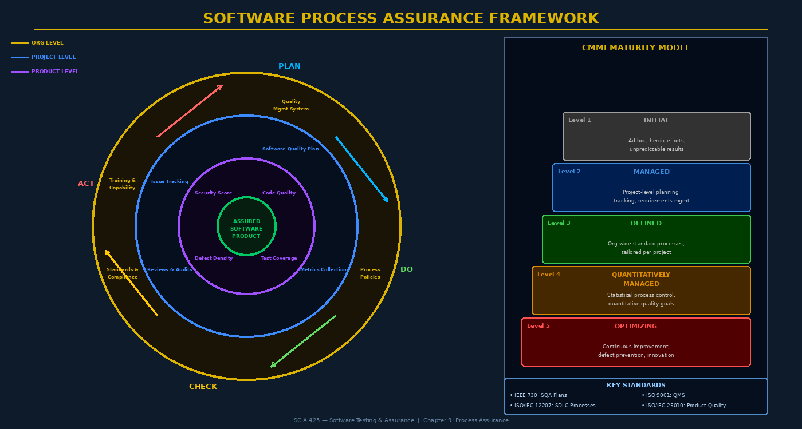

# Chapter 9: Process Assurance and Software Quality Plans



## 9.1 Process Assurance: The Upstream Root Cause

The quality of a software product is not an accident — it is a consequence. If your development process consistently produces low-quality code, no amount of downstream testing will fully compensate. You can test in some quality, but you cannot test *in* the quality that a disciplined process would have produced. This is the foundational insight of **process assurance**: the discipline of ensuring that the development process itself is healthy, followed, and continuously improving.

The contrast between product assurance and process assurance is a classic dichotomy in quality management. **Product assurance** asks: "Does this artifact meet its requirements?" **Process assurance** asks: "Are we following a process that predictably produces correct artifacts?" The two are deeply related — Watts Humphrey's empirical research at the Software Engineering Institute established that organizations with mature, disciplined processes produce software with significantly fewer defects, even before accounting for testing.

Philip Crosby's aphorism "Quality is free" captures the economic argument: the cost of preventing defects through better process is less than the cost of detecting and fixing them later. Early defect injection (in requirements, architecture, or design phases) costs exponentially more to fix than defects caught in the phase where they're introduced. IBM's studies in the 1970s and NASA's data from shuttle software development both demonstrate order-of-magnitude cost multipliers for late defect discovery.

> **Key Principle:** A defect found in requirements costs approximately $1 to fix. The same defect found in system testing costs $100. Found in production, it costs $1,000-$10,000. Process assurance is an investment in early detection and prevention.

---

## 9.2 Software Quality Assurance: IEEE 730

**Software Quality Assurance (SQA)** is the set of systematic activities that provides evidence that the software process and product conform to established requirements, standards, and procedures. The authoritative standard is **IEEE 730-2014: IEEE Standard for Software Quality Assurance Plans**.

SQA activities span the entire software development lifecycle:

| SQA Activity | Description | Artifacts |
|-------------|-------------|-----------|
| **Process Standards Definition** | Define mandatory development standards and procedures | Standards catalog, process tailoring guidelines |
| **Quality Planning** | Plan QA activities for the project | Software Quality Plan (SQP) |
| **Reviews and Audits** | Formal evaluation of process and product artifacts | Review records, audit reports |
| **Metrics Collection** | Gather and analyze quality measurements | Metrics dashboard, trend reports |
| **Defect Tracking** | Log, classify, analyze, and trend defects | Defect database, Pareto analysis |
| **Configuration Management Oversight** | Ensure CM processes are followed | CM audit records |
| **Supplier Control** | Assess and monitor third-party quality | Supplier assessment records |
| **Training** | Ensure team has required skills | Training records |

---

## 9.3 The Software Quality Plan

The **Software Quality Plan (SQP)** is the project-level document that governs all quality activities. IEEE 730 specifies the following required sections:

### SQP Structure (IEEE 730-2014)

**1. Purpose and Scope** — What system does this plan govern? What are the quality objectives (defect rate targets, coverage requirements, security standards)?

**2. Reference Documents** — Standards (ISO 9001, NIST CSF), regulatory requirements, organizational process standards, referenced project documents.

**3. Management** — Organizational chart showing quality roles and responsibilities. Who is the SQA manager? What authority does QA have to halt delivery? Who resolves escalated quality issues?

**4. Documentation Requirements** — What documents must be produced? What templates? What review and approval process? What retention requirements?

**5. Standards, Practices, and Conventions** — Coding standards (language-specific), naming conventions, documentation standards, security coding guidelines (CERT, SEI), API design standards.

**6. Reviews and Audits Schedule** — Types of reviews (requirements review, design review, code review, test readiness review), schedule, entrance/exit criteria, roles.

**7. Problem Reporting and Corrective Action** — Defect classification scheme, severity/priority definitions, escalation paths, resolution process, closure criteria.

**8. Tools and Techniques** — Approved tools list: IDE plugins, SAST scanners, test frameworks, coverage tools, CI/CD platform.

**9. Media Control** — How are deliverables managed? Version control, backup, integrity verification (checksums), artifact signing.

**10. Supplier Control** — How are third-party components assessed? SBOM (Software Bill of Materials) requirements, supplier security assessments.

**11. Records Collection and Retention** — What quality records must be kept? For how long? For regulatory compliance?

```markdown
# Example SQP Excerpt: Exit Criteria for Code Review

Code review is required before merging to main branch. Exit criteria:
  - All review comments resolved or explicitly deferred with ticket reference
  - Automated checks pass: linter, SAST (zero Critical/High findings), coverage ≥ 80%
  - At least one approved review from team member with relevant domain knowledge
  - Security-sensitive code (auth, crypto, input handling) requires additional review
    from security champion or designated security reviewer
  - Review evidence (PR comments, approval records) retained in version control system
```

---

## 9.4 Quality Audits

Audits are formal, independent evaluations of compliance with defined processes or standards. The key characteristic is **independence** — an audit is not a peer review; it is an objective third-party evaluation.

### Types of Audits

**Process Audits** — Verify that development teams are following defined processes. Examples:
- Is the team conducting required code reviews before merging?
- Are test cases being documented per the quality plan?
- Is the defect tracking process being followed?
- Are security code review requirements being applied to authentication changes?

**Product Audits** — Verify that artifacts conform to their specifications and standards:
- Does the delivered software implement all specified security requirements?
- Does the test documentation reflect the actual tests performed?
- Are all deliverables present and signed off per the documentation requirements?

### Audit Process

```
1. PLANNING:     Define audit scope, objectives, criteria, schedule, audit team
2. PREPARATION:  Review previous audit results, collect reference materials
3. EXECUTION:    Conduct interviews, examine records, test compliance evidence
4. REPORTING:    Document findings (conformances, nonconformances, observations)
5. FOLLOW-UP:    Track corrective actions to closure; verify effectiveness
```

A nonconformance finding requires a **Corrective Action Request (CAR)**: root cause analysis, remediation plan, target date, and verification that the corrective action was effective.

---

## 9.5 CMMI: Capability Maturity Model Integration

**CMMI (Capability Maturity Model Integration)** is a process improvement framework developed by the Software Engineering Institute (SEI) at Carnegie Mellon University. It defines five **maturity levels** that describe the progressively more mature characteristics of an organization's development processes:

| Level | Name | Characteristics | Key Process Areas |
|-------|------|-----------------|-------------------|
| **1** | Initial | Ad hoc, heroic, unpredictable | None — starting point |
| **2** | Managed | Project-level planning, tracking | Requirements Mgmt, Project Planning, Configuration Mgmt, QA, Measurement |
| **3** | Defined | Org-wide standard processes, tailored per project | Process Definition, Training, Integrated Project Mgmt, Risk Mgmt |
| **4** | Quantitatively Managed | Statistical process control, quantitative goals | Organizational Process Performance, Quantitative Project Mgmt |
| **5** | Optimizing | Continuous innovation and defect prevention | Causal Analysis, Organizational Innovation |

Most organizations operate at Level 1 or 2. Level 3 is a common target for organizations with DoD or government contracts. Levels 4 and 5 require sophisticated statistical measurement infrastructure that is only cost-effective for large, mature software development organizations.

The progression from Level 1 to Level 2 is often the most impactful: moving from heroic, individual-dependent effort to repeatable, process-defined project management.

---

## 9.6 ISO 9001 and ISO/IEC 12207

**ISO 9001:2015** is the international standard for Quality Management Systems (QMS). While not software-specific, its requirements apply directly to software development organizations:

- **Clause 4:** Context of the organization — understand stakeholders, define QMS scope
- **Clause 6:** Planning — risk-based thinking, quality objectives, change management
- **Clause 7:** Support — competence, awareness, documented information
- **Clause 8:** Operation — software development and delivery processes
- **Clause 9:** Performance evaluation — internal audits, management review, metrics analysis
- **Clause 10:** Improvement — nonconformance management, continual improvement

ISO 9001 certification requires a third-party audit by an accredited certification body and annual surveillance audits. The standard requires demonstrable evidence of process compliance — documented procedures, records, and results.

**ISO/IEC 12207:2017** defines the full Software Life Cycle Processes framework: acquisition, supply, development, operation, maintenance processes, and supporting processes (documentation, configuration management, quality assurance, verification, validation, joint review, audit, problem resolution).

---

## 9.7 Agile Quality Assurance

Traditional SQA was designed for waterfall development — heavyweight documentation, phase-gate reviews, formal audits. Agile development requires adapting these principles to a faster cadence without sacrificing their intent.

### Definition of Done as a Quality Gate

The **Definition of Done (DoD)** is the agile analog of exit criteria — a team-agreed checklist that every user story must satisfy before being considered complete:

```
Definition of Done — Example:
  ✓ All acceptance criteria implemented and verified by product owner
  ✓ Unit tests written with ≥ 80% branch coverage
  ✓ Code reviewed by at least one peer (approved PR)
  ✓ SAST scan run — zero Critical/High severity findings
  ✓ Integration tests pass in CI
  ✓ Documentation updated (API docs, README, architecture decision record if applicable)
  ✓ Security review completed for auth/input handling changes
  ✓ Performance meets baseline (response time < 200ms p95 under normal load)
```

### Sprint Retrospectives as Process Improvement

The sprint retrospective is the agile mechanism for continuous process improvement — the team reflects on what worked, what didn't, and agrees on specific experiments to try. This is the Kaizen principle — continuous small improvements — applied to software development.

Structure: **What went well? | What didn't go well? | What do we try differently?**

Retrospective findings that identify quality issues (e.g., "we keep missing edge cases in input validation") should result in concrete process changes (e.g., "we add a security checklist item to our code review template for all input-handling changes").

### DevSecOps Quality Gates

In CI/CD pipelines, quality gates are automated enforcement mechanisms that prevent low-quality code from progressing through the pipeline:

```yaml
# GitHub Actions quality gate example
quality-gate:
  steps:
    - name: Coverage Gate
      run: |
        coverage_pct=$(python -m pytest --cov=src --cov-report=json | jq '.totals.percent_covered')
        if (( $(echo "$coverage_pct < 80" | bc -l) )); then
          echo "QUALITY GATE FAILED: Coverage $coverage_pct% < 80% threshold"
          exit 1
        fi
    
    - name: Security Gate (SAST)
      run: |
        semgrep --config=auto --error src/   # Non-zero exit on findings
    
    - name: Dependency Vulnerability Gate
      run: |
        safety check --full-report
        # Fails if any High/Critical CVE in dependencies
    
    - name: Complexity Gate
      run: |
        radon cc src/ -a -nb --min B   # Fail on functions with complexity > B (10)
```

---

## 9.8 Defect Tracking and Root Cause Analysis

Effective defect management transforms individual bugs into organizational learning.

### Orthogonal Defect Classification (ODC)

IBM's **Orthogonal Defect Classification (ODC)** taxonomy classifies defects along multiple orthogonal dimensions, enabling analysis of where defects originate and what kinds of process changes would prevent them:

- **Defect Type**: Function, Assignment, Interface, Checking, Timing/Serialization, Build/Package/Merge, Documentation, Algorithm
- **Defect Trigger**: Workload/Stress, Rare Situation, Simple Path, Complex Path
- **Impact**: Reliability, Performance, Installability, Security, Usability

### Root Cause Analysis Techniques

**Fishbone (Ishikawa) Diagram** — Organizes potential root causes by category (People, Process, Tools, Materials, Environment, Measurement) visually showing causal relationships.

**5 Whys** — Iteratively ask "why?" to drill past symptoms to root causes:

```
Problem: Authentication bypass vulnerability shipped to production.
Why 1: The security code review was skipped.
Why 2: The ticket was not tagged as security-sensitive.
Why 3: Developers don't know the tagging criteria.
Why 4: The tagging criteria were never documented or communicated.
Why 5: No one owns the responsibility for security criteria documentation.
Root Cause: Unclear ownership of security requirement communication.
Corrective Action: Assign security champion role; define and publish tagging criteria;
                   update Definition of Done to require security tag review.
```

---

## 9.9 Configuration Management as Quality Assurance

Configuration management (CM) ensures that the software product being tested, reviewed, and delivered is exactly the product that was specified — not a slightly different version, not an unofficial build, not an untested configuration.

CM as quality assurance encompasses:
- **Version control** — Every artifact tracked; every change attributed and logged
- **Build reproducibility** — Same source + same build environment = same binary (deterministic builds)
- **Artifact integrity** — Checksums and digital signatures on all deliverables
- **Change control** — Formal approval process for changes to baselined artifacts
- **Baseline management** — Formal snapshots of approved artifact sets at key milestones

```bash
# Example: Verifying build artifact integrity
sha256sum release-2.3.1.jar
# 7f3c9a4b8e2d1f5a6c0b9d3e7a4c8f2b1e5d9a3c7f4b2e6d0a8c1f5b9e3d7a  release-2.3.1.jar

# Verify against published hash
if [ "$(sha256sum release-2.3.1.jar | cut -d' ' -f1)" != "$EXPECTED_HASH" ]; then
  echo "INTEGRITY FAILURE: Artifact hash mismatch"
  exit 1
fi
```

---

## Key Terms

| Term | Definition |
|------|-----------|
| **Process Assurance** | Ensuring the development process itself produces quality outcomes |
| **SQA** | Software Quality Assurance — systematic activities for quality evidence |
| **IEEE 730** | IEEE standard for Software Quality Assurance Plans |
| **Software Quality Plan** | Document governing all quality activities for a project |
| **CMMI** | Capability Maturity Model Integration — 5-level process maturity framework |
| **ISO 9001** | International standard for Quality Management Systems |
| **ISO/IEC 12207** | Standard for Software Life Cycle Processes |
| **Process Audit** | Verification that defined processes are being followed |
| **Product Audit** | Verification that artifacts conform to specifications |
| **CAR** | Corrective Action Request — formal response to audit nonconformance |
| **Definition of Done** | Agile quality gate checklist that all stories must satisfy before completion |
| **ODC** | Orthogonal Defect Classification — IBM's multi-dimensional defect taxonomy |
| **5 Whys** | Root cause analysis technique iterating questions to underlying causes |
| **DevSecOps Quality Gate** | Automated pipeline enforcement of quality thresholds |
| **Configuration Management** | Systematic control of software artifacts, changes, and versions |
| **Sprint Retrospective** | Agile process improvement ceremony — inspect and adapt the process |
| **Quality Gate** | Automated pass/fail threshold enforcing quality metrics in CI/CD |
| **Fishbone Diagram** | Ishikawa cause-and-effect diagram for root cause analysis |
| **Defect Density** | Number of defects per unit of software size (KLOC or function points) |
| **SBOM** | Software Bill of Materials — inventory of all software components and dependencies |

---

## Review Questions

1. Explain the distinction between **process assurance** and **product assurance**. Why does the quality of the development process affect the quality of the product, even before any testing occurs?

2. Philip Crosby argued that "quality is free." Explain this claim in terms of the cost of quality model: what costs does a quality program prevent, and why does the total economic calculation support investment in prevention?

3. Describe the required sections of a **Software Quality Plan** per IEEE 730. Which sections do you consider most important for a security-sensitive application, and why?

4. Distinguish between a **process audit** and a **product audit**. For each type, give a concrete example of a finding that would be raised in a web application development context.

5. An organization is at **CMMI Level 2**. What key process areas are present at Level 2, and what specific organizational changes would be required to reach Level 3?

6. Explain how the **Definition of Done** functions as a quality gate in agile development. Design a DoD checklist for a team developing a financial services API, including at least 8 criteria spanning functional, security, and documentation requirements.

7. Apply the **5 Whys** root cause analysis technique to the following defect: "A hardcoded API key was found in a production code commit." Identify the root cause and propose a corrective action that addresses that root cause systemically.

8. How does **DevSecOps** change the traditional SQA model? Describe four specific automated quality gates that should be implemented in a CI/CD pipeline for a web application with regulatory compliance requirements.

9. Explain **Orthogonal Defect Classification (ODC)** and describe how analyzing the distribution of defect types could inform process improvements. Give an example of a finding that would lead to a specific process change.

10. Describe the relationship between **configuration management** and software quality assurance. What quality assurance failures can result from inadequate configuration management practices?

---

## Further Reading

1. **Humphrey, W.S.** (1989). *Managing the Software Process*. Addison-Wesley. — Humphrey's foundational work establishing the relationship between process maturity and software quality, which led to the development of the CMM.

2. **IEEE Std 730-2014.** *IEEE Standard for Software Quality Assurance*. IEEE. — The authoritative specification for SQA plans and activities.

3. **Chrissis, M.B., Konrad, M., & Shrum, S.** (2011). *CMMI for Development: Guidelines for Process Integration and Product Improvement* (3rd ed.). Addison-Wesley. — The definitive CMMI reference from SEI authors.

4. **Poppendieck, M. & Poppendieck, T.** (2003). *Lean Software Development: An Agile Toolkit*. Addison-Wesley. — Applies Toyota Production System quality principles to software development, introducing the "stop the line" concept for software teams.

5. **Crosby, P.B.** (1979). *Quality is Free: The Art of Making Quality Certain*. McGraw-Hill. — Classic business case for quality investment; argues prevention costs less than failure costs.
