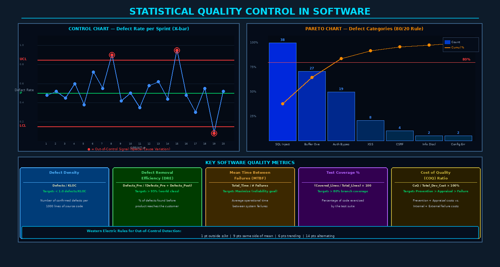

# Chapter 10: Statistical Quality Control and Metrics



## 10.1 From Intuition to Data: Statistical Quality Management

In the early decades of software development, quality management was largely intuitive. Experienced developers had a "feel" for whether a project was on track. A project was "done" when it felt done. Quality was "good enough" when the team was tired of testing. This approach fails in any domain where the consequences of poor quality are significant — and software security makes the consequences of poor quality severe and measurable in breach costs, regulatory penalties, and reputational damage.

Statistical quality management — rooted in the work of Walter Shewhart and W. Edwards Deming in manufacturing — provides a rigorous alternative: **measure processes and products quantitatively, distinguish random variation from meaningful signals, and make decisions based on data rather than intuition**. Deming's 14 Points for Management and his PDCA (Plan-Do-Check-Act) cycle were developed in the context of post-war Japanese manufacturing, but every principle translates directly to software development.

The central premise: **software development is a process, and all processes exhibit variation.** Some variation is inherent and random (**common cause variation**) — the normal noise of a stable process. Some variation indicates that something significant has changed (**special cause variation**) — a new library with bugs, a developer who is sick, a deployment to a new environment with different configuration. Statistical process control gives us tools to distinguish these two types of variation objectively.

> **Deming's Insight:** Tampering with a stable process (treating common cause variation as if it were special cause) makes the process *worse*. A manager who reacts to every defect spike by mandating overtime is potentially disrupting a stable process rather than addressing a real problem.

---

## 10.2 Software Quality Metrics Taxonomy

A comprehensive metrics program covers three dimensions: product characteristics, process behavior, and in-process indicators.

### 10.2.1 Product Metrics

**Size Metrics:**
- **Lines of Code (LOC)** — Simple but language-dependent; useful for trending within a language ecosystem
- **Function Points (FP)** — Language-independent measure of functional size; IFPUG method counts inputs, outputs, inquiries, internal files, external interfaces
- **Story Points** — Agile relative sizing; useful for velocity tracking but not absolute size comparison

**Complexity Metrics:**
- **Cyclomatic Complexity (McCabe)** — Counts linearly independent paths through code: `CC = E - N + 2P` (edges − nodes + 2×connected components). Strong predictor of defect density and testing effort:

```python
# Example: Calculating cyclomatic complexity
def authenticate(username, password, mfa_token=None):  # CC starts at 1
    if not username or not password:                    # +1 → CC=2
        raise ValueError("Credentials required")
    
    user = db.get_user(username)
    if user is None:                                    # +1 → CC=3
        return False
    
    if not check_password(password, user.hash):        # +1 → CC=4
        return False
    
    if user.requires_mfa:                              # +1 → CC=5
        if not mfa_token:                              # +1 → CC=6
            raise MFARequired()
        if not verify_mfa(mfa_token, user.secret):     # +1 → CC=7
            return False
    
    return True
# Cyclomatic Complexity: 7 → Requires minimum 7 test cases for branch coverage
```

Guidelines: CC ≤ 10 (simple), 11-20 (moderate), 21-50 (complex), > 50 (untestable — refactor).

**Halstead Metrics** — Derived from operator/operand counts in source code: vocabulary (η), length (N), volume (V), difficulty (D), effort (E), and estimated bugs (`B = V/3000`). Provides a theoretical defect count estimate independent of testing.

**Defect Metrics:**
- **Defect Density** = Defects / KLOC (or per Function Point) — Enables cross-project comparison
- **Defect Removal Efficiency (DRE)** = Pre-delivery defects / (Pre-delivery + Post-delivery defects) × 100% — World-class organizations achieve > 95% DRE

### 10.2.2 Process Metrics

| Metric | Formula | Interpretation |
|--------|---------|----------------|
| Defect Injection Rate | Defects_introduced / KLOC_coded | How many bugs per unit of development activity |
| Review Effectiveness | Defects_found_in_review / Total_pre_test_defects | What fraction of bugs does review catch? |
| Test Efficiency | Defects_found_in_testing / Total_pre_release_defects | Complements review effectiveness |
| Build Success Rate | Successful_builds / Total_builds | Stability of development environment |
| Mean Time to Detect | Average time from defect injection to discovery | Faster detection = cheaper fixes |

### 10.2.3 In-Process Metrics

In-process metrics provide real-time signals during development:

- **Code coverage %** — Tracked per commit; regression if coverage drops below threshold
- **SAST findings count** — Total and by severity category; trending upward signals degrading code quality
- **Open defects by severity** — Backlog of unresolved defects; P1/P2 count should trend to zero
- **Technical debt ratio** — SonarQube's ratio of remediation effort to development effort

---

## 10.3 Statistical Process Control for Software

Walter Shewhart's control chart (1924) is the core tool of Statistical Process Control. Applied to software, a control chart shows a quality metric plotted over time, with statistical control limits calculated from historical data. Points within the control limits represent **common cause variation** — random noise of a stable process. Points outside represent **special cause variation** — something has fundamentally changed.

### Control Chart Construction

For a **p-chart** (proportion of defective items per sample, appropriate for defect rate per sprint):

```
Given: 20 sprints of defect rate data
  data = [0.048, 0.052, 0.045, 0.060, 0.038, 0.072, 0.055, 0.090, ...]

Calculate:
  p̄ (center line) = mean defect rate = 0.050  (5.0 defects per 100 test cases)
  σ = sqrt(p̄ × (1-p̄) / n)    where n = sample size per sprint

Control Limits (3-sigma):
  UCL = p̄ + 3σ = 0.050 + 3(0.022) = 0.116  (11.6%)
  LCL = p̄ - 3σ = 0.050 - 3(0.022) = -0.016 → clipped to 0.0
```

### Western Electric Rules for Out-of-Control Signals

Beyond simple UCL/LCL violations, the Western Electric Statistical Quality Control Handbook (1956) defines eight additional rules for detecting special cause variation in patterns:

| Rule | Signal | Interpretation |
|------|--------|----------------|
| **Rule 1** | 1 point beyond ±3σ | Sudden large shift (most common rule) |
| **Rule 2** | 9 consecutive points same side of centerline | Sustained process shift |
| **Rule 3** | 6 consecutive points trending up or down | Gradual drift (e.g., accumulating tech debt) |
| **Rule 4** | 14 points alternating up/down | Systematic variation between two sub-processes |

These patterns are meaningful in software contexts:
- 9 points above the mean defect rate → a team or architectural change has degraded quality
- 6 points trending upward → gradual erosion of code quality over sprints
- 1 point above UCL → a specific sprint had an unusual event (rushed feature, new team member, incomplete review)

```python
# Applying Western Electric Rule 1 to sprint defect data
def detect_out_of_control(data, ucl, lcl):
    violations = []
    for i, point in enumerate(data):
        if point > ucl or point < lcl:
            violations.append({
                'sprint': i+1,
                'value': point,
                'rule': 'Rule 1: Outside 3-sigma limits',
                'action': 'Investigate special cause — what changed this sprint?'
            })
    return violations
```

---

## 10.4 Pareto Analysis of Software Defects

The **Pareto Principle** (Vilfredo Pareto's 80/20 observation) applies powerfully to software defects: approximately **80% of failures are caused by 20% of defect types**. For security specifically, OWASP's research consistently shows that a handful of vulnerability categories (injection, broken access control, cryptographic failures) account for the majority of exploitable vulnerabilities.

**Pareto Analysis Process:**
1. Collect defect data over a meaningful period (quarter, year, product release)
2. Categorize defects by type (input validation, authentication, error handling, race condition, etc.)
3. Count frequency by category and sort descending
4. Calculate cumulative percentage
5. Identify the "vital few" categories that reach 80% cumulative

```
Defect Category     | Count | % Total | Cumulative %
--------------------|-------|---------|-------------
SQL Injection        |  38   |  38.0%  |    38.0%
Buffer Overflow      |  27   |  27.0%  |    65.0%
Auth Bypass          |  19   |  19.0%  |    84.0%  ← 80% threshold crossed
XSS                  |   8   |   8.0%  |    92.0%
CSRF                 |   4   |   4.0%  |    96.0%
Info Disclosure      |   2   |   2.0%  |    98.0%
Config Error         |   2   |   2.0%  |   100.0%
                     
Action: Focus prevention and training on SQL Injection, Buffer Overflow, Auth Bypass first.
These three categories = 84% of all defects; fix the process for these three = 84% impact.
```

---

## 10.5 Reliability Modeling

**Software Reliability** is the probability that a software system will operate without failure for a specified period under specified conditions. Quantitative reliability modeling transforms test failure data into reliability estimates.

### Software Reliability Growth Models (NHPP Models)

As testing proceeds and defects are found and fixed, the software becomes more reliable — reliability *grows* during testing. Non-Homogeneous Poisson Process (NHPP) models capture this behavior.

**Goel-Okumoto Model:**
```
m(t) = a(1 - e^(-bt))
  where:
    m(t) = expected number of failures by time t
    a = total number of failures expected in infinite testing
    b = failure detection rate
```

**Practical Application:**

```python
import numpy as np
from scipy.optimize import curve_fit

def goel_okumoto(t, a, b):
    return a * (1 - np.exp(-b * t))

# Cumulative failures observed at test time points
test_times = np.array([10, 20, 30, 40, 50, 60, 70, 80])
cumulative_failures = np.array([5, 12, 22, 35, 44, 50, 54, 57])

# Fit model parameters
params, _ = curve_fit(goel_okumoto, test_times, cumulative_failures)
a_est, b_est = params
print(f"Estimated total failures: {a_est:.1f}")
print(f"Failure detection rate: {b_est:.4f}/hour")

# Predict additional test time for target reliability
# Target: 95% of failures detected → need m(t) = 0.95 * a_est
```

**Mean Time to Failure (MTTF)** estimation from field failure data:

```
MTTF = Total_operational_time / Number_of_failures

Example: System operates 10,000 hours with 4 failures
MTTF = 10,000 / 4 = 2,500 hours

For security context: 
  If system is exploited once per 6 months of operation:
  MTTF_security = 4,380 hours → target > 87,600 hours (10 years) for sensitive systems
```

---

## 10.6 Goal-Question-Metric (GQM) Framework

The **GQM approach**, developed by Victor Basili at the University of Maryland, provides a structured method for defining metrics that are purposefully connected to quality goals. The anti-pattern is "measure everything that's easy to measure" — leading to dashboards full of metrics that nobody acts on.

### GQM Hierarchy

```
GOAL:     Improve the security of the authentication module
          [Purpose: Reduce | Issue: Security vulnerabilities | Object: Auth module]

QUESTION: Q1: How often are authentication vulnerabilities introduced?
          Q2: How effectively are they caught before production?
          Q3: What is the time-to-fix for auth vulnerabilities?

METRIC:   M1: Defect density in auth module (auth bugs / KLOC of auth code)
          M2: DRE for auth-related defects (pre-delivery / total auth defects)
          M3: Mean time from auth vulnerability discovery to patch deployment
```

GQM forces the team to justify every metric by tracing it to a quality question, and every question to a business goal. Metrics with no parent question are candidates for removal; questions with no parent goal are candidates for deprioritization.

---

## 10.7 Cost of Quality Model

The **Cost of Quality (COQ)** model, developed by Juran and formalized by Crosby, categorizes all quality-related costs:

| Category | Examples | Typical Range |
|---------|---------|--------------|
| **Prevention** | Training, process design, security tooling, code review | 5-15% of CoQ |
| **Appraisal** | Testing, code review execution, security audits | 25-40% of CoQ |
| **Internal Failure** | Bug fixing, rework, refactoring, regression testing | 25-40% of CoQ |
| **External Failure** | Production incidents, breach costs, customer complaints, regulatory fines | 20-40% of CoQ |

The classic finding: **organizations with low quality maturity spend most of their CoQ on external failure**, which is the most expensive category by far. A major security breach can cost millions in remediation, legal fees, regulatory fines (GDPR: up to 4% of global annual revenue), and reputation damage.

The optimal investment strategy: shift spending **left** toward prevention and appraisal, reducing internal and external failure costs by more than the investment required.

```
Low-maturity organization:     5% Prevention + 10% Appraisal + 25% Internal + 60% External
High-maturity organization:   40% Prevention + 35% Appraisal + 20% Internal +  5% External

Total CoQ as % of project cost:  ~30% for low-maturity vs. ~10% for high-maturity
Net savings: 20 points of project cost — quality truly is free
```

---

## 10.8 Quality Dashboard Design

A quality dashboard should provide **actionable signals**, not just data. Key design principles:

- **Threshold-based alerting** — Red/yellow/green status is immediately readable; absolute numbers require context
- **Trend visualization** — Direction matters as much as current value; is defect density going up or down?
- **Audience segmentation** — Executive dashboard (risk posture, trend, cost) ≠ Engineering dashboard (specific metrics by component)
- **Actionable metrics only** — If no one will act on a metric regardless of its value, remove it

```
QUALITY DASHBOARD — KEY INDICATORS:
┌─────────────────────┬──────────┬──────────┬─────────┐
│ Metric              │ Current  │ Target   │ Status  │
├─────────────────────┼──────────┼──────────┼─────────┤
│ Defect Density      │ 0.8/KLOC │ < 1.0    │ ✅ OK   │
│ Branch Coverage     │ 73%      │ ≥ 80%    │ ⚠️ WARN │
│ SAST Critical Vulns │ 2        │ 0        │ ❌ FAIL │
│ Open P1 Defects     │ 0        │ 0        │ ✅ OK   │
│ DRE                 │ 91%      │ ≥ 95%    │ ⚠️ WARN │
│ Build Success Rate  │ 98.3%    │ ≥ 98%    │ ✅ OK   │
│ Dependency CVEs     │ 3 High   │ 0 H/C    │ ❌ FAIL │
└─────────────────────┴──────────┴──────────┴─────────┘
```

---

## 10.9 CISQ: Automated Quality Measurement

The **Consortium for IT Software Quality (CISQ)** has defined four automated quality characteristics measurable through static analysis:

- **Reliability** — Absence of crash-causing and data corruption defects (CWE-related)
- **Security** — Absence of OWASP Top 10 and SANS Top 25 vulnerable coding patterns
- **Performance Efficiency** — Absence of patterns causing excessive resource consumption
- **Maintainability** — Absence of code patterns that impede future modification

CISQ quality measures are language-specific rulesets implemented in static analysis tools (CAST, SonarQube, Coverity). They provide a standardized, reproducible basis for quality benchmarking across projects, teams, and organizations — enabling meaningful comparison that ad hoc metrics cannot provide.

---

## Key Terms

| Term | Definition |
|------|-----------|
| **Statistical Process Control (SPC)** | Using statistical methods to monitor and control processes |
| **Control Chart** | Time-series chart with UCL/LCL showing process stability |
| **Common Cause Variation** | Random, inherent variation of a stable process |
| **Special Cause Variation** | Variation indicating a significant process change or anomaly |
| **UCL / LCL** | Upper/Lower Control Limits — 3-sigma bounds on control charts |
| **Western Electric Rules** | Eight rules for detecting special cause variation patterns |
| **Cyclomatic Complexity** | McCabe's measure of independent paths through code; defect predictor |
| **Halstead Metrics** | Complexity measures derived from operator and operand counts |
| **Defect Density** | Defects per unit of software size (per KLOC or function point) |
| **DRE** | Defect Removal Efficiency — % of defects caught before delivery |
| **MTTF** | Mean Time to Failure — average operational time between failures |
| **NHPP Model** | Non-Homogeneous Poisson Process — software reliability growth model |
| **Goel-Okumoto Model** | NHPP reliability growth model fitting cumulative failure data |
| **Pareto Analysis** | 80/20 analysis identifying vital few defect types causing most failures |
| **GQM** | Goal-Question-Metric — framework linking metrics to business goals |
| **Cost of Quality (COQ)** | Total cost: Prevention + Appraisal + Internal Failure + External Failure |
| **Function Points** | Language-independent measure of software functional size |
| **CISQ** | Consortium for IT Software Quality — automated quality characteristic standards |
| **Defect Injection Rate** | Defects introduced per unit of development activity |
| **Quality Dashboard** | Visual display of key quality indicators with threshold-based status |

---

## Review Questions

1. Explain the difference between **common cause variation** and **special cause variation** in statistical process control. Give a concrete example of each type in the context of software defect rates per sprint.

2. Deming argued that "tampering" with a stable process makes it worse. Describe a specific software development scenario where a manager might tamper with a stable process, and explain why this harms rather than helps quality.

3. A control chart shows 9 consecutive sprint defect rates above the centerline but all within the UCL/LCL bounds. According to the **Western Electric Rules**, is this process in control? What action should management take?

4. Calculate the **Cyclomatic Complexity** of the authentication function shown in section 10.2.1. How many test cases are minimally required to achieve branch coverage? What does a CC of 7 imply about the risk of this function?

5. Using the **GQM approach**, define a measurement program for the goal: "Improve the reliability of the payment processing module." Include 2 questions and 2-3 metrics per question.

6. A mature development organization has the following Cost of Quality distribution: 40% Prevention, 35% Appraisal, 20% Internal Failure, 5% External Failure. Total CoQ is 10% of project cost. A low-maturity competitor spends 5% Prevention, 10% Appraisal, 25% Internal, 60% External with 30% total CoQ. Analyze this data: which organization has better ROI, and what specific investment should the low-maturity organization make first?

7. Describe the **Goel-Okumoto reliability growth model**. What inputs does it require, what does it estimate, and how would you use it to decide when software is "reliable enough" to ship?

8. Apply **Pareto Analysis** to the following defect dataset and identify which categories to address first: Authentication errors (45), Input validation bugs (32), Session management flaws (28), XSS vulnerabilities (15), CSRF issues (8), Information disclosure (7), Misconfiguration (5). What fraction of defects does the top 20% of categories represent?

9. Design a quality dashboard for a DevSecOps team delivering a healthcare application (HIPAA-regulated). Specify: 6-8 key quality indicators, their thresholds, and what action is triggered when each threshold is breached.

10. Explain what **CISQ's four automated quality characteristics** measure and how they differ from traditional code coverage metrics. Why does CISQ argue that these characteristics require automated static analysis rather than dynamic testing?

---

## Further Reading

1. **Deming, W.E.** (1986). *Out of the Crisis*. MIT Press. — The foundational text for statistical quality management; Deming's 14 Points and PDCA cycle translated from manufacturing to any process-driven discipline.

2. **Fenton, N. & Bieman, J.** (2014). *Software Metrics: A Rigorous and Practical Approach* (3rd ed.). CRC Press. — The definitive textbook on software measurement theory and practice, including reliability modeling and defect prediction.

3. **Basili, V.R., Caldiera, G., & Rombach, H.D.** (1994). "The Goal Question Metric Approach." *Encyclopedia of Software Engineering*, Wiley. — The original GQM paper establishing the goal-driven measurement paradigm.

4. **Juran, J.M.** (1992). *Juran on Quality by Design*. Free Press. — Juran's comprehensive quality management methodology including the Cost of Quality model and Pareto analysis applied to quality improvement.

5. **Musa, J.D.** (1999). *Software Reliability Engineering: More Reliable Software Faster and Cheaper* (2nd ed.). AuthorHouse. — Comprehensive treatment of software reliability growth models, MTTF estimation, and reliability-based testing objectives.
