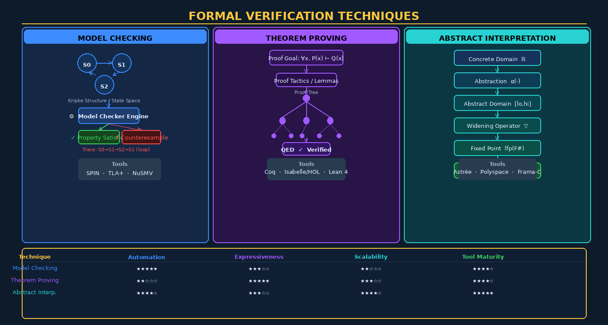

# Chapter 11 — Formal Methods and Correctness Verification



## Overview

Software testing finds bugs; formal verification *proves* their absence. While no testing strategy can exhaust all possible inputs or execution paths, formal methods apply mathematical rigor to reason about every possible program behavior simultaneously. This chapter explores the theoretical foundations and practical tools that underpin correctness verification — a discipline once confined to academic laboratories but now increasingly embedded in safety-critical and security-critical industrial software.

Formal methods matter most where the cost of failure is catastrophic. In **avionics**, the FAA's DO-178C standard at Design Assurance Level A (DAL A) governs software whose failure could cause aircraft loss — testing alone is insufficient at this level. **Medical device** firmware, where a race condition could administer a lethal drug dose, relies on formal analysis during certification. **Cryptographic implementations** represent perhaps the most compelling security case: a single off-by-one error in an elliptic-curve library can leak private keys regardless of how many unit tests pass. **Kernel and hypervisor code** sit beneath all security boundaries, so a proof of correctness there protects everything above.

The formal methods spectrum ranges from lightweight to heavyweight:

| Level | Technique | Effort | Coverage |
|-------|-----------|--------|----------|
| Lightweight | Type systems, linters | Minutes | Partial, syntactic |
| Moderate | Design by contract, model checking | Hours–days | Behavioral properties |
| Heavy | Full formal proof (theorem proving) | Weeks–months | Complete correctness |

---

## Model Checking — Exhaustive State Space Exploration

Model checking answers the question: *does this system satisfy this property in every possible execution?* It does so by exhaustively exploring the state space of a finite-state model.

### Kripke Structures and Temporal Logic

A **Kripke structure** is the mathematical model used by most model checkers — a graph where nodes are states (each labeled with atomic propositions true at that state) and edges are transitions. Properties to verify are expressed in **temporal logic**:

- **LTL (Linear Temporal Logic)** reasons about individual execution paths. The operator `G` means "globally always", `F` means "eventually", `X` means "next", `U` means "until". For example, the liveness property *"the system will eventually respond"* is written `G(request → F response)`.

- **CTL (Computation Tree Logic)** quantifies over branching futures. `AG` means "on all paths, always"; `EF` means "there exists a path where eventually." The safety property *"the system never deadlocks on any path"* is `AG(¬deadlock)`.

### SPIN Model Checker

**SPIN** (Simple Promela INterpreter) is the canonical open-source model checker, developed at Bell Labs. Systems are modeled in **Promela** (Process Meta Language), a C-like notation for concurrent processes. SPIN performs on-the-fly LTL model checking and can verify mutual exclusion, absence of deadlock, and protocol correctness.

```promela
/* Promela: simple mutual exclusion */
bool flag[2] = false;
byte turn = 0;

active [2] proctype P(byte id) {
  do ::
    flag[id] = true;
    turn = 1 - id;
    (!flag[1-id] || turn == id); /* wait */
    /* critical section */
    flag[id] = false
  od
}

ltl mutex { [] !(P[0]@crit && P[1]@crit) }
```

### TLA+ — Temporal Logic of Actions

**TLA+** (Temporal Logic of Actions), created by Leslie Lamport, extends temporal logic with action predicates over state variables. It has proven invaluable for verifying *distributed algorithms*: Amazon Web Services has published extensively on using TLA+ to verify protocols in **DynamoDB**, **S3**, **EBS**, and their consensus algorithm underlying Aurora. Microsoft uses TLA+ for Azure CosmosDB protocol verification.

A TLA+ specification consists of an initial predicate `Init`, a next-state relation `Next`, and a temporal formula `Spec == Init ∧ □[Next]_vars`. Properties are checked with the TLC model checker. The elegance of TLA+ lies in its ability to capture non-determinism, concurrency, and message loss in a clean mathematical notation.

### NuSMV / nuXmv

**NuSMV** (New Symbolic Model Verifier) uses Binary Decision Diagrams (BDDs) and SAT-based bounded model checking to handle much larger state spaces than explicit-state model checkers. **nuXmv** extends NuSMV with infinite-state model checking and IC3/PDR algorithms. Both support LTL and CTL verification.

> **Counterexamples as Debugging Aids**: When a model checker finds a property violation, it produces a *counterexample* — a concrete execution trace demonstrating the failure. This trace is often more valuable than a simple "property violated" verdict: it pinpoints the exact sequence of events causing the bug.

---

## Theorem Proving — Machine-Checked Mathematical Proofs

Theorem provers go further than model checkers: they can reason about infinite state spaces, unbounded data structures, and arbitrary programs. The price is that proofs are not automatic — a human expert must guide the proof assistant through logical steps using **tactics**.

### Coq Proof Assistant

**Coq** is a dependently-typed proof assistant from INRIA. Its foundational achievement in software assurance is **CompCert** — a formally verified optimizing C compiler. CompCert's proof guarantees that every optimization preserves the semantics of the source program. The **Fiat Cryptography** library, used in TLS implementations including Chrome and Firefox, was developed in Coq and generates provably-correct cryptographic primitives from high-level specifications.

```coq
(* Coq: prove addition is commutative for natural numbers *)
Theorem add_comm : forall n m : nat, n + m = m + n.
Proof.
  intros n m.
  induction n as [| n' IHn'].
  - simpl. rewrite <- plus_n_O. reflexivity.
  - simpl. rewrite -> IHn'. rewrite <- plus_n_Sm. reflexivity.
Qed.
```

### Isabelle/HOL

**Isabelle/HOL** combines the Isabelle framework with Higher-Order Logic. Its most celebrated achievement is the **seL4 microkernel verification** — a formal proof that 8,700 lines of C code correctly implements a high-assurance microkernel specification, guaranteeing memory safety, no unhandled exceptions, and correct access-control enforcement. seL4 now underpins security-critical systems in aerospace (Lockheed Martin) and autonomous vehicles (DARPA HACMS project).

### Lean 4

**Lean 4** is a rapidly growing theorem prover and functional programming language developed at Microsoft Research. The **Mathlib** project has formalized a substantial portion of undergraduate mathematics in Lean, and the language is seeing increased adoption in software verification due to its powerful metaprogramming facilities and performance.

---

## Abstract Interpretation — Sound Static Analysis

**Abstract interpretation**, formalized by Patrick and Radhia Cousot in 1977, provides a theoretical framework for *sound* static analysis — analysis that never misses a real error (no false negatives), at the cost of potentially reporting false positives.

The key insight is the **Galois connection**: a pair of monotone functions (α, γ) relating the concrete domain (actual program values) to an abstract domain (approximations). The **interval domain** abstracts each variable to a range [lo, hi]. The **polyhedral domain** captures linear relationships between variables. The **widening operator** ▽ ensures convergence of fixed-point computation, sacrificing precision to guarantee termination.

**Astrée** (Analyse Statique par Exécution Abstraite) is the industrial abstract interpretation tool developed for Airbus. It was used to prove the *complete absence* of runtime errors (division by zero, integer overflow, illegal memory access) in the flight control software of the Airbus A380 — approximately 400,000 lines of C. **Polyspace** (MathWorks) brings similar capabilities to automotive (ISO 26262) and medical device (IEC 62304) markets. **Frama-C** is the open-source framework offering abstract interpretation (Eva plugin) alongside deductive verification (WP plugin).

---

## Formal Specification Languages

**Z notation** is a set-theoretic specification language using mathematical schemas. **Alloy** (MIT) is a lightweight modeling language that uses a SAT solver (the Alloy Analyzer) to find counterexamples to design properties — ideal for finding subtle bugs in access control models and protocol designs before writing any code. The **B-Method** is an industrial formal method used to develop the automatic train control software for the Paris Metro Line 14 — the world's first fully automated metro line — and subsequently London's Jubilee Line extension.

---

## Design by Contract

**Design by Contract** (DbC), introduced by Bertrand Meyer in the **Eiffel** language, makes software correctness obligations explicit through three mechanisms:

1. **Preconditions** — what must be true before a routine is called (caller's obligation)
2. **Postconditions** — what the routine guarantees on return (callee's obligation)
3. **Class invariants** — properties that hold throughout an object's lifetime

```java
// JML (Java Modeling Language) contract
/*@ requires x >= 0;
  @ ensures \result == Math.sqrt(x);
  @ assignable \nothing; @*/
public double sqrt(double x) { ... }
```

Python's **`deal`** library, Kotlin's contracts API, and Ada's SPARK subset all bring DbC to modern languages. When combined with static checkers, DbC specifications become machine-verifiable documentation that can catch errors before testing begins.

---

## Type Systems as Lightweight Formal Methods

**Dependent types** allow types to depend on values — expressing properties like "a list of exactly n elements" or "a non-negative integer." **Refinement types** add logical predicates to base types (e.g., `{x : Int | x > 0}`), enabling tools like **Liquid Haskell** to verify complex invariants automatically. **Rust's ownership and borrow system** is essentially an embedded linear type system enforcing memory safety and data-race freedom at compile time — no garbage collector, no undefined behavior — addressing approximately 70% of the CVE class of memory safety vulnerabilities.

---

## Property-Based Testing — Bridging Specification and Testing

**QuickCheck** (Haskell) and **Hypothesis** (Python) generate hundreds of random inputs satisfying specified constraints and check that properties hold. This bridges formal specification (defining properties) with automated testing (checking them empirically):

```python
# Hypothesis: property-based test for sort
from hypothesis import given, strategies as st

@given(st.lists(st.integers()))
def test_sort_idempotent(lst):
    assert sorted(sorted(lst)) == sorted(lst)
```

Property-based testing is not as strong as formal proof but discovers edge cases that hand-written unit tests miss, with minimal additional effort.

---

## Formal Methods in Practice

The main challenges limiting wider adoption are **state space explosion** (model checking becomes infeasible as system size grows), **steep learning curves** (theorem proving requires significant expertise), and **specification effort** (writing complete formal specs can take longer than writing the code itself). Mitigations include:

- **Compositional verification**: verify components independently and compose proofs
- **Modular specifications**: use contracts at interfaces rather than full system specs
- **Automation advances**: SAT/SMT solvers (Z3, CVC5) increasingly automate routine proof steps
- **Targeted application**: apply formal methods to the security-critical kernel, not every library

Formal methods are *worth the cost* when: (1) failure consequences are catastrophic or irreversible, (2) systems are long-lived and must be maintained, (3) regulatory requirements mandate it, or (4) the attack surface is so small and critical that exhaustive assurance is feasible.

---

## Key Terms

| Term | Definition |
|------|-----------|
| **Formal Verification** | Using mathematical proof to establish software correctness |
| **Model Checking** | Automated exhaustive state-space exploration against temporal logic properties |
| **Kripke Structure** | Graph-based model of a system's states and transitions |
| **LTL** | Linear Temporal Logic — reasons about single execution paths |
| **CTL** | Computation Tree Logic — quantifies over branching execution trees |
| **SPIN** | Open-source model checker using Promela language |
| **TLA+** | Temporal Logic of Actions, used by AWS/Azure for distributed system verification |
| **Theorem Proving** | Interactive proof assistant requiring human-guided proof construction |
| **Coq** | Dependently-typed proof assistant; used for CompCert, Fiat Cryptography |
| **Isabelle/HOL** | Proof assistant used to verify the seL4 microkernel |
| **seL4** | First formally verified OS microkernel (8,700 lines of C) |
| **Abstract Interpretation** | Framework for sound static analysis via Galois connections |
| **Widening Operator** | Ensures termination of abstract interpretation fixed-point computation |
| **Astrée** | Abstract interpretation tool proving absence of runtime errors in Airbus A380 |
| **Design by Contract** | Pre/postconditions and invariants making correctness obligations explicit |
| **JML** | Java Modeling Language for DbC contracts |
| **Alloy** | Lightweight modeling language using SAT to find design flaws |
| **Refinement Types** | Types enriched with logical predicates for machine-checkable invariants |
| **Property-Based Testing** | Random input generation to check universal properties (QuickCheck, Hypothesis) |
| **Counterexample** | Concrete trace produced by model checker demonstrating a property violation |

---

## Review Questions

1. Explain the difference between LTL and CTL. Give an example property better expressed in each.
2. How does TLA+ model non-determinism and message loss in distributed systems? Why is this important for verifying protocols like those in DynamoDB?
3. Describe the role of the widening operator in abstract interpretation. What precision trade-off does it make, and why is this acceptable for safety analysis?
4. What is the Galois connection in abstract interpretation, and how does it relate the concrete and abstract domains?
5. Compare the verification effort and guarantees of model checking vs. theorem proving for a mutual exclusion protocol of 5 processes.
6. What is the seL4 microkernel verification project? What properties were formally proved, and what does this enable for security architecture?
7. Explain Design by Contract using a concrete banking API example with preconditions, postconditions, and a class invariant.
8. Why does Rust's ownership system eliminate approximately 70% of the CVE class of memory safety vulnerabilities? What formal concept underlies it?
9. How does property-based testing (Hypothesis) differ from unit testing? What kinds of bugs does it find that unit testing misses?
10. A startup is building a cryptographic library for TLS. Argue for and against investing in Coq-based formal verification. What factors determine whether the investment is worthwhile?

---

## Further Reading

1. Clarke, E., Grumberg, O., & Peled, D. (1999). *Model Checking*. MIT Press. — The definitive textbook on model checking, covering Kripke structures, temporal logics, and algorithms.
2. Lamport, L. (2002). *Specifying Systems: The TLA+ Language and Tools for Hardware and Software Engineers*. Addison-Wesley. — The authoritative reference for TLA+, freely available at lamport.azurewebsites.net.
3. Klein, G. et al. (2009). seL4: Formal Verification of an OS Kernel. *SOSP 2009*. — The landmark paper describing the complete formal verification of the seL4 microkernel.
4. Cousot, P. & Cousot, R. (1977). Abstract Interpretation: A Unified Lattice Model for Static Analysis of Programs. *POPL 1977*. — The foundational paper establishing abstract interpretation theory.
5. Meyer, B. (1997). *Object-Oriented Software Construction* (2nd ed.). Prentice Hall. — Introduces Design by Contract in depth within the Eiffel language context.
