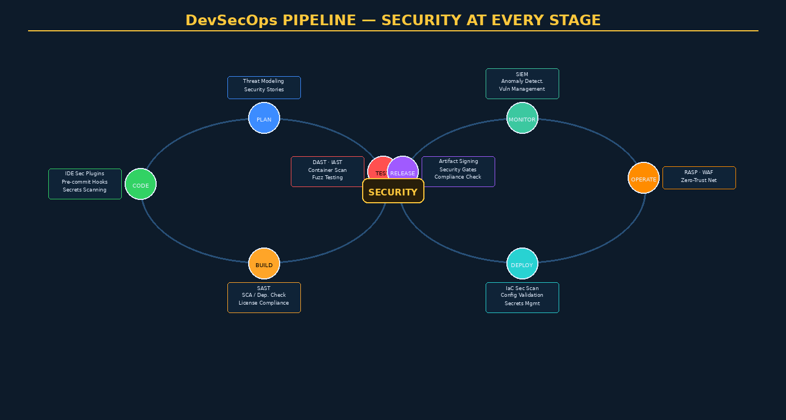

# Chapter 12 — DevSecOps: Integrating Assurance into Pipelines



## Overview

For decades, security was treated as a gate — a phase at the end of the development cycle where a security team would review a completed application and deliver a list of findings days before launch. This model consistently failed. Findings surfaced too late to fix economically, the security team was a bottleneck, and developers had no ownership of security outcomes. **DevSecOps** dismantles this anti-pattern by embedding security controls continuously throughout the software delivery pipeline, making security a property of the delivery process itself rather than a last-minute inspection.

The three philosophical pillars of DevSecOps are:

- **Shift Left**: Move security activities as early in the SDLC as possible. Fixing a design flaw during requirements costs 1×; fixing it post-production costs 100×. (IBM Systems Sciences Institute)
- **Security as Code**: Security policies, configurations, and controls are version-controlled, reviewed, and deployed like application code — enabling repeatability, auditability, and collaborative improvement.
- **Everyone Owns Security**: Security responsibility is distributed across all roles. Developers write secure code, infrastructure engineers harden configurations, QA engineers include security test cases, and product managers include security stories in every sprint.

---

## Source Control Security

Every secure pipeline begins with secured source control. **Branch protection rules** prevent direct pushes to `main`, require pull request reviews, and mandate status checks before merging. **Signed commits** (GPG/SSH signing via `git commit -S`) create a cryptographic audit trail linking each change to a verified identity — critical for software supply chain integrity.

**Secret scanning** detects accidentally committed credentials before they enter the repository history:

```bash
# Pre-install: detect-secrets baseline
detect-secrets scan > .secrets.baseline
git add .secrets.baseline

# GitHub CLI: enable secret scanning on a repo
gh repo edit --enable-secret-scanning
```

Tools in this space include **GitHub Secret Scanning** (built into GitHub Advanced Security), **GitLeaks** (open-source, fast Golang scanner for git histories), **truffleHog** (entropy-based secret detection), and **detect-secrets** (Yelp's baseline-aware scanner). Even with these tools, the golden rule remains: *never commit credentials*. Use environment variables, secret managers, or `.env` files excluded from version control.

---

## Pre-Commit Hooks

Pre-commit hooks run on a developer's workstation *before* the commit is created, catching issues at the earliest possible moment. The **pre-commit framework** (`pre-commit.com`) provides a standardized way to configure hooks:

```yaml
# .pre-commit-config.yaml
repos:
  - repo: https://github.com/Yelp/detect-secrets
    rev: v1.4.0
    hooks:
      - id: detect-secrets
  - repo: https://github.com/PyCQA/bandit
    rev: 1.7.5
    hooks:
      - id: bandit
        args: ["-ll"]
  - repo: https://github.com/hadolint/hadolint
    rev: v2.12.0
    hooks:
      - id: hadolint-docker
```

Pre-commit hooks should be fast (under 30 seconds) and focused — slow hooks get disabled by frustrated developers, defeating their purpose.

---

## SAST Integration in CI/CD

**Static Application Security Testing (SAST)** analyzes source code without executing it, finding vulnerability patterns (SQL injection, XSS, hardcoded secrets, insecure API usage) at build time.

### GitHub Actions CodeQL Example

```yaml
# .github/workflows/codeql.yml
name: CodeQL Security Analysis
on: [push, pull_request]
jobs:
  analyze:
    runs-on: ubuntu-latest
    permissions:
      security-events: write
    steps:
      - uses: actions/checkout@v4
      - uses: github/codeql-action/init@v3
        with:
          languages: javascript, python
      - uses: github/codeql-action/autobuild@v3
      - uses: github/codeql-action/analyze@v3
        with:
          upload: true
```

**Semgrep** provides rule-based SAST with custom rules, making it highly adaptable to organization-specific security policies. GitLab ships SAST templates for 15+ languages out of the box. Results are reported in **SARIF** (Static Analysis Results Interchange Format), a JSON-based standard enabling integration with GitHub Code Scanning, VS Code, and Azure DevOps.

> **Alert Fatigue Management**: Establish a SAST baseline on day one. CI gates should block pipelines *only* on **new** findings introduced by the current change — not pre-existing ones. Tools like CodeQL's `--compare-to-baseline` and Semgrep's `--baseline-commit` flag enable this behavior.

---

## Software Composition Analysis (SCA)

Modern applications are 80–90% open-source dependencies. **SCA** tools identify vulnerable and outdated dependencies by comparing dependency manifests against vulnerability databases (NVD, OSV, GitHub Advisory Database).

| Tool | Free Tier | Key Feature |
|------|-----------|-------------|
| OWASP Dependency-Check | Yes (open source) | NVD CVE matching, CI plugins |
| Snyk | Free for open source | Developer UX, fix PRs, license |
| GitHub Dependabot | Yes (GitHub native) | Automated update PRs |
| FOSSA | Freemium | License compliance focus |
| Socket | Freemium | Supply chain attack detection |

```yaml
# GitHub Actions: Dependency Review on PRs
- name: Dependency Review
  uses: actions/dependency-review-action@v4
  with:
    fail-on-severity: high
    deny-licenses: GPL-2.0, AGPL-3.0
```

**License compliance** is frequently overlooked — shipping a product containing GPL-licensed code without open-sourcing your own code violates the license and creates legal exposure. SCA tools flag copyleft licenses and generate reports for legal review.

---

## Container Security in Pipelines

Containers introduce an additional attack surface: base images carry their own vulnerability footprint, and misconfigurations in `Dockerfile`s create privilege escalation risks.

**Dockerfile linting** (Hadolint, Checkov) catches insecure patterns:

```dockerfile
# BAD: Running as root, no pinned digest
FROM ubuntu:latest
RUN apt-get install -y curl
CMD ["/app/run.sh"]

# GOOD: Non-root user, pinned digest, minimal base
FROM ubuntu:22.04@sha256:a123...
RUN useradd -m -u 1001 appuser
USER appuser
COPY --chown=appuser:appuser app /app
CMD ["/app/run.sh"]
```

**Image vulnerability scanning** with **Trivy** (Aqua Security) or **Grype** (Anchore) scans layers for known CVEs:

```bash
# Trivy: fail CI if critical CVEs found
trivy image --exit-code 1 --severity CRITICAL myapp:latest
```

**Image signing** with **cosign** (Sigstore project) creates an immutable, auditable record that an image was produced by a trusted CI pipeline:

```bash
cosign sign --key cosign.key myregistry/myapp@sha256:abc123
cosign verify --key cosign.pub myregistry/myapp@sha256:abc123
```

**Distroless images** (Google's `gcr.io/distroless/*`) ship only the application runtime — no shell, no package manager, minimal attack surface.

---

## Infrastructure-as-Code Security Testing

IaC templates (Terraform, CloudFormation, ARM, Pulumi) are the blueprints for cloud infrastructure. Misconfigured IaC is a leading cause of cloud data breaches (S3 buckets open to public, security groups allowing `0.0.0.0/0` SSH).

**Checkov** (Palo Alto Bridgecrew) scans Terraform, CloudFormation, Kubernetes manifests, and Dockerfiles against 1,000+ security policies:

```bash
checkov -d ./terraform --framework terraform \
        --check CKV_AWS_18,CKV_AWS_21 \
        --output sarif > checkov-results.sarif
```

**tfsec** (Aqua Security) and **Terrascan** offer similar capabilities with different rule sets. The critical control is ensuring IaC security gates block `terraform apply` of non-compliant configurations.

---

## Secret Management

Hardcoded credentials in source code represent one of the most common and damaging security failures. The solution is **dynamic secret injection** at runtime:

```yaml
# GitHub Actions: inject AWS credentials from Secrets
- name: Configure AWS credentials
  uses: aws-actions/configure-aws-credentials@v4
  with:
    role-to-assume: ${{ secrets.AWS_ROLE_ARN }}
    aws-region: us-east-1
```

**HashiCorp Vault** provides a self-hosted secrets management solution with dynamic secret generation (database credentials that expire after use), audit logging, and fine-grained ACLs. **AWS Secrets Manager** and **Azure Key Vault** offer managed alternatives.

---

## DAST in CI/CD

**Dynamic Application Security Testing (DAST)** tests running applications by sending crafted HTTP requests and analyzing responses. **OWASP ZAP** provides a pipeline-friendly "baseline scan" mode:

```bash
docker run -t owasp/zap2docker-stable zap-baseline.py \
  -t https://staging.myapp.com \
  -r zap-report.html \
  --exit-code 1
```

DAST requires a running application, so it typically executes against a pre-production environment after deployment. **Nuclei** (ProjectDiscovery) enables template-based scanning with a rapidly updated community template library covering thousands of CVEs and misconfigurations.

---

## Security Quality Gates

Security quality gates are pipeline enforcement points that block promotion of code/images that fail security criteria:

| Severity | Gate Action |
|----------|-------------|
| Critical | Block immediately |
| High | Block (with time-limited exception process) |
| Medium | Warn; track in backlog |
| Low / Info | Log; optional |

**DORA metrics** (Deployment Frequency, Lead Time, Change Failure Rate, MTTR) should incorporate security incidents as contributors to Change Failure Rate, connecting security quality to engineering performance metrics.

---

## SBOM Generation

A **Software Bill of Materials (SBOM)** is a machine-readable inventory of all components in a software product. US Executive Order 14028 mandates SBOMs for federal software suppliers.

**CycloneDX** and **SPDX** are the dominant SBOM formats. **Syft** (Anchore) generates SBOMs from container images, filesystems, and package manifests:

```bash
syft myapp:latest -o cyclonedx-json > sbom.json
grype sbom:./sbom.json  # vulnerability scan against SBOM
```

The NTIA minimum elements for a valid SBOM include: supplier name, component name, version, unique identifier, dependency relationships, author of SBOM data, and timestamp.

---

## Key Terms

| Term | Definition |
|------|-----------|
| **DevSecOps** | Integration of security into DevOps pipelines and culture |
| **Shift Left** | Moving security activities earlier in the SDLC |
| **SAST** | Static Application Security Testing — analyzes source code without executing it |
| **DAST** | Dynamic Application Security Testing — tests running applications |
| **IAST** | Interactive AST — instruments running application to observe security during functional testing |
| **SCA** | Software Composition Analysis — identifies vulnerable open-source dependencies |
| **SARIF** | Static Analysis Results Interchange Format — standard for security tool output |
| **Pre-commit Hook** | Script executed before a git commit is finalized |
| **IaC** | Infrastructure as Code — infrastructure defined in version-controlled templates |
| **Checkov** | Open-source IaC security scanner supporting Terraform, CF, K8s |
| **Trivy** | Container and filesystem vulnerability scanner by Aqua Security |
| **cosign** | Sigstore tool for signing and verifying container images |
| **Distroless** | Minimal container base images containing only runtime, no shell |
| **SBOM** | Software Bill of Materials — inventory of all software components |
| **CycloneDX** | OWASP-managed SBOM standard format |
| **Dependabot** | GitHub tool that automates dependency update pull requests |
| **GitLeaks** | Open-source tool to detect secrets in git repositories |
| **Security Gate** | Pipeline enforcement point that blocks promotion of non-compliant artifacts |
| **DORA Metrics** | Four key metrics measuring software delivery performance |
| **HashiCorp Vault** | Self-hosted secrets management and encryption-as-a-service platform |

---

## Review Questions

1. What is the "security as a gate at the end" anti-pattern, and what specific organizational and technical problems does it create? How does DevSecOps address each?
2. Explain the difference between SAST, DAST, and IAST. Give a vulnerability type that each approach detects best.
3. Describe how SARIF enables integration between security tools and development platforms. What information does a SARIF file contain?
4. A developer accidentally commits an AWS access key to a public GitHub repository. Walk through the response process, including how each DevSecOps control should have prevented this and what incident response steps are needed.
5. Why is SCA important even when developers write secure code? What risk does it address that SAST cannot?
6. Explain image signing with cosign/Sigstore. What threat does it mitigate, and how does the Rekor transparency log contribute to supply chain integrity?
7. What is a security quality gate? Design a gate policy for a financial services application's CI/CD pipeline, specifying criteria for blocking vs. warning.
8. What are the NTIA minimum elements for an SBOM, and why does EO 14028 require them for federal contractors?
9. Compare pre-commit hooks vs. CI/CD SAST gates. Why are both necessary, and what are the trade-offs of each?
10. A team is adopting DevSecOps. They already have SAST in CI but are told to add DAST. Explain the deployment architecture needed (environments, credentials, rate limiting) to safely run DAST in an automated pipeline.

---

## Further Reading

1. Kim, G., Humble, J., Debois, P., & Willis, J. (2016). *The DevOps Handbook*. IT Revolution Press. — Foundational text on DevOps culture and technical practices.
2. Forsgren, N., Humble, J., & Kim, G. (2018). *Accelerate: The Science of Lean Software and DevOps*. IT Revolution Press. — Research basis for DORA metrics and their relationship to organizational performance.
3. NIST Special Publication 800-218 (2022). *Secure Software Development Framework (SSDF)*. — Federal guidance on integrating security into software development processes.
4. OWASP DevSecOps Guideline (2023). Available at owasp.org. — Practical guidance on implementing DevSecOps controls across the pipeline.
5. Zaidman, E. et al. (2021). *Container Security: Fundamental Technology Concepts that Protect Containerized Applications*. O'Reilly Media. — Comprehensive coverage of container security controls relevant to DevSecOps pipelines.
