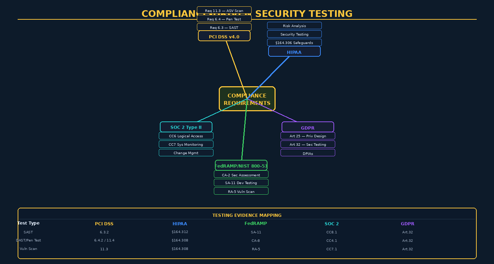

# Chapter 13 — Compliance Testing and Regulatory Assurance



## Overview

When organizations handle payment card data, protected health information, or personal data of EU citizens, they do not merely face best-practice recommendations — they face legal mandates with specific, auditable technical requirements. **Compliance-driven testing** is the discipline of aligning software security testing activities to the specific controls enumerated by regulatory frameworks, generating the evidence that auditors require, and building continuous monitoring programs that sustain compliance between assessments.

The compliance testing landscape is complex because organizations often must satisfy *multiple overlapping frameworks simultaneously* — a healthcare SaaS company accepting payments might need to satisfy HIPAA, PCI DSS, SOC 2, and potentially FedRAMP if they serve federal agencies. Understanding which technical controls satisfy which requirements — and where frameworks overlap — is an essential skill for security professionals.

> **Compliance ≠ Security**: Satisfying a compliance framework's testing requirements does not guarantee security. Frameworks are updated annually; attackers adapt continuously. Treat compliance as a *floor*, not a ceiling. Use the testing evidence you generate for compliance to also improve your actual security posture.

---

## PCI DSS v4.0 — Payment Card Industry Data Security Standard

PCI DSS v4.0, released in March 2022, governs any organization that stores, processes, or transmits payment card data. The standard substantially strengthened software security requirements compared to v3.2.1. Organizations had until March 31, 2024, to complete the transition from v3.2.1.

### Requirement 6: Develop and Maintain Secure Systems and Software

**Requirement 6.2** mandates defined roles and responsibilities for software security, including explicit ownership of secure coding practices.

**Requirement 6.3** — Security vulnerabilities must be identified and addressed:
- **6.3.2**: Maintain an inventory of bespoke and custom software to facilitate vulnerability management
- **6.3.3**: All security vulnerabilities must be protected against via relevant security patches/updates

**Requirement 6.4** — Public-facing web applications must be protected against attacks:
- **6.4.1**: Deploy an automated technical solution (WAF) that continuously detects and prevents web-based attacks, OR
- **6.4.2**: Conduct a review of the application via a penetration test at least every 12 months and after any significant change — a critical testing mandate

**Requirement 6.5** — Changes to all system components are managed securely, including security impact analysis and regression testing.

### Requirement 11: Testing Security of Systems and Networks

**Requirement 11.3** — External and internal vulnerability scans:
- 11.3.1: External vulnerability scan performed quarterly by an Approved Scanning Vendor (ASV)
- 11.3.2: Internal vulnerability scan performed quarterly and after significant changes
- 11.3.3: Vulnerabilities found must be addressed and rescanned until "passing" scan achieved

**Requirement 11.4** — Penetration testing:
- External penetration test at least annually and after any significant infrastructure or application upgrade
- Internal penetration test at least annually
- Testing methodology must cover the entire CDE (Cardholder Data Environment) perimeter and critical systems
- Acceptable methodologies: PTES (Penetration Testing Execution Standard) or NIST SP 800-115
- **Segmentation testing** (11.4.5): If network segmentation is used to isolate the CDE, penetration testing must verify that segmentation is effective and isolating all out-of-scope systems

```bash
# Example: Nmap scan documentation for PCI compliance evidence
nmap -sV -sC -p- --reason -oA pci_scan_Q1_2024 10.0.0.0/24
# Evidence: scan results + remediation tracking in vulnerability management tool
```

---

## HIPAA Security Rule Testing Requirements

The Health Insurance Portability and Accountability Act (HIPAA) Security Rule (45 CFR Part 164) applies to Covered Entities and Business Associates handling electronic Protected Health Information (ePHI).

### §164.308(a)(8) — Evaluation (Required)

The HIPAA Evaluation standard requires covered entities to:

> *"Perform a periodic technical and nontechnical evaluation, based initially upon the standards implemented under this rule and subsequently, in response to environmental or operational changes affecting the security of electronic protected health information."*

This broad requirement encompasses:
- **Technical evaluations**: vulnerability assessments, penetration testing, code reviews, configuration assessments
- **Nontechnical evaluations**: policy reviews, workforce training assessments, physical security reviews
- **Documentation**: evaluation reports, remediation plans, risk acceptance decisions — all required for audit defense

### §164.308(a)(1) — Security Management Process (Risk Analysis)

The foundational requirement is a comprehensive risk analysis — systematic identification of vulnerabilities that could affect ePHI confidentiality, integrity, and availability. Security testing feeds directly into this risk analysis by providing empirical evidence of actual vulnerabilities.

| HIPAA Control | Testing Mapping |
|---------------|----------------|
| §164.308(a)(8) Evaluation | Annual pen test, quarterly vuln scans |
| §164.312(a)(2)(iv) Encryption | TLS verification, encryption-at-rest testing |
| §164.312(b) Audit Controls | Log review, SIEM alert validation |
| §164.312(e)(2)(i) Integrity | Integrity checking tools, file integrity monitoring |

---

## NIST SP 800-53 Security Testing Controls

NIST Special Publication 800-53 Rev. 5, "Security and Privacy Controls for Information Systems and Organizations," is the foundational control catalog for U.S. federal information systems and is widely adopted beyond the federal sector.

### CA-2 — Control Assessments

CA-2 requires an independent assessor to:
1. Develop a security assessment plan
2. Assess security controls to determine the extent of implementation
3. Produce an assessment report documenting findings
4. Provide assessment results to the authorizing official

The **independent assessor** requirement is critical — self-assessments are generally insufficient for high-impact systems.

### CA-8 — Penetration Testing

CA-8 specifically mandates penetration testing of organizational systems and components, including:
- Specifying the scope, depth, and coverage
- Employing penetration testing agents with specific skills
- Requiring evidence of testing methodology (PTES, OWASP Testing Guide)

### SA-11 — Developer Testing and Evaluation

SA-11 requires software developers to:
- Create a security assessment plan
- Perform unit, integration, system, and regression testing
- Produce evidence of testing (test plans, results, coverage reports)
- **SA-11(2)**: Threat and vulnerability analyses
- **SA-11(5)**: Penetration testing
- **SA-11(8)**: Dynamic code analysis (DAST)
- **SA-11(9)**: Interactive code analysis (IAST)
- **SA-11(10)**: Fuzz testing

### RA-5 — Vulnerability Monitoring and Scanning

RA-5 requires organizations to:
- Scan for vulnerabilities in the information system and hosted applications at defined frequency
- Employ vulnerability monitoring tools and techniques
- Analyze scan reports and remediate vulnerabilities within defined timeframes
- Share vulnerability information with designated personnel
- **RA-5(5)**: Privileged access — scanners must have privileged access for comprehensive scanning
- **RA-5(11)**: Public disclosure program (bug bounty / coordinated vulnerability disclosure)

---

## FedRAMP — Federal Risk and Authorization Management Program

FedRAMP authorizes cloud service offerings (CSOs) for use by federal agencies. It applies NIST SP 800-53 controls at FedRAMP Moderate or High baseline, with additional requirements:

### Assessment Requirements

- **Annual Penetration Testing**: Performed by an approved **3PAO (Third Party Assessment Organization)** — independent firms accredited by the American Association for Laboratory Accreditation (A2LA) or the NIST National Voluntary Laboratory Accreditation Program
- **Continuous Monitoring (ConMon)**: Monthly vulnerability scans (operating system, database, web application), with results submitted to the FedRAMP Program Management Office (PMO)
- **Significant Change Requests**: Security impact analysis and re-testing required before deploying significant changes to FedRAMP-authorized systems
- **Annual Assessment**: Full control assessment by 3PAO every 12 months

---

## GDPR Article 32 — Appropriate Technical Measures

The General Data Protection Regulation applies to organizations processing personal data of EU residents, regardless of where the organization is located. Article 32 requires:

> *"The controller and the processor shall implement appropriate technical and organisational measures to ensure a level of security appropriate to the risk, including as appropriate: ... (d) a process for regularly testing, assessing and evaluating the effectiveness of technical and organisational measures for ensuring the security of the processing."*

This direct mandate for *regular testing* encompasses:
- **Article 25 (Data Protection by Design and Default)**: Security testing of privacy controls during development (DPIA-informed threat modeling, privacy unit tests)
- **Article 35 (Data Protection Impact Assessments — DPIAs)**: Required before high-risk processing — technical security testing is a DPIA input
- **Breach Notification** (Articles 33-34): Effective testing reduces breach probability; rapid detection capability (SIEM, anomaly detection) reduces notification delay

---

## ISO/IEC 27001:2022 and SOC 2 Type II

### ISO/IEC 27001:2022 Annex A 8.29 — Security Testing in Development and Acceptance

The 2022 revision of ISO 27001 added explicit security testing requirements: security testing must be defined and implemented for new information systems and significant changes. Testing must cover functional security requirements and include non-functional testing for known attack patterns.

### SOC 2 Type II — Trust Services Criteria

SOC 2 Type II reports assess controls relevant to Security, Availability, Processing Integrity, Confidentiality, and Privacy over an *observation period* (typically 6-12 months). Security testing evidence is primarily relevant to:

- **CC6 (Logical and Physical Access Controls)**: Testing access control enforcement, authentication strength
- **CC7 (System Operations)**: Vulnerability management testing evidence, SIEM alert validation
- **CC8 (Change Management)**: Security testing of changes before promotion to production
- **CC4 (Monitoring Activities)**: Penetration test results, security assessment reports

The key distinction for SOC 2 is *evidence over time* — auditors want to see that testing occurred *consistently* throughout the observation period, not just before the audit.

---

## Building a Compliance Testing Program

### Control-to-Test Mapping

The foundation of a compliance program is a mapping table that links each compliance control to the specific test that evidences it:

| Test Type | PCI DSS | HIPAA | FedRAMP | SOC 2 | GDPR |
|-----------|---------|-------|---------|-------|------|
| SAST (code review) | 6.3.2 | §164.312 | SA-11 | CC8.1 | Art. 32 |
| DAST / Pen Test | 6.4.2, 11.4 | §164.308(a)(8) | CA-8 | CC4.1 | Art. 32(d) |
| Vulnerability Scan | 11.3.1/2 | §164.308(a)(8) | RA-5 | CC7.1 | Art. 32(d) |
| IaC Security Scan | 6.4.1 | §164.312(c) | CM-6 | CC6.6 | Art. 25 |
| Container Scanning | — | §164.312 | SA-11(8) | CC6.1 | Art. 32 |
| Threat Modeling | 6.3.3 | Risk Analysis | SA-11(2) | CC3.1 | Art. 35 |

### Evidence Management

Compliance evidence must be:
- **Dated and timestamped**: Evidence must demonstrate *when* testing occurred
- **Scoped**: Evidence must cover the systems in scope for the compliance framework
- **Retained**: PCI DSS requires 12 months; most frameworks require evidence for the full assessment period
- **Attributable**: Who ran the test, what tools, what version, what configuration

Modern GRC (Governance, Risk, and Compliance) platforms — Drata, Vanta, Tugboat Logic, ServiceNow GRC — automate evidence collection by integrating directly with CI/CD pipelines, cloud providers, and security scanners.

### Continuous Compliance Monitoring

Traditional compliance operates on point-in-time assessment cycles. **Continuous compliance monitoring** replaces annual snapshots with real-time control verification:

```yaml
# Example: Automated compliance check in GitHub Actions
- name: PCI DSS 11.3.2 - Internal Vulnerability Scan
  run: |
    trivy image --format json --output vuln-scan.json myapp:${{ github.sha }}
    python3 pci_evidence_upload.py --report vuln-scan.json \
      --control "PCI-11.3.2" --system "payment-processor" \
      --grc-api ${{ secrets.GRC_API_KEY }}
```

This approach ensures that compliance evidence is generated automatically with every deployment, audit trails are always current, and drift from compliant state is detected immediately rather than discovered during an annual audit.

---

## Key Terms

| Term | Definition |
|------|-----------|
| **PCI DSS** | Payment Card Industry Data Security Standard — governs cardholder data security |
| **ASV** | Approved Scanning Vendor — PCI-authorized organization for external vulnerability scans |
| **CDE** | Cardholder Data Environment — systems that store, process, or transmit card data |
| **HIPAA** | Health Insurance Portability and Accountability Act — U.S. health data privacy law |
| **ePHI** | Electronic Protected Health Information — HIPAA-regulated health data |
| **NIST SP 800-53** | NIST's comprehensive security control catalog for federal information systems |
| **CA-2** | NIST 800-53 control: Control Assessments — independent security assessment |
| **SA-11** | NIST 800-53 control: Developer Testing and Evaluation |
| **RA-5** | NIST 800-53 control: Vulnerability Monitoring and Scanning |
| **FedRAMP** | Federal Risk and Authorization Management Program — cloud authorization for U.S. agencies |
| **3PAO** | Third Party Assessment Organization — FedRAMP-approved independent assessors |
| **ConMon** | Continuous Monitoring — ongoing compliance monitoring between annual assessments |
| **GDPR** | General Data Protection Regulation — EU data privacy law with global reach |
| **DPIA** | Data Protection Impact Assessment — GDPR-required privacy risk assessment |
| **SOC 2 Type II** | Audit standard assessing security controls over an observation period |
| **GRC** | Governance, Risk, and Compliance — tools and processes for managing compliance programs |
| **PTES** | Penetration Testing Execution Standard — methodology for standardized pen testing |
| **Segmentation Testing** | PCI requirement to verify network isolation of cardholder data environment |
| **Compensating Control** | Alternative control accepted when a specific requirement cannot be met |
| **Evidence Chain** | Documentation trail linking each test to the compliance control it satisfies |

---

## Review Questions

1. PCI DSS v4.0 Requirement 6.4 offers two options for protecting public-facing web applications. Describe both options and explain when an organization might choose each.
2. Explain the difference between an ASV vulnerability scan (PCI 11.3.1) and a penetration test (PCI 11.4). What does each test for that the other cannot?
3. HIPAA's §164.308(a)(8) Evaluation standard is intentionally technology-neutral and broad. What does this flexibility mean for organizations building a testing program? What documentation is required?
4. Compare NIST SP 800-53 SA-11 with the software security testing requirements in PCI DSS v4.0. Where do they overlap, and where does one framework go further than the other?
5. What is a 3PAO, and why does FedRAMP require an independent assessor rather than allowing self-attestation for high-impact systems?
6. GDPR Article 32(d) requires "a process for regularly testing, assessing and evaluating" security measures. How does this differ from a point-in-time penetration test, and what ongoing testing activities would satisfy this requirement?
7. A SOC 2 Type II observation period is 12 months. An organization runs a penetration test in month 1 and does not test again until the next annual cycle. How might an auditor view this? What continuous testing activities would strengthen the SOC 2 report?
8. Design a compliance testing evidence management process for an organization subject to both PCI DSS and HIPAA. How would you handle overlapping requirements to avoid duplication of testing effort?
9. What is the difference between a compliance gap and a security risk? Give an example where a system could be fully compliant but still have significant security risk.
10. A company is preparing for their first FedRAMP Moderate assessment. They currently run monthly vulnerability scans but have never conducted a formal penetration test. Outline the steps to prepare for the CA-8 penetration testing control.

---

## Further Reading

1. PCI Security Standards Council (2022). *PCI DSS v4.0 Quick Reference Guide*. Available at pcisecuritystandards.org. — Official reference for all PCI DSS v4.0 requirements with testing procedures.
2. NIST (2020). *SP 800-53 Rev. 5: Security and Privacy Controls for Information Systems and Organizations*. Available at nvlpubs.nist.gov. — The authoritative control catalog for federal and widely-adopted security controls.
3. Mather, T., Kumaraswamy, S., & Latif, S. (2009). *Cloud Security and Privacy*. O'Reilly Media. — Covers compliance frameworks in cloud environments including FedRAMP precursors.
4. Sherwood, J., Clark, A., & Lynas, D. (2005). *Enterprise Security Architecture*. CMP Books. — Provides frameworks for mapping security controls to compliance requirements across multiple standards.
5. OWASP Testing Guide v4.2 (2021). Available at owasp.org/www-project-web-security-testing-guide/. — Technical reference for web application security testing aligned with compliance requirements.
