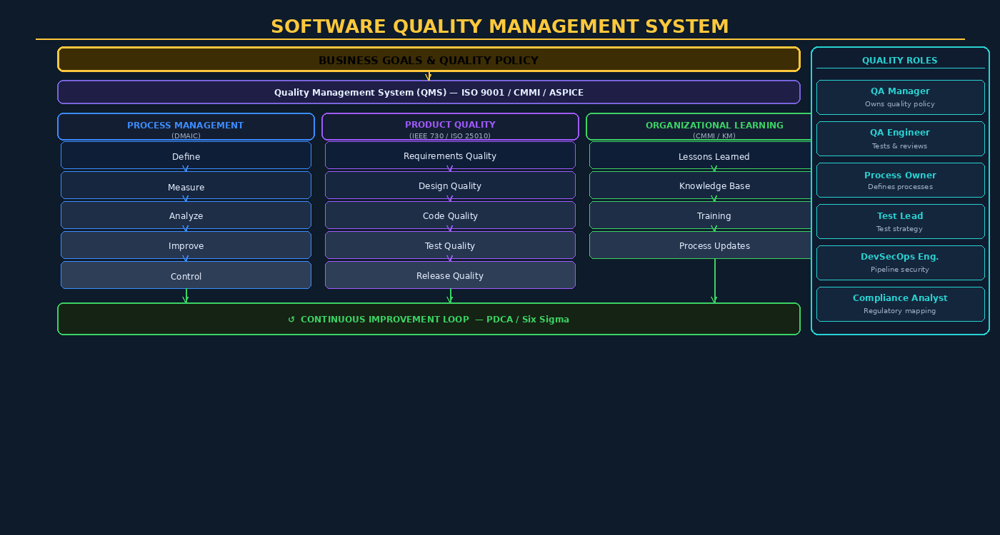

# Chapter 14 — Software Quality Management



## Overview

Software quality is not an accident. It is the product of deliberate organizational systems, disciplined measurement, continuous learning, and a culture that treats quality as a first-class engineering concern. **Software Quality Management (SQM)** is the organizational framework that makes high-quality, high-security software delivery systematic and repeatable — transforming quality from heroic individual effort into engineered organizational capability.

This chapter examines the principles, structures, and practices of software quality management at scale: from international standards (ISO 9001, CMMI, ISO 25010) and quality planning frameworks to measurement systems, defect prevention programs, and the human roles that sustain quality culture. Security quality — the application of quality management disciplines specifically to security outcomes — is a thread woven throughout.

> **Quality is Free (But Not Cheap)**: Philip Crosby's influential argument holds that the cost of conformance (doing things right) is always less than the cost of nonconformance (rework, failures, liability). For security specifically: the average cost of a data breach (IBM: $4.45M in 2023) dwarfs the investment in robust quality management.

---

## ISO 9000:2015 Quality Management Principles

ISO 9000:2015 defines seven quality management principles that form the foundation of any effective QMS. Applied to software development organizations:

1. **Customer Focus**: Understand current and future customer needs, including security and reliability expectations. For software, "customer" includes end users, the business, and regulators.

2. **Leadership**: Top management must establish quality policy and create conditions for people to achieve quality objectives. QA cannot succeed as a bottom-up initiative without executive sponsorship.

3. **Engagement of People**: Quality is everyone's responsibility. Developers who understand quality objectives make better decisions. Quality training, psychological safety for raising issues, and incentives aligned with quality (not just speed) are required.

4. **Process Approach**: Consistent, predictable results come from understood and managed processes. Ad hoc development produces unpredictable quality. Process documentation, measurement, and improvement are foundational.

5. **Improvement**: Continual improvement of the QMS itself is a permanent organizational objective. PDCA (Plan-Do-Check-Act) cycles and Six Sigma DMAIC provide the operational mechanism.

6. **Evidence-Based Decision Making**: Decisions about quality should be based on analysis of data, not intuition. Defect metrics, code coverage, and static analysis trends inform resource allocation and process improvement.

7. **Relationship Management**: Software organizations depend on suppliers (open-source libraries, third-party components, cloud providers). Managing these relationships — including quality and security requirements for suppliers — is part of the QMS.

---

## The Quality Management System for Software

A **QMS** (Quality Management System) provides the documented, systematic framework within which quality activities occur. For software organizations, the relevant standards are:

- **ISO 9001:2015** — General QMS standard, applicable to software organizations seeking certification
- **CMMI (Capability Maturity Model Integration)** — Five-level maturity model measuring process capability
- **ISO/IEC 33000 series** — Process assessment framework (successor to SPICE/ISO 15504)
- **ASPICE (Automotive SPICE)** — QMS framework for automotive software suppliers

### Key QMS Elements for Software

| QMS Element | Software Application |
|-------------|---------------------|
| Quality Policy | Organization-level commitment to quality (e.g., "zero critical defects at release") |
| Quality Objectives | Measurable targets: defect density < 0.5/KLOC, code coverage > 80% |
| Documented Processes | SDLC processes, testing procedures, review checklists |
| Resource Management | QA staffing, tool budget, training programs |
| Measurement and Analysis | Defect tracking, metrics dashboards, trend analysis |
| Continual Improvement | CAR process, lessons learned, process update cycles |
| Internal Audits | Periodic assessment of QMS effectiveness and compliance |
| Management Review | Executive review of QMS performance at defined intervals |

---

## Software Quality Planning: IEEE 730 SQAP

The **Software Quality Assurance Plan (SQAP)**, defined by IEEE 730, is the project-level document that operationalizes the QMS for a specific software project. IEEE 730-2014 specifies these mandatory sections:

1. **Purpose and Scope** — Systems covered, applicable standards
2. **Reference Documents** — Standards, plans, and specifications the SQAP draws from
3. **Management** — QA organizational structure, roles and responsibilities, independence requirements
4. **Documentation** — Required documentation, review and audit of documents
5. **Standards, Practices, Conventions, and Metrics** — Coding standards, documentation standards, quality metrics with acceptance thresholds
6. **Software Reviews** — Types of reviews, entry/exit criteria, reporting requirements
7. **Test** — Test planning, test levels, coverage requirements, test completion criteria
8. **Problem Reporting and Corrective Action** — Defect reporting workflow, severity classification, SLAs for resolution
9. **Tools and Methodologies** — Approved tools, configuration of static analysis, approved testing frameworks
10. **Code Control** — Version control practices, branch management, merge requirements
11. **Media Control** — Artifact storage, backup, secure handling of sensitive builds
12. **Supplier Control** — Quality requirements for third-party components and services
13. **Records Collection** — What records are retained, retention periods, storage security
14. **Training** — Required training for QA roles
15. **Risk Management** — Quality risks, mitigation strategies

---

## Quality Reviews — Types and Techniques

### Management Reviews

Management reviews assess whether the QMS is achieving its objectives. They examine quality metrics trends, audit results, customer complaints, and resource adequacy. Required inputs include: audit results, customer feedback, process performance, nonconformity analysis. Outputs include: decisions on QMS changes, resource needs, improvement opportunities.

### Technical Reviews

Technical reviews assess whether technical artifacts (architecture, design, code, test cases) are sound and meet quality criteria. Participants include the author and technical peers with relevant expertise. Less formal than inspections, more focused on technical correctness than process.

### Walkthroughs

A **walkthrough** is an informal peer review where the author presents their work to colleagues for comment. The primary goals are **knowledge transfer** (other team members understand the code/design) and **defect detection** (fresh eyes catch issues the author missed). Walkthroughs are low-overhead and suitable for early-stage artifacts.

### Formal Fagan Inspection

The **Fagan Inspection** (Michael Fagan, IBM 1976) is the most rigorously studied and consistently effective defect removal technique. Studies show inspections find 60-90% of defects present in reviewed artifacts, at a cost far lower than finding those defects through testing or in production.

**The six phases of Fagan Inspection:**

1. **Planning**: Inspection coordinator selects reviewers (3-6 people), distributes materials 3+ days in advance, schedules meeting
2. **Overview**: Author provides background on the artifact to reviewers (optional for experienced teams)
3. **Preparation**: Each reviewer independently examines the artifact against a checklist, logging potential defects — typically 2 hours per 100 lines
4. **Inspection Meeting**: Moderator leads team through artifact, readers paraphrase code/design, reviewers raise defects logged during preparation — meeting limited to 2 hours maximum
5. **Rework**: Author resolves all defects found, with no estimation of effort spent
6. **Follow-up**: Moderator verifies all defects were resolved correctly (for major defects, may require re-inspection)

```
Fagan Inspection Defect Log Example:
| ID | Location  | Category | Description              | Severity |
|----|-----------|----------|--------------------------|----------|
| 01 | Line 142  | Logic    | Off-by-one in loop bound | Major    |
| 02 | Line 287  | Security | SQL query not parameterized | Critical |
| 03 | Line 319  | Style    | Variable name ambiguous  | Minor    |
```

---

## Measurement and Analytics for Quality Management

### GQM — Goal-Question-Metric Paradigm

The **GQM** (Goal-Question-Metric) approach (Basili & Rombach, 1988) provides a top-down methodology for defining meaningful metrics:

1. **Goal**: State a measurable organizational goal (e.g., "Reduce critical defect escape rate to production by 50% this year")
2. **Question**: Ask questions that characterize the goal (e.g., "What percentage of critical defects are found before release?", "What is the defect detection rate at each SDLC phase?")
3. **Metric**: Define metrics that answer each question (e.g., "Defect Detection Effectiveness (DDE) = defects found pre-release / total defects")

### Key Software Quality Metrics

| Metric | Formula / Definition | Target Range |
|--------|---------------------|-------------|
| Defect Density | Defects / KLOC | < 0.5 at release |
| Defect Detection Effectiveness | Pre-release defects / Total | > 95% |
| Code Coverage | Lines tested / Total lines × 100 | > 80% branch |
| Mean Time to Detect (MTTD) | Avg time from defect injection to detection | Minimize |
| Escaped Defect Rate | Defects found post-release / All defects | < 5% |
| Review Effectiveness | Defects found in review / Defects in artifact | > 60% |
| Technical Debt Ratio | Remediation cost / Total development cost | < 5% |

### Predictive Quality Analytics

Historical quality data enables predictive models. **Risk-based testing** uses defect history, code churn, and complexity metrics to predict which modules are likely to contain defects, focusing testing effort where it matters most. Tools like SonarQube track technical debt trends over time, alerting when quality is deteriorating before it becomes critical.

---

## Defect Prevention Program

Defect detection (finding bugs) is necessary but insufficient — the ultimate goal is defect *prevention*: eliminating the root causes that allow defects to be introduced.

### Causal Analysis and Resolution (CAR)

**CAR** (a CMMI process area) is a structured approach to preventing defect recurrence:

1. **Select defects**: Choose high-severity escaped defects or defect clusters for causal analysis
2. **Analyze causes**: Root cause analysis (5 Whys, fishbone/Ishikawa diagram) to identify systemic causes
3. **Develop action proposals**: Specific process changes to prevent recurrence
4. **Implement actions**: Change training, checklists, tooling, or processes
5. **Evaluate results**: Measure whether the change reduced the defect type's frequency

### Orthogonal Defect Classification (ODC)

**ODC** (IBM Research) provides a taxonomy for classifying defects by their type (Function, Interface, Logic, Checking, Timing, Assignment, Build, Documentation, Algorithm) and trigger (what testing scenario revealed the defect). ODC patterns reveal whether defects cluster in a particular defect type (suggesting a root cause), enabling targeted defect prevention investment.

---

## Software Maintenance Quality

ISO/IEC 14764 defines four types of software maintenance: **corrective** (fixing defects), **adaptive** (accommodating environmental changes), **perfective** (enhancing functionality), and **preventive** (improving maintainability to prevent future failures).

**Technical debt** — the accumulated cost of shortcuts and poor decisions — is a quality risk. Robert C. Martin's concept of **clean code** and Michael Feathers' **legacy code** rehabilitation provide pragmatic frameworks for managing and reducing technical debt systematically.

**Regression testing strategy** for maintenance must balance coverage against execution time. Techniques include:
- **Select-minimize**: Select the minimum test suite covering changed code paths
- **Prioritization**: Run highest-risk tests first, enabling fast feedback
- **Test impact analysis**: Tools (Launchable, Microsoft AzDO) that predict which tests to run based on code changes

---

## ISO/IEC 25010 — Product Quality Standard (SQuaRE)

ISO/IEC 25010:2023 defines the **Software Product Quality** model with eight quality characteristics:

| Characteristic | Sub-characteristics |
|----------------|-------------------|
| Functional Suitability | Completeness, Correctness, Appropriateness |
| Performance Efficiency | Time behavior, Resource utilization, Capacity |
| Compatibility | Co-existence, Interoperability |
| Usability | Appropriateness recognizability, Learnability, Operability |
| **Security** | **Confidentiality, Integrity, Non-repudiation, Authenticity, Accountability** |
| Reliability | Maturity, Availability, Fault tolerance, Recoverability |
| Maintainability | Modularity, Reusability, Analyzability, Modifiability, Testability |
| Portability | Adaptability, Installability, Replaceability |

Security is explicitly a quality characteristic in ISO 25010 — not separate from quality but embedded within it.

---

## Supplier and Vendor Quality Management

Modern software organizations depend heavily on third-party and open-source components. **Supplier quality management** applies QMS disciplines to these relationships:

- **Open-source evaluation criteria**: Project activity (commit frequency, issue resolution time), community health (number of maintainers, bus factor), security posture (CVE history, security policy presence, SBOM availability), license compliance
- **Third-party assessment**: Pre-integration security assessment, contractual quality requirements (SLAs, security testing evidence, right-to-audit clauses)
- **Software supply chain assurance**: SLSA framework attestations, SBOM ingestion and continuous CVE monitoring

---

## Key Terms

| Term | Definition |
|------|-----------|
| **QMS** | Quality Management System — documented framework for systematic quality management |
| **ISO 9001** | International standard for quality management systems |
| **CMMI** | Capability Maturity Model Integration — five-level process maturity model |
| **SQAP** | Software Quality Assurance Plan — project-level quality planning document (IEEE 730) |
| **Fagan Inspection** | Formal, six-phase code review process with highest defect detection effectiveness |
| **GQM** | Goal-Question-Metric — top-down methodology for defining meaningful quality metrics |
| **Defect Density** | Number of defects per thousand lines of code |
| **DDE** | Defect Detection Effectiveness — percentage of defects found before release |
| **CAR** | Causal Analysis and Resolution — CMMI process for systematic defect prevention |
| **ODC** | Orthogonal Defect Classification — IBM taxonomy for classifying defects by type and trigger |
| **PDCA** | Plan-Do-Check-Act — Deming's continuous improvement cycle |
| **DMAIC** | Define-Measure-Analyze-Improve-Control — Six Sigma improvement methodology |
| **Technical Debt** | Accumulated cost of shortcuts and poor design decisions |
| **ISO 25010** | SQuaRE product quality standard defining 8 quality characteristics including security |
| **Regression Testing** | Re-testing after changes to verify no previously working functionality was broken |
| **Risk-Based Testing** | Focusing testing effort on areas of highest defect probability or business impact |
| **Test Impact Analysis** | Predicting which tests to run based on code changes, to reduce test cycle time |
| **Walkthrough** | Informal peer review for knowledge transfer and early defect detection |
| **Quality Gate** | Defined criterion that must be satisfied before an artifact advances to the next phase |
| **Bus Factor** | Number of team members who must leave before a project becomes unmaintainable |

---

## Review Questions

1. Explain the seven ISO 9000:2015 quality management principles. For each, give a concrete example of how it applies to a software development organization.
2. Compare CMMI and ISO 9001 as quality management frameworks. What does each measure, and when would an organization choose one over the other?
3. Walk through the six phases of a Fagan Inspection for a 200-line authentication module. Who are the participants, what does each do, and what are the entry and exit criteria?
4. Using the GQM paradigm, define a complete quality measurement program for a team whose goal is to "reduce escaped defects by 50% in 12 months."
5. What is Orthogonal Defect Classification, and how do ODC patterns help prioritize defect prevention investment? Give an example of an ODC pattern and the prevention action it suggests.
6. ISO/IEC 25010 includes Security as a quality characteristic. Explain why this placement matters organizationally, and describe how each security sub-characteristic (confidentiality, integrity, non-repudiation, authenticity, accountability) maps to testable software behaviors.
7. A software organization is accumulating significant technical debt. Describe a structured approach to measuring the debt (metrics), prioritizing remediation, and preventing further accumulation.
8. Describe three different regression testing strategies for a maintenance project. What factors determine which strategy to apply?
9. Your organization purchases a critical third-party SDK. What quality and security criteria would you evaluate during supplier qualification, and what contractual provisions would you require?
10. Design a quality dashboard for a software development organization with 50 engineers. Specify the 8-10 most important metrics, their update frequency, and what action each metric should trigger when it crosses a threshold.

---

## Further Reading

1. Kan, S. H. (2002). *Metrics and Models in Software Quality Engineering* (2nd ed.). Addison-Wesley. — Comprehensive reference for software quality metrics, measurement theory, and statistical quality control.
2. Wiegers, K. E. (2002). *Peer Reviews in Software: A Practical Guide*. Addison-Wesley. — The definitive practical guide to code inspections, walkthroughs, and peer reviews including Fagan's method.
3. Crosby, P. B. (1979). *Quality is Free: The Art of Making Quality Certain*. McGraw-Hill. — The foundational argument that prevention costs less than detection and failure.
4. ISO/IEC 25010:2023. *Systems and software engineering — System and software quality models*. International Organization for Standardization. — The current SQuaRE product quality standard.
5. Basili, V. R. & Rombach, H. D. (1988). The TAME Project: Towards Improvement-Oriented Software Environments. *IEEE Transactions on Software Engineering*, 14(6). — Original GQM paper establishing the goal-oriented measurement methodology.
