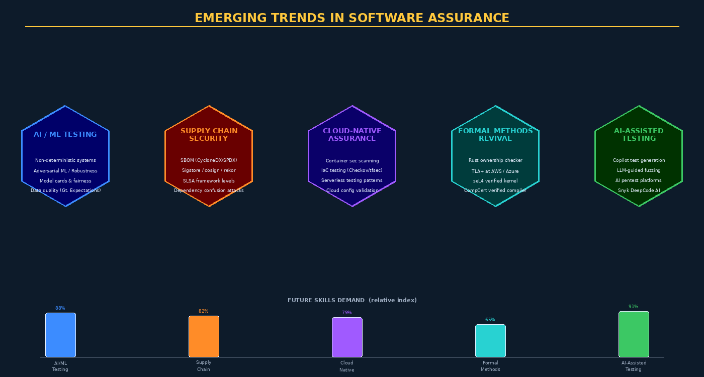

# Chapter 15 — Emerging Trends, AI Testing, and Course Synthesis



## Overview

Software assurance is not a static discipline. The threat landscape evolves, new technologies introduce novel attack surfaces, and regulatory frameworks race to keep pace with technical reality. This final chapter surveys the most significant emerging trends reshaping software assurance practice: testing AI/ML systems with fundamentally different properties than deterministic software, securing the software supply chain as a discipline in its own right, the mainstreaming of formal methods through languages like Rust, and the use of AI to augment human testing capabilities. We conclude with a synthesis of all 15 weeks into a coherent professional framework for software assurance practitioners.

---

## Testing AI and Machine Learning Systems

Traditional software testing rests on a fundamental assumption: given the same input, the program will produce the same output. **Machine learning systems violate this assumption**. A neural network's output may vary based on hardware (floating-point rounding), batch normalization, dropout layers active during inference, or model versioning. This non-determinism makes traditional test oracles impossible — there is no "correct answer" to compare against for many ML tasks.

### ML-Specific Defect Taxonomy

Software defects in ML systems fall into categories that have no equivalent in traditional software:

| Defect Type | Description | Detection Approach |
|-------------|-------------|-------------------|
| Data Distribution Shift | Production data diverges from training distribution | Statistical tests (KS test, PSI) |
| Fairness/Bias | Model discriminates based on protected attributes | Fairness metrics (equalized odds, demographic parity) |
| Adversarial Examples | Small input perturbations cause dramatic output changes | Adversarial robustness testing |
| Model Degradation | Performance decays over time as world changes | Production monitoring, shadow deployment |
| Label Noise | Training data has incorrect labels | Data quality auditing |
| Underfitting/Overfitting | Generalization failure | Cross-validation, hold-out test sets |

### Testing Strategies for ML

**Metamorphic testing** is particularly valuable for ML systems. Instead of checking absolute correctness, it checks *relationships between outputs* for related inputs. If you rotate an image 90°, the classifier should be equally confident. If you translate a sentiment analysis input to synonyms, sentiment should not change. These metamorphic relations can be automated at scale without requiring ground truth labels.

**Differential testing** compares multiple model versions or implementations. If GPT-4 and a fine-tuned variant produce dramatically different outputs for the same input, that difference warrants investigation. **A/B testing** in production is a form of differential testing at scale.

**Adversarial robustness testing** evaluates whether models maintain correct behavior under adversarial inputs:

```python
# Using IBM Adversarial Robustness Toolbox (ART)
from art.attacks.evasion import FastGradientMethod
from art.estimators.classification import KerasClassifier

classifier = KerasClassifier(model=keras_model)
attack = FastGradientMethod(estimator=classifier, eps=0.3)
x_adv = attack.generate(x=x_test)

# Check: what percentage of adversarial examples fool the model?
adversarial_accuracy = np.mean(
    np.argmax(classifier.predict(x_adv), axis=1) == y_test
)
print(f"Accuracy under FGSM attack: {adversarial_accuracy:.2%}")
```

**Data quality testing** with **Great Expectations** validates that production data feeding the model meets statistical expectations:

```python
import great_expectations as gx

context = gx.get_context()
suite = context.add_expectation_suite("production_data_suite")
validator.expect_column_values_to_not_be_null("age")
validator.expect_column_values_to_be_between("age", min_value=18, max_value=120)
validator.expect_column_mean_to_be_between("income", min_value=30000, max_value=200000)
```

**Model cards** (Google) provide structured documentation of model behavior, limitations, intended use cases, and known biases — a form of specification that enables testing by making implicit assumptions explicit.

### Production ML Monitoring

Testing at training time is insufficient — models degrade in production. **Data drift detection** (using tools like Evidently AI, WhyLogs, or Arize) monitors the statistical distribution of production inputs against the training baseline. **Prediction confidence monitoring** flags when the model's confidence drops, indicating it is encountering unfamiliar input. MLOps platforms (MLflow, Weights & Biases, AWS SageMaker Model Monitor) automate these production assurance functions.

---

## Software Supply Chain Security as a Testing Discipline

The 2020 SolarWinds attack demonstrated that compromising the software supply chain — the tools, processes, and dependencies that produce software — can achieve mass compromise of downstream customers without ever directly attacking them. Supply chain security has emerged as a critical assurance domain.

### SLSA Framework

**SLSA (Supply chain Levels for Software Artifacts)**, pronounced "salsa," is a security framework defining four levels of supply chain integrity:

| SLSA Level | Requirements | Example |
|------------|-------------|---------|
| Level 1 | Build process documented, provenance generated | Basic CI with provenance |
| Level 2 | Version controlled builds, hosted source | GitHub Actions with signed provenance |
| Level 3 | Source/build integrity verified by third party | Hermetic builds with OIDC |
| Level 4 | Two-party review, hermetic builds, reproducible | Highly restricted, auditable builds |

SLSA provenance attestations are cryptographically signed statements asserting *how* and *where* an artifact was built — enabling downstream consumers to verify build integrity.

### SBOM-Driven Vulnerability Management

An SBOM (Software Bill of Materials) is the foundation of supply chain risk management. Once generated, SBOMs enable:
- **Automated CVE correlation**: Tools like Grype, OWASP DependencyTrack, and Anchore scan SBOMs against the NVD and OSV databases in real time
- **License compliance monitoring**: Continuous validation that dependency licenses remain compatible
- **Incident response**: When a new CVE is published (log4shell-style), immediately determine whether any of your products are affected

### Sigstore — Keyless Signing

**Sigstore** (cosign, rekor, fulcio) provides a keyless artifact signing infrastructure built on certificate transparency:

```bash
# Sign with cosign using OIDC (keyless)
cosign sign --yes registry.example.com/myapp@sha256:abc123

# Verify: checks signature + rekor transparency log entry
cosign verify --certificate-identity-regexp "github.com/myorg/myapp" \
  --certificate-oidc-issuer "https://token.actions.githubusercontent.com" \
  registry.example.com/myapp@sha256:abc123
```

The **Rekor** transparency log creates an immutable, auditable record of every signing event — similar to certificate transparency for TLS certificates.

### Dependency Confusion Attacks

In a **dependency confusion attack**, an attacker publishes a malicious package to a public registry (npm, PyPI) with the same name as an internal private package, at a higher version number. Many package managers will download the public package preferentially. Mitigations include: private package registry mirrors, namespace reservations, SLSA provenance verification, and network egress controls blocking access to public registries from build systems.

---

## Formal Methods Mainstreaming

Formal methods are no longer confined to aerospace and cryptography. Market forces and a new generation of tools are bringing formal verification into mainstream software engineering.

### Rust's Ownership System

**Rust's ownership and borrow checker** is an embedded formal verification system enforcing memory safety and data-race freedom at compile time. Properties guaranteed by Rust's type system:
- **No use-after-free**: the borrow checker prevents accessing memory after it is freed
- **No null pointer dereferences**: `Option<T>` forces explicit handling of absence
- **No data races**: the ownership system prevents simultaneous mutable access from multiple threads
- **No buffer overflows**: bounds checking on slice indexing

Microsoft, Google, and the NSA have all published guidance recommending Rust (and other memory-safe languages) as a mitigation for the approximately 70% of CVEs attributable to memory safety bugs. The Linux kernel accepted Rust as a second implementation language in version 6.1 (December 2022).

### TLA+ in Production

Amazon Web Services has published papers describing their use of TLA+ to verify distributed protocols in DynamoDB, S3, EBS, and their internal consensus algorithm. A key finding: TLA+ model checking found subtle bugs in multi-year-old production protocols that extensive testing had not caught. Microsoft uses TLA+ for Azure CosmosDB. Intel verifies cache coherence protocols. The tooling has improved substantially — the VSCode TLA+ extension provides syntax highlighting, model checking integration, and counterexample visualization.

### seL4 and Verified Computing

The **seL4 verified microkernel** represents the state of the art in formally verified systems software. Running seL4 as the foundation for a system provides mathematically proven isolation between compartments — if the proof holds, no software bug in one compartment can compromise another. DARPA's HACMS project used seL4 to build a verified helicopter flight controller. The Rust-based **Ferrocene** toolchain is the first formally qualified Rust compiler (ISO 26262, IEC 61508), enabling Rust adoption in safety-critical automotive and industrial applications.

---

## AI-Assisted Testing Tools

AI is rapidly augmenting human testing capabilities across multiple dimensions, though careful evaluation of each tool's actual vs. marketed capabilities is essential.

### Test Generation

**GitHub Copilot** can generate test stubs and test cases from function signatures and docstrings. Quality varies significantly — Copilot generates plausible-looking tests that may not actually test the relevant behavior. Studies show Copilot-generated tests have lower code coverage and fewer meaningful assertions than expert-written tests. Best practice: use Copilot to generate test scaffolding, then review and enhance test logic manually.

```python
# Copilot-assisted: generates a reasonable starting point
def test_transfer_funds_insufficient_balance():
    """Test that transfer fails when source account has insufficient balance."""
    account = BankAccount(balance=100.00)
    with pytest.raises(InsufficientFundsError):
        account.transfer(amount=200.00, destination="ACC-456")
    assert account.balance == 100.00  # balance unchanged
```

### LLM-Guided Fuzzing

Recent research (2023-2024) demonstrates that LLMs can significantly improve fuzzing effectiveness. Rather than purely random mutation, GPT-4-guided fuzzers generate inputs that exercise specific code paths and trigger semantic edge cases. Projects like **Fuzz4All** and **CarpetFuzz** show 20-50% improvements in code coverage vs. traditional fuzzers on open-source targets.

### AI-Powered Static Analysis

**Snyk DeepCode AI** uses a model trained on 4 billion lines of code to identify vulnerability patterns beyond what rule-based SAST can detect. **Amazon CodeGuru Reviewer** uses ML models trained on Amazon's internal code review history to identify similar patterns in customer code. These tools augment traditional SAST by finding novel vulnerability patterns, though false positive rates remain higher than mature rule-based tools.

---

## Emerging Compliance Landscape

### U.S. Executive Order 14028

EO 14028 "Improving the Nation's Cybersecurity" (May 2021) mandates:
- **SBOM requirement**: Federal agencies must obtain SBOMs for software they purchase
- **SSDF (Secure Software Development Framework)**: NIST SP 800-218 provides implementation guidance; OMB M-22-18 requires federal contractors to self-attest compliance
- **Zero-trust architecture**: Federal systems must implement zero-trust networking principles

### EU Cyber Resilience Act

The **EU Cyber Resilience Act** (expected enforcement 2027) will require:
- Mandatory security testing for all connected products sold in the EU
- Security vulnerability disclosure programs for all manufacturers
- Support for at least 5 years of security updates
- CE marking to include security requirements

This extends compliance testing obligations to *product manufacturers* — including software vendors — not just service providers.

### SEC Cybersecurity Disclosure Rules

SEC rules effective December 2023 require public companies to:
- Disclose material cybersecurity incidents within 4 business days
- Annually disclose cybersecurity risk management processes
- Describe board oversight of cybersecurity risk

Security testing programs now have *securities law* implications — documented, mature testing programs reduce disclosure liability.

---

## Course Synthesis: A Complete Software Assurance Program

The 15 weeks of SCIA 425 form a coherent, layered software assurance framework:

```
WEEKS 1-3:  Foundation — Quality concepts, security requirements, assurance mindset
WEEKS 4-6:  Architecture & Design — Security in design, threat modeling, design reviews
WEEKS 7-9:  Construction — Secure coding, SAST, code reviews, static analysis
WEEKS 10:   Dynamic Testing — Fuzzing, DAST, penetration testing
WEEK 11:    Formal Methods — Correctness verification, model checking, theorem proving
WEEK 12:    DevSecOps — Automation, pipelines, security as code
WEEK 13:    Compliance — Regulatory testing, evidence management
WEEK 14:    Quality Management — Organizational systems, measurement, improvement
WEEK 15:    Emerging Trends — AI/ML testing, supply chain, future of assurance
```

A mature software assurance program integrates all these layers: formal methods for the most critical components, DevSecOps automation for continuous feedback, compliance testing for regulatory evidence, quality management systems for organizational consistency, and continuous adaptation to emerging threats and technologies.

---

## Career Paths in Software Assurance

| Role | Primary Skills | Typical Tools | Cert Path |
|------|---------------|---------------|-----------|
| Security Engineer | AppSec, SAST/DAST, code review | Burp Suite, CodeQL, Semgrep | CSSLP, CEH |
| QA/Test Engineer | Test design, automation, metrics | Selenium, JUnit, pytest | ISTQB, CSTE |
| Penetration Tester | Exploitation, OSINT, reporting | Metasploit, nmap, Burp | OSCP, CEH |
| DevSecOps Engineer | CI/CD, IaC, cloud security | GitHub Actions, Terraform, Trivy | AWS-SAP, CKS |
| Compliance Analyst | GRC, control mapping, auditing | Drata, Vanta, ServiceNow | CISA, CRISC |
| Formal Verification | Math, proof assistants, type theory | Coq, TLA+, Lean | Academic / research |
| ML Security Engineer | ML ops, adversarial ML, data quality | ART, Evidently, MLflow | Emerging field |

---

## Capstone Project: Software Assurance Assessment

The capstone integrates all course concepts into a complete software assurance assessment of an open-source application:

1. **Threat Model**: STRIDE analysis, attack tree, DFD level 0/1
2. **SAST**: CodeQL + Semgrep scan, triage findings, CVSS scoring
3. **DAST**: ZAP baseline scan against deployed instance
4. **Dependency Analysis**: Syft SBOM, Grype vulnerability scan
5. **Formal Specification**: Alloy model of a critical security invariant
6. **Compliance Mapping**: Map findings to NIST SP 800-53 controls
7. **Quality Plan**: Draft SQAP with metrics, review cadence, and improvement targets
8. **Executive Report**: Risk-prioritized findings with business impact and remediation roadmap

---

## Key Terms

| Term | Definition |
|------|-----------|
| **Metamorphic Testing** | Testing by checking relationships between outputs for related inputs |
| **Adversarial Examples** | Inputs crafted to cause ML model misclassification with minimal perturbation |
| **ART** | IBM Adversarial Robustness Toolbox — open-source adversarial ML testing framework |
| **Data Distribution Shift** | Production data statistics diverge from training data distribution |
| **Model Card** | Structured documentation of ML model behavior, limitations, and intended use |
| **SLSA** | Supply chain Levels for Software Artifacts — framework for build integrity |
| **Sigstore** | Keyless artifact signing infrastructure (cosign, rekor, fulcio) |
| **Rekor** | Immutable transparency log for artifact signing events |
| **Dependency Confusion** | Supply chain attack exploiting package manager resolution order |
| **Provenance Attestation** | Cryptographically signed statement of how/where an artifact was built |
| **Rust Borrow Checker** | Compile-time enforcement of memory safety and data-race freedom |
| **seL4** | Formally verified microkernel with machine-checked isolation guarantees |
| **Ferrocene** | First ISO 26262-qualified Rust compiler toolchain |
| **DeepCode AI** | Snyk's ML-based code vulnerability detection system |
| **EO 14028** | U.S. Executive Order on Improving the Nation's Cybersecurity |
| **SSDF** | Secure Software Development Framework (NIST SP 800-218) |
| **EU Cyber Resilience Act** | EU regulation mandating security for connected products |
| **Differential Testing** | Comparing outputs of multiple implementations to detect divergence |
| **Great Expectations** | Python framework for data quality testing and validation |
| **Fuzz4All** | LLM-guided fuzzing research demonstrating AI-augmented coverage improvement |

---

## Review Questions

1. Explain why traditional test oracles are insufficient for testing ML classification systems. What testing approaches work in their absence, and what guarantees do they provide?
2. Compare the SLSA framework's four levels. What specific build integrity threats does each level address that the previous level does not?
3. A log4shell-style vulnerability is disclosed in a library your organization uses. Walk through how an SBOM-driven vulnerability management process enables faster response than traditional inventory methods.
4. Explain how Rust's ownership system eliminates use-after-free and data race vulnerabilities at compile time. Why can't traditional C compilers provide equivalent guarantees?
5. What are the limitations of using GitHub Copilot for test generation? How would you integrate AI test generation into a quality assurance process while managing these limitations?
6. Compare metamorphic testing, differential testing, and adversarial testing as strategies for validating ML models. What types of defects does each approach find?
7. The EU Cyber Resilience Act will require security testing evidence for CE marking. How would a small IoT device manufacturer build a compliant testing program within budget constraints?
8. How has TLA+ model checking at AWS found bugs that years of production experience and testing did not reveal? What property of model checking enables this?
9. Synthesize the 15 weeks of this course: if you were building a software assurance program for a 50-person startup, which three capabilities would you implement first, and why?
10. Compare career paths in software assurance: penetration tester vs. DevSecOps engineer vs. formal verification specialist. What are the day-to-day activities, salary ranges, demand trajectory, and skill requirements for each?

---

## Further Reading

1. Goodfellow, I., Bengio, Y., & Courville, A. (2016). *Deep Learning*. MIT Press (Chapter 7 and adversarial examples literature). — Foundation for understanding ML-specific testing challenges.
2. Sculley, D. et al. (2015). Hidden Technical Debt in Machine Learning Systems. *NIPS 2015*. — Seminal paper on quality challenges in production ML systems.
3. Saltzer, J. H. & Schroeder, M. D. (1975). The Protection of Information in Computer Systems. *Proceedings of the IEEE*. — Classic paper establishing foundational security design principles still relevant today.
4. CISA & NSA (2023). *The Case for Memory Safe Roadmaps*. — U.S. government guidance on transitioning to memory-safe programming languages including Rust.
5. Zeller, A. (2009). *Why Programs Fail: A Guide to Systematic Debugging* (2nd ed.). Morgan Kaufmann. — Systematic approaches to fault isolation and root cause analysis applicable to both traditional and ML systems.
